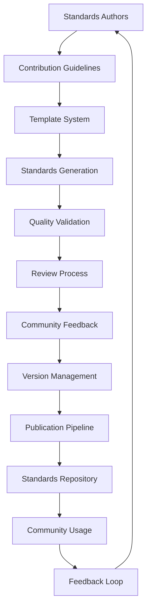

# Standards Ecosystem Documentation

This document provides a comprehensive overview of the complete standards development and publishing ecosystem, including all tools, processes, and workflows for community-driven standards development.

## Table of Contents

1. [Ecosystem Overview](#ecosystem-overview)
2. [Core Components](#core-components)
3. [Development Workflow](#development-workflow)
4. [Quality Assurance](#quality-assurance)
5. [Community Participation](#community-participation)
6. [Publication and Distribution](#publication-and-distribution)
7. [Maintenance and Evolution](#maintenance-and-evolution)
8. [Getting Started](#getting-started)

## Ecosystem Overview

The MCP Standards Server provides a complete ecosystem for developing, reviewing, publishing, and maintaining technical standards. It combines automated tools, structured processes, and community collaboration to ensure high-quality, consistent standards.

### Key Principles

- **Community-Driven**: Standards are developed with input from the entire community
- **Quality-Focused**: Rigorous quality gates ensure excellence
- **Transparent**: All processes are open and documented
- **Automated**: Extensive automation reduces manual overhead
- **Versioned**: Comprehensive version tracking and migration support
- **Accessible**: Tools and processes designed for broad participation

### Architecture Overview



## Core Components

### 1. Standards Contribution System

**File**: [`CONTRIBUTING_STANDARDS.md`](CONTRIBUTING_STANDARDS.md)

Comprehensive guide for contributing standards including:
- Template selection and customization
- Quality criteria and review checklist
- Submission workflow and best practices
- Community guidelines and support

**Key Features**:
- Template-based standard generation
- Quality assessment scoring
- Step-by-step submission process
- Peer review guidelines
- Recognition and attribution system

### 2. Automated Publishing Pipeline

**File**: [`scripts/publish_standards.py`](scripts/publish_standards.py)

Automated system for validating and publishing standards:
- Integration with williamzujkowski/standards repository
- Quality gate validation before publishing
- Automated formatting and cross-reference updating
- Batch publishing capabilities

**Key Features**:
- GitHub API integration
- Quality score validation (minimum 80%)
- Automated cross-reference updates
- Publication status tracking
- Notification system integration

**Usage**:
```bash
# Publish single standard
python scripts/publish_standards.py --standard standards/my-standard.md --validate

# Batch publish all standards
python scripts/publish_standards.py --batch-dir standards/ --min-quality 0.8

# Dry run validation
python scripts/publish_standards.py --standard standards/my-standard.md --dry-run
```

### 3. Standards Versioning System

**File**: [`src/core/standards/versioning.py`](src/core/standards/versioning.py)

Comprehensive version management including:
- Semantic version tracking
- Change detection and diff generation
- Backward compatibility checking
- Migration assistance between versions

**Key Features**:
- Automatic version increment based on change type
- Detailed change tracking and categorization
- Compatibility analysis between versions
- Migration guide generation
- Version history management

**Usage**:
```python
from src.core.standards.versioning import StandardsVersionManager

# Initialize version manager
vm = StandardsVersionManager("data/standards")

# Create new version
version_info = vm.create_version(
    "API_DESIGN_STANDARDS",
    content=updated_content,
    metadata=updated_metadata,
    description="Added GraphQL federation guidelines"
)

# Check compatibility
compatibility = vm.check_compatibility(
    "API_DESIGN_STANDARDS",
    "2.0.0",
    "1.5.0"
)

# Generate migration guide
migration_guide = vm.generate_migration_guide(
    "API_DESIGN_STANDARDS",
    "1.5.0",
    "2.0.0"
)
```

### 4. Community Review Process

**File**: [`docs/community/review-process.md`](docs/community/review-process.md)

Structured review workflow including:
- Reviewer assignment and tracking
- Multi-stage review process
- Feedback integration workflow
- Approval and publication process

**Review Stages**:
1. **Initial Triage** (24 hours) - Maintainers
2. **Technical Review** (3-5 days) - Domain experts
3. **Editorial Review** (2-3 days) - Editorial team
4. **Community Review** (5-7 days) - Community members
5. **Final Approval** (1-2 days) - Maintainers

### 5. Reviewer Management Tools

**File**: [`scripts/reviewer_tools.py`](scripts/reviewer_tools.py)

Tools for managing the review process:
- Automatic reviewer assignment
- Workload tracking and balancing
- Progress monitoring and reminders
- Review metrics and reporting

**Configuration**: [`reviewer_config.yaml`](reviewer_config.yaml)

**Usage**:
```bash
# Assign reviewers to new standard
python scripts/reviewer_tools.py assign \
  --standard "Microservices Communication" \
  --domain api \
  --pr 123

# Check reviewer workload
python scripts/reviewer_tools.py workload

# Send reminder notifications
python scripts/reviewer_tools.py notify

# Generate comprehensive report
python scripts/reviewer_tools.py report
```

### 6. Automated Workflows

**File**: [`.github/workflows/review-automation.yml`](.github/workflows/review-automation.yml)

GitHub Actions workflows for:
- Automatic reviewer assignment
- Quality gate validation
- Review status tracking
- Overdue review management

**Workflow Triggers**:
- Pull request opened (assigns reviewers)
- Review commands in comments
- Daily scheduled check for overdue reviews
- Quality validation on content changes

## Development Workflow

### 1. Planning Phase

1. **Research existing standards** to avoid duplication
2. **Identify target domain** and stakeholders
3. **Define scope and objectives** clearly
4. **Map dependencies** to existing standards
5. **Assess compliance requirements**

### 2. Development Phase

1. **Select appropriate template**:
   ```bash
   python -m src.cli.main list-templates --domain api
   ```

2. **Generate initial standard**:
   ```bash
   python -m src.cli.main generate \
     --template api \
     --title "Microservices Communication Standards" \
     --domain microservices \
     --output standards/microservices-communication.md
   ```

3. **Iterate and refine content**:
   ```bash
   # Validate during development
   python -m src.cli.main validate standards/microservices-communication.yaml
   
   # Check quality score
   python -m src.cli.main quality-check standards/microservices-communication.md
   ```

### 3. Submission Phase

1. **Create feature branch**
2. **Submit pull request** with standard files
3. **Automated reviewer assignment** via GitHub Actions
4. **Review process begins** automatically

### 4. Review and Revision Phase

1. **Technical review** by domain experts
2. **Editorial review** for clarity and consistency
3. **Community review** for practical feedback
4. **Address feedback** and iterate as needed

### 5. Publication Phase

1. **Final approval** by maintainers
2. **Automated publication** to standards repository
3. **Community notification** and documentation updates
4. **Post-publication monitoring** setup

## Quality Assurance

### Quality Gates

The system implements multiple quality gates:

**Pre-Review Gates**:
- File format validation
- Metadata completeness check
- Basic quality scoring (>60%)
- Link verification
- Security scanning

**Review Stage Gates**:
- Technical expert approval
- Editorial team approval
- Community consensus
- Maintainer final approval

**Publication Gates**:
- Quality score ≥ 80%
- All required feedback addressed
- Final validation checks
- Publication readiness confirmation

### Quality Metrics

The quality assessment system evaluates:

| Criteria | Weight | Description |
|----------|--------|-------------|
| Completeness | 25% | All required sections present |
| Clarity | 20% | Readability and comprehension |
| Technical Accuracy | 20% | Correctness of technical details |
| Examples | 15% | Quality and relevance of code examples |
| Cross-references | 10% | Links to related standards |
| Compliance Mapping | 10% | Regulatory framework alignment |

### Automated Quality Checks

```yaml
# Example quality validation
quality_checks:
  - file_format_validation
  - metadata_completeness
  - link_verification
  - code_example_validation
  - security_scanning
  - compliance_verification
  - cross_reference_validation
```

## Community Participation

### Roles and Responsibilities

**Maintainers**:
- Overall project governance
- Final approval decisions
- Process oversight and improvement
- Conflict resolution

**Domain Experts**:
- Technical accuracy validation
- Implementation feasibility assessment
- Best practices verification
- Architecture review

**Editorial Team**:
- Content quality assurance
- Grammar and style validation
- Consistency maintenance
- Accessibility review

**Community Reviewers**:
- Practical feedback on usability
- Use case validation
- Implementation experience sharing
- Quality scoring participation

### Getting Involved

1. **Start with community reviews** - Participate in reviewing standards
2. **Contribute improvements** - Submit pull requests for existing standards
3. **Propose new standards** - Follow the contribution guidelines
4. **Join domain expertise** - Build reputation in specific domains
5. **Editorial contributions** - Help improve documentation quality

### Recognition System

Contributors are recognized through:
- Author attribution in standard metadata
- Contributor credits in CHANGELOG.md
- Community highlights in project updates
- Domain expert designation for significant contributions

## Publication and Distribution

### Publishing Pipeline

The automated publishing pipeline:

1. **Validates** standard quality and completeness
2. **Formats** content for publication
3. **Updates** cross-references and links
4. **Publishes** to GitHub repository
5. **Updates** standards index
6. **Notifies** community of new publication

### Distribution Channels

Standards are distributed through:
- **GitHub Repository**: Main standards repository
- **CLI Tool**: Direct access via command line
- **Web Interface**: Browser-based access and search
- **API**: Programmatic access for tooling
- **Package Managers**: Integration with package ecosystems

### Integration Support

The system provides integration with:
- **IDEs**: Extensions for major development environments
- **CI/CD**: Pipeline integration for compliance checking
- **Documentation**: Automatic documentation generation
- **Monitoring**: Standards compliance monitoring

## Maintenance and Evolution

### Version Management

The versioning system provides:
- **Semantic versioning** for all standards
- **Change tracking** with detailed diff generation
- **Compatibility analysis** between versions
- **Migration assistance** for breaking changes
- **Historical preservation** of all versions

### Continuous Improvement

The ecosystem includes:
- **Metrics collection** on usage and quality
- **Feedback loops** from community and implementers
- **Regular reviews** of standards and processes
- **Tool enhancements** based on user needs
- **Process refinements** for efficiency

### Scheduled Maintenance

Regular maintenance activities:
- **Monthly**: Review metrics and process efficiency
- **Quarterly**: Update tools and workflows
- **Bi-annually**: Comprehensive standard reviews
- **Annually**: Strategic direction and major updates

## Getting Started

### For Contributors

1. **Read the contribution guidelines**: [CONTRIBUTING_STANDARDS.md](CONTRIBUTING_STANDARDS.md)
2. **Set up development environment**:
   ```bash
   git clone https://github.com/williamzujkowski/mcp-standards-server.git
   cd mcp-standards-server
   pip install -r requirements.txt
   ```
3. **Explore existing standards**: Browse [`data/standards/`](data/standards/)
4. **Try the CLI tools**:
   ```bash
   python -m src.cli.main list-templates
   python -m src.cli.main generate --template base --preview
   ```
5. **Join the community**: Participate in discussions and reviews

### For Reviewers

1. **Review the review process**: [docs/community/review-process.md](docs/community/review-process.md)
2. **Configure reviewer profile**: Update [`reviewer_config.yaml`](reviewer_config.yaml)
3. **Complete reviewer training**: Follow onboarding checklist
4. **Start with community reviews**: Build experience gradually
5. **Consider domain specialization**: Develop expertise in specific areas

### For Maintainers

1. **Study the complete ecosystem**: Review all documentation
2. **Understand automation**: Familiarize with GitHub Actions workflows
3. **Configure access tokens**: Set up GitHub and webhook integration
4. **Review quality gates**: Understand validation criteria
5. **Monitor community health**: Track participation and satisfaction

### For Users

1. **Browse available standards**: Use CLI or web interface
2. **Integrate with tooling**: Use API or CLI for automation
3. **Provide feedback**: Share implementation experiences
4. **Request new standards**: Submit proposals for missing areas
5. **Stay updated**: Subscribe to notifications and updates

## Support and Resources

### Documentation

- [Contribution Guidelines](CONTRIBUTING_STANDARDS.md)
- [Review Process](docs/community/review-process.md)
- [CLI Reference](docs/cli/README.md)
- [API Documentation](docs/api/mcp-tools.md)

### Tools and Scripts

- [Publishing Pipeline](scripts/publish_standards.py)
- [Reviewer Tools](scripts/reviewer_tools.py)
- [Version Management](src/core/standards/versioning.py)
- [Quality Assurance](src/generators/quality_assurance.py)

### Community

- **GitHub Issues**: Bug reports and feature requests
- **GitHub Discussions**: General questions and community interaction
- **Review Process**: Structured feedback and improvement
- **Office Hours**: Regular maintainer availability

### Contact

For questions about the standards ecosystem:
- Open an issue for bugs or feature requests
- Start a discussion for general questions
- Contact maintainers directly for sensitive matters
- Join community channels for real-time interaction

## Conclusion

The MCP Standards Server provides a comprehensive ecosystem for community-driven standards development. By combining automated tools, structured processes, and community collaboration, it ensures the creation of high-quality, maintainable standards that serve the entire community.

The ecosystem continues to evolve based on community feedback and changing needs. All community members are encouraged to participate in both standards development and ecosystem improvement.

---

*This documentation is maintained by the MCP Standards Server community. For updates and improvements, please contribute via pull requests.*