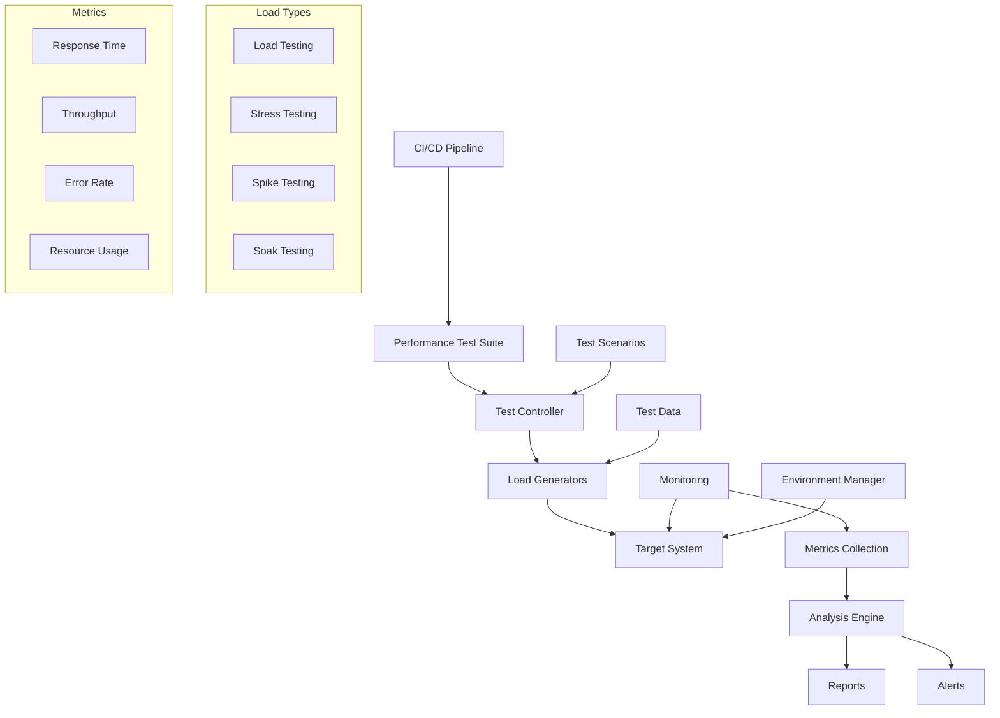

# Advanced Testing Methodologies Standards

**Version:** v1.0.0  
**Domain:** testing  
**Type:** Technical  
**Risk Level:** HIGH  
**Maturity Level:** Production  
**Author:** MCP Standards Team  
**Created:** 2025-07-08T10:00:00.000000  
**Last Updated:** 2025-07-08T10:00:00.000000  

## Purpose

Comprehensive standards for advanced testing methodologies, covering performance testing, security testing, chaos engineering, and modern testing strategies

This testing standard defines the requirements, guidelines, and best practices for advanced testing methodologies. It provides comprehensive guidance for performance testing, security testing, chaos engineering, and testing in production while ensuring quality, reliability, and resilience across all systems.

**Testing Focus Areas:**
- **Performance Testing**: Load, stress, spike, and soak testing strategies
- **Security Testing**: SAST, DAST, and penetration testing approaches
- **Chaos Engineering**: Resilience testing and failure injection
- **Contract Testing**: API and service contract verification
- **Advanced Testing**: Mutation testing and property-based testing
- **Test Data Management**: Synthetic data generation and management
- **Production Testing**: Safe testing in production environments

## Scope

This testing standard applies to:
- Performance testing strategies and implementation
- Security testing methodologies and tools
- Chaos engineering practices
- Contract and API testing approaches
- Mutation and property-based testing
- Test data management and synthetic data
- Testing in production strategies
- Test automation frameworks
- Quality assurance processes

## Implementation

### Testing Requirements

**NIST Controls:** NIST-SA-3, SA-4, SA-8, SA-11, SA-15, CA-2, CA-7, CM-3, CM-4, RA-5, SC-7, SC-8, SI-3, SI-4, SI-10, AU-2, AU-12

**Testing Standards:** ISO/IEC 29119, IEEE 829, OWASP Testing Guide
**Performance Standards:** Load testing best practices, performance baselines
**Security Standards:** OWASP Top 10, SANS Top 25, CVE tracking

### Performance Testing Architecture

#### Performance Testing Framework


#### Performance Testing Implementation
```python
# Example: Comprehensive performance testing framework
import asyncio
import aiohttp
import time
import statistics
import json
import logging
from dataclasses import dataclass, field
from typing import List, Dict, Optional, Callable, Any
from datetime import datetime, timedelta
import numpy as np
import matplotlib.pyplot as plt
from concurrent.futures import ThreadPoolExecutor
import psutil
import prometheus_client
from locust import HttpUser, task, between, events
import yaml

# Configuration
@dataclass
class PerformanceTestConfig:
    """Performance test configuration."""
    base_url: str
    duration_seconds: int = 300
    users: int = 100
    ramp_up_time: int = 60
    think_time: tuple = (1, 3)
    timeout: int = 30
    metrics_interval: int = 5
    
    # Test types
    load_test: bool = True
    stress_test: bool = False
    spike_test: bool = False
    soak_test: bool = False
    
    # Thresholds
    max_response_time_ms: int = 1000
    max_error_rate: float = 0.01
    min_throughput_rps: float = 100

@dataclass
class TestMetrics:
    """Test metrics collection."""
    timestamp: datetime
    response_times: List[float] = field(default_factory=list)
    status_codes: Dict[int, int] = field(default_factory=dict)
    errors: List[str] = field(default_factory=list)
    throughput: float = 0.0
    active_users: int = 0
    cpu_usage: float = 0.0
    memory_usage: float = 0.0
    
    def calculate_percentiles(self) -> Dict[str, float]:
        """Calculate response time percentiles."""
        if not self.response_times:
            return {}
        
        sorted_times = sorted(self.response_times)
        return {
            "p50": np.percentile(sorted_times, 50),
            "p90": np.percentile(sorted_times, 90),
            "p95": np.percentile(sorted_times, 95),
            "p99": np.percentile(sorted_times, 99),
            "mean": statistics.mean(sorted_times),
            "median": statistics.median(sorted_times)
        }

class PerformanceTestRunner:
    """Advanced performance test runner."""
    
    def __init__(self, config: PerformanceTestConfig):
        self.config = config
        self.metrics: List[TestMetrics] = []
        self.logger = logging.getLogger(__name__)
        self.session: Optional[aiohttp.ClientSession] = None
        
    async def run_load_test(self):
        """Run load test with gradual ramp-up."""
        self.logger.info(f"Starting load test: {self.config.users} users")
        
        # Ramp-up phase
        ramp_up_steps = min(10, self.config.users)
        users_per_step = self.config.users // ramp_up_steps
        step_duration = self.config.ramp_up_time / ramp_up_steps
        
        tasks = []
        for step in range(ramp_up_steps):
            current_users = users_per_step * (step + 1)
            self.logger.info(f"Ramping up to {current_users} users")
            
            for _ in range(users_per_step):
                task = asyncio.create_task(self._simulate_user())
                tasks.append(task)
            
            await asyncio.sleep(step_duration)
        
        # Sustain phase
        self.logger.info("Entering sustain phase")
        sustain_duration = self.config.duration_seconds - self.config.ramp_up_time
        await asyncio.sleep(sustain_duration)
        
        # Shutdown
        self.logger.info("Shutting down test")
        for task in tasks:
            task.cancel()
        
        await asyncio.gather(*tasks, return_exceptions=True)
    
    async def run_stress_test(self):
        """Run stress test to find breaking point."""
        self.logger.info("Starting stress test")
        
        initial_users = 10
        increment = 10
        current_users = initial_users
        tasks = []
        
        while True:
            self.logger.info(f"Testing with {current_users} users")
            
            # Add new users
            for _ in range(increment):
                task = asyncio.create_task(self._simulate_user())
                tasks.append(task)
            
            # Monitor for breaking point
            await asyncio.sleep(30)  # Monitor period
            
            metrics = self._collect_metrics()
            error_rate = len(metrics.errors) / max(1, len(metrics.response_times))
            
            if error_rate > 0.1 or statistics.mean(metrics.response_times) > 5000:
                self.logger.warning(f"System breaking point reached at {current_users} users")
                break
            
            current_users += increment
            
            if current_users > 1000:  # Safety limit
                break
        
        # Shutdown
        for task in tasks:
            task.cancel()
        await asyncio.gather(*tasks, return_exceptions=True)
    
    async def run_spike_test(self):
        """Run spike test with sudden load increase."""
        self.logger.info("Starting spike test")
        
        # Normal load phase
        normal_users = self.config.users // 4
        spike_users = self.config.users
        
        tasks = []
        
        # Start with normal load
        self.logger.info(f"Starting with normal load: {normal_users} users")
        for _ in range(normal_users):
            task = asyncio.create_task(self._simulate_user())
            tasks.append(task)
        
        await asyncio.sleep(60)  # Normal period
        
        # Spike phase
        self.logger.info(f"Spiking to {spike_users} users")
        for _ in range(spike_users - normal_users):
            task = asyncio.create_task(self._simulate_user())
            tasks.append(task)
        
        await asyncio.sleep(120)  # Spike period
        
        # Return to normal
        self.logger.info("Returning to normal load")
        excess_tasks = tasks[normal_users:]
        for task in excess_tasks:
            task.cancel()
        
        await asyncio.sleep(60)  # Recovery period
        
        # Shutdown
        for task in tasks[:normal_users]:
            task.cancel()
        await asyncio.gather(*tasks, return_exceptions=True)
    
    async def run_soak_test(self):
        """Run extended duration soak test."""
        self.logger.info("Starting soak test")
        
        # Override duration for soak test
        soak_duration = max(3600, self.config.duration_seconds)  # Minimum 1 hour
        
        tasks = []
        for _ in range(self.config.users):
            task = asyncio.create_task(self._simulate_user())
            tasks.append(task)
        
        # Monitor for duration
        start_time = time.time()
        while time.time() - start_time < soak_duration:
            await asyncio.sleep(self.config.metrics_interval)
            
            metrics = self._collect_metrics()
            self._check_memory_leaks(metrics)
            self._check_performance_degradation(metrics)
        
        # Shutdown
        for task in tasks:
            task.cancel()
        await asyncio.gather(*tasks, return_exceptions=True)
    
    async def _simulate_user(self):
        """Simulate a single user session."""
        async with aiohttp.ClientSession() as session:
            while True:
                try:
                    # Think time
                    think_time = np.random.uniform(*self.config.think_time)
                    await asyncio.sleep(think_time)
                    
                    # Make request
                    start_time = time.time()
                    async with session.get(
                        self.config.base_url,
                        timeout=aiohttp.ClientTimeout(total=self.config.timeout)
                    ) as response:
                        await response.text()
                        response_time = (time.time() - start_time) * 1000
                        
                        # Record metrics
                        self._record_response(response.status, response_time)
                        
                except asyncio.CancelledError:
                    break
                except Exception as e:
                    self._record_error(str(e))
    
    def _collect_metrics(self) -> TestMetrics:
        """Collect current metrics."""
        metrics = TestMetrics(timestamp=datetime.utcnow())
        
        # System metrics
        metrics.cpu_usage = psutil.cpu_percent(interval=1)
        metrics.memory_usage = psutil.virtual_memory().percent
        
        return metrics
    
    def _check_memory_leaks(self, metrics: TestMetrics):
        """Check for potential memory leaks."""
        if len(self.metrics) > 10:
            recent_memory = [m.memory_usage for m in self.metrics[-10:]]
            if all(recent_memory[i] < recent_memory[i+1] for i in range(9)):
                self.logger.warning("Potential memory leak detected")
    
    def _check_performance_degradation(self, metrics: TestMetrics):
        """Check for performance degradation over time."""
        if len(self.metrics) > 20:
            early_metrics = self.metrics[:10]
            recent_metrics = self.metrics[-10:]
            
            early_avg = statistics.mean([
                statistics.mean(m.response_times) 
                for m in early_metrics if m.response_times
            ])
            recent_avg = statistics.mean([
                statistics.mean(m.response_times) 
                for m in recent_metrics if m.response_times
            ])
            
            if recent_avg > early_avg * 1.5:
                self.logger.warning("Performance degradation detected")
    
    def _record_response(self, status_code: int, response_time: float):
        """Record successful response."""
        if not self.metrics:
            self.metrics.append(TestMetrics(timestamp=datetime.utcnow()))
        
        current_metrics = self.metrics[-1]
        current_metrics.response_times.append(response_time)
        current_metrics.status_codes[status_code] = \
            current_metrics.status_codes.get(status_code, 0) + 1
    
    def _record_error(self, error: str):
        """Record error."""
        if not self.metrics:
            self.metrics.append(TestMetrics(timestamp=datetime.utcnow()))
        
        current_metrics = self.metrics[-1]
        current_metrics.errors.append(error)
    
    def generate_report(self) -> Dict[str, Any]:
        """Generate comprehensive test report."""
        if not self.metrics:
            return {"error": "No metrics collected"}
        
        all_response_times = []
        all_errors = []
        status_code_summary = {}
        
        for metric in self.metrics:
            all_response_times.extend(metric.response_times)
            all_errors.extend(metric.errors)
            
            for code, count in metric.status_codes.items():
                status_code_summary[code] = \
                    status_code_summary.get(code, 0) + count
        
        # Calculate statistics
        percentiles = TestMetrics(datetime.utcnow())
        percentiles.response_times = all_response_times
        percentile_stats = percentiles.calculate_percentiles()
        
        error_rate = len(all_errors) / max(1, len(all_response_times))
        
        report = {
            "summary": {
                "total_requests": len(all_response_times),
                "total_errors": len(all_errors),
                "error_rate": error_rate,
                "duration_seconds": self.config.duration_seconds,
                "users": self.config.users
            },
            "response_times": percentile_stats,
            "status_codes": status_code_summary,
            "errors": dict(zip(*np.unique(all_errors, return_counts=True))) 
                     if all_errors else {},
            "test_passed": self._check_thresholds(percentile_stats, error_rate)
        }
        
        return report
    
    def _check_thresholds(self, percentiles: Dict[str, float], 
                         error_rate: float) -> bool:
        """Check if test passed based on thresholds."""
        if error_rate > self.config.max_error_rate:
            return False
        
        if percentiles.get("p95", 0) > self.config.max_response_time_ms:
            return False
        
        return True

# Locust-based load testing example
class WebsiteUser(HttpUser):
    """Locust user for load testing."""
    wait_time = between(1, 3)
    
    def on_start(self):
        """Called when user starts."""
        # Login or setup
        pass
    
    @task(3)
    def index_page(self):
        """Test index page."""
        with self.client.get("/", catch_response=True) as response:
            if response.status_code == 200:
                response.success()
            else:
                response.failure(f"Got status code {response.status_code}")
    
    @task(2)
    def api_endpoint(self):
        """Test API endpoint."""
        headers = {"Authorization": "Bearer fake-token"}
        with self.client.get("/api/v1/users", headers=headers, 
                            catch_response=True) as response:
            if response.elapsed.total_seconds() > 1:
                response.failure("Request took too long")
            elif response.status_code != 200:
                response.failure(f"Got status code {response.status_code}")
            else:
                response.success()
    
    @task(1)
    def create_resource(self):
        """Test resource creation."""
        data = {
            "name": f"Resource {time.time()}",
            "description": "Test resource"
        }
        with self.client.post("/api/v1/resources", json=data,
                             catch_response=True) as response:
            if response.status_code == 201:
                response.success()
            else:
                response.failure(f"Failed to create resource")

# Custom Locust events
@events.test_start.add_listener
def on_test_start(environment, **kwargs):
    """Called when test starts."""
    logging.info("Load test starting")

@events.request.add_listener
def on_request(request_type, name, response_time, response_length, 
               exception, **kwargs):
    """Called for each request."""
    if exception:
        logging.error(f"Request failed: {name} - {exception}")
```

### Security Testing Implementation

#### Security Testing Framework
```python
# Example: Comprehensive security testing implementation
import subprocess
import json
import yaml
import requests
from typing import List, Dict, Any, Optional
from dataclasses import dataclass
from datetime import datetime
import hashlib
import re
import asyncio
from pathlib import Path
import xml.etree.ElementTree as ET
from urllib.parse import urlparse, parse_qs
import jwt
import base64
from cryptography.hazmat.primitives import hashes
from cryptography.hazmat.primitives.asymmetric import padding
import bandit
from safety import check
import semgrep

@dataclass
class SecurityTestConfig:
    """Security test configuration."""
    target_url: str
    api_endpoints: List[str]
    auth_token: Optional[str] = None
    scan_types: List[str] = field(default_factory=lambda: [
        "sast", "dast", "dependency", "secrets", "infrastructure"
    ])
    severity_threshold: str = "medium"
    timeout: int = 3600

@dataclass
class SecurityFinding:
    """Security finding data."""
    finding_id: str
    type: str
    severity: str
    title: str
    description: str
    file_path: Optional[str] = None
    line_number: Optional[int] = None
    cwe_id: Optional[str] = None
    owasp_category: Optional[str] = None
    remediation: Optional[str] = None
    evidence: Optional[Dict[str, Any]] = None

class SecurityTestRunner:
    """Comprehensive security testing runner."""
    
    def __init__(self, config: SecurityTestConfig):
        self.config = config
        self.findings: List[SecurityFinding] = []
        self.logger = logging.getLogger(__name__)
        
    async def run_all_tests(self) -> Dict[str, Any]:
        """Run all configured security tests."""
        results = {}
        
        if "sast" in self.config.scan_types:
            results["sast"] = await self.run_sast_scan()
        
        if "dast" in self.config.scan_types:
            results["dast"] = await self.run_dast_scan()
        
        if "dependency" in self.config.scan_types:
            results["dependency"] = await self.run_dependency_scan()
        
        if "secrets" in self.config.scan_types:
            results["secrets"] = await self.run_secrets_scan()
        
        if "infrastructure" in self.config.scan_types:
            results["infrastructure"] = await self.run_infrastructure_scan()
        
        return {
            "summary": self._generate_summary(),
            "findings": [f.__dict__ for f in self.findings],
            "scan_results": results
        }
    
    async def run_sast_scan(self) -> Dict[str, Any]:
        """Run Static Application Security Testing."""
        self.logger.info("Running SAST scan")
        
        sast_tools = {
            "bandit": self._run_bandit_scan,
            "semgrep": self._run_semgrep_scan,
            "sonarqube": self._run_sonarqube_scan,
            "codeql": self._run_codeql_scan
        }
        
        results = {}
        for tool, scanner in sast_tools.items():
            try:
                results[tool] = await scanner()
            except Exception as e:
                self.logger.error(f"SAST scan failed for {tool}: {e}")
                results[tool] = {"error": str(e)}
        
        return results
    
    async def _run_bandit_scan(self) -> Dict[str, Any]:
        """Run Bandit Python security scanner."""
        try:
            # Run Bandit programmatically
            from bandit.core import manager
            
            b_mgr = manager.BanditManager()
            b_mgr.discover_files(["."])
            b_mgr.run_tests()
            
            # Process results
            issues = []
            for issue in b_mgr.get_issue_list():
                finding = SecurityFinding(
                    finding_id=hashlib.md5(
                        f"{issue.fname}{issue.lineno}{issue.test_id}".encode()
                    ).hexdigest()[:8],
                    type="sast",
                    severity=issue.severity.lower(),
                    title=issue.test,
                    description=issue.text,
                    file_path=issue.fname,
                    line_number=issue.lineno,
                    cwe_id=issue.cwe.get("id") if hasattr(issue, "cwe") else None,
                    remediation=f"Review and fix {issue.test_id}"
                )
                self.findings.append(finding)
                issues.append(finding.__dict__)
            
            return {"status": "completed", "issues_found": len(issues)}
            
        except Exception as e:
            return {"status": "error", "message": str(e)}
    
    async def _run_semgrep_scan(self) -> Dict[str, Any]:
        """Run Semgrep security scanner."""
        try:
            # Run Semgrep via subprocess
            cmd = [
                "semgrep", "--config=auto", "--json",
                "--severity", self.config.severity_threshold.upper()
            ]
            
            result = subprocess.run(cmd, capture_output=True, text=True)
            if result.returncode == 0:
                data = json.loads(result.stdout)
                
                for finding in data.get("results", []):
                    security_finding = SecurityFinding(
                        finding_id=hashlib.md5(
                            f"{finding['path']}{finding['start']['line']}".encode()
                        ).hexdigest()[:8],
                        type="sast",
                        severity=self._map_semgrep_severity(finding.get("severity")),
                        title=finding.get("check_id", "Unknown"),
                        description=finding.get("message", ""),
                        file_path=finding.get("path"),
                        line_number=finding.get("start", {}).get("line"),
                        owasp_category=finding.get("metadata", {}).get("owasp"),
                        remediation=finding.get("metadata", {}).get("fix")
                    )
                    self.findings.append(security_finding)
                
                return {
                    "status": "completed",
                    "issues_found": len(data.get("results", []))
                }
            
            return {"status": "error", "message": result.stderr}
            
        except Exception as e:
            return {"status": "error", "message": str(e)}
    
    async def run_dast_scan(self) -> Dict[str, Any]:
        """Run Dynamic Application Security Testing."""
        self.logger.info("Running DAST scan")
        
        dast_tests = [
            self._test_sql_injection,
            self._test_xss,
            self._test_xxe,
            self._test_path_traversal,
            self._test_command_injection,
            self._test_ldap_injection,
            self._test_authentication,
            self._test_authorization,
            self._test_session_management,
            self._test_csrf,
            self._test_cors,
            self._test_security_headers
        ]
        
        results = {}
        for test in dast_tests:
            test_name = test.__name__.replace("_test_", "")
            try:
                results[test_name] = await test()
            except Exception as e:
                self.logger.error(f"DAST test failed for {test_name}: {e}")
                results[test_name] = {"error": str(e)}
        
        return results
    
    async def _test_sql_injection(self) -> Dict[str, Any]:
        """Test for SQL injection vulnerabilities."""
        payloads = [
            "' OR '1'='1",
            "' OR '1'='1' --",
            "' OR '1'='1' /*",
            "'; DROP TABLE users--",
            "' UNION SELECT NULL--",
            "1' AND '1'='1",
            "1' AND '1'='2",
            "' AND SLEEP(5)--"
        ]
        
        vulnerable_endpoints = []
        
        for endpoint in self.config.api_endpoints:
            for payload in payloads:
                try:
                    # Test in query parameters
                    response = await self._make_request(
                        f"{endpoint}?id={payload}",
                        method="GET"
                    )
                    
                    if self._detect_sql_injection(response, payload):
                        vulnerable_endpoints.append({
                            "endpoint": endpoint,
                            "parameter": "id",
                            "payload": payload,
                            "method": "GET"
                        })
                        
                        finding = SecurityFinding(
                            finding_id=hashlib.md5(
                                f"{endpoint}sql_injection{payload}".encode()
                            ).hexdigest()[:8],
                            type="dast",
                            severity="critical",
                            title="SQL Injection Vulnerability",
                            description=f"SQL injection found in {endpoint}",
                            cwe_id="CWE-89",
                            owasp_category="A03:2021 - Injection",
                            evidence={"payload": payload, "endpoint": endpoint},
                            remediation="Use parameterized queries and input validation"
                        )
                        self.findings.append(finding)
                    
                    # Test in POST body
                    data = {"id": payload, "name": "test"}
                    response = await self._make_request(
                        endpoint,
                        method="POST",
                        json=data
                    )
                    
                    if self._detect_sql_injection(response, payload):
                        vulnerable_endpoints.append({
                            "endpoint": endpoint,
                            "parameter": "body",
                            "payload": payload,
                            "method": "POST"
                        })
                        
                except Exception as e:
                    self.logger.debug(f"SQL injection test error: {e}")
        
        return {
            "tested_payloads": len(payloads),
            "tested_endpoints": len(self.config.api_endpoints),
            "vulnerabilities_found": len(vulnerable_endpoints),
            "vulnerable_endpoints": vulnerable_endpoints
        }
    
    async def _test_xss(self) -> Dict[str, Any]:
        """Test for Cross-Site Scripting vulnerabilities."""
        xss_payloads = [
            "<script>alert('XSS')</script>",
            "",
            "<svg onload=alert('XSS')>",
            "javascript:alert('XSS')",
            "<iframe src='javascript:alert(`XSS`)'>",
            "'><script>alert('XSS')</script>",
            "<script>alert(String.fromCharCode(88,83,83))</script>",
            "",
            "<body onload=alert('XSS')>"
        ]
        
        vulnerable_endpoints = []
        
        for endpoint in self.config.api_endpoints:
            for payload in xss_payloads:
                try:
                    # Test reflected XSS
                    response = await self._make_request(
                        f"{endpoint}?search={payload}",
                        method="GET"
                    )
                    
                    if payload in response.get("body", ""):
                        vulnerable_endpoints.append({
                            "endpoint": endpoint,
                            "type": "reflected",
                            "payload": payload
                        })
                        
                        finding = SecurityFinding(
                            finding_id=hashlib.md5(
                                f"{endpoint}xss{payload}".encode()
                            ).hexdigest()[:8],
                            type="dast",
                            severity="high",
                            title="Cross-Site Scripting (XSS) Vulnerability",
                            description=f"XSS vulnerability found in {endpoint}",
                            cwe_id="CWE-79",
                            owasp_category="A03:2021 - Injection",
                            evidence={"payload": payload, "endpoint": endpoint},
                            remediation="Encode output and validate input"
                        )
                        self.findings.append(finding)
                    
                except Exception as e:
                    self.logger.debug(f"XSS test error: {e}")
        
        return {
            "tested_payloads": len(xss_payloads),
            "tested_endpoints": len(self.config.api_endpoints),
            "vulnerabilities_found": len(vulnerable_endpoints),
            "vulnerable_endpoints": vulnerable_endpoints
        }
    
    async def _test_authentication(self) -> Dict[str, Any]:
        """Test authentication mechanisms."""
        auth_tests = {
            "no_auth": await self._test_no_auth(),
            "weak_passwords": await self._test_weak_passwords(),
            "brute_force": await self._test_brute_force_protection(),
            "session_fixation": await self._test_session_fixation(),
            "password_policy": await self._test_password_policy()
        }
        
        return auth_tests
    
    async def _test_no_auth(self) -> Dict[str, Any]:
        """Test for endpoints accessible without authentication."""
        unprotected_endpoints = []
        
        for endpoint in self.config.api_endpoints:
            try:
                # Test without auth header
                response = await self._make_request(endpoint, method="GET")
                
                if response.get("status_code") == 200:
                    unprotected_endpoints.append(endpoint)
                    
                    finding = SecurityFinding(
                        finding_id=hashlib.md5(
                            f"{endpoint}no_auth".encode()
                        ).hexdigest()[:8],
                        type="dast",
                        severity="high",
                        title="Missing Authentication",
                        description=f"Endpoint {endpoint} accessible without authentication",
                        cwe_id="CWE-306",
                        owasp_category="A01:2021 - Broken Access Control",
                        remediation="Implement proper authentication"
                    )
                    self.findings.append(finding)
                    
            except Exception as e:
                self.logger.debug(f"Auth test error: {e}")
        
        return {
            "tested_endpoints": len(self.config.api_endpoints),
            "unprotected_endpoints": unprotected_endpoints
        }
    
    async def _test_security_headers(self) -> Dict[str, Any]:
        """Test for security headers."""
        required_headers = {
            "X-Content-Type-Options": "nosniff",
            "X-Frame-Options": ["DENY", "SAMEORIGIN"],
            "X-XSS-Protection": "1; mode=block",
            "Strict-Transport-Security": "max-age=",
            "Content-Security-Policy": None,
            "Referrer-Policy": ["no-referrer", "strict-origin"],
            "Permissions-Policy": None
        }
        
        missing_headers = {}
        
        try:
            response = await self._make_request(
                self.config.target_url,
                method="GET"
            )
            
            headers = response.get("headers", {})
            
            for header, expected_value in required_headers.items():
                if header not in headers:
                    missing_headers[header] = "missing"
                    
                    finding = SecurityFinding(
                        finding_id=hashlib.md5(
                            f"security_header_{header}".encode()
                        ).hexdigest()[:8],
                        type="dast",
                        severity="medium",
                        title=f"Missing Security Header: {header}",
                        description=f"Security header {header} is not set",
                        cwe_id="CWE-693",
                        owasp_category="A05:2021 - Security Misconfiguration",
                        remediation=f"Add {header} header with appropriate value"
                    )
                    self.findings.append(finding)
                    
                elif expected_value:
                    actual_value = headers.get(header)
                    if isinstance(expected_value, list):
                        if not any(exp in actual_value for exp in expected_value):
                            missing_headers[header] = f"incorrect: {actual_value}"
                    elif isinstance(expected_value, str):
                        if expected_value not in actual_value:
                            missing_headers[header] = f"incorrect: {actual_value}"
            
        except Exception as e:
            self.logger.error(f"Security headers test error: {e}")
        
        return {
            "required_headers": len(required_headers),
            "missing_or_incorrect": len(missing_headers),
            "details": missing_headers
        }
    
    async def _make_request(self, url: str, method: str = "GET", 
                          **kwargs) -> Dict[str, Any]:
        """Make HTTP request for testing."""
        headers = kwargs.get("headers", {})
        if self.config.auth_token:
            headers["Authorization"] = f"Bearer {self.config.auth_token}"
        kwargs["headers"] = headers
        
        try:
            response = requests.request(
                method, 
                url if url.startswith("http") else f"{self.config.target_url}{url}",
                timeout=30,
                **kwargs
            )
            
            return {
                "status_code": response.status_code,
                "headers": dict(response.headers),
                "body": response.text,
                "response_time": response.elapsed.total_seconds()
            }
        except Exception as e:
            return {"error": str(e)}
    
    def _detect_sql_injection(self, response: Dict[str, Any], 
                            payload: str) -> bool:
        """Detect SQL injection indicators."""
        if response.get("error"):
            return False
        
        error_patterns = [
            r"SQL syntax.*MySQL",
            r"Warning.*mysql_",
            r"MySQLSyntaxErrorException",
            r"valid MySQL result",
            r"PostgreSQL.*ERROR",
            r"warning.*pg_",
            r"valid PostgreSQL result",
            r"ORA-[0-9]{5}",
            r"Oracle error",
            r"Oracle.*Driver",
            r"SQLServer JDBC Driver",
            r"SqlException",
            r"Syntax error.*SQL",
            r"sqlite3.OperationalError"
        ]
        
        body = response.get("body", "")
        
        # Check for SQL errors
        for pattern in error_patterns:
            if re.search(pattern, body, re.IGNORECASE):
                return True
        
        # Check for time-based detection
        if "SLEEP" in payload and response.get("response_time", 0) > 5:
            return True
        
        return False
    
    def _generate_summary(self) -> Dict[str, Any]:
        """Generate security test summary."""
        severity_counts = {"critical": 0, "high": 0, "medium": 0, "low": 0}
        type_counts = {}
        
        for finding in self.findings:
            severity_counts[finding.severity] += 1
            type_counts[finding.type] = type_counts.get(finding.type, 0) + 1
        
        return {
            "total_findings": len(self.findings),
            "severity_distribution": severity_counts,
            "finding_types": type_counts,
            "test_passed": severity_counts["critical"] == 0 and \
                          severity_counts["high"] == 0
        }
```

### Chaos Engineering Implementation

#### Chaos Engineering Framework
```python
# Example: Chaos engineering implementation
import random
import asyncio
import kubernetes
from typing import List, Dict, Any, Optional, Callable
from dataclasses import dataclass, field
from datetime import datetime, timedelta
import logging
import json
import yaml
from prometheus_client import Gauge, Counter, Histogram
import boto3
import docker
import requests
from abc import ABC, abstractmethod

@dataclass
class ChaosExperiment:
    """Chaos experiment configuration."""
    name: str
    description: str
    target_type: str  # pod, node, network, etc.
    target_selector: Dict[str, str]
    blast_radius: str  # small, medium, large
    duration_seconds: int
    steady_state_hypothesis: Dict[str, Any]
    method: List[Dict[str, Any]]
    rollback: List[Dict[str, Any]]
    
@dataclass
class ChaosResult:
    """Chaos experiment result."""
    experiment_name: str
    start_time: datetime
    end_time: datetime
    steady_state_before: bool
    steady_state_after: bool
    steady_state_during: List[bool]
    exceptions: List[str]
    metrics: Dict[str, Any]
    rollback_successful: bool

class ChaosOrchestrator:
    """Main chaos engineering orchestrator."""
    
    def __init__(self, config_path: str):
        self.experiments = self._load_experiments(config_path)
        self.logger = logging.getLogger(__name__)
        self.k8s_client = kubernetes.client.ApiClient()
        self.metrics = self._setup_metrics()
        
    def _setup_metrics(self):
        """Setup Prometheus metrics."""
        return {
            "experiments_total": Counter(
                "chaos_experiments_total",
                "Total number of chaos experiments run"
            ),
            "experiments_failed": Counter(
                "chaos_experiments_failed_total",
                "Total number of failed chaos experiments"
            ),
            "steady_state_probes": Histogram(
                "chaos_steady_state_probe_duration_seconds",
                "Duration of steady state probes"
            )
        }
    
    async def run_experiment(self, experiment_name: str) -> ChaosResult:
        """Run a single chaos experiment."""
        experiment = self._get_experiment(experiment_name)
        if not experiment:
            raise ValueError(f"Experiment {experiment_name} not found")
        
        self.logger.info(f"Starting chaos experiment: {experiment_name}")
        self.metrics["experiments_total"].inc()
        
        result = ChaosResult(
            experiment_name=experiment_name,
            start_time=datetime.utcnow(),
            end_time=datetime.utcnow(),
            steady_state_before=False,
            steady_state_after=False,
            steady_state_during=[],
            exceptions=[],
            metrics={},
            rollback_successful=True
        )
        
        try:
            # Check steady state hypothesis before
            result.steady_state_before = await self._check_steady_state(
                experiment.steady_state_hypothesis
            )
            
            if not result.steady_state_before:
                self.logger.warning("Steady state not met before experiment")
                return result
            
            # Execute chaos method
            await self._execute_chaos_method(experiment.method)
            
            # Monitor steady state during experiment
            monitor_task = asyncio.create_task(
                self._monitor_steady_state(
                    experiment.steady_state_hypothesis,
                    experiment.duration_seconds,
                    result
                )
            )
            
            # Wait for experiment duration
            await asyncio.sleep(experiment.duration_seconds)
            
            # Stop monitoring
            await monitor_task
            
            # Rollback chaos
            await self._execute_rollback(experiment.rollback)
            
            # Check steady state hypothesis after
            result.steady_state_after = await self._check_steady_state(
                experiment.steady_state_hypothesis
            )
            
        except Exception as e:
            self.logger.error(f"Experiment failed: {e}")
            result.exceptions.append(str(e))
            self.metrics["experiments_failed"].inc()
            
            # Attempt rollback
            try:
                await self._execute_rollback(experiment.rollback)
            except Exception as rollback_error:
                self.logger.error(f"Rollback failed: {rollback_error}")
                result.rollback_successful = False
        
        finally:
            result.end_time = datetime.utcnow()
            
        return result
    
    async def _check_steady_state(self, hypothesis: Dict[str, Any]) -> bool:
        """Check if steady state hypothesis is met."""
        probes = hypothesis.get("probes", [])
        
        for probe in probes:
            probe_type = probe.get("type")
            
            if probe_type == "http":
                if not await self._check_http_probe(probe):
                    return False
            elif probe_type == "kubernetes":
                if not await self._check_k8s_probe(probe):
                    return False
            elif probe_type == "prometheus":
                if not await self._check_prometheus_probe(probe):
                    return False
        
        return True
    
    async def _check_http_probe(self, probe: Dict[str, Any]) -> bool:
        """Check HTTP endpoint probe."""
        try:
            response = requests.get(
                probe["url"],
                timeout=probe.get("timeout", 5)
            )
            
            expected_status = probe.get("expected_status", 200)
            return response.status_code == expected_status
            
        except Exception as e:
            self.logger.error(f"HTTP probe failed: {e}")
            return False
    
    async def _execute_chaos_method(self, methods: List[Dict[str, Any]]):
        """Execute chaos injection methods."""
        for method in methods:
            method_type = method.get("type")
            
            if method_type == "kill-pod":
                await self._kill_pods(method)
            elif method_type == "network-delay":
                await self._inject_network_delay(method)
            elif method_type == "cpu-stress":
                await self._inject_cpu_stress(method)
            elif method_type == "memory-stress":
                await self._inject_memory_stress(method)
            elif method_type == "disk-fill":
                await self._fill_disk(method)
            elif method_type == "kill-process":
                await self._kill_process(method)
    
    async def _kill_pods(self, method: Dict[str, Any]):
        """Kill Kubernetes pods."""
        v1 = kubernetes.client.CoreV1Api()
        
        namespace = method.get("namespace", "default")
        label_selector = method.get("label_selector")
        
        # Get pods
        pods = v1.list_namespaced_pod(
            namespace=namespace,
            label_selector=label_selector
        )
        
        # Select pods based on blast radius
        num_pods = self._calculate_blast_radius(
            len(pods.items),
            method.get("blast_radius", "small")
        )
        
        selected_pods = random.sample(pods.items, min(num_pods, len(pods.items)))
        
        # Delete pods
        for pod in selected_pods:
            self.logger.info(f"Killing pod: {pod.metadata.name}")
            v1.delete_namespaced_pod(
                name=pod.metadata.name,
                namespace=namespace,
                grace_period_seconds=0
            )
    
    async def _inject_network_delay(self, method: Dict[str, Any]):
        """Inject network delay using tc (traffic control)."""
        target_pods = await self._get_target_pods(method)
        
        delay_ms = method.get("delay_ms", 100)
        jitter_ms = method.get("jitter_ms", 10)
        loss_percent = method.get("loss_percent", 0)
        
        for pod in target_pods:
            # Execute tc commands in pod
            commands = [
                f"tc qdisc add dev eth0 root netem delay {delay_ms}ms {jitter_ms}ms",
            ]
            
            if loss_percent > 0:
                commands.append(f"tc qdisc change dev eth0 root netem loss {loss_percent}%")
            
            for cmd in commands:
                await self._exec_in_pod(pod, cmd)
    
    def _calculate_blast_radius(self, total: int, radius: str) -> int:
        """Calculate number of targets based on blast radius."""
        radius_map = {
            "small": 0.1,  # 10%
            "medium": 0.3,  # 30%
            "large": 0.5   # 50%
        }
        
        percentage = radius_map.get(radius, 0.1)
        return max(1, int(total * percentage))

# Chaos experiment definitions
class PodChaosExperiment:
    """Pod-level chaos experiments."""
    
    @staticmethod
    def create_pod_failure_experiment() -> Dict[str, Any]:
        """Create pod failure experiment."""
        return {
            "version": "1.0.0",
            "title": "Pod Failure Test",
            "description": "Test application resilience to pod failures",
            "steady-state-hypothesis": {
                "title": "Application is healthy",
                "probes": [
                    {
                        "type": "http",
                        "name": "app-responds",
                        "provider": {
                            "type": "http",
                            "url": "http://myapp.example.com/health",
                            "timeout": 3
                        }
                    },
                    {
                        "type": "probe",
                        "name": "pod-count",
                        "provider": {
                            "type": "python",
                            "module": "chaosk8s.pod.probes",
                            "func": "pods_in_phase",
                            "arguments": {
                                "label_selector": "app=myapp",
                                "phase": "Running",
                                "ns": "production"
                            }
                        }
                    }
                ]
            },
            "method": [
                {
                    "type": "action",
                    "name": "kill-app-pod",
                    "provider": {
                        "type": "python",
                        "module": "chaosk8s.pod.actions",
                        "func": "terminate_pods",
                        "arguments": {
                            "label_selector": "app=myapp",
                            "ns": "production",
                            "qty": 1,
                            "grace_period": 0
                        }
                    }
                }
            ],
            "rollbacks": []
        }

class NetworkChaosExperiment:
    """Network-level chaos experiments."""
    
    @staticmethod
    def create_network_latency_experiment() -> Dict[str, Any]:
        """Create network latency experiment."""
        return {
            "version": "1.0.0",
            "title": "Network Latency Test",
            "description": "Test application behavior under network latency",
            "steady-state-hypothesis": {
                "title": "Application performs within SLA",
                "probes": [
                    {
                        "type": "probe",
                        "name": "response-time-under-sla",
                        "provider": {
                            "type": "prometheus",
                            "query": "histogram_quantile(0.95, http_request_duration_seconds_bucket) < 1",
                            "url": "http://prometheus:9090"
                        }
                    }
                ]
            },
            "method": [
                {
                    "type": "action",
                    "name": "inject-latency",
                    "provider": {
                        "type": "process",
                        "path": "pumba",
                        "arguments": [
                            "netem",
                            "--duration", "5m",
                            "--interface", "eth0",
                            "delay",
                            "--time", "200",
                            "--jitter", "50",
                            "--distribution", "normal",
                            "re2:^myapp"
                        ]
                    }
                }
            ],
            "rollbacks": [
                {
                    "type": "action",
                    "name": "remove-latency",
                    "provider": {
                        "type": "process",
                        "path": "tc",
                        "arguments": ["qdisc", "del", "dev", "eth0", "root"]
                    }
                }
            ]
        }

# Litmus Chaos integration
class LitmusChaosRunner:
    """Runner for Litmus Chaos experiments."""
    
    def __init__(self):
        self.k8s_client = kubernetes.client.ApiClient()
        self.custom_api = kubernetes.client.CustomObjectsApi()
        
    async def install_litmus(self, namespace: str = "litmus"):
        """Install Litmus Chaos operator."""
        # Apply Litmus operator YAML
        operator_yaml = """
apiVersion: v1
kind: Namespace
metadata:
  name: litmus
---
apiVersion: apps/v1
kind: Deployment
metadata:
  name: chaos-operator-ce
  namespace: litmus
spec:
  replicas: 1
  selector:
    matchLabels:
      name: chaos-operator
  template:
    metadata:
      labels:
        name: chaos-operator
    spec:
      serviceAccountName: litmus
      containers:
      - name: chaos-operator
        image: litmuschaos/chaos-operator:2.14.0
        env:
        - name: CHAOS_RUNNER_IMAGE
          value: "litmuschaos/chaos-runner:2.14.0"
        - name: WATCH_NAMESPACE
          value: ""
"""
        # Apply using kubectl or k8s API
        
    async def run_pod_delete_experiment(self, app_namespace: str, 
                                      app_label: str) -> Dict[str, Any]:
        """Run pod delete experiment using Litmus."""
        experiment = {
            "apiVersion": "litmuschaos.io/v1alpha1",
            "kind": "ChaosEngine",
            "metadata": {
                "name": f"pod-delete-{int(time.time())}",
                "namespace": app_namespace
            },
            "spec": {
                "appinfo": {
                    "appns": app_namespace,
                    "applabel": app_label,
                    "appkind": "deployment"
                },
                "engineState": "active",
                "chaosServiceAccount": "pod-delete-sa",
                "experiments": [
                    {
                        "name": "pod-delete",
                        "spec": {
                            "components": {
                                "env": [
                                    {
                                        "name": "TOTAL_CHAOS_DURATION",
                                        "value": "60"
                                    },
                                    {
                                        "name": "CHAOS_INTERVAL",
                                        "value": "10"
                                    },
                                    {
                                        "name": "FORCE",
                                        "value": "true"
                                    }
                                ]
                            }
                        }
                    }
                ]
            }
        }
        
        # Create chaos engine
        result = self.custom_api.create_namespaced_custom_object(
            group="litmuschaos.io",
            version="v1alpha1",
            namespace=app_namespace,
            plural="chaosengines",
            body=experiment
        )
        
        # Monitor experiment
        return await self._monitor_litmus_experiment(
            result["metadata"]["name"],
            app_namespace
        )
```

### Contract Testing Implementation

#### Contract Testing Framework
```python
# Example: Contract testing implementation
import json
import jsonschema
from typing import Dict, Any, List, Optional
from dataclasses import dataclass
from pathlib import Path
import yaml
import requests
from pact import Consumer, Provider, Like, EachLike, Term
import pytest
from datetime import datetime
import asyncio
from abc import ABC, abstractmethod

@dataclass
class ContractDefinition:
    """API contract definition."""
    consumer: str
    provider: str
    version: str
    interactions: List[Dict[str, Any]]
    metadata: Dict[str, Any] = field(default_factory=dict)

class ContractTestRunner:
    """Contract testing runner."""
    
    def __init__(self, contracts_dir: str = "./contracts"):
        self.contracts_dir = Path(contracts_dir)
        self.contracts = self._load_contracts()
        
    def _load_contracts(self) -> List[ContractDefinition]:
        """Load contract definitions."""
        contracts = []
        
        for contract_file in self.contracts_dir.glob("*.json"):
            with open(contract_file) as f:
                data = json.load(f)
                contract = ContractDefinition(
                    consumer=data["consumer"]["name"],
                    provider=data["provider"]["name"],
                    version=data.get("version", "1.0.0"),
                    interactions=data["interactions"],
                    metadata=data.get("metadata", {})
                )
                contracts.append(contract)
        
        return contracts
    
    async def run_consumer_tests(self, consumer_name: str):
        """Run consumer contract tests."""
        consumer_contracts = [
            c for c in self.contracts if c.consumer == consumer_name
        ]
        
        results = []
        for contract in consumer_contracts:
            result = await self._test_consumer_contract(contract)
            results.append(result)
        
        return results
    
    async def run_provider_tests(self, provider_name: str):
        """Run provider contract tests."""
        provider_contracts = [
            c for c in self.contracts if c.provider == provider_name
        ]
        
        results = []
        for contract in provider_contracts:
            result = await self._test_provider_contract(contract)
            results.append(result)
        
        return results
    
    async def _test_consumer_contract(self, contract: ContractDefinition):
        """Test consumer side of contract."""
        pact = Consumer(contract.consumer).has_pact_with(
            Provider(contract.provider)
        )
        
        for interaction in contract.interactions:
            (pact
             .given(interaction["providerState"])
             .upon_receiving(interaction["description"])
             .with_request(
                 method=interaction["request"]["method"],
                 path=interaction["request"]["path"],
                 headers=interaction["request"].get("headers"),
                 body=interaction["request"].get("body")
             )
             .will_respond_with(
                 status=interaction["response"]["status"],
                 headers=interaction["response"].get("headers"),
                 body=interaction["response"].get("body")
             ))
        
        with pact:
            # Run consumer tests
            for interaction in contract.interactions:
                await self._execute_consumer_test(interaction)
        
        return {"status": "passed", "contract": contract.consumer}

# Advanced contract testing with schema validation
class SchemaContractValidator:
    """Validate API contracts using JSON Schema."""
    
    def __init__(self, schema_dir: str = "./schemas"):
        self.schema_dir = Path(schema_dir)
        self.schemas = self._load_schemas()
        
    def _load_schemas(self) -> Dict[str, Dict[str, Any]]:
        """Load JSON schemas."""
        schemas = {}
        
        for schema_file in self.schema_dir.glob("*.json"):
            with open(schema_file) as f:
                schema_name = schema_file.stem
                schemas[schema_name] = json.load(f)
        
        return schemas
    
    def validate_request(self, endpoint: str, method: str, 
                        data: Dict[str, Any]) -> bool:
        """Validate request against schema."""
        schema_key = f"{endpoint}_{method}_request"
        schema = self.schemas.get(schema_key)
        
        if not schema:
            return True  # No schema defined
        
        try:
            jsonschema.validate(data, schema)
            return True
        except jsonschema.ValidationError as e:
            logging.error(f"Request validation failed: {e}")
            return False
    
    def validate_response(self, endpoint: str, method: str, 
                         status_code: int, data: Dict[str, Any]) -> bool:
        """Validate response against schema."""
        schema_key = f"{endpoint}_{method}_response_{status_code}"
        schema = self.schemas.get(schema_key)
        
        if not schema:
            return True  # No schema defined
        
        try:
            jsonschema.validate(data, schema)
            return True
        except jsonschema.ValidationError as e:
            logging.error(f"Response validation failed: {e}")
            return False

# Example API contract schema
USER_API_CONTRACT = {
    "openapi": "3.0.0",
    "info": {
        "title": "User API",
        "version": "1.0.0"
    },
    "paths": {
        "/users/{id}": {
            "get": {
                "summary": "Get user by ID",
                "parameters": [
                    {
                        "name": "id",
                        "in": "path",
                        "required": True,
                        "schema": {
                            "type": "integer",
                            "minimum": 1
                        }
                    }
                ],
                "responses": {
                    "200": {
                        "description": "User found",
                        "content": {
                            "application/json": {
                                "schema": {
                                    "$ref": "#/components/schemas/User"
                                }
                            }
                        }
                    },
                    "404": {
                        "description": "User not found"
                    }
                }
            }
        }
    },
    "components": {
        "schemas": {
            "User": {
                "type": "object",
                "required": ["id", "name", "email"],
                "properties": {
                    "id": {
                        "type": "integer",
                        "minimum": 1
                    },
                    "name": {
                        "type": "string",
                        "minLength": 1
                    },
                    "email": {
                        "type": "string",
                        "format": "email"
                    },
                    "createdAt": {
                        "type": "string",
                        "format": "date-time"
                    }
                }
            }
        }
    }
}

# GraphQL contract testing
class GraphQLContractTester:
    """Contract testing for GraphQL APIs."""
    
    def __init__(self, schema_path: str):
        self.schema = self._load_graphql_schema(schema_path)
        
    def test_query_contract(self, query: str, expected_shape: Dict[str, Any]):
        """Test GraphQL query contract."""
        # Parse and validate query
        from graphql import parse, validate
        
        try:
            document = parse(query)
            errors = validate(self.schema, document)
            
            if errors:
                return {
                    "valid": False,
                    "errors": [str(e) for e in errors]
                }
            
            # Execute query and validate response shape
            # This would be implemented based on your GraphQL setup
            
            return {"valid": True}
            
        except Exception as e:
            return {
                "valid": False,
                "errors": [str(e)]
            }
```

### Advanced Testing Strategies

#### Mutation Testing Implementation
```python
# Example: Mutation testing framework
import ast
import random
import subprocess
import tempfile
from typing import List, Dict, Any, Tuple
from pathlib import Path
import coverage
from dataclasses import dataclass

@dataclass
class Mutation:
    """Represents a code mutation."""
    file_path: str
    line_number: int
    original_code: str
    mutated_code: str
    mutation_type: str
    
@dataclass
class MutationResult:
    """Mutation testing result."""
    mutation: Mutation
    killed: bool
    test_output: str
    coverage_info: Dict[str, Any]

class MutationTestRunner:
    """Mutation testing framework."""
    
    def __init__(self, source_dir: str, test_dir: str):
        self.source_dir = Path(source_dir)
        self.test_dir = Path(test_dir)
        self.mutation_operators = [
            self._mutate_arithmetic_operator,
            self._mutate_comparison_operator,
            self._mutate_boolean_operator,
            self._mutate_constant,
            self._mutate_return_value,
            self._mutate_conditional_boundary
        ]
        
    async def run_mutation_testing(self) -> Dict[str, Any]:
        """Run mutation testing on source code."""
        # Generate mutations
        mutations = self._generate_mutations()
        
        # Run tests for each mutation
        results = []
        for mutation in mutations:
            result = await self._test_mutation(mutation)
            results.append(result)
        
        # Calculate mutation score
        killed_count = sum(1 for r in results if r.killed)
        mutation_score = killed_count / len(results) if results else 0
        
        return {
            "total_mutations": len(mutations),
            "killed_mutations": killed_count,
            "survived_mutations": len(results) - killed_count,
            "mutation_score": mutation_score,
            "results": results
        }
    
    def _generate_mutations(self) -> List[Mutation]:
        """Generate mutations for source files."""
        mutations = []
        
        for py_file in self.source_dir.glob("**/*.py"):
            with open(py_file) as f:
                source_code = f.read()
            
            tree = ast.parse(source_code)
            
            for node in ast.walk(tree):
                for operator in self.mutation_operators:
                    mutation = operator(node, py_file, source_code)
                    if mutation:
                        mutations.append(mutation)
        
        return mutations
    
    def _mutate_arithmetic_operator(self, node: ast.AST, file_path: Path, 
                                   source: str) -> Optional[Mutation]:
        """Mutate arithmetic operators."""
        if isinstance(node, ast.BinOp):
            mutations_map = {
                ast.Add: ast.Sub,
                ast.Sub: ast.Add,
                ast.Mult: ast.Div,
                ast.Div: ast.Mult,
                ast.Mod: ast.Mult,
                ast.Pow: ast.Mult
            }
            
            if type(node.op) in mutations_map:
                # Create mutated node
                mutated_op = mutations_map[type(node.op)]()
                
                return Mutation(
                    file_path=str(file_path),
                    line_number=node.lineno,
                    original_code=ast.unparse(node),
                    mutated_code=ast.unparse(
                        ast.BinOp(left=node.left, op=mutated_op, right=node.right)
                    ),
                    mutation_type="arithmetic_operator"
                )
        
        return None
    
    def _mutate_comparison_operator(self, node: ast.AST, file_path: Path,
                                   source: str) -> Optional[Mutation]:
        """Mutate comparison operators."""
        if isinstance(node, ast.Compare):
            mutations_map = {
                ast.Lt: ast.Gt,
                ast.Gt: ast.Lt,
                ast.LtE: ast.GtE,
                ast.GtE: ast.LtE,
                ast.Eq: ast.NotEq,
                ast.NotEq: ast.Eq
            }
            
            if node.ops and type(node.ops[0]) in mutations_map:
                mutated_op = mutations_map[type(node.ops[0])]()
                
                return Mutation(
                    file_path=str(file_path),
                    line_number=node.lineno,
                    original_code=ast.unparse(node),
                    mutated_code=ast.unparse(
                        ast.Compare(
                            left=node.left,
                            ops=[mutated_op],
                            comparators=node.comparators
                        )
                    ),
                    mutation_type="comparison_operator"
                )
        
        return None
    
    async def _test_mutation(self, mutation: Mutation) -> MutationResult:
        """Test a single mutation."""
        # Create temporary file with mutation
        with tempfile.NamedTemporaryFile(mode='w', suffix='.py', 
                                       delete=False) as tmp:
            # Apply mutation to source
            with open(mutation.file_path) as f:
                original_source = f.read()
            
            mutated_source = self._apply_mutation(
                original_source,
                mutation
            )
            tmp.write(mutated_source)
            tmp_path = tmp.name
        
        try:
            # Run tests with mutated code
            result = subprocess.run(
                ["pytest", str(self.test_dir), "-x", "-q"],
                capture_output=True,
                text=True,
                timeout=30
            )
            
            # Mutation is killed if tests fail
            killed = result.returncode != 0
            
            return MutationResult(
                mutation=mutation,
                killed=killed,
                test_output=result.stdout + result.stderr,
                coverage_info={}
            )
            
        finally:
            # Clean up
            Path(tmp_path).unlink()

# Property-based testing
class PropertyBasedTester:
    """Property-based testing framework."""
    
    @staticmethod
    def test_api_properties():
        """Test API properties using hypothesis."""
        from hypothesis import given, strategies as st, assume
        from hypothesis.stateful import RuleBasedStateMachine, rule, invariant
        
        class APIStateMachine(RuleBasedStateMachine):
            """Stateful testing for API."""
            
            def __init__(self):
                super().__init__()
                self.users = {}
                self.sessions = {}
                
            @rule(
                username=st.text(min_size=3, max_size=20),
                email=st.emails(),
                password=st.text(min_size=8)
            )
            def create_user(self, username, email, password):
                """Create user rule."""
                response = requests.post(
                    "http://api/users",
                    json={
                        "username": username,
                        "email": email,
                        "password": password
                    }
                )
                
                if response.status_code == 201:
                    user_data = response.json()
                    self.users[user_data["id"]] = user_data
                    
                    # Property: Created user should be retrievable
                    get_response = requests.get(
                        f"http://api/users/{user_data['id']}"
                    )
                    assert get_response.status_code == 200
                    assert get_response.json()["id"] == user_data["id"]
            
            @rule(user_id=st.integers(min_value=1))
            def delete_user(self, user_id):
                """Delete user rule."""
                if user_id in self.users:
                    response = requests.delete(f"http://api/users/{user_id}")
                    
                    if response.status_code == 204:
                        del self.users[user_id]
                        
                        # Property: Deleted user should not be retrievable
                        get_response = requests.get(f"http://api/users/{user_id}")
                        assert get_response.status_code == 404
            
            @invariant()
            def users_have_unique_emails(self):
                """Invariant: All users have unique emails."""
                emails = [u["email"] for u in self.users.values()]
                assert len(emails) == len(set(emails))
            
            @invariant()
            def active_sessions_have_valid_users(self):
                """Invariant: All sessions belong to existing users."""
                for session in self.sessions.values():
                    assert session["user_id"] in self.users
        
        # Run state machine tests
        APIStateMachine.TestCase.settings.max_examples = 100
        test = APIStateMachine.TestCase()
        test.runTest()
```

### Test Data Management

#### Synthetic Data Generation
```python
# Example: Test data management and synthetic data generation
import faker
import random
import json
import csv
from typing import List, Dict, Any, Optional, Callable
from dataclasses import dataclass, asdict
from datetime import datetime, timedelta
import pandas as pd
import numpy as np
from sqlalchemy import create_engine
import hashlib

@dataclass
class DataProfile:
    """Data generation profile."""
    entity_type: str
    fields: Dict[str, Dict[str, Any]]
    relationships: Optional[Dict[str, str]] = None
    constraints: Optional[List[Callable]] = None
    
class SyntheticDataGenerator:
    """Generate synthetic test data."""
    
    def __init__(self, locale: str = "en_US"):
        self.fake = faker.Faker(locale)
        self.generated_data = {}
        
    def generate_users(self, count: int) -> List[Dict[str, Any]]:
        """Generate synthetic user data."""
        users = []
        
        for i in range(count):
            user = {
                "id": i + 1,
                "username": self.fake.unique.user_name(),
                "email": self.fake.unique.email(),
                "first_name": self.fake.first_name(),
                "last_name": self.fake.last_name(),
                "date_of_birth": self.fake.date_of_birth(
                    minimum_age=18,
                    maximum_age=80
                ).isoformat(),
                "phone": self.fake.phone_number(),
                "address": {
                    "street": self.fake.street_address(),
                    "city": self.fake.city(),
                    "state": self.fake.state(),
                    "country": self.fake.country(),
                    "postal_code": self.fake.postcode()
                },
                "created_at": self.fake.date_time_between(
                    start_date="-2y",
                    end_date="now"
                ).isoformat(),
                "is_active": random.choice([True, True, True, False]),
                "preferences": {
                    "notifications": random.choice(["email", "sms", "push", "none"]),
                    "theme": random.choice(["light", "dark", "auto"]),
                    "language": random.choice(["en", "es", "fr", "de"])
                }
            }
            users.append(user)
        
        self.generated_data["users"] = users
        return users
    
    def generate_transactions(self, count: int, 
                            user_ids: Optional[List[int]] = None) -> List[Dict[str, Any]]:
        """Generate synthetic transaction data."""
        if not user_ids and "users" in self.generated_data:
            user_ids = [u["id"] for u in self.generated_data["users"]]
        
        transactions = []
        
        for i in range(count):
            transaction = {
                "id": self.fake.uuid4(),
                "user_id": random.choice(user_ids) if user_ids else self.fake.random_int(1, 1000),
                "type": random.choice(["purchase", "refund", "transfer", "withdrawal"]),
                "amount": round(random.uniform(1, 10000), 2),
                "currency": random.choice(["USD", "EUR", "GBP", "JPY"]),
                "status": random.choice(["completed", "pending", "failed", "cancelled"]),
                "merchant": self.fake.company(),
                "category": random.choice([
                    "groceries", "entertainment", "utilities",
                    "transport", "healthcare", "education"
                ]),
                "timestamp": self.fake.date_time_between(
                    start_date="-1y",
                    end_date="now"
                ).isoformat(),
                "metadata": {
                    "ip_address": self.fake.ipv4(),
                    "device_id": self.fake.uuid4(),
                    "location": {
                        "lat": float(self.fake.latitude()),
                        "lon": float(self.fake.longitude())
                    }
                }
            }
            transactions.append(transaction)
        
        self.generated_data["transactions"] = transactions
        return transactions
    
    def generate_api_logs(self, count: int) -> List[Dict[str, Any]]:
        """Generate synthetic API log data."""
        endpoints = [
            "/api/v1/users", "/api/v1/products", "/api/v1/orders",
            "/api/v1/auth/login", "/api/v1/auth/logout", "/api/v1/search"
        ]
        
        methods = ["GET", "POST", "PUT", "DELETE", "PATCH"]
        status_codes = [200, 201, 204, 400, 401, 403, 404, 500]
        
        logs = []
        base_time = datetime.now() - timedelta(days=7)
        
        for i in range(count):
            timestamp = base_time + timedelta(seconds=i * random.randint(1, 60))
            
            log_entry = {
                "id": str(i + 1),
                "timestamp": timestamp.isoformat(),
                "method": random.choice(methods),
                "endpoint": random.choice(endpoints),
                "status_code": random.choices(
                    status_codes,
                    weights=[40, 10, 5, 10, 5, 5, 10, 5]  # Weighted distribution
                )[0],
                "response_time_ms": random.randint(10, 2000),
                "user_id": self.fake.uuid4() if random.random() > 0.2 else None,
                "ip_address": self.fake.ipv4(),
                "user_agent": self.fake.user_agent(),
                "request_size": random.randint(100, 10000),
                "response_size": random.randint(100, 100000),
                "error_message": self.fake.sentence() if random.random() < 0.1 else None
            }
            logs.append(log_entry)
        
        self.generated_data["api_logs"] = logs
        return logs
    
    def generate_complex_dataset(self, profile: DataProfile, 
                               count: int) -> pd.DataFrame:
        """Generate complex dataset based on profile."""
        data = []
        
        for i in range(count):
            record = {"id": i + 1}
            
            for field_name, field_config in profile.fields.items():
                field_type = field_config.get("type")
                
                if field_type == "name":
                    record[field_name] = self.fake.name()
                elif field_type == "email":
                    record[field_name] = self.fake.email()
                elif field_type == "phone":
                    record[field_name] = self.fake.phone_number()
                elif field_type == "address":
                    record[field_name] = self.fake.address()
                elif field_type == "date":
                    start = field_config.get("start", "-5y")
                    end = field_config.get("end", "now")
                    record[field_name] = self.fake.date_between(
                        start_date=start,
                        end_date=end
                    )
                elif field_type == "number":
                    min_val = field_config.get("min", 0)
                    max_val = field_config.get("max", 1000)
                    record[field_name] = random.randint(min_val, max_val)
                elif field_type == "decimal":
                    min_val = field_config.get("min", 0)
                    max_val = field_config.get("max", 1000)
                    decimals = field_config.get("decimals", 2)
                    record[field_name] = round(
                        random.uniform(min_val, max_val),
                        decimals
                    )
                elif field_type == "choice":
                    choices = field_config.get("choices", [])
                    record[field_name] = random.choice(choices)
                elif field_type == "boolean":
                    probability = field_config.get("probability", 0.5)
                    record[field_name] = random.random() < probability
                elif field_type == "text":
                    max_length = field_config.get("max_length", 100)
                    record[field_name] = self.fake.text(max_length)
                elif field_type == "json":
                    record[field_name] = self._generate_json_field(field_config)
            
            # Apply constraints
            if profile.constraints:
                for constraint in profile.constraints:
                    if not constraint(record):
                        continue  # Skip this record
            
            data.append(record)
        
        df = pd.DataFrame(data)
        
        # Apply relationships
        if profile.relationships:
            for field, relationship in profile.relationships.items():
                # Implement relationship logic
                pass
        
        return df
    
    def _generate_json_field(self, config: Dict[str, Any]) -> Dict[str, Any]:
        """Generate JSON field data."""
        schema = config.get("schema", {})
        result = {}
        
        for key, value_type in schema.items():
            if value_type == "string":
                result[key] = self.fake.word()
            elif value_type == "number":
                result[key] = random.randint(1, 100)
            elif value_type == "boolean":
                result[key] = random.choice([True, False])
            elif value_type == "array":
                result[key] = [self.fake.word() for _ in range(random.randint(1, 5))]
            elif isinstance(value_type, dict):
                result[key] = self._generate_json_field({"schema": value_type})
        
        return result
    
    def export_data(self, format: str = "json", output_dir: str = "./test_data"):
        """Export generated data to files."""
        output_path = Path(output_dir)
        output_path.mkdir(exist_ok=True)
        
        for data_type, data in self.generated_data.items():
            if format == "json":
                with open(output_path / f"{data_type}.json", "w") as f:
                    json.dump(data, f, indent=2)
            elif format == "csv":
                df = pd.DataFrame(data)
                df.to_csv(output_path / f"{data_type}.csv", index=False)
            elif format == "sql":
                # Generate SQL insert statements
                self._export_to_sql(data_type, data, output_path)
    
    def _export_to_sql(self, table_name: str, data: List[Dict[str, Any]], 
                      output_path: Path):
        """Export data as SQL insert statements."""
        with open(output_path / f"{table_name}.sql", "w") as f:
            for record in data:
                columns = ", ".join(record.keys())
                values = ", ".join(
                    f"'{v}'" if isinstance(v, str) else str(v) 
                    for v in record.values()
                )
                f.write(f"INSERT INTO {table_name} ({columns}) VALUES ({values});\n")

# Test data anonymization
class DataAnonymizer:
    """Anonymize production data for testing."""
    
    def __init__(self):
        self.fake = faker.Faker()
        self.mapping_cache = {}
        
    def anonymize_pii(self, data: pd.DataFrame, 
                     pii_columns: List[str]) -> pd.DataFrame:
        """Anonymize PII columns in dataframe."""
        anonymized = data.copy()
        
        for column in pii_columns:
            if column not in anonymized.columns:
                continue
            
            column_type = self._infer_column_type(column, anonymized[column])
            anonymized[column] = anonymized[column].apply(
                lambda x: self._anonymize_value(x, column_type)
            )
        
        return anonymized
    
    def _infer_column_type(self, column_name: str, 
                          series: pd.Series) -> str:
        """Infer data type from column name and values."""
        column_lower = column_name.lower()
        
        if any(term in column_lower for term in ["email", "mail"]):
            return "email"
        elif any(term in column_lower for term in ["name", "firstname", "lastname"]):
            return "name"
        elif any(term in column_lower for term in ["phone", "mobile", "cell"]):
            return "phone"
        elif any(term in column_lower for term in ["ssn", "social"]):
            return "ssn"
        elif any(term in column_lower for term in ["address", "street", "city"]):
            return "address"
        else:
            return "generic"
    
    def _anonymize_value(self, value: Any, data_type: str) -> Any:
        """Anonymize a single value based on type."""
        if pd.isna(value):
            return value
        
        # Use consistent mapping for same values
        cache_key = f"{data_type}:{value}"
        if cache_key in self.mapping_cache:
            return self.mapping_cache[cache_key]
        
        if data_type == "email":
            # Preserve domain for testing
            domain = value.split("@")[-1] if "@" in str(value) else "example.com"
            anonymized = f"{self.fake.user_name()}@{domain}"
        elif data_type == "name":
            anonymized = self.fake.name()
        elif data_type == "phone":
            anonymized = self.fake.phone_number()
        elif data_type == "ssn":
            anonymized = self.fake.ssn()
        elif data_type == "address":
            anonymized = self.fake.address()
        else:
            # Generic anonymization using hash
            anonymized = hashlib.sha256(str(value).encode()).hexdigest()[:8]
        
        self.mapping_cache[cache_key] = anonymized
        return anonymized
```

### Testing in Production

#### Safe Production Testing Framework
```python
# Example: Testing in production implementation
import asyncio
from typing import List, Dict, Any, Optional, Callable
from dataclasses import dataclass
from datetime import datetime, timedelta
import random
import logging
from enum import Enum
import prometheus_client
import json

class TestingStrategy(Enum):
    """Production testing strategies."""
    CANARY = "canary"
    SHADOW = "shadow"
    FEATURE_FLAG = "feature_flag"
    A_B_TEST = "ab_test"
    BLUE_GREEN = "blue_green"

@dataclass
class ProductionTest:
    """Production test configuration."""
    name: str
    strategy: TestingStrategy
    target_percentage: float
    duration_minutes: int
    success_criteria: Dict[str, Any]
    rollback_criteria: Dict[str, Any]
    monitoring_config: Dict[str, Any]
    
class ProductionTestRunner:
    """Safe production testing orchestrator."""
    
    def __init__(self):
        self.active_tests = {}
        self.metrics = self._setup_metrics()
        self.logger = logging.getLogger(__name__)
        
    def _setup_metrics(self):
        """Setup monitoring metrics."""
        return {
            "test_requests": prometheus_client.Counter(
                "production_test_requests_total",
                "Total requests in production tests",
                ["test_name", "variant"]
            ),
            "test_errors": prometheus_client.Counter(
                "production_test_errors_total",
                "Errors in production tests",
                ["test_name", "variant"]
            ),
            "test_latency": prometheus_client.Histogram(
                "production_test_latency_seconds",
                "Latency of production tests",
                ["test_name", "variant"]
            )
        }
    
    async def run_canary_test(self, test: ProductionTest):
        """Run canary deployment test."""
        self.logger.info(f"Starting canary test: {test.name}")
        
        # Configure traffic splitting
        await self._configure_traffic_split(
            test.name,
            canary_percentage=test.target_percentage
        )
        
        # Monitor canary
        monitor_task = asyncio.create_task(
            self._monitor_canary(test)
        )
        
        # Wait for test duration
        await asyncio.sleep(test.duration_minutes * 60)
        
        # Evaluate results
        success = await self._evaluate_canary(test)
        
        if success:
            # Promote canary
            await self._promote_canary(test.name)
        else:
            # Rollback
            await self._rollback_canary(test.name)
        
        monitor_task.cancel()
        
    async def run_shadow_test(self, test: ProductionTest):
        """Run shadow traffic test."""
        self.logger.info(f"Starting shadow test: {test.name}")
        
        # Configure shadow proxy
        shadow_config = {
            "target_service": test.name,
            "shadow_percentage": test.target_percentage,
            "async_mode": True,
            "record_responses": True
        }
        
        await self._configure_shadow_proxy(shadow_config)
        
        # Collect shadow results
        results = []
        start_time = datetime.utcnow()
        
        while datetime.utcnow() - start_time < timedelta(minutes=test.duration_minutes):
            shadow_results = await self._collect_shadow_results()
            results.extend(shadow_results)
            await asyncio.sleep(10)  # Collect every 10 seconds
        
        # Analyze differences
        analysis = self._analyze_shadow_differences(results)
        
        return {
            "test_name": test.name,
            "total_requests": len(results),
            "differences": analysis,
            "success": self._evaluate_shadow_success(analysis, test.success_criteria)
        }
    
    async def run_feature_flag_test(self, test: ProductionTest):
        """Run feature flag based test."""
        self.logger.info(f"Starting feature flag test: {test.name}")
        
        # Create feature flag
        flag_config = {
            "name": test.name,
            "enabled": True,
            "rollout_percentage": test.target_percentage,
            "targeting_rules": test.monitoring_config.get("targeting", {}),
            "variations": {
                "control": {"weight": 100 - test.target_percentage},
                "treatment": {"weight": test.target_percentage}
            }
        }
        
        await self._create_feature_flag(flag_config)
        
        # Monitor feature performance
        metrics = await self._monitor_feature_flag(
            test.name,
            test.duration_minutes
        )
        
        # Evaluate results
        success = self._evaluate_feature_flag_metrics(
            metrics,
            test.success_criteria
        )
        
        if not success:
            # Disable feature flag
            await self._disable_feature_flag(test.name)
        
        return {
            "test_name": test.name,
            "metrics": metrics,
            "success": success
        }
    
    async def run_ab_test(self, test: ProductionTest):
        """Run A/B test in production."""
        self.logger.info(f"Starting A/B test: {test.name}")
        
        # Configure A/B test
        ab_config = {
            "name": test.name,
            "variants": {
                "control": {"weight": 50, "config": {}},
                "variant_a": {"weight": 50, "config": test.monitoring_config}
            },
            "metrics": ["conversion_rate", "revenue", "engagement"],
            "minimum_sample_size": 1000
        }
        
        await self._configure_ab_test(ab_config)
        
        # Collect metrics
        results = await self._collect_ab_metrics(
            test.name,
            test.duration_minutes
        )
        
        # Statistical analysis
        analysis = self._perform_statistical_analysis(results)
        
        return {
            "test_name": test.name,
            "results": results,
            "analysis": analysis,
            "winner": analysis.get("winner"),
            "confidence": analysis.get("confidence")
        }
    
    async def _monitor_canary(self, test: ProductionTest):
        """Monitor canary deployment."""
        while True:
            try:
                # Collect metrics
                metrics = await self._collect_canary_metrics(test.name)
                
                # Check rollback criteria
                if self._should_rollback(metrics, test.rollback_criteria):
                    self.logger.warning("Rollback criteria met, initiating rollback")
                    await self._rollback_canary(test.name)
                    break
                
                # Log metrics
                self._record_test_metrics(test.name, metrics)
                
                await asyncio.sleep(30)  # Check every 30 seconds
                
            except asyncio.CancelledError:
                break
            except Exception as e:
                self.logger.error(f"Error monitoring canary: {e}")
    
    def _should_rollback(self, metrics: Dict[str, Any], 
                        criteria: Dict[str, Any]) -> bool:
        """Check if rollback criteria are met."""
        for metric, threshold in criteria.items():
            if metric in metrics:
                if metric == "error_rate" and metrics[metric] > threshold:
                    return True
                elif metric == "latency_p99" and metrics[metric] > threshold:
                    return True
                elif metric == "success_rate" and metrics[metric] < threshold:
                    return True
        
        return False
    
    def _perform_statistical_analysis(self, results: Dict[str, Any]) -> Dict[str, Any]:
        """Perform statistical analysis on A/B test results."""
        from scipy import stats
        
        control_data = results["control"]
        variant_data = results["variant_a"]
        
        # Conversion rate analysis
        control_conversions = control_data["conversions"]
        control_total = control_data["total"]
        variant_conversions = variant_data["conversions"]
        variant_total = variant_data["total"]
        
        # Chi-square test for conversion rates
        chi2, p_value = stats.chi2_contingency([
            [control_conversions, control_total - control_conversions],
            [variant_conversions, variant_total - variant_conversions]
        ])[:2]
        
        # Calculate lift
        control_rate = control_conversions / control_total
        variant_rate = variant_conversions / variant_total
        lift = (variant_rate - control_rate) / control_rate
        
        # Determine winner
        winner = None
        if p_value < 0.05:  # 95% confidence
            winner = "variant_a" if variant_rate > control_rate else "control"
        
        return {
            "control_conversion_rate": control_rate,
            "variant_conversion_rate": variant_rate,
            "lift": lift,
            "p_value": p_value,
            "confidence": 1 - p_value,
            "winner": winner,
            "sample_size": {
                "control": control_total,
                "variant": variant_total
            }
        }

# Circuit breaker for safe testing
class TestCircuitBreaker:
    """Circuit breaker for production tests."""
    
    def __init__(self, failure_threshold: int = 5, 
                 recovery_timeout: int = 60):
        self.failure_threshold = failure_threshold
        self.recovery_timeout = recovery_timeout
        self.failure_count = 0
        self.last_failure_time = None
        self.state = "closed"  # closed, open, half-open
        
    async def call(self, func: Callable, *args, **kwargs):
        """Execute function with circuit breaker."""
        if self.state == "open":
            if self._should_attempt_reset():
                self.state = "half-open"
            else:
                raise Exception("Circuit breaker is OPEN")
        
        try:
            result = await func(*args, **kwargs)
            self._on_success()
            return result
        except Exception as e:
            self._on_failure()
            raise e
    
    def _should_attempt_reset(self) -> bool:
        """Check if circuit breaker should attempt reset."""
        return (
            self.last_failure_time and
            datetime.utcnow() - self.last_failure_time > 
            timedelta(seconds=self.recovery_timeout)
        )
    
    def _on_success(self):
        """Handle successful call."""
        self.failure_count = 0
        self.state = "closed"
    
    def _on_failure(self):
        """Handle failed call."""
        self.failure_count += 1
        self.last_failure_time = datetime.utcnow()
        
        if self.failure_count >= self.failure_threshold:
            self.state = "open"
            logging.warning("Circuit breaker opened due to failures")
```

## Responsibilities

### Standard Owner
- Maintain testing standards documentation
- Approve changes and updates
- Ensure compliance monitoring

### Development Teams
- Implement testing strategies
- Maintain test coverage
- Report testing metrics

### QA Teams
- Execute test plans
- Validate test results
- Maintain test environments

### Security Teams
- Conduct security testing
- Review security findings
- Implement remediation

## References

### Testing Frameworks and Tools

#### Performance Testing
- **Apache JMeter**: Load testing tool
- **Gatling**: High-performance load testing
- **Locust**: Python-based load testing
- **K6**: Modern load testing tool
- **Vegeta**: HTTP load testing tool

#### Security Testing
- **OWASP ZAP**: Web application security scanner
- **Burp Suite**: Web security testing
- **SQLMap**: SQL injection testing
- **Metasploit**: Penetration testing framework
- **Nuclei**: Vulnerability scanner

#### Chaos Engineering
- **Chaos Monkey**: Netflix's chaos tool
- **Litmus**: Kubernetes chaos engineering
- **Gremlin**: Chaos engineering platform
- **Chaos Toolkit**: Open-source chaos engineering
- **PowerfulSeal**: Kubernetes chaos testing

#### Contract Testing
- **Pact**: Contract testing framework
- **Spring Cloud Contract**: Contract testing for Spring
- **Dredd**: API Blueprint testing
- **Postman**: API testing platform

#### Test Data Management
- **Faker**: Synthetic data generation
- **Mockaroo**: Realistic test data
- **Test Data Management tools**: Various TDM solutions
- **Data masking tools**: PII protection

## Appendix

### Glossary

**Performance Testing**: Testing to determine system performance under workload.

**Security Testing**: Testing to uncover vulnerabilities and security flaws.

**Chaos Engineering**: Practice of experimenting on systems to build confidence.

**Contract Testing**: Testing service interactions at boundaries.

**Mutation Testing**: Testing the quality of test suites.

**Property-Based Testing**: Testing based on properties rather than examples.

**Synthetic Data**: Artificially generated data for testing.

**Testing in Production**: Safely testing features with real user traffic.

### Change History

| Version | Date | Changes | Author |
|---------|------|---------|---------|
| 1.0.0 | 2025-07-08T10:00:00.000000 | Initial version | MCP Standards Team |

### Review and Approval

- **Review Status**: Draft
- **Reviewers**: 
- **Approval Date**: Pending

---

*This document is part of the testing standards framework and is subject to regular review and updates.*