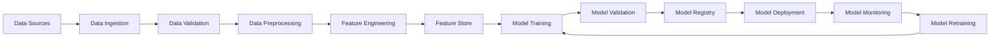

# AI/ML Operations Standards

**Version:** v1.0.0  
**Domain:** ai_ml  
**Type:** Technical  
**Risk Level:** HIGH  
**Maturity Level:** Production  
**Author:** MCP Standards Team  
**Created:** 2025-07-07T23:25:49.985996  
**Last Updated:** 2025-07-07T23:25:49.986003  

## Purpose

Comprehensive standards for AI/ML operations, model lifecycle management, and ethical AI practices

This AI/ML standard defines the requirements, guidelines, and best practices for ai/ml operations standards. It provides comprehensive guidance for machine learning model development, deployment, and lifecycle management while ensuring ethical AI practices and compliance with data protection regulations.

**AI/ML Focus Areas:**
- **Model Development**: End-to-end ML pipeline design and implementation
- **Data Management**: Data quality, privacy, and governance
- **Model Deployment**: Production deployment and monitoring
- **MLOps**: Continuous integration and deployment for ML systems
- **Ethical AI**: Bias detection, fairness, and explainability
- **Performance**: Model accuracy, latency, and scalability

## Scope

This AI/ML standard applies to:
- All machine learning and AI system development
- Data science and analytics projects
- Model training, validation, and deployment
- AI/ML infrastructure and MLOps pipelines
- Data processing and feature engineering
- Model monitoring and maintenance
- Ethical AI and bias mitigation
- Compliance with AI regulations and standards

## Implementation

### AI/ML Requirements

**NIST Controls:** NIST-AC-1, AC-6, AU-2, AU-12, CM-2, CM-8, IA-2, IA-4, RA-3, RA-5, SA-3, SA-8, SC-7, SC-8, SI-3, SI-4

**AI Ethics Framework:** Responsible AI development and deployment
**Data Protection:** GDPR, CCPA, and other privacy regulations
**Model Governance:** Version control, testing, and documentation

### Machine Learning Pipeline

#### Data Pipeline


#### Data Quality Framework
```python
# Example: Data quality validation
import pandas as pd
import numpy as np
from typing import Dict, List, Any
from dataclasses import dataclass
from sklearn.preprocessing import StandardScaler
from sklearn.impute import SimpleImputer

@dataclass
class DataQualityMetrics:
    completeness: float
    consistency: float
    accuracy: float
    validity: float
    uniqueness: float

class DataQualityValidator:
    def __init__(self):
        self.quality_rules = {}
        self.quality_metrics = {}
    
    def validate_data_quality(self, df: pd.DataFrame, 
                            quality_rules: Dict[str, Any]) -> DataQualityMetrics:
        """Validate data quality against defined rules."""
        
        # Completeness check
        completeness = self.check_completeness(df)
        
        # Consistency check
        consistency = self.check_consistency(df, quality_rules)
        
        # Accuracy check
        accuracy = self.check_accuracy(df, quality_rules)
        
        # Validity check
        validity = self.check_validity(df, quality_rules)
        
        # Uniqueness check
        uniqueness = self.check_uniqueness(df, quality_rules)
        
        return DataQualityMetrics(
            completeness=completeness,
            consistency=consistency,
            accuracy=accuracy,
            validity=validity,
            uniqueness=uniqueness
        )
    
    def check_completeness(self, df: pd.DataFrame) -> float:
        """Check data completeness (no missing values)."""
        total_cells = df.shape[0] * df.shape[1]
        missing_cells = df.isnull().sum().sum()
        return (total_cells - missing_cells) / total_cells
    
    def check_consistency(self, df: pd.DataFrame, 
                         rules: Dict[str, Any]) -> float:
        """Check data consistency against business rules."""
        consistency_score = 0
        rule_count = 0
        
        for column, rule in rules.get('consistency_rules', {}).items():
            if column in df.columns:
                rule_count += 1
                # Example: Check if values are within expected range
                if 'range' in rule:
                    min_val, max_val = rule['range']
                    valid_values = df[column].between(min_val, max_val).sum()
                    consistency_score += valid_values / len(df)
        
        return consistency_score / rule_count if rule_count > 0 else 1.0
    
    def preprocess_data(self, df: pd.DataFrame) -> pd.DataFrame:
        """Preprocess data for ML pipeline."""
        # Handle missing values
        numeric_columns = df.select_dtypes(include=[np.number]).columns
        categorical_columns = df.select_dtypes(include=['object']).columns
        
        # Impute missing values
        if len(numeric_columns) > 0:
            numeric_imputer = SimpleImputer(strategy='median')
            df[numeric_columns] = numeric_imputer.fit_transform(df[numeric_columns])
        
        if len(categorical_columns) > 0:
            categorical_imputer = SimpleImputer(strategy='most_frequent')
            df[categorical_columns] = categorical_imputer.fit_transform(df[categorical_columns])
        
        # Scale numerical features
        if len(numeric_columns) > 0:
            scaler = StandardScaler()
            df[numeric_columns] = scaler.fit_transform(df[numeric_columns])
        
        return df
```

#### Feature Engineering
```python
# Example: Feature engineering pipeline
import pandas as pd
from sklearn.base import BaseEstimator, TransformerMixin
from sklearn.pipeline import Pipeline
from sklearn.compose import ColumnTransformer
from sklearn.preprocessing import OneHotEncoder, StandardScaler

class FeatureEngineering:
    def __init__(self):
        self.feature_pipeline = None
        self.feature_importance = {}
    
    def create_feature_pipeline(self, numeric_features: List[str], 
                               categorical_features: List[str]) -> Pipeline:
        """Create feature engineering pipeline."""
        
        numeric_transformer = Pipeline([
            ('scaler', StandardScaler()),
            ('feature_creator', self.create_numeric_features())
        ])
        
        categorical_transformer = Pipeline([
            ('onehot', OneHotEncoder(handle_unknown='ignore')),
            ('feature_creator', self.create_categorical_features())
        ])
        
        preprocessor = ColumnTransformer([
            ('numeric', numeric_transformer, numeric_features),
            ('categorical', categorical_transformer, categorical_features)
        ])
        
        self.feature_pipeline = Pipeline([
            ('preprocessor', preprocessor),
            ('feature_selector', self.select_features())
        ])
        
        return self.feature_pipeline
    
    def create_numeric_features(self):
        """Create custom numeric features."""
        class NumericFeatureCreator(BaseEstimator, TransformerMixin):
            def fit(self, X, y=None):
                return self
            
            def transform(self, X):
                X_new = X.copy()
                # Add polynomial features
                X_new['feature_squared'] = X_new.iloc[:, 0] ** 2
                # Add interaction features
                if X_new.shape[1] > 1:
                    X_new['feature_interaction'] = X_new.iloc[:, 0] * X_new.iloc[:, 1]
                return X_new
        
        return NumericFeatureCreator()
    
    def create_categorical_features(self):
        """Create custom categorical features."""
        class CategoricalFeatureCreator(BaseEstimator, TransformerMixin):
            def fit(self, X, y=None):
                return self
            
            def transform(self, X):
                # Custom categorical feature transformations
                return X
        
        return CategoricalFeatureCreator()
    
    def select_features(self):
        """Select most important features."""
        from sklearn.feature_selection import SelectKBest, f_classif
        
        return SelectKBest(score_func=f_classif, k='all')
```

### Model Development

#### Model Training Framework
```python
# Example: ML model training framework
import mlflow
import mlflow.sklearn
from sklearn.model_selection import train_test_split, cross_val_score
from sklearn.metrics import accuracy_score, precision_score, recall_score, f1_score
from sklearn.ensemble import RandomForestClassifier
from sklearn.linear_model import LogisticRegression
from sklearn.svm import SVC

class MLModelTrainer:
    def __init__(self, experiment_name: str):
        mlflow.set_experiment(experiment_name)
        self.models = {}
        self.best_model = None
        self.model_metrics = {}
    
    def train_model(self, X_train, y_train, X_test, y_test, 
                   model_type: str = 'random_forest'):
        """Train and evaluate ML model."""
        
        with mlflow.start_run():
            # Select model
            if model_type == 'random_forest':
                model = RandomForestClassifier(n_estimators=100, random_state=42)
            elif model_type == 'logistic_regression':
                model = LogisticRegression(random_state=42)
            elif model_type == 'svm':
                model = SVC(random_state=42)
            else:
                raise ValueError(f"Unsupported model type: {model_type}")
            
            # Train model
            model.fit(X_train, y_train)
            
            # Make predictions
            y_pred = model.predict(X_test)
            
            # Calculate metrics
            metrics = {
                'accuracy': accuracy_score(y_test, y_pred),
                'precision': precision_score(y_test, y_pred, average='weighted'),
                'recall': recall_score(y_test, y_pred, average='weighted'),
                'f1_score': f1_score(y_test, y_pred, average='weighted')
            }
            
            # Cross-validation
            cv_scores = cross_val_score(model, X_train, y_train, cv=5)
            metrics['cv_mean'] = cv_scores.mean()
            metrics['cv_std'] = cv_scores.std()
            
            # Log parameters and metrics
            mlflow.log_param("model_type", model_type)
            mlflow.log_param("n_estimators", getattr(model, 'n_estimators', 'N/A'))
            
            for metric_name, metric_value in metrics.items():
                mlflow.log_metric(metric_name, metric_value)
            
            # Log model
            mlflow.sklearn.log_model(model, "model")
            
            # Store results
            self.models[model_type] = model
            self.model_metrics[model_type] = metrics
            
            return model, metrics
    
    def select_best_model(self, metric: str = 'f1_score'):
        """Select best model based on specified metric."""
        if not self.model_metrics:
            raise ValueError("No models trained yet")
        
        best_model_type = max(self.model_metrics.keys(), 
                            key=lambda x: self.model_metrics[x][metric])
        
        self.best_model = self.models[best_model_type]
        return self.best_model, self.model_metrics[best_model_type]
    
    def validate_model_performance(self, model, X_test, y_test, 
                                 performance_threshold: float = 0.8):
        """Validate model performance against threshold."""
        y_pred = model.predict(X_test)
        f1 = f1_score(y_test, y_pred, average='weighted')
        
        if f1 < performance_threshold:
            raise ValueError(f"Model performance ({f1:.3f}) below threshold ({performance_threshold})")
        
        return True
```

#### Model Validation and Testing
```python
# Example: Model validation framework
import numpy as np
from sklearn.model_selection import StratifiedKFold
from sklearn.metrics import confusion_matrix, classification_report

class ModelValidator:
    def __init__(self):
        self.validation_results = {}
    
    def validate_model_robustness(self, model, X, y, n_splits=5):
        """Validate model robustness using cross-validation."""
        skf = StratifiedKFold(n_splits=n_splits, shuffle=True, random_state=42)
        
        scores = []
        for train_idx, val_idx in skf.split(X, y):
            X_train, X_val = X[train_idx], X[val_idx]
            y_train, y_val = y[train_idx], y[val_idx]
            
            # Train on fold
            model.fit(X_train, y_train)
            
            # Validate on fold
            y_pred = model.predict(X_val)
            score = f1_score(y_val, y_pred, average='weighted')
            scores.append(score)
        
        return {
            'mean_score': np.mean(scores),
            'std_score': np.std(scores),
            'scores': scores
        }
    
    def test_model_bias(self, model, X, y, sensitive_features):
        """Test model for bias across sensitive features."""
        bias_metrics = {}
        
        for feature in sensitive_features:
            if feature in X.columns:
                unique_values = X[feature].unique()
                
                for value in unique_values:
                    mask = X[feature] == value
                    X_subset = X[mask]
                    y_subset = y[mask]
                    
                    if len(X_subset) > 0:
                        y_pred = model.predict(X_subset)
                        accuracy = accuracy_score(y_subset, y_pred)
                        
                        bias_metrics[f"{feature}_{value}"] = {
                            'accuracy': accuracy,
                            'sample_size': len(X_subset)
                        }
        
        return bias_metrics
    
    def validate_model_explainability(self, model, X, feature_names):
        """Validate model explainability."""
        try:
            import shap
            
            # Create SHAP explainer
            explainer = shap.TreeExplainer(model)
            shap_values = explainer.shap_values(X)
            
            # Calculate feature importance
            feature_importance = np.abs(shap_values).mean(axis=0)
            
            return {
                'feature_importance': dict(zip(feature_names, feature_importance)),
                'shap_values': shap_values,
                'explainable': True
            }
        except ImportError:
            return {
                'explainable': False,
                'error': 'SHAP not available for explainability analysis'
            }
```

### Model Deployment

#### MLOps Pipeline
```yaml
# Example: MLOps pipeline configuration
mlops_pipeline:
  model_registry:
    type: "MLflow"
    url: "https://mlflow.company.com"
    
  deployment_targets:
    - name: "staging"
      type: "kubernetes"
      namespace: "ml-staging"
      replicas: 2
      
    - name: "production"
      type: "kubernetes"
      namespace: "ml-production"
      replicas: 5
      
  monitoring:
    metrics:
      - "prediction_latency"
      - "prediction_accuracy"
      - "data_drift"
      - "model_drift"
    
    alerting:
      - condition: "prediction_latency > 100ms"
        severity: "warning"
      - condition: "prediction_accuracy < 0.9"
        severity: "critical"
```

#### Model Serving
```python
# Example: Model serving with FastAPI
from fastapi import FastAPI, HTTPException
from pydantic import BaseModel
import joblib
import numpy as np
from typing import List, Dict, Any
import logging

app = FastAPI(title="ML Model API", version="1.0.0")

class PredictionRequest(BaseModel):
    features: List[float]
    model_version: str = "latest"

class PredictionResponse(BaseModel):
    prediction: float
    probability: List[float]
    model_version: str
    prediction_id: str

class ModelServer:
    def __init__(self):
        self.models = {}
        self.model_metadata = {}
        self.prediction_counter = 0
        
    def load_model(self, model_path: str, model_version: str):
        """Load model from file system."""
        try:
            model = joblib.load(model_path)
            self.models[model_version] = model
            self.model_metadata[model_version] = {
                'loaded_at': datetime.now(),
                'model_path': model_path
            }
            logging.info(f"Model {model_version} loaded successfully")
        except Exception as e:
            logging.error(f"Error loading model {model_version}: {str(e)}")
            raise
    
    def predict(self, features: List[float], model_version: str = "latest"):
        """Make prediction using specified model version."""
        if model_version not in self.models:
            raise HTTPException(status_code=404, detail=f"Model version {model_version} not found")
        
        model = self.models[model_version]
        
        try:
            # Prepare input
            X = np.array(features).reshape(1, -1)
            
            # Make prediction
            prediction = model.predict(X)[0]
            probability = model.predict_proba(X)[0].tolist()
            
            # Generate prediction ID
            self.prediction_counter += 1
            prediction_id = f"pred_{self.prediction_counter:06d}"
            
            # Log prediction
            logging.info(f"Prediction {prediction_id}: {prediction}")
            
            return PredictionResponse(
                prediction=prediction,
                probability=probability,
                model_version=model_version,
                prediction_id=prediction_id
            )
            
        except Exception as e:
            logging.error(f"Error making prediction: {str(e)}")
            raise HTTPException(status_code=500, detail="Prediction failed")

model_server = ModelServer()

@app.post("/predict", response_model=PredictionResponse)
async def predict(request: PredictionRequest):
    """Make prediction endpoint."""
    return model_server.predict(request.features, request.model_version)

@app.get("/health")
async def health_check():
    """Health check endpoint."""
    return {"status": "healthy", "models_loaded": len(model_server.models)}
```

### Model Monitoring

#### Data Drift Detection
```python
# Example: Data drift detection
import pandas as pd
from scipy import stats
from typing import Dict, Tuple

class DataDriftDetector:
    def __init__(self, reference_data: pd.DataFrame):
        self.reference_data = reference_data
        self.reference_stats = self.calculate_reference_stats()
        
    def calculate_reference_stats(self) -> Dict[str, Dict[str, float]]:
        """Calculate reference statistics for drift detection."""
        stats = {}
        
        for column in self.reference_data.columns:
            if self.reference_data[column].dtype in ['int64', 'float64']:
                stats[column] = {
                    'mean': self.reference_data[column].mean(),
                    'std': self.reference_data[column].std(),
                    'min': self.reference_data[column].min(),
                    'max': self.reference_data[column].max()
                }
            else:
                value_counts = self.reference_data[column].value_counts()
                stats[column] = {
                    'distribution': value_counts.to_dict(),
                    'unique_values': len(value_counts)
                }
        
        return stats
    
    def detect_drift(self, current_data: pd.DataFrame, 
                    threshold: float = 0.05) -> Dict[str, Dict[str, Any]]:
        """Detect data drift using statistical tests."""
        drift_results = {}
        
        for column in self.reference_data.columns:
            if column in current_data.columns:
                if self.reference_data[column].dtype in ['int64', 'float64']:
                    # Use Kolmogorov-Smirnov test for numerical features
                    statistic, p_value = stats.ks_2samp(
                        self.reference_data[column], 
                        current_data[column]
                    )
                    
                    drift_results[column] = {
                        'test': 'Kolmogorov-Smirnov',
                        'statistic': statistic,
                        'p_value': p_value,
                        'drift_detected': p_value < threshold,
                        'drift_score': statistic
                    }
                else:
                    # Use Chi-square test for categorical features
                    ref_counts = self.reference_data[column].value_counts()
                    curr_counts = current_data[column].value_counts()
                    
                    # Align categories
                    all_categories = set(ref_counts.index) | set(curr_counts.index)
                    ref_aligned = [ref_counts.get(cat, 0) for cat in all_categories]
                    curr_aligned = [curr_counts.get(cat, 0) for cat in all_categories]
                    
                    try:
                        statistic, p_value = stats.chisquare(curr_aligned, ref_aligned)
                        
                        drift_results[column] = {
                            'test': 'Chi-square',
                            'statistic': statistic,
                            'p_value': p_value,
                            'drift_detected': p_value < threshold,
                            'drift_score': statistic
                        }
                    except ValueError:
                        drift_results[column] = {
                            'test': 'Chi-square',
                            'error': 'Unable to perform chi-square test',
                            'drift_detected': False
                        }
        
        return drift_results
```

#### Model Performance Monitoring
```python
# Example: Model performance monitoring
class ModelPerformanceMonitor:
    def __init__(self):
        self.performance_history = []
        self.alert_thresholds = {
            'accuracy': 0.85,
            'precision': 0.80,
            'recall': 0.80,
            'f1_score': 0.80
        }
    
    def monitor_predictions(self, y_true, y_pred, timestamp=None):
        """Monitor model performance on new predictions."""
        if timestamp is None:
            timestamp = datetime.now()
        
        # Calculate metrics
        metrics = {
            'timestamp': timestamp,
            'accuracy': accuracy_score(y_true, y_pred),
            'precision': precision_score(y_true, y_pred, average='weighted'),
            'recall': recall_score(y_true, y_pred, average='weighted'),
            'f1_score': f1_score(y_true, y_pred, average='weighted'),
            'sample_size': len(y_true)
        }
        
        # Store performance history
        self.performance_history.append(metrics)
        
        # Check for alerts
        alerts = self.check_performance_alerts(metrics)
        
        return metrics, alerts
    
    def check_performance_alerts(self, metrics: Dict[str, Any]) -> List[Dict[str, Any]]:
        """Check if performance metrics trigger alerts."""
        alerts = []
        
        for metric_name, threshold in self.alert_thresholds.items():
            if metric_name in metrics:
                if metrics[metric_name] < threshold:
                    alerts.append({
                        'metric': metric_name,
                        'value': metrics[metric_name],
                        'threshold': threshold,
                        'severity': 'high' if metrics[metric_name] < threshold * 0.9 else 'medium',
                        'timestamp': metrics['timestamp']
                    })
        
        return alerts
    
    def generate_performance_report(self, days: int = 30):
        """Generate performance report for specified period."""
        cutoff_date = datetime.now() - timedelta(days=days)
        
        recent_metrics = [
            m for m in self.performance_history 
            if m['timestamp'] > cutoff_date
        ]
        
        if not recent_metrics:
            return {"error": "No performance data available for the specified period"}
        
        # Calculate aggregate metrics
        avg_metrics = {}
        for metric in ['accuracy', 'precision', 'recall', 'f1_score']:
            values = [m[metric] for m in recent_metrics]
            avg_metrics[metric] = {
                'mean': np.mean(values),
                'std': np.std(values),
                'min': np.min(values),
                'max': np.max(values)
            }
        
        return {
            'period_days': days,
            'total_predictions': sum(m['sample_size'] for m in recent_metrics),
            'performance_metrics': avg_metrics,
            'trend': self.calculate_performance_trend(recent_metrics)
        }
    
    def calculate_performance_trend(self, metrics: List[Dict[str, Any]]) -> Dict[str, str]:
        """Calculate performance trend."""
        if len(metrics) < 2:
            return {'trend': 'insufficient_data'}
        
        # Sort by timestamp
        sorted_metrics = sorted(metrics, key=lambda x: x['timestamp'])
        
        # Calculate trend for each metric
        trends = {}
        for metric in ['accuracy', 'precision', 'recall', 'f1_score']:
            values = [m[metric] for m in sorted_metrics]
            
            # Simple trend calculation
            first_half = np.mean(values[:len(values)//2])
            second_half = np.mean(values[len(values)//2:])
            
            if second_half > first_half * 1.02:
                trends[metric] = 'improving'
            elif second_half < first_half * 0.98:
                trends[metric] = 'declining'
            else:
                trends[metric] = 'stable'
        
        return trends
```

### Ethical AI and Bias Mitigation

#### Bias Detection Framework
```python
# Example: AI bias detection and mitigation
class BiasDetector:
    def __init__(self):
        self.bias_metrics = {}
        self.fairness_constraints = {}
    
    def detect_bias(self, model, X, y, sensitive_features):
        """Detect bias in model predictions."""
        bias_results = {}
        
        for feature in sensitive_features:
            if feature in X.columns:
                unique_values = X[feature].unique()
                
                for value in unique_values:
                    mask = X[feature] == value
                    X_subset = X[mask]
                    y_subset = y[mask]
                    
                    if len(X_subset) > 0:
                        y_pred = model.predict(X_subset)
                        
                        # Calculate fairness metrics
                        bias_results[f"{feature}_{value}"] = {
                            'accuracy': accuracy_score(y_subset, y_pred),
                            'precision': precision_score(y_subset, y_pred, average='weighted'),
                            'recall': recall_score(y_subset, y_pred, average='weighted'),
                            'sample_size': len(X_subset),
                            'positive_rate': (y_pred == 1).mean()
                        }
        
        return bias_results
    
    def calculate_fairness_metrics(self, bias_results, reference_group):
        """Calculate fairness metrics comparing to reference group."""
        fairness_metrics = {}
        
        if reference_group not in bias_results:
            return fairness_metrics
        
        reference_metrics = bias_results[reference_group]
        
        for group, metrics in bias_results.items():
            if group != reference_group:
                fairness_metrics[group] = {
                    'equalized_odds': abs(metrics['recall'] - reference_metrics['recall']),
                    'demographic_parity': abs(metrics['positive_rate'] - reference_metrics['positive_rate']),
                    'equality_of_opportunity': abs(metrics['precision'] - reference_metrics['precision'])
                }
        
        return fairness_metrics
    
    def mitigate_bias(self, X, y, sensitive_features, method='resampling'):
        """Apply bias mitigation techniques."""
        if method == 'resampling':
            return self.apply_resampling(X, y, sensitive_features)
        elif method == 'reweighting':
            return self.apply_reweighting(X, y, sensitive_features)
        else:
            raise ValueError(f"Unknown bias mitigation method: {method}")
    
    def apply_resampling(self, X, y, sensitive_features):
        """Apply resampling to mitigate bias."""
        # Implement resampling logic
        return X, y
    
    def apply_reweighting(self, X, y, sensitive_features):
        """Apply reweighting to mitigate bias."""
        # Implement reweighting logic
        sample_weights = np.ones(len(X))
        return X, y, sample_weights
```

### Model Lifecycle Management

#### Model Versioning and Registry
```python
# Example: Model registry and versioning
class ModelRegistry:
    def __init__(self):
        self.models = {}
        self.model_versions = {}
        self.model_metadata = {}
    
    def register_model(self, model_name: str, model, version: str, 
                      metadata: Dict[str, Any]):
        """Register a model with version and metadata."""
        model_key = f"{model_name}:{version}"
        
        self.models[model_key] = model
        
        if model_name not in self.model_versions:
            self.model_versions[model_name] = []
        
        self.model_versions[model_name].append(version)
        
        self.model_metadata[model_key] = {
            'registered_at': datetime.now(),
            'version': version,
            'metadata': metadata
        }
    
    def get_model(self, model_name: str, version: str = 'latest'):
        """Get model by name and version."""
        if version == 'latest':
            if model_name in self.model_versions:
                version = self.model_versions[model_name][-1]
            else:
                raise ValueError(f"Model {model_name} not found")
        
        model_key = f"{model_name}:{version}"
        
        if model_key not in self.models:
            raise ValueError(f"Model {model_name}:{version} not found")
        
        return self.models[model_key]
    
    def promote_model(self, model_name: str, version: str, stage: str):
        """Promote model to a specific stage (staging, production)."""
        model_key = f"{model_name}:{version}"
        
        if model_key not in self.models:
            raise ValueError(f"Model {model_name}:{version} not found")
        
        self.model_metadata[model_key]['stage'] = stage
        self.model_metadata[model_key]['promoted_at'] = datetime.now()
    
    def list_models(self, stage: str = None):
        """List all models, optionally filtered by stage."""
        models = []
        
        for model_key, metadata in self.model_metadata.items():
            if stage is None or metadata.get('stage') == stage:
                models.append({
                    'model_key': model_key,
                    'stage': metadata.get('stage', 'none'),
                    'registered_at': metadata['registered_at'],
                    'metadata': metadata['metadata']
                })
        
        return models
```

## Compliance

### Regulatory Requirements

- **GDPR**: Compliance with GDPR requirements
- **CCPA**: Compliance with CCPA requirements
- **AI Act**: Compliance with AI Act requirements
- **NIST AI Risk Management Framework**: Compliance with NIST AI Risk Management Framework requirements
- **ISO/IEC 23053**: Compliance with ISO/IEC 23053 requirements
- **IEEE 2857**: Compliance with IEEE 2857 requirements

### Risk Management

- **Risk Level**: High Impact
- **Risk Assessment**: Regular risk assessments required
- **Mitigation Strategies**: Implement appropriate controls

### Audit Requirements

- Regular compliance audits
- Documentation review
- Control effectiveness testing

## Monitoring and Measurement

### AI/ML System Monitoring

#### ML Pipeline Monitoring
```python
# Example: ML pipeline monitoring
class MLPipelineMonitor:
    def __init__(self):
        self.pipeline_metrics = {}
        self.data_quality_metrics = {}
        self.model_performance_metrics = {}
    
    def monitor_data_pipeline(self, pipeline_name: str, 
                            input_data: pd.DataFrame, 
                            output_data: pd.DataFrame):
        """Monitor data pipeline health."""
        metrics = {
            'timestamp': datetime.now(),
            'input_records': len(input_data),
            'output_records': len(output_data),
            'data_quality_score': self.calculate_data_quality_score(input_data),
            'processing_time': self.get_processing_time(pipeline_name)
        }
        
        self.pipeline_metrics[pipeline_name] = metrics
        return metrics
    
    def monitor_model_serving(self, model_name: str, 
                            prediction_latency: float,
                            prediction_accuracy: float):
        """Monitor model serving performance."""
        metrics = {
            'timestamp': datetime.now(),
            'prediction_latency': prediction_latency,
            'prediction_accuracy': prediction_accuracy,
            'throughput': self.calculate_throughput(model_name)
        }
        
        self.model_performance_metrics[model_name] = metrics
        return metrics
    
    def generate_ml_dashboard(self):
        """Generate ML monitoring dashboard."""
        return {
            'pipeline_health': self.pipeline_metrics,
            'model_performance': self.model_performance_metrics,
            'data_quality': self.data_quality_metrics,
            'alerts': self.check_ml_alerts()
        }
    
    def check_ml_alerts(self):
        """Check for ML system alerts."""
        alerts = []
        
        # Check data quality alerts
        for pipeline, metrics in self.pipeline_metrics.items():
            if metrics['data_quality_score'] < 0.8:
                alerts.append({
                    'type': 'data_quality',
                    'pipeline': pipeline,
                    'score': metrics['data_quality_score'],
                    'threshold': 0.8
                })
        
        # Check model performance alerts
        for model, metrics in self.model_performance_metrics.items():
            if metrics['prediction_latency'] > 100:  # 100ms threshold
                alerts.append({
                    'type': 'latency',
                    'model': model,
                    'latency': metrics['prediction_latency'],
                    'threshold': 100
                })
        
        return alerts
```

#### Automated ML Governance
```yaml
# Example: Automated ML governance configuration
ml_governance:
  model_approval_workflow:
    stages:
      - "development"
      - "testing"
      - "staging"
      - "production"
    
    approval_criteria:
      testing:
        - "performance_score >= 0.85"
        - "bias_score <= 0.1"
        - "data_quality_score >= 0.9"
      
      staging:
        - "load_testing_passed == true"
        - "security_scan_passed == true"
        - "documentation_complete == true"
      
      production:
        - "business_approval == true"
        - "compliance_review_passed == true"
        - "disaster_recovery_tested == true"
  
  automated_checks:
    - check: "model_performance_degradation"
      frequency: "hourly"
      threshold: "10% decrease"
      action: "alert_team"
    
    - check: "data_drift_detection"
      frequency: "daily"
      threshold: "p_value < 0.05"
      action: "retrain_model"
    
    - check: "bias_monitoring"
      frequency: "weekly"
      threshold: "fairness_score < 0.8"
      action: "flag_for_review"
```

## Responsibilities

### Standard Owner
- Maintain standard documentation
- Approve changes and updates
- Ensure compliance monitoring

### Implementation Teams
- Follow standard requirements
- Report compliance issues
- Maintain documentation

### Audit Teams
- Conduct compliance reviews
- Validate implementation
- Report findings and recommendations

## References

### AI/ML References

#### Machine Learning Frameworks
- **Python**: scikit-learn, TensorFlow, PyTorch, XGBoost
- **R**: caret, randomForest, e1071
- **MLOps**: MLflow, Kubeflow, Apache Airflow
- **Model Serving**: TensorFlow Serving, Seldon Core, BentoML

#### AI Ethics and Fairness
- **Fairlearn**: Microsoft's fairness toolkit
- **AI Fairness 360**: IBM's fairness toolkit
- **What-If Tool**: Google's model analysis tool
- **Responsible AI Guidelines**: Industry best practices

#### Data Quality and Governance
- **Great Expectations**: Data validation framework
- **Apache Atlas**: Data governance platform
- **Feast**: Feature store for ML
- **DVC**: Data Version Control

#### Model Monitoring and Observability
- **Evidently**: ML monitoring and testing
- **Whylogs**: Data logging for ML
- **Weights & Biases**: ML experiment tracking
- **Neptune**: ML metadata store

#### Compliance and Regulations
- **GDPR**: General Data Protection Regulation
- **CCPA**: California Consumer Privacy Act
- **AI Act**: European Union AI regulation
- **NIST AI Risk Management Framework**

#### Industry Standards
- **ISO/IEC 23053**: Framework for AI risk management
- **IEEE 2857**: Privacy engineering for AI systems
- **ISO/IEC 23894**: AI risk management guidance
- **NIST SP 1270**: Towards a standard for identifying and managing bias in AI

## Appendix

### Glossary

**Standard**: A documented agreement containing technical specifications or criteria to be used consistently.

**Compliance**: The act of conforming to rules, regulations, or standards.

**Risk**: The potential for loss, damage, or destruction of an asset as a result of a threat.

### Change History

| Version | Date | Changes | Author |
|---------|------|---------|---------|
| 1.0.0 | 2025-07-07T23:25:49.986003 | Initial version | MCP Standards Team |

### Review and Approval

- **Review Status**: Draft
- **Reviewers**: 
- **Approval Date**: Pending

---

*This document is part of the ai_ml standards framework and is subject to regular review and updates.*