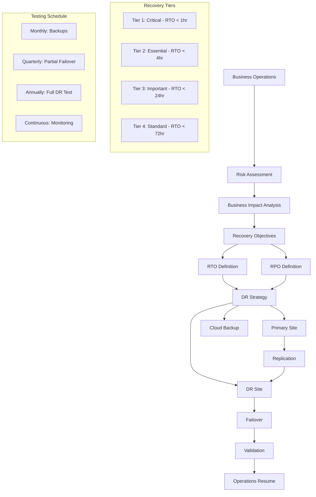

# Business Continuity and Disaster Recovery Standards

**Version:** v1.0.0  
**Domain:** resilience  
**Type:** Technical  
**Risk Level:** CRITICAL  
**Maturity Level:** Production  
**Author:** MCP Standards Team  
**Created:** 2025-07-08T12:00:00.000000  
**Last Updated:** 2025-07-08T12:00:00.000000  

## Purpose

Comprehensive standards for business continuity planning and disaster recovery, including BCP/DR frameworks, RTO/RPO definitions, backup strategies, failover procedures, crisis communication, recovery testing, and documentation requirements

This business continuity and disaster recovery standard defines the requirements, guidelines, and best practices for ensuring organizational resilience. It provides comprehensive guidance for developing business continuity plans, defining recovery objectives, implementing backup strategies, establishing failover procedures, managing crisis communications, conducting recovery tests, and maintaining documentation while ensuring rapid recovery and minimal business impact during disruptions.

**Business Continuity and Disaster Recovery Focus Areas:**
- **BCP/DR Planning**: Comprehensive framework development
- **RTO/RPO Definitions**: Recovery time and point objectives
- **Backup Strategies**: Data protection and recovery methods
- **Failover Procedures**: Automated and manual failover processes
- **Crisis Communication**: Stakeholder communication during disasters
- **Recovery Testing**: Regular drills and validation
- **Documentation**: Runbooks and training materials

## Scope

This business continuity and disaster recovery standard applies to:
- Business impact analysis and risk assessment
- Recovery time and recovery point objectives
- Data backup and replication strategies
- System failover and failback procedures
- Disaster recovery site management
- Crisis communication protocols
- Recovery testing and validation
- DR documentation and runbooks
- Training and awareness programs

## Implementation

### Business Continuity Requirements

**NIST Controls:** NIST-CP-1 through CP-13, IR-1 through IR-10, PE-17, SC-6, SI-13, AU-9, PM-8, PM-9, SA-14

**Framework Standards:** ISO 22301, COBIT, ITIL Service Continuity
**Recovery Standards:** RTO/RPO definitions, tiered recovery strategies
**Testing Standards:** Tabletop exercises, partial failover, full DR tests

### Business Continuity Architecture

#### Comprehensive BC/DR Framework


#### Business Continuity Implementation
```python
# Example: Comprehensive BC/DR management system
import json
import asyncio
import hashlib
from datetime import datetime, timedelta
from typing import List, Dict, Any, Optional, Tuple, Callable
from dataclasses import dataclass, field
from enum import Enum
import boto3
import kubernetes
from concurrent.futures import ThreadPoolExecutor
import logging

# Configure logging
logging.basicConfig(level=logging.INFO)
logger = logging.getLogger(__name__)

class SystemCriticality(Enum):
    """System criticality levels for recovery prioritization"""
    TIER1_CRITICAL = 1      # Mission critical, customer-facing
    TIER2_ESSENTIAL = 2     # Business essential
    TIER3_IMPORTANT = 3     # Important but not critical
    TIER4_STANDARD = 4      # Standard priority

class DisasterType(Enum):
    """Types of disasters to plan for"""
    NATURAL = "natural"          # Earthquake, flood, etc.
    CYBER = "cyber"             # Ransomware, breach, etc.
    INFRASTRUCTURE = "infra"    # Power, network, etc.
    PANDEMIC = "pandemic"       # Health crisis
    REGIONAL = "regional"       # Regional outage

class RecoveryStatus(Enum):
    """Recovery process status"""
    NORMAL = "normal"
    ALERT = "alert"
    FAILOVER_INITIATED = "failover_initiated"
    FAILOVER_COMPLETE = "failover_complete"
    VALIDATION = "validation"
    RECOVERED = "recovered"
    FAILED = "failed"

@dataclass
class RecoveryObjective:
    """Recovery Time and Point Objectives"""
    system_name: str
    criticality: SystemCriticality
    rto_minutes: int  # Recovery Time Objective
    rpo_minutes: int  # Recovery Point Objective
    dependencies: List[str] = field(default_factory=list)
    
    def is_rto_breached(self, downtime_minutes: int) -> bool:
        """Check if RTO has been breached"""
        return downtime_minutes > self.rto_minutes
    
    def is_rpo_breached(self, data_loss_minutes: int) -> bool:
        """Check if RPO has been breached"""
        return data_loss_minutes > self.rpo_minutes

@dataclass
class BackupConfiguration:
    """Backup configuration for a system"""
    system_name: str
    backup_type: str  # full, incremental, differential
    frequency_hours: int
    retention_days: int
    storage_locations: List[str]
    encryption_enabled: bool = True
    compression_enabled: bool = True
    verification_enabled: bool = True
    
    def next_backup_time(self, last_backup: datetime) -> datetime:
        """Calculate next backup time"""
        return last_backup + timedelta(hours=self.frequency_hours)

@dataclass
class DisasterScenario:
    """Disaster scenario definition"""
    id: str
    name: str
    type: DisasterType
    description: str
    affected_systems: List[str]
    affected_regions: List[str]
    probability: str  # low, medium, high
    impact: str      # low, medium, high, critical
    mitigation_strategies: List[str]

@dataclass
class RecoveryProcedure:
    """Automated recovery procedure"""
    id: str
    name: str
    system: str
    steps: List[Dict[str, Any]]
    validation_checks: List[Dict[str, Any]]
    rollback_steps: List[Dict[str, Any]]
    estimated_duration_minutes: int
    requires_approval: bool = False
    
    async def execute(self, context: Dict[str, Any]) -> bool:
        """Execute recovery procedure"""
        logger.info(f"Executing recovery procedure: {self.name}")
        
        for step in self.steps:
            success = await self._execute_step(step, context)
            if not success:
                logger.error(f"Step failed: {step['name']}")
                await self._rollback(context)
                return False
        
        # Validate recovery
        for check in self.validation_checks:
            if not await self._validate_check(check, context):
                logger.error(f"Validation failed: {check['name']}")
                await self._rollback(context)
                return False
        
        return True
    
    async def _execute_step(self, step: Dict[str, Any], context: Dict[str, Any]) -> bool:
        """Execute a single recovery step"""
        # Implementation would depend on step type
        logger.info(f"Executing step: {step['name']}")
        await asyncio.sleep(1)  # Simulate work
        return True
    
    async def _validate_check(self, check: Dict[str, Any], context: Dict[str, Any]) -> bool:
        """Execute validation check"""
        logger.info(f"Running validation: {check['name']}")
        await asyncio.sleep(0.5)  # Simulate check
        return True
    
    async def _rollback(self, context: Dict[str, Any]):
        """Execute rollback procedures"""
        logger.warning("Executing rollback procedures")
        for step in self.rollback_steps:
            await self._execute_step(step, context)

class BackupManager:
    """Manage backup operations"""
    
    def __init__(self):
        self.configurations: Dict[str, BackupConfiguration] = {}
        self.backup_history: Dict[str, List[Dict[str, Any]]] = {}
        self.s3_client = boto3.client('s3')
        
    def register_backup_config(self, config: BackupConfiguration):
        """Register backup configuration"""
        self.configurations[config.system_name] = config
        logger.info(f"Registered backup config for {config.system_name}")
    
    async def perform_backup(self, system_name: str) -> Dict[str, Any]:
        """Perform backup for a system"""
        if system_name not in self.configurations:
            raise ValueError(f"No backup configuration for {system_name}")
        
        config = self.configurations[system_name]
        backup_id = f"{system_name}_{datetime.utcnow().strftime('%Y%m%d_%H%M%S')}"
        
        logger.info(f"Starting backup {backup_id}")
        
        # Simulate backup process
        backup_result = {
            "backup_id": backup_id,
            "system": system_name,
            "start_time": datetime.utcnow().isoformat(),
            "type": config.backup_type,
            "status": "in_progress"
        }
        
        try:
            # Create backup
            backup_data = await self._create_backup(system_name)
            
            # Compress if enabled
            if config.compression_enabled:
                backup_data = await self._compress_data(backup_data)
            
            # Encrypt if enabled
            if config.encryption_enabled:
                backup_data = await self._encrypt_data(backup_data)
            
            # Store in multiple locations
            for location in config.storage_locations:
                await self._store_backup(backup_id, backup_data, location)
            
            # Verify if enabled
            if config.verification_enabled:
                verification_result = await self._verify_backup(backup_id, config.storage_locations[0])
                backup_result["verification"] = verification_result
            
            backup_result["status"] = "completed"
            backup_result["end_time"] = datetime.utcnow().isoformat()
            backup_result["size_bytes"] = len(backup_data)
            
        except Exception as e:
            logger.error(f"Backup failed: {e}")
            backup_result["status"] = "failed"
            backup_result["error"] = str(e)
        
        # Record in history
        if system_name not in self.backup_history:
            self.backup_history[system_name] = []
        self.backup_history[system_name].append(backup_result)
        
        return backup_result
    
    async def _create_backup(self, system_name: str) -> bytes:
        """Create backup data"""
        # Simulate data collection
        await asyncio.sleep(2)
        return f"Backup data for {system_name}".encode()
    
    async def _compress_data(self, data: bytes) -> bytes:
        """Compress backup data"""
        import gzip
        return gzip.compress(data)
    
    async def _encrypt_data(self, data: bytes) -> bytes:
        """Encrypt backup data"""
        # Simplified - would use proper encryption
        return hashlib.sha256(data).digest() + data
    
    async def _store_backup(self, backup_id: str, data: bytes, location: str):
        """Store backup in specified location"""
        if location.startswith("s3://"):
            bucket = location.replace("s3://", "").split("/")[0]
            key = f"backups/{backup_id}"
            # self.s3_client.put_object(Bucket=bucket, Key=key, Body=data)
            logger.info(f"Stored backup in S3: {bucket}/{key}")
        else:
            # File system storage
            import os
            path = f"{location}/{backup_id}"
            os.makedirs(os.path.dirname(path), exist_ok=True)
            with open(path, 'wb') as f:
                f.write(data)
            logger.info(f"Stored backup in filesystem: {path}")
    
    async def _verify_backup(self, backup_id: str, location: str) -> Dict[str, Any]:
        """Verify backup integrity"""
        # Simulate verification
        await asyncio.sleep(1)
        return {
            "verified": True,
            "checksum": hashlib.md5(backup_id.encode()).hexdigest(),
            "timestamp": datetime.utcnow().isoformat()
        }
    
    def get_last_backup_time(self, system_name: str) -> Optional[datetime]:
        """Get last successful backup time"""
        if system_name not in self.backup_history:
            return None
        
        successful_backups = [
            b for b in self.backup_history[system_name]
            if b["status"] == "completed"
        ]
        
        if not successful_backups:
            return None
        
        last_backup = successful_backups[-1]
        return datetime.fromisoformat(last_backup["end_time"])
    
    def calculate_rpo_status(self, system_name: str, rpo_minutes: int) -> Dict[str, Any]:
        """Calculate RPO compliance status"""
        last_backup = self.get_last_backup_time(system_name)
        
        if not last_backup:
            return {
                "compliant": False,
                "last_backup": None,
                "time_since_backup": None,
                "rpo_breach_minutes": rpo_minutes
            }
        
        time_since_backup = datetime.utcnow() - last_backup
        minutes_since_backup = time_since_backup.total_seconds() / 60
        
        return {
            "compliant": minutes_since_backup <= rpo_minutes,
            "last_backup": last_backup.isoformat(),
            "time_since_backup_minutes": minutes_since_backup,
            "rpo_breach_minutes": max(0, minutes_since_backup - rpo_minutes)
        }

class FailoverOrchestrator:
    """Orchestrate failover procedures"""
    
    def __init__(self):
        self.procedures: Dict[str, RecoveryProcedure] = {}
        self.active_failovers: Dict[str, Dict[str, Any]] = {}
        self.health_checks: Dict[str, Callable] = {}
        
    def register_procedure(self, procedure: RecoveryProcedure):
        """Register failover procedure"""
        self.procedures[procedure.system] = procedure
        
    def register_health_check(self, system: str, check: Callable):
        """Register system health check"""
        self.health_checks[system] = check
    
    async def initiate_failover(self, system: str, reason: str) -> Dict[str, Any]:
        """Initiate failover for a system"""
        if system not in self.procedures:
            raise ValueError(f"No failover procedure for {system}")
        
        if system in self.active_failovers:
            return {
                "status": "already_active",
                "failover_id": self.active_failovers[system]["id"]
            }
        
        failover_id = f"failover_{system}_{datetime.utcnow().strftime('%Y%m%d_%H%M%S')}"
        
        failover_context = {
            "id": failover_id,
            "system": system,
            "reason": reason,
            "start_time": datetime.utcnow(),
            "status": RecoveryStatus.FAILOVER_INITIATED
        }
        
        self.active_failovers[system] = failover_context
        
        # Execute failover procedure
        procedure = self.procedures[system]
        
        try:
            # Check if approval required
            if procedure.requires_approval:
                approval = await self._request_approval(system, reason)
                if not approval:
                    failover_context["status"] = RecoveryStatus.FAILED
                    failover_context["error"] = "Approval denied"
                    return failover_context
            
            # Execute failover
            success = await procedure.execute(failover_context)
            
            if success:
                failover_context["status"] = RecoveryStatus.FAILOVER_COMPLETE
                failover_context["end_time"] = datetime.utcnow()
                
                # Validate system health
                if await self._validate_system_health(system):
                    failover_context["status"] = RecoveryStatus.RECOVERED
                else:
                    failover_context["status"] = RecoveryStatus.VALIDATION
                    failover_context["warning"] = "System health check failed"
            else:
                failover_context["status"] = RecoveryStatus.FAILED
                
        except Exception as e:
            logger.error(f"Failover failed: {e}")
            failover_context["status"] = RecoveryStatus.FAILED
            failover_context["error"] = str(e)
        
        # Remove from active failovers
        if failover_context["status"] in [RecoveryStatus.RECOVERED, RecoveryStatus.FAILED]:
            del self.active_failovers[system]
        
        return failover_context
    
    async def _request_approval(self, system: str, reason: str) -> bool:
        """Request failover approval"""
        logger.info(f"Requesting approval for {system} failover: {reason}")
        # In production, this would integrate with approval systems
        await asyncio.sleep(1)
        return True
    
    async def _validate_system_health(self, system: str) -> bool:
        """Validate system health after failover"""
        if system in self.health_checks:
            return await self.health_checks[system]()
        return True

class CrisisCommunicationManager:
    """Manage crisis communications"""
    
    def __init__(self):
        self.contact_lists: Dict[str, List[Dict[str, str]]] = {}
        self.templates: Dict[str, str] = {}
        self.communication_log: List[Dict[str, Any]] = []
        
    def register_contact_list(self, list_name: str, contacts: List[Dict[str, str]]):
        """Register contact list"""
        self.contact_lists[list_name] = contacts
        
    def register_template(self, template_name: str, template: str):
        """Register communication template"""
        self.templates[template_name] = template
    
    async def send_notification(self, 
                              incident_type: str,
                              severity: str,
                              affected_systems: List[str],
                              message: str,
                              contact_lists: List[str]) -> Dict[str, Any]:
        """Send crisis notification"""
        notification_id = f"notif_{datetime.utcnow().strftime('%Y%m%d_%H%M%S')}"
        
        # Prepare notification
        notification = {
            "id": notification_id,
            "timestamp": datetime.utcnow().isoformat(),
            "incident_type": incident_type,
            "severity": severity,
            "affected_systems": affected_systems,
            "message": message,
            "recipients": []
        }
        
        # Get all recipients
        all_recipients = []
        for list_name in contact_lists:
            if list_name in self.contact_lists:
                all_recipients.extend(self.contact_lists[list_name])
        
        # Send notifications
        for recipient in all_recipients:
            await self._send_to_recipient(recipient, notification)
            notification["recipients"].append(recipient["email"])
        
        # Log communication
        self.communication_log.append(notification)
        
        return notification
    
    async def _send_to_recipient(self, recipient: Dict[str, str], 
                                notification: Dict[str, Any]):
        """Send notification to individual recipient"""
        # Implementation would integrate with communication channels
        logger.info(f"Sending notification to {recipient['email']}")
        await asyncio.sleep(0.1)  # Simulate sending
    
    def generate_status_page_update(self, 
                                   affected_services: List[str],
                                   status: str,
                                   message: str) -> str:
        """Generate public status page update"""
        template = self.templates.get("status_page", """
        **Service Status Update**
        
        Time: {timestamp}
        Status: {status}
        Affected Services: {services}
        
        {message}
        
        We are actively working to resolve this issue and will provide updates every 30 minutes.
        """)
        
        return template.format(
            timestamp=datetime.utcnow().strftime("%Y-%m-%d %H:%M UTC"),
            status=status,
            services=", ".join(affected_services),
            message=message
        )

class DRTestManager:
    """Manage disaster recovery testing"""
    
    def __init__(self):
        self.test_scenarios: Dict[str, Dict[str, Any]] = {}
        self.test_results: List[Dict[str, Any]] = []
        self.test_schedule: Dict[str, Dict[str, Any]] = {}
        
    def register_test_scenario(self, scenario: Dict[str, Any]):
        """Register DR test scenario"""
        self.test_scenarios[scenario["id"]] = scenario
        
    def schedule_test(self, scenario_id: str, test_date: datetime, test_type: str):
        """Schedule DR test"""
        test_id = f"test_{scenario_id}_{test_date.strftime('%Y%m%d')}"
        
        self.test_schedule[test_id] = {
            "id": test_id,
            "scenario_id": scenario_id,
            "test_date": test_date,
            "test_type": test_type,  # tabletop, partial, full
            "status": "scheduled"
        }
        
        return test_id
    
    async def execute_test(self, test_id: str) -> Dict[str, Any]:
        """Execute DR test"""
        if test_id not in self.test_schedule:
            raise ValueError(f"Test {test_id} not found")
        
        test_info = self.test_schedule[test_id]
        scenario = self.test_scenarios[test_info["scenario_id"]]
        
        test_result = {
            "test_id": test_id,
            "scenario": scenario["name"],
            "test_type": test_info["test_type"],
            "start_time": datetime.utcnow().isoformat(),
            "status": "in_progress",
            "steps_completed": [],
            "issues_found": [],
            "recommendations": []
        }
        
        try:
            # Execute test based on type
            if test_info["test_type"] == "tabletop":
                await self._execute_tabletop_test(scenario, test_result)
            elif test_info["test_type"] == "partial":
                await self._execute_partial_test(scenario, test_result)
            elif test_info["test_type"] == "full":
                await self._execute_full_test(scenario, test_result)
            
            test_result["status"] = "completed"
            
        except Exception as e:
            logger.error(f"Test failed: {e}")
            test_result["status"] = "failed"
            test_result["error"] = str(e)
        
        test_result["end_time"] = datetime.utcnow().isoformat()
        self.test_results.append(test_result)
        
        return test_result
    
    async def _execute_tabletop_test(self, scenario: Dict[str, Any], 
                                    result: Dict[str, Any]):
        """Execute tabletop exercise"""
        logger.info("Executing tabletop exercise")
        
        # Simulate discussion points
        discussion_points = [
            "Review incident detection procedures",
            "Validate communication plans",
            "Check runbook completeness",
            "Verify contact lists",
            "Review decision trees"
        ]
        
        for point in discussion_points:
            await asyncio.sleep(0.5)
            result["steps_completed"].append({
                "step": point,
                "timestamp": datetime.utcnow().isoformat(),
                "outcome": "reviewed"
            })
    
    async def _execute_partial_test(self, scenario: Dict[str, Any], 
                                   result: Dict[str, Any]):
        """Execute partial failover test"""
        logger.info("Executing partial failover test")
        
        # Test specific components
        test_components = scenario.get("test_components", ["database", "api"])
        
        for component in test_components:
            await asyncio.sleep(2)
            
            # Simulate component test
            test_passed = True  # Would perform actual test
            
            result["steps_completed"].append({
                "component": component,
                "action": "failover",
                "success": test_passed,
                "timestamp": datetime.utcnow().isoformat()
            })
            
            if not test_passed:
                result["issues_found"].append({
                    "component": component,
                    "issue": "Failover failed",
                    "severity": "high"
                })
    
    async def _execute_full_test(self, scenario: Dict[str, Any], 
                                result: Dict[str, Any]):
        """Execute full DR test"""
        logger.info("Executing full DR test")
        
        # Full system failover
        systems = scenario.get("systems", [])
        
        for system in systems:
            await asyncio.sleep(5)
            
            # Simulate full system failover
            failover_success = True  # Would perform actual failover
            validation_success = True  # Would validate system
            
            result["steps_completed"].append({
                "system": system,
                "failover": failover_success,
                "validation": validation_success,
                "timestamp": datetime.utcnow().isoformat()
            })
            
            if not failover_success or not validation_success:
                result["issues_found"].append({
                    "system": system,
                    "issue": "System recovery failed",
                    "severity": "critical"
                })
        
        # Generate recommendations
        if result["issues_found"]:
            result["recommendations"] = [
                "Update failover procedures",
                "Increase testing frequency",
                "Review system dependencies"
            ]

class BCDROrchestrator:
    """Main BC/DR orchestration system"""
    
    def __init__(self):
        self.recovery_objectives: Dict[str, RecoveryObjective] = {}
        self.backup_manager = BackupManager()
        self.failover_orchestrator = FailoverOrchestrator()
        self.communication_manager = CrisisCommunicationManager()
        self.test_manager = DRTestManager()
        self.active_incidents: Dict[str, Dict[str, Any]] = {}
        
    def register_system(self, recovery_objective: RecoveryObjective, 
                       backup_config: BackupConfiguration):
        """Register system for BC/DR"""
        self.recovery_objectives[recovery_objective.system_name] = recovery_objective
        self.backup_manager.register_backup_config(backup_config)
        
        logger.info(f"Registered system: {recovery_objective.system_name}")
        logger.info(f"RTO: {recovery_objective.rto_minutes} min, RPO: {recovery_objective.rpo_minutes} min")
    
    async def declare_incident(self, incident_type: str, 
                             affected_systems: List[str],
                             severity: str) -> Dict[str, Any]:
        """Declare a BC/DR incident"""
        incident_id = f"inc_{datetime.utcnow().strftime('%Y%m%d_%H%M%S')}"
        
        incident = {
            "id": incident_id,
            "type": incident_type,
            "affected_systems": affected_systems,
            "severity": severity,
            "declared_at": datetime.utcnow(),
            "status": "active",
            "recovery_actions": []
        }
        
        self.active_incidents[incident_id] = incident
        
        # Send initial notifications
        await self.communication_manager.send_notification(
            incident_type=incident_type,
            severity=severity,
            affected_systems=affected_systems,
            message=f"BC/DR incident declared: {incident_type}",
            contact_lists=["executive", "technical", "operations"]
        )
        
        # Initiate recovery procedures
        for system in affected_systems:
            if system in self.recovery_objectives:
                recovery_task = asyncio.create_task(
                    self._recover_system(system, incident_id)
                )
                incident["recovery_actions"].append({
                    "system": system,
                    "task": recovery_task,
                    "started_at": datetime.utcnow()
                })
        
        return incident
    
    async def _recover_system(self, system: str, incident_id: str):
        """Recover a system"""
        logger.info(f"Starting recovery for {system}")
        
        # Check RTO/RPO status
        recovery_obj = self.recovery_objectives[system]
        rpo_status = self.backup_manager.calculate_rpo_status(
            system, recovery_obj.rpo_minutes
        )
        
        if not rpo_status["compliant"]:
            logger.warning(f"RPO breach for {system}: {rpo_status['rpo_breach_minutes']} minutes")
        
        # Initiate failover
        failover_result = await self.failover_orchestrator.initiate_failover(
            system, f"Incident {incident_id}"
        )
        
        # Update incident status
        if incident_id in self.active_incidents:
            self.active_incidents[incident_id]["recovery_actions"].append({
                "system": system,
                "failover_result": failover_result,
                "completed_at": datetime.utcnow()
            })
    
    def generate_bcdr_report(self) -> Dict[str, Any]:
        """Generate comprehensive BC/DR status report"""
        report = {
            "generated_at": datetime.utcnow().isoformat(),
            "systems": {},
            "recent_incidents": [],
            "test_results": [],
            "compliance_status": {}
        }
        
        # System status
        for system, recovery_obj in self.recovery_objectives.items():
            rpo_status = self.backup_manager.calculate_rpo_status(
                system, recovery_obj.rpo_minutes
            )
            
            report["systems"][system] = {
                "criticality": recovery_obj.criticality.name,
                "rto_minutes": recovery_obj.rto_minutes,
                "rpo_minutes": recovery_obj.rpo_minutes,
                "rpo_compliant": rpo_status["compliant"],
                "last_backup": rpo_status["last_backup"]
            }
        
        # Recent incidents
        for incident in list(self.active_incidents.values())[-5:]:
            report["recent_incidents"].append({
                "id": incident["id"],
                "type": incident["type"],
                "status": incident["status"],
                "declared_at": incident["declared_at"].isoformat()
            })
        
        # Test results
        report["test_results"] = self.test_manager.test_results[-5:]
        
        return report

# Example usage
async def main():
    # Initialize BC/DR orchestrator
    bcdr = BCDROrchestrator()
    
    # Register critical systems
    api_recovery = RecoveryObjective(
        system_name="api",
        criticality=SystemCriticality.TIER1_CRITICAL,
        rto_minutes=60,
        rpo_minutes=15,
        dependencies=["database", "cache"]
    )
    
    api_backup = BackupConfiguration(
        system_name="api",
        backup_type="incremental",
        frequency_hours=1,
        retention_days=30,
        storage_locations=["s3://backup-primary", "s3://backup-secondary"]
    )
    
    bcdr.register_system(api_recovery, api_backup)
    
    # Register database
    db_recovery = RecoveryObjective(
        system_name="database",
        criticality=SystemCriticality.TIER1_CRITICAL,
        rto_minutes=30,
        rpo_minutes=5,
        dependencies=[]
    )
    
    db_backup = BackupConfiguration(
        system_name="database",
        backup_type="continuous",
        frequency_hours=0.25,  # 15 minutes
        retention_days=90,
        storage_locations=["s3://backup-primary", "/mnt/backup"]
    )
    
    bcdr.register_system(db_recovery, db_backup)
    
    # Setup communication templates
    bcdr.communication_manager.register_template(
        "incident_notification",
        """
        URGENT: BC/DR Incident Notification
        
        Type: {incident_type}
        Severity: {severity}
        Affected Systems: {systems}
        
        {message}
        
        Incident Response Team has been activated.
        Updates will follow every 30 minutes.
        """
    )
    
    # Register contact lists
    bcdr.communication_manager.register_contact_list("executive", [
        {"name": "CEO", "email": "ceo@company.com", "phone": "+1234567890"},
        {"name": "CTO", "email": "cto@company.com", "phone": "+1234567891"}
    ])
    
    # Schedule DR test
    test_scenario = {
        "id": "regional_outage",
        "name": "Regional Data Center Outage",
        "systems": ["api", "database"],
        "test_components": ["failover", "data_sync", "validation"]
    }
    
    bcdr.test_manager.register_test_scenario(test_scenario)
    test_id = bcdr.test_manager.schedule_test(
        "regional_outage",
        datetime.utcnow() + timedelta(days=7),
        "partial"
    )
    
    # Simulate incident
    incident = await bcdr.declare_incident(
        incident_type="infrastructure",
        affected_systems=["api", "database"],
        severity="high"
    )
    
    print(f"Incident declared: {incident['id']}")
    
    # Wait for recovery actions
    await asyncio.sleep(5)
    
    # Generate report
    report = bcdr.generate_bcdr_report()
    print(f"BC/DR Report: {json.dumps(report, indent=2)}")

if __name__ == "__main__":
    asyncio.run(main())
```

### RTO/RPO Guidelines

#### Recovery Objectives by Tier
| Tier | System Type | RTO | RPO | Backup Frequency | DR Site |
|------|------------|-----|-----|------------------|---------|
| Tier 1 | Mission Critical | < 1 hr | < 15 min | Continuous | Hot standby |
| Tier 2 | Business Essential | < 4 hrs | < 1 hr | Hourly | Warm standby |
| Tier 3 | Important | < 24 hrs | < 4 hrs | 4-hourly | Cold standby |
| Tier 4 | Standard | < 72 hrs | < 24 hrs | Daily | Backup only |

### Backup Strategy Framework

#### 3-2-1 Backup Rule Implementation
```yaml
# Example: Backup strategy configuration
backup_strategy:
  rule_3_2_1:
    copies: 3  # Three copies of data
    media_types: 2  # Two different media types
    offsite: 1  # One offsite copy
    
  implementation:
    primary_copy:
      location: "Production storage"
      type: "SAN/NAS"
      access: "Immediate"
    
    secondary_copy:
      location: "Backup storage"
      type: "Object storage (S3)"
      access: "< 5 minutes"
    
    tertiary_copy:
      location: "Different region"
      type: "Glacier/Archive"
      access: "< 12 hours"
    
  validation:
    frequency: "Daily"
    restoration_test: "Weekly sample"
    full_recovery_test: "Quarterly"
```

### Failover Procedures

#### Automated Failover Decision Tree
```python
# Example: Failover decision logic
class FailoverDecisionEngine:
    """Automated failover decision making"""
    
    def __init__(self):
        self.health_thresholds = {
            "availability": 0.95,
            "response_time": 5000,  # ms
            "error_rate": 0.05
        }
    
    def should_failover(self, metrics: Dict[str, float]) -> Tuple[bool, str]:
        """Determine if failover should occur"""
        
        # Critical failures - immediate failover
        if metrics.get("availability", 1.0) < 0.5:
            return True, "Critical availability failure"
        
        if metrics.get("response_time", 0) > 30000:
            return True, "Critical response time"
        
        # Multi-factor decision
        failure_score = 0
        reasons = []
        
        if metrics.get("availability", 1.0) < self.health_thresholds["availability"]:
            failure_score += 3
            reasons.append("Low availability")
        
        if metrics.get("response_time", 0) > self.health_thresholds["response_time"]:
            failure_score += 2
            reasons.append("High response time")
        
        if metrics.get("error_rate", 0) > self.health_thresholds["error_rate"]:
            failure_score += 2
            reasons.append("High error rate")
        
        if failure_score >= 5:
            return True, "; ".join(reasons)
        
        return False, "System healthy"
```

### Crisis Communication Templates

#### Incident Communication Plan
```markdown
# Crisis Communication Playbook

## Initial Notification (T+0 minutes)
**Internal**: Incident detected, investigation started
**External**: Aware of issues, investigating

## Status Update (T+30 minutes)
**Internal**: Root cause identified, recovery initiated
**External**: Issue identified, working on resolution

## Progress Update (Every 30 minutes)
**Internal**: Detailed progress, ETA, blockers
**External**: Progress update, revised ETA

## Resolution Notice
**Internal**: Service restored, monitoring
**External**: Service restored, post-mortem planned

## Post-Incident (T+24 hours)
**Internal**: Detailed RCA, action items
**External**: Summary RCA, prevention measures
```

### DR Testing Schedule

#### Comprehensive Testing Program
```python
# Example: DR testing schedule
dr_testing_schedule = {
    "daily": {
        "backup_verification": {
            "scope": "Validate latest backups",
            "duration": "30 minutes",
            "automated": True
        }
    },
    "weekly": {
        "component_failover": {
            "scope": "Single component failover",
            "duration": "2 hours",
            "systems": ["load_balancer", "cache"]
        }
    },
    "monthly": {
        "partial_dr_test": {
            "scope": "Non-critical systems failover",
            "duration": "4 hours",
            "systems": ["reporting", "analytics"]
        }
    },
    "quarterly": {
        "full_dr_test": {
            "scope": "Complete datacenter failover",
            "duration": "8 hours",
            "systems": "all",
            "notification": "2 weeks advance"
        }
    },
    "annually": {
        "crisis_simulation": {
            "scope": "Full crisis scenario",
            "duration": "2 days",
            "includes": ["technical", "communication", "decision-making"]
        }
    }
}
```

### Documentation Requirements

#### BC/DR Documentation Structure
```yaml
# Example: Required BC/DR documentation
bcdr_documentation:
  plans:
    - business_continuity_plan:
        sections:
          - executive_summary
          - risk_assessment
          - business_impact_analysis
          - recovery_strategies
          - plan_activation
        
    - disaster_recovery_plan:
        sections:
          - system_inventory
          - recovery_procedures
          - failover_steps
          - validation_checklists
          - rollback_procedures
  
  runbooks:
    - system_recovery:
        format: "Step-by-step"
        includes:
          - prerequisites
          - recovery_steps
          - validation_tests
          - escalation_paths
    
    - data_restoration:
        format: "Automated + manual"
        includes:
          - backup_locations
          - restoration_commands
          - integrity_checks
          - application_sync
  
  contact_lists:
    - internal_contacts:
        - executive_team
        - technical_team
        - operations_team
        - legal_team
    
    - external_contacts:
        - cloud_providers
        - network_providers
        - hardware_vendors
        - dr_site_contacts
  
  test_reports:
    retention: "7 years"
    includes:
      - test_objectives
      - test_execution
      - issues_found
      - remediation_actions
      - sign_offs
```

### Best Practices

1. **Planning and Preparation**
   - Regular BIA updates
   - Documented procedures
   - Clear escalation paths
   - Defined decision rights

2. **Technical Implementation**
   - Automated failover where possible
   - Multi-region deployments
   - Immutable backups
   - Regular capacity planning

3. **Testing and Validation**
   - Follow testing schedule
   - Document all findings
   - Address gaps immediately
   - Include stakeholders

4. **Communication**
   - Pre-drafted templates
   - Multiple channels
   - Regular updates
   - Post-incident reports

### Security Considerations

- Encrypt all backups
- Secure replication channels
- Access control for DR sites
- Audit all recovery actions
- Protect runbook credentials

### Compliance Requirements

- Meet regulatory RTO/RPO requirements
- Document all DR tests
- Maintain audit trails
- Annual DR plan review
- Third-party DR audit validation