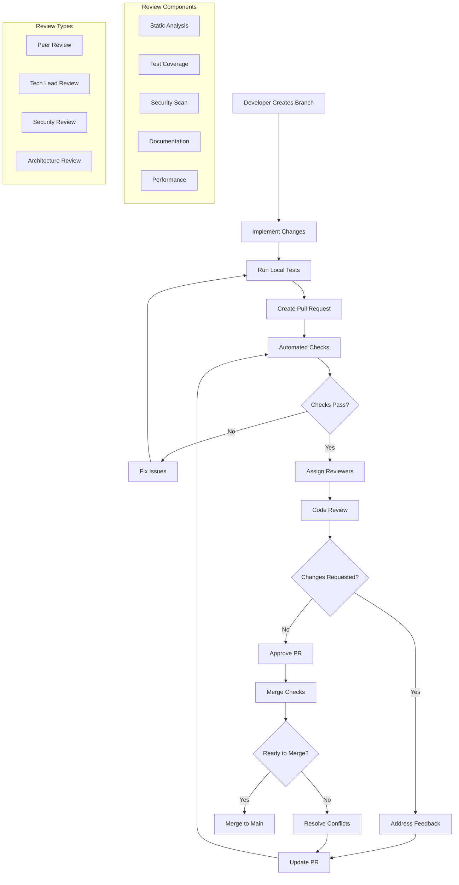

# Code Review Best Practices Standards

**Version:** v1.0.0  
**Domain:** development  
**Type:** Process  
**Risk Level:** HIGH  
**Maturity Level:** Production  
**Author:** MCP Standards Team  
**Created:** 2025-07-08T11:00:00.000000  
**Last Updated:** 2025-07-08T11:00:00.000000  

## Purpose

Comprehensive standards for code review processes, including workflows, automated checks, review checklists, feedback guidelines, and tool configurations

This code review standard defines the requirements, guidelines, and best practices for conducting effective code reviews. It provides comprehensive guidance for review workflows, quality gates, constructive feedback, and continuous improvement while ensuring code quality, knowledge sharing, and team collaboration.

**Code Review Focus Areas:**
- **Review Process Workflows**: Structured review processes and approval gates
- **Automated Checks**: Quality gates and automated verification
- **Review Checklists**: Language and framework-specific guidelines
- **Feedback Guidelines**: Constructive and effective review practices
- **Collaborative Practices**: Pair and mob programming approaches
- **Metrics and Improvement**: Tracking and optimizing review processes
- **Tool Configurations**: GitHub, GitLab, Bitbucket setup

## Scope

This code review standard applies to:
- Pull request and merge request workflows
- Automated code quality checks
- Manual code review processes
- Review feedback and communication
- Pair and mob programming sessions
- Code review metrics and analytics
- Tool configuration and integration
- Knowledge sharing practices
- Continuous improvement processes

## Implementation

### Code Review Requirements

**NIST Controls:** NIST-SA-3, SA-4, SA-8, SA-11, SA-15, CM-2, CM-3, CM-4, CM-7, SI-2, SI-3, SI-7, AU-2, AU-3, AU-12

**Development Standards:** Clean Code, SOLID principles, DRY, KISS
**Quality Standards:** ISO 9001, IEEE 730, SQA practices
**Communication Standards:** Constructive feedback, respectful dialogue

### Code Review Architecture

#### Code Review Process Flow


#### Code Review Implementation
```python
# Example: Comprehensive code review automation framework
import json
import yaml
from typing import List, Dict, Any, Optional, Tuple
from dataclasses import dataclass, field
from datetime import datetime, timedelta
import asyncio
import re
from pathlib import Path
import subprocess
import git
from github import Github
import gitlab
from abc import ABC, abstractmethod
import pandas as pd
import matplotlib.pyplot as plt

@dataclass
class ReviewChecklist:
    """Code review checklist configuration."""
    language: str
    category: str
    items: List[Dict[str, Any]]
    severity_weights: Dict[str, float] = field(default_factory=dict)

@dataclass
class ReviewComment:
    """Code review comment."""
    file_path: str
    line_number: int
    comment_type: str  # issue, suggestion, question, praise
    severity: str  # blocker, critical, major, minor, info
    message: str
    code_snippet: Optional[str] = None
    suggestion: Optional[str] = None
    references: List[str] = field(default_factory=list)

@dataclass
class ReviewMetrics:
    """Code review metrics."""
    pr_number: int
    created_at: datetime
    merged_at: Optional[datetime]
    time_to_first_review: Optional[timedelta]
    time_to_merge: Optional[timedelta]
    number_of_comments: int
    number_of_commits: int
    lines_added: int
    lines_deleted: int
    files_changed: int
    reviewers: List[str]
    approval_count: int
    change_requests: int
    iterations: int

class CodeReviewOrchestrator:
    """Orchestrate code review processes."""
    
    def __init__(self, config_path: str):
        self.config = self._load_config(config_path)
        self.checklists = self._load_checklists()
        self.metrics: List[ReviewMetrics] = []
        self.logger = logging.getLogger(__name__)
        
    def _load_config(self, config_path: str) -> Dict[str, Any]:
        """Load review configuration."""
        with open(config_path) as f:
            return yaml.safe_load(f)
    
    def _load_checklists(self) -> Dict[str, ReviewChecklist]:
        """Load language-specific checklists."""
        checklists = {}
        
        # Python checklist
        checklists["python"] = ReviewChecklist(
            language="python",
            category="general",
            items=[
                {
                    "id": "py-naming",
                    "description": "Follow PEP 8 naming conventions",
                    "severity": "major",
                    "examples": {
                        "good": "def calculate_total_price():",
                        "bad": "def CalculateTotalPrice():"
                    }
                },
                {
                    "id": "py-docstrings",
                    "description": "Include docstrings for modules, classes, and functions",
                    "severity": "major",
                    "check_regex": r"^(async\s+)?def\s+\w+\([^)]*\):\s*\n\s*\"\"\"",
                },
                {
                    "id": "py-type-hints",
                    "description": "Use type hints for function parameters and returns",
                    "severity": "minor",
                    "examples": {
                        "good": "def add(a: int, b: int) -> int:",
                        "bad": "def add(a, b):"
                    }
                },
                {
                    "id": "py-error-handling",
                    "description": "Proper exception handling with specific exceptions",
                    "severity": "critical",
                    "anti_patterns": ["except:", "except Exception:"]
                },
                {
                    "id": "py-security",
                    "description": "No hardcoded secrets or sensitive data",
                    "severity": "blocker",
                    "patterns": ["password =", "api_key =", "secret ="]
                }
            ],
            severity_weights={
                "blocker": 10.0,
                "critical": 5.0,
                "major": 3.0,
                "minor": 1.0,
                "info": 0.5
            }
        )
        
        # JavaScript/TypeScript checklist
        checklists["javascript"] = ReviewChecklist(
            language="javascript",
            category="general",
            items=[
                {
                    "id": "js-naming",
                    "description": "Use camelCase for variables and functions",
                    "severity": "major",
                    "examples": {
                        "good": "const userName = 'John';",
                        "bad": "const user_name = 'John';"
                    }
                },
                {
                    "id": "js-const-let",
                    "description": "Use const/let instead of var",
                    "severity": "major",
                    "anti_patterns": ["var "]
                },
                {
                    "id": "js-async",
                    "description": "Use async/await instead of callbacks",
                    "severity": "minor",
                    "preferred_patterns": ["async", "await"]
                },
                {
                    "id": "js-error-handling",
                    "description": "Handle promise rejections and errors",
                    "severity": "critical",
                    "required_patterns": ["try {", ".catch("]
                },
                {
                    "id": "js-security",
                    "description": "Prevent XSS vulnerabilities",
                    "severity": "blocker",
                    "anti_patterns": ["innerHTML =", "document.write(", "eval("]
                }
            ],
            severity_weights={
                "blocker": 10.0,
                "critical": 5.0,
                "major": 3.0,
                "minor": 1.0,
                "info": 0.5
            }
        )
        
        # General checklist (applies to all languages)
        checklists["general"] = ReviewChecklist(
            language="general",
            category="general",
            items=[
                {
                    "id": "gen-single-responsibility",
                    "description": "Functions/methods follow single responsibility principle",
                    "severity": "major",
                    "max_lines": 50
                },
                {
                    "id": "gen-no-magic-numbers",
                    "description": "No magic numbers, use named constants",
                    "severity": "minor",
                    "anti_patterns": ["return 86400", "if (x > 7)"]
                },
                {
                    "id": "gen-test-coverage",
                    "description": "New code has appropriate test coverage",
                    "severity": "critical",
                    "min_coverage": 80
                },
                {
                    "id": "gen-documentation",
                    "description": "Complex logic is well documented",
                    "severity": "major"
                },
                {
                    "id": "gen-performance",
                    "description": "No obvious performance issues",
                    "severity": "major",
                    "check_for": ["nested loops", "N+1 queries", "unnecessary iterations"]
                }
            ],
            severity_weights={
                "blocker": 10.0,
                "critical": 5.0,
                "major": 3.0,
                "minor": 1.0,
                "info": 0.5
            }
        )
        
        return checklists
    
    async def review_pull_request(self, pr_url: str) -> Dict[str, Any]:
        """Conduct automated code review."""
        # Parse PR URL
        pr_info = self._parse_pr_url(pr_url)
        
        # Get PR details and changed files
        pr_data = await self._get_pr_data(pr_info)
        changed_files = await self._get_changed_files(pr_info)
        
        # Run automated checks
        review_results = {
            "pr_number": pr_info["number"],
            "title": pr_data["title"],
            "author": pr_data["author"],
            "created_at": pr_data["created_at"],
            "files_changed": len(changed_files),
            "automated_checks": {},
            "review_comments": [],
            "quality_score": 100.0,
            "recommendation": "approve"
        }
        
        # Run various checks
        check_tasks = [
            self._check_code_style(changed_files),
            self._check_test_coverage(changed_files),
            self._check_security_issues(changed_files),
            self._check_documentation(changed_files),
            self._check_complexity(changed_files),
            self._apply_checklists(changed_files)
        ]
        
        check_results = await asyncio.gather(*check_tasks)
        
        # Aggregate results
        all_comments = []
        for result in check_results:
            if "comments" in result:
                all_comments.extend(result["comments"])
            if "check_name" in result:
                review_results["automated_checks"][result["check_name"]] = result
        
        review_results["review_comments"] = all_comments
        
        # Calculate quality score
        review_results["quality_score"] = self._calculate_quality_score(all_comments)
        
        # Determine recommendation
        review_results["recommendation"] = self._determine_recommendation(
            all_comments,
            review_results["quality_score"]
        )
        
        # Post review comments
        if self.config.get("post_comments", True):
            await self._post_review_comments(pr_info, all_comments)
        
        # Collect metrics
        await self._collect_review_metrics(pr_info, review_results)
        
        return review_results
    
    async def _check_code_style(self, files: List[Dict[str, Any]]) -> Dict[str, Any]:
        """Check code style compliance."""
        comments = []
        style_issues = 0
        
        for file_info in files:
            file_path = file_info["path"]
            language = self._detect_language(file_path)
            
            if language == "python":
                # Run flake8
                result = subprocess.run(
                    ["flake8", "--format=json", file_path],
                    capture_output=True,
                    text=True
                )
                
                if result.stdout:
                    issues = json.loads(result.stdout)
                    for issue in issues:
                        comments.append(ReviewComment(
                            file_path=file_path,
                            line_number=issue["line_number"],
                            comment_type="issue",
                            severity="minor",
                            message=f"Style issue: {issue['code']} - {issue['text']}",
                            code_snippet=issue.get("physical_line", "")
                        ))
                        style_issues += 1
                        
            elif language in ["javascript", "typescript"]:
                # Run ESLint
                result = subprocess.run(
                    ["eslint", "--format=json", file_path],
                    capture_output=True,
                    text=True
                )
                
                if result.stdout:
                    data = json.loads(result.stdout)
                    for file_result in data:
                        for message in file_result.get("messages", []):
                            comments.append(ReviewComment(
                                file_path=file_path,
                                line_number=message["line"],
                                comment_type="issue",
                                severity=self._map_eslint_severity(message["severity"]),
                                message=f"Style issue: {message['message']}",
                                suggestion=message.get("fix", {}).get("text")
                            ))
                            style_issues += 1
        
        return {
            "check_name": "code_style",
            "passed": style_issues == 0,
            "issues_found": style_issues,
            "comments": comments
        }
    
    async def _check_test_coverage(self, files: List[Dict[str, Any]]) -> Dict[str, Any]:
        """Check test coverage for changed files."""
        comments = []
        coverage_data = {}
        
        # Run coverage analysis
        coverage_result = subprocess.run(
            ["coverage", "json", "-o", "-"],
            capture_output=True,
            text=True
        )
        
        if coverage_result.returncode == 0:
            coverage_json = json.loads(coverage_result.stdout)
            
            for file_info in files:
                file_path = file_info["path"]
                
                if file_path in coverage_json.get("files", {}):
                    file_coverage = coverage_json["files"][file_path]
                    coverage_percent = file_coverage["summary"]["percent_covered"]
                    
                    coverage_data[file_path] = coverage_percent
                    
                    if coverage_percent < self.config.get("min_coverage", 80):
                        comments.append(ReviewComment(
                            file_path=file_path,
                            line_number=1,
                            comment_type="issue",
                            severity="major",
                            message=f"Low test coverage: {coverage_percent:.1f}% (minimum: {self.config['min_coverage']}%)",
                            suggestion="Add tests to improve coverage"
                        ))
                    
                    # Check for untested lines
                    for line_num in file_coverage.get("missing_lines", []):
                        if self._is_important_line(file_path, line_num):
                            comments.append(ReviewComment(
                                file_path=file_path,
                                line_number=line_num,
                                comment_type="issue",
                                severity="major",
                                message="This line is not covered by tests",
                                suggestion="Add test case for this code path"
                            ))
        
        avg_coverage = sum(coverage_data.values()) / len(coverage_data) if coverage_data else 0
        
        return {
            "check_name": "test_coverage",
            "passed": avg_coverage >= self.config.get("min_coverage", 80),
            "average_coverage": avg_coverage,
            "file_coverage": coverage_data,
            "comments": comments
        }
    
    async def _check_security_issues(self, files: List[Dict[str, Any]]) -> Dict[str, Any]:
        """Check for security vulnerabilities."""
        comments = []
        security_issues = []
        
        for file_info in files:
            file_path = file_info["path"]
            
            # Read file content
            try:
                with open(file_path, 'r') as f:
                    content = f.read()
                    lines = content.splitlines()
            except:
                continue
            
            # Check for hardcoded secrets
            secret_patterns = [
                (r'(password|passwd|pwd)\s*=\s*["\'][^"\']+["\']', "Hardcoded password detected"),
                (r'(api_key|apikey|api_secret)\s*=\s*["\'][^"\']+["\']', "Hardcoded API key detected"),
                (r'(secret|token)\s*=\s*["\'][^"\']+["\']', "Hardcoded secret detected"),
                (r'-----BEGIN (RSA )?PRIVATE KEY-----', "Private key detected in code")
            ]
            
            for pattern, message in secret_patterns:
                for match in re.finditer(pattern, content, re.IGNORECASE):
                    line_num = content[:match.start()].count('\n') + 1
                    
                    comments.append(ReviewComment(
                        file_path=file_path,
                        line_number=line_num,
                        comment_type="issue",
                        severity="blocker",
                        message=f"Security: {message}",
                        code_snippet=lines[line_num - 1].strip(),
                        suggestion="Use environment variables or secure key management"
                    ))
                    security_issues.append(message)
            
            # Language-specific security checks
            language = self._detect_language(file_path)
            
            if language == "python":
                # Check for dangerous functions
                dangerous_patterns = [
                    (r'\beval\s*\(', "Use of eval() is dangerous", "Use ast.literal_eval() or json.loads()"),
                    (r'\bexec\s*\(', "Use of exec() is dangerous", "Avoid dynamic code execution"),
                    (r'pickle\.loads?\s*\(', "Unsafe deserialization", "Use JSON or other safe formats"),
                    (r'os\.system\s*\(', "Command injection risk", "Use subprocess with shell=False")
                ]
                
                for pattern, message, suggestion in dangerous_patterns:
                    for match in re.finditer(pattern, content):
                        line_num = content[:match.start()].count('\n') + 1
                        
                        comments.append(ReviewComment(
                            file_path=file_path,
                            line_number=line_num,
                            comment_type="issue",
                            severity="critical",
                            message=f"Security: {message}",
                            code_snippet=lines[line_num - 1].strip(),
                            suggestion=suggestion
                        ))
                        security_issues.append(message)
            
            elif language in ["javascript", "typescript"]:
                # Check for XSS vulnerabilities
                xss_patterns = [
                    (r'\.innerHTML\s*=', "Potential XSS via innerHTML", "Use textContent or sanitize HTML"),
                    (r'document\.write\s*\(', "Potential XSS via document.write", "Use DOM methods instead"),
                    (r'\beval\s*\(', "Use of eval() is dangerous", "Avoid eval(), use JSON.parse()"),
                    (r'\.html\s*\([^)]*\$\{', "Potential XSS in template literal", "Sanitize user input")
                ]
                
                for pattern, message, suggestion in xss_patterns:
                    for match in re.finditer(pattern, content):
                        line_num = content[:match.start()].count('\n') + 1
                        
                        comments.append(ReviewComment(
                            file_path=file_path,
                            line_number=line_num,
                            comment_type="issue",
                            severity="critical",
                            message=f"Security: {message}",
                            code_snippet=lines[line_num - 1].strip(),
                            suggestion=suggestion
                        ))
                        security_issues.append(message)
        
        return {
            "check_name": "security",
            "passed": len(security_issues) == 0,
            "issues_found": len(security_issues),
            "issue_types": list(set(security_issues)),
            "comments": comments
        }
    
    async def _apply_checklists(self, files: List[Dict[str, Any]]) -> Dict[str, Any]:
        """Apply language-specific checklists."""
        comments = []
        checklist_violations = []
        
        for file_info in files:
            file_path = file_info["path"]
            language = self._detect_language(file_path)
            
            # Get applicable checklists
            checklists = []
            if language in self.checklists:
                checklists.append(self.checklists[language])
            checklists.append(self.checklists["general"])
            
            # Read file content
            try:
                with open(file_path, 'r') as f:
                    content = f.read()
                    lines = content.splitlines()
            except:
                continue
            
            # Apply each checklist item
            for checklist in checklists:
                for item in checklist.items:
                    violations = self._check_item(item, file_path, content, lines)
                    
                    for violation in violations:
                        comments.append(ReviewComment(
                            file_path=file_path,
                            line_number=violation["line"],
                            comment_type="issue" if item["severity"] in ["blocker", "critical"] else "suggestion",
                            severity=item["severity"],
                            message=f"{item['description']} (ID: {item['id']})",
                            code_snippet=violation.get("snippet", ""),
                            suggestion=violation.get("suggestion", item.get("suggestion", ""))
                        ))
                        checklist_violations.append(item["id"])
        
        return {
            "check_name": "checklist",
            "passed": len([c for c in comments if c.severity in ["blocker", "critical"]]) == 0,
            "total_violations": len(checklist_violations),
            "violation_types": list(set(checklist_violations)),
            "comments": comments
        }
    
    def _check_item(self, item: Dict[str, Any], file_path: str,
                   content: str, lines: List[str]) -> List[Dict[str, Any]]:
        """Check individual checklist item."""
        violations = []
        
        # Check anti-patterns
        if "anti_patterns" in item:
            for pattern in item["anti_patterns"]:
                for i, line in enumerate(lines):
                    if pattern in line:
                        violations.append({
                            "line": i + 1,
                            "snippet": line.strip(),
                            "suggestion": f"Avoid using '{pattern}'"
                        })
        
        # Check required patterns
        if "required_patterns" in item and item["required_patterns"]:
            has_required = any(
                pattern in content 
                for pattern in item["required_patterns"]
            )
            if not has_required:
                violations.append({
                    "line": 1,
                    "snippet": "",
                    "suggestion": f"Missing required pattern: {', '.join(item['required_patterns'])}"
                })
        
        # Check regex patterns
        if "check_regex" in item:
            pattern = re.compile(item["check_regex"])
            if not pattern.search(content):
                violations.append({
                    "line": 1,
                    "snippet": "",
                    "suggestion": "Pattern not found in file"
                })
        
        # Check function length
        if "max_lines" in item and self._detect_language(file_path) in ["python", "javascript"]:
            functions = self._extract_functions(content, self._detect_language(file_path))
            for func in functions:
                if func["lines"] > item["max_lines"]:
                    violations.append({
                        "line": func["start_line"],
                        "snippet": func["name"],
                        "suggestion": f"Function is too long ({func['lines']} lines, max: {item['max_lines']})"
                    })
        
        return violations
    
    def _calculate_quality_score(self, comments: List[ReviewComment]) -> float:
        """Calculate overall quality score."""
        if not comments:
            return 100.0
        
        # Get severity weights
        weights = self.checklists["general"].severity_weights
        
        # Calculate weighted penalty
        total_penalty = 0.0
        for comment in comments:
            if comment.comment_type == "issue":
                total_penalty += weights.get(comment.severity, 1.0)
        
        # Calculate score (max penalty of 100)
        score = max(0, 100 - min(total_penalty, 100))
        
        return round(score, 2)
    
    def _determine_recommendation(self, comments: List[ReviewComment],
                                quality_score: float) -> str:
        """Determine review recommendation."""
        # Count issues by severity
        severity_counts = {
            "blocker": 0,
            "critical": 0,
            "major": 0,
            "minor": 0,
            "info": 0
        }
        
        for comment in comments:
            if comment.comment_type == "issue":
                severity_counts[comment.severity] += 1
        
        # Determine recommendation
        if severity_counts["blocker"] > 0:
            return "request_changes"
        elif severity_counts["critical"] > 2:
            return "request_changes"
        elif severity_counts["critical"] > 0 or severity_counts["major"] > 5:
            return "comment"
        elif quality_score < 70:
            return "comment"
        else:
            return "approve"
    
    async def _post_review_comments(self, pr_info: Dict[str, Any],
                                  comments: List[ReviewComment]):
        """Post review comments to PR."""
        platform = pr_info["platform"]
        
        if platform == "github":
            await self._post_github_review(pr_info, comments)
        elif platform == "gitlab":
            await self._post_gitlab_review(pr_info, comments)
        elif platform == "bitbucket":
            await self._post_bitbucket_review(pr_info, comments)
    
    async def _collect_review_metrics(self, pr_info: Dict[str, Any],
                                    review_results: Dict[str, Any]):
        """Collect and store review metrics."""
        # Get PR timeline data
        timeline = await self._get_pr_timeline(pr_info)
        
        metrics = ReviewMetrics(
            pr_number=pr_info["number"],
            created_at=review_results["created_at"],
            merged_at=timeline.get("merged_at"),
            time_to_first_review=timeline.get("first_review_time"),
            time_to_merge=timeline.get("merge_time"),
            number_of_comments=len(review_results["review_comments"]),
            number_of_commits=timeline.get("commit_count", 0),
            lines_added=timeline.get("additions", 0),
            lines_deleted=timeline.get("deletions", 0),
            files_changed=review_results["files_changed"],
            reviewers=timeline.get("reviewers", []),
            approval_count=timeline.get("approvals", 0),
            change_requests=timeline.get("change_requests", 0),
            iterations=timeline.get("iterations", 1)
        )
        
        self.metrics.append(metrics)
        
        # Save metrics for analysis
        self._save_metrics()
    
    def generate_metrics_report(self, period_days: int = 30) -> Dict[str, Any]:
        """Generate code review metrics report."""
        # Filter metrics for period
        cutoff_date = datetime.utcnow() - timedelta(days=period_days)
        period_metrics = [
            m for m in self.metrics 
            if m.created_at >= cutoff_date
        ]
        
        if not period_metrics:
            return {"error": "No metrics available for period"}
        
        # Calculate statistics
        report = {
            "period_days": period_days,
            "total_prs": len(period_metrics),
            "average_time_to_first_review": self._calculate_average_timedelta(
                [m.time_to_first_review for m in period_metrics if m.time_to_first_review]
            ),
            "average_time_to_merge": self._calculate_average_timedelta(
                [m.time_to_merge for m in period_metrics if m.time_to_merge]
            ),
            "average_comments_per_pr": sum(m.number_of_comments for m in period_metrics) / len(period_metrics),
            "average_iterations": sum(m.iterations for m in period_metrics) / len(period_metrics),
            "average_files_changed": sum(m.files_changed for m in period_metrics) / len(period_metrics),
            "reviewer_workload": self._calculate_reviewer_workload(period_metrics),
            "quality_trends": self._calculate_quality_trends(period_metrics)
        }
        
        # Generate visualizations
        self._generate_metrics_visualizations(period_metrics, report)
        
        return report
    
    def _calculate_reviewer_workload(self, metrics: List[ReviewMetrics]) -> Dict[str, int]:
        """Calculate reviewer workload distribution."""
        workload = {}
        
        for metric in metrics:
            for reviewer in metric.reviewers:
                workload[reviewer] = workload.get(reviewer, 0) + 1
        
        return dict(sorted(workload.items(), key=lambda x: x[1], reverse=True))
    
    def _generate_metrics_visualizations(self, metrics: List[ReviewMetrics],
                                       report: Dict[str, Any]):
        """Generate visualization charts for metrics."""
        # Time to merge distribution
        plt.figure(figsize=(10, 6))
        merge_times = [
            m.time_to_merge.total_seconds() / 3600 
            for m in metrics 
            if m.time_to_merge
        ]
        plt.hist(merge_times, bins=20, edgecolor='black')
        plt.xlabel('Hours to Merge')
        plt.ylabel('Number of PRs')
        plt.title('PR Merge Time Distribution')
        plt.savefig('metrics/merge_time_distribution.png')
        plt.close()
        
        # PR size vs review time correlation
        plt.figure(figsize=(10, 6))
        sizes = [m.files_changed for m in metrics if m.time_to_first_review]
        review_times = [
            m.time_to_first_review.total_seconds() / 3600 
            for m in metrics 
            if m.time_to_first_review
        ]
        plt.scatter(sizes, review_times, alpha=0.6)
        plt.xlabel('Files Changed')
        plt.ylabel('Hours to First Review')
        plt.title('PR Size vs Review Time')
        plt.savefig('metrics/size_vs_review_time.png')
        plt.close()
    
    def _detect_language(self, file_path: str) -> str:
        """Detect programming language from file extension."""
        ext = Path(file_path).suffix.lower()
        language_map = {
            ".py": "python",
            ".js": "javascript",
            ".jsx": "javascript",
            ".ts": "typescript",
            ".tsx": "typescript",
            ".java": "java",
            ".go": "go",
            ".rb": "ruby",
            ".php": "php",
            ".cs": "csharp",
            ".cpp": "cpp",
            ".c": "c",
            ".rs": "rust"
        }
        return language_map.get(ext, "unknown")

### Constructive Feedback Guidelines

#### Feedback Framework Implementation
```python
# Example: Constructive feedback system
from typing import List, Dict, Any, Optional
from dataclasses import dataclass
from enum import Enum
import re

class FeedbackTone(Enum):
    """Feedback tone categories."""
    POSITIVE = "positive"
    CONSTRUCTIVE = "constructive"
    NEUTRAL = "neutral"
    QUESTIONING = "questioning"

@dataclass
class FeedbackTemplate:
    """Template for constructive feedback."""
    category: str
    tone: FeedbackTone
    template: str
    examples: List[str]

class ConstructiveFeedbackGenerator:
    """Generate constructive code review feedback."""
    
    def __init__(self):
        self.templates = self._load_feedback_templates()
        self.positive_phrases = [
            "Great job on",
            "I really like how you",
            "Excellent implementation of",
            "This is a clean approach to",
            "Nice use of",
            "Well structured",
            "Good thinking on"
        ]
        self.constructive_phrases = [
            "Consider",
            "What do you think about",
            "Have you considered",
            "It might be worth",
            "An alternative approach could be",
            "To improve readability, you could",
            "For better performance, consider"
        ]
    
    def _load_feedback_templates(self) -> Dict[str, List[FeedbackTemplate]]:
        """Load feedback templates."""
        return {
            "code_style": [
                FeedbackTemplate(
                    category="naming",
                    tone=FeedbackTone.CONSTRUCTIVE,
                    template="Consider using a more descriptive name for '{variable}'. What about '{suggestion}'?",
                    examples=[
                        "Consider using a more descriptive name for 'x'. What about 'user_count'?",
                        "The variable name 'data' is quite generic. How about 'customer_records'?"
                    ]
                ),
                FeedbackTemplate(
                    category="formatting",
                    tone=FeedbackTone.NEUTRAL,
                    template="To maintain consistency with our style guide, please {action}.",
                    examples=[
                        "To maintain consistency with our style guide, please add a space after the comma.",
                        "To maintain consistency with our style guide, please use 4 spaces for indentation."
                    ]
                )
            ],
            "performance": [
                FeedbackTemplate(
                    category="optimization",
                    tone=FeedbackTone.CONSTRUCTIVE,
                    template="This operation has O({complexity}) complexity. Consider {suggestion} for better performance.",
                    examples=[
                        "This nested loop has O(n²) complexity. Consider using a hash map for O(n) lookup.",
                        "Multiple database queries in a loop could cause N+1 issues. Consider using a join or batch query."
                    ]
                ),
                FeedbackTemplate(
                    category="caching",
                    tone=FeedbackTone.QUESTIONING,
                    template="Would caching help here? This {operation} seems to be called frequently.",
                    examples=[
                        "Would caching help here? This API call seems to be made on every request.",
                        "Have you considered memoizing this expensive calculation?"
                    ]
                )
            ],
            "security": [
                FeedbackTemplate(
                    category="vulnerability",
                    tone=FeedbackTone.CONSTRUCTIVE,
                    template="⚠️ Potential security issue: {issue}. Please {action} to prevent {risk}.",
                    examples=[
                        "⚠️ Potential security issue: SQL injection. Please use parameterized queries to prevent attacks.",
                        "⚠️ This could expose sensitive data. Please sanitize the output before returning it to the client."
                    ]
                )
            ],
            "praise": [
                FeedbackTemplate(
                    category="good_practice",
                    tone=FeedbackTone.POSITIVE,
                    template="👍 {praise}! This {aspect} makes the code {benefit}.",
                    examples=[
                        "👍 Great error handling! This makes the code much more robust.",
                        "👍 Excellent use of type hints! This makes the code self-documenting.",
                        "👍 Nice abstraction! This makes the code much more maintainable."
                    ]
                )
            ]
        }
    
    def generate_feedback(self, issue_type: str, severity: str,
                         context: Dict[str, Any]) -> str:
        """Generate constructive feedback for an issue."""
        # Select appropriate tone based on severity
        if severity in ["blocker", "critical"]:
            tone = FeedbackTone.CONSTRUCTIVE
        elif severity == "info":
            tone = FeedbackTone.NEUTRAL
        else:
            tone = FeedbackTone.QUESTIONING
        
        # Generate feedback
        if issue_type == "naming":
            return self._generate_naming_feedback(context)
        elif issue_type == "complexity":
            return self._generate_complexity_feedback(context)
        elif issue_type == "performance":
            return self._generate_performance_feedback(context)
        elif issue_type == "security":
            return self._generate_security_feedback(context)
        else:
            return self._generate_generic_feedback(issue_type, context)
    
    def _generate_naming_feedback(self, context: Dict[str, Any]) -> str:
        """Generate feedback for naming issues."""
        current_name = context.get("current_name", "variable")
        suggestion = self._suggest_better_name(current_name, context)
        
        templates = [
            f"Consider using a more descriptive name. What about '{suggestion}'?",
            f"The name '{current_name}' doesn't clearly convey its purpose. How about '{suggestion}'?",
            f"For better readability, consider renaming to '{suggestion}'."
        ]
        
        return random.choice(templates)
    
    def _suggest_better_name(self, current_name: str,
                            context: Dict[str, Any]) -> str:
        """Suggest a better variable/function name."""
        # Analyze context to suggest better name
        code_snippet = context.get("code_snippet", "")
        
        # Common improvements
        improvements = {
            "x": "count",
            "y": "index",
            "data": "user_data",
            "arr": "items",
            "str": "text",
            "num": "number",
            "val": "value",
            "temp": "temporary_result",
            "res": "result",
            "ret": "return_value"
        }
        
        if current_name.lower() in improvements:
            return improvements[current_name.lower()]
        
        # Suggest based on usage
        if "loop" in code_snippet or "for" in code_snippet:
            return f"{current_name}_index"
        elif "count" in code_snippet:
            return f"{current_name}_count"
        elif "sum" in code_snippet:
            return f"{current_name}_total"
        
        return f"meaningful_{current_name}"
    
    def add_positive_feedback(self, comments: List[ReviewComment],
                            file_content: str) -> List[ReviewComment]:
        """Add positive feedback to balance critique."""
        positive_comments = []
        
        # Look for good practices
        good_practices = [
            (r'try:.*except\s+\w+Exception', "Good specific exception handling!"),
            (r'"""[\s\S]*?"""', "Great documentation!"),
            (r'@lru_cache|@cached_property', "Nice performance optimization with caching!"),
            (r'with\s+open\(.*\)\s+as', "Good use of context manager!"),
            (r'if\s+__name__\s*==\s*["\']__main__["\']:', "Good practice with main guard!"),
            (r'logging\.(debug|info|warning|error)', "Good logging practices!"),
            (r'@pytest\.mark\.parametrize', "Excellent parametrized testing!"),
            (r'async def.*await', "Good async/await usage!")
        ]
        
        for pattern, praise in good_practices:
            if re.search(pattern, file_content):
                positive_comments.append(ReviewComment(
                    file_path="",
                    line_number=1,
                    comment_type="praise",
                    severity="info",
                    message=f"👍 {praise}"
                ))
        
        # Balance negative with positive
        negative_count = len([c for c in comments if c.comment_type == "issue"])
        positive_count = len(positive_comments)
        
        # Aim for at least 1 positive per 3 negative
        if positive_count < negative_count // 3:
            generic_praise = [
                "Overall, the code structure looks good!",
                "Thanks for the clear implementation!",
                "The logic flow is easy to follow.",
                "Good separation of concerns here."
            ]
            positive_comments.append(ReviewComment(
                file_path="",
                line_number=1,
                comment_type="praise",
                severity="info",
                message=f"👍 {random.choice(generic_praise)}"
            ))
        
        return comments + positive_comments

### Pair and Mob Programming Implementation

#### Collaborative Programming Framework
```python
# Example: Pair and mob programming support
import asyncio
from typing import List, Dict, Any, Optional
from dataclasses import dataclass
from datetime import datetime, timedelta
import json
import websocket
from abc import ABC, abstractmethod

@dataclass
class ProgrammingSession:
    """Collaborative programming session."""
    session_id: str
    session_type: str  # pair, mob
    participants: List[Dict[str, Any]]
    start_time: datetime
    end_time: Optional[datetime]
    driver: str  # Current person typing
    navigator: Optional[str]  # For pair programming
    facilitator: Optional[str]  # For mob programming
    rotation_interval: int  # Minutes
    code_changes: List[Dict[str, Any]]
    session_notes: List[str]

class CollaborativeProgrammingManager:
    """Manage pair and mob programming sessions."""
    
    def __init__(self):
        self.active_sessions: Dict[str, ProgrammingSession] = {}
        self.session_history: List[ProgrammingSession] = []
        self.rotation_timers: Dict[str, asyncio.Task] = {}
        
    async def start_pair_session(self, participants: List[str],
                               rotation_interval: int = 15) -> ProgrammingSession:
        """Start a pair programming session."""
        if len(participants) != 2:
            raise ValueError("Pair programming requires exactly 2 participants")
        
        session = ProgrammingSession(
            session_id=self._generate_session_id(),
            session_type="pair",
            participants=[
                {"name": participants[0], "role": "driver"},
                {"name": participants[1], "role": "navigator"}
            ],
            start_time=datetime.utcnow(),
            end_time=None,
            driver=participants[0],
            navigator=participants[1],
            facilitator=None,
            rotation_interval=rotation_interval,
            code_changes=[],
            session_notes=[]
        )
        
        self.active_sessions[session.session_id] = session
        
        # Start rotation timer
        self.rotation_timers[session.session_id] = asyncio.create_task(
            self._rotation_reminder(session)
        )
        
        # Log session start
        self._log_session_event(session, "Session started")
        
        return session
    
    async def start_mob_session(self, participants: List[str],
                              rotation_interval: int = 5) -> ProgrammingSession:
        """Start a mob programming session."""
        if len(participants) < 3:
            raise ValueError("Mob programming requires at least 3 participants")
        
        session = ProgrammingSession(
            session_id=self._generate_session_id(),
            session_type="mob",
            participants=[
                {"name": p, "role": "driver" if i == 0 else "navigator"}
                for i, p in enumerate(participants)
            ],
            start_time=datetime.utcnow(),
            end_time=None,
            driver=participants[0],
            navigator=None,
            facilitator=participants[-1],  # Last person as facilitator
            rotation_interval=rotation_interval,
            code_changes=[],
            session_notes=[]
        )
        
        self.active_sessions[session.session_id] = session
        
        # Start rotation timer
        self.rotation_timers[session.session_id] = asyncio.create_task(
            self._rotation_reminder(session)
        )
        
        # Setup mob-specific features
        await self._setup_mob_features(session)
        
        return session
    
    async def rotate_roles(self, session_id: str):
        """Rotate roles in the session."""
        session = self.active_sessions.get(session_id)
        if not session:
            return
        
        if session.session_type == "pair":
            # Swap driver and navigator
            session.driver, session.navigator = session.navigator, session.driver
            
            # Update participant roles
            for p in session.participants:
                if p["name"] == session.driver:
                    p["role"] = "driver"
                else:
                    p["role"] = "navigator"
            
            self._log_session_event(
                session,
                f"Roles rotated: {session.driver} is now driving"
            )
            
        elif session.session_type == "mob":
            # Rotate all participants
            participants = session.participants
            
            # Current driver becomes navigator
            current_driver_idx = next(
                i for i, p in enumerate(participants) 
                if p["role"] == "driver"
            )
            
            # Next person becomes driver
            next_driver_idx = (current_driver_idx + 1) % len(participants)
            
            # Update roles
            for i, p in enumerate(participants):
                if i == next_driver_idx:
                    p["role"] = "driver"
                    session.driver = p["name"]
                else:
                    p["role"] = "navigator"
            
            self._log_session_event(
                session,
                f"Mob rotation: {session.driver} is now driving"
            )
        
        # Restart rotation timer
        if session_id in self.rotation_timers:
            self.rotation_timers[session_id].cancel()
        
        self.rotation_timers[session_id] = asyncio.create_task(
            self._rotation_reminder(session)
        )
    
    async def _rotation_reminder(self, session: ProgrammingSession):
        """Send rotation reminder after interval."""
        await asyncio.sleep(session.rotation_interval * 60)
        
        # Send notification
        await self._send_notification(
            session,
            f"Time to rotate! Current driver: {session.driver}"
        )
        
        # Auto-rotate if configured
        if self.config.get("auto_rotate", False):
            await self.rotate_roles(session.session_id)
    
    async def add_session_note(self, session_id: str, note: str, author: str):
        """Add note to session."""
        session = self.active_sessions.get(session_id)
        if session:
            session.session_notes.append({
                "timestamp": datetime.utcnow(),
                "author": author,
                "note": note
            })
    
    async def track_code_change(self, session_id: str, change: Dict[str, Any]):
        """Track code changes during session."""
        session = self.active_sessions.get(session_id)
        if session:
            change["timestamp"] = datetime.utcnow()
            change["driver"] = session.driver
            session.code_changes.append(change)
    
    async def end_session(self, session_id: str) -> Dict[str, Any]:
        """End programming session and generate summary."""
        session = self.active_sessions.get(session_id)
        if not session:
            return {"error": "Session not found"}
        
        session.end_time = datetime.utcnow()
        
        # Cancel rotation timer
        if session_id in self.rotation_timers:
            self.rotation_timers[session_id].cancel()
            del self.rotation_timers[session_id]
        
        # Generate session summary
        summary = self._generate_session_summary(session)
        
        # Move to history
        self.session_history.append(session)
        del self.active_sessions[session_id]
        
        return summary
    
    def _generate_session_summary(self, session: ProgrammingSession) -> Dict[str, Any]:
        """Generate summary of programming session."""
        duration = session.end_time - session.start_time
        
        # Calculate participation metrics
        participation = {}
        for change in session.code_changes:
            driver = change["driver"]
            participation[driver] = participation.get(driver, 0) + 1
        
        # Extract key insights
        summary = {
            "session_id": session.session_id,
            "session_type": session.session_type,
            "duration": str(duration),
            "participants": [p["name"] for p in session.participants],
            "total_rotations": len(session.code_changes) // session.rotation_interval,
            "code_changes": len(session.code_changes),
            "participation_breakdown": participation,
            "session_notes": session.session_notes,
            "key_accomplishments": self._extract_accomplishments(session),
            "areas_of_focus": self._analyze_code_changes(session.code_changes)
        }
        
        return summary
    
    def _extract_accomplishments(self, session: ProgrammingSession) -> List[str]:
        """Extract key accomplishments from session."""
        accomplishments = []
        
        # Analyze code changes
        files_modified = set()
        features_added = []
        bugs_fixed = []
        tests_added = []
        
        for change in session.code_changes:
            files_modified.add(change.get("file"))
            
            if "test" in change.get("file", "").lower():
                tests_added.append(change.get("description", ""))
            elif "fix" in change.get("description", "").lower():
                bugs_fixed.append(change.get("description", ""))
            elif "add" in change.get("description", "").lower():
                features_added.append(change.get("description", ""))
        
        if files_modified:
            accomplishments.append(f"Modified {len(files_modified)} files")
        if features_added:
            accomplishments.append(f"Added {len(features_added)} new features")
        if bugs_fixed:
            accomplishments.append(f"Fixed {len(bugs_fixed)} bugs")
        if tests_added:
            accomplishments.append(f"Added {len(tests_added)} tests")
        
        return accomplishments
    
    def generate_best_practices_report(self) -> Dict[str, Any]:
        """Generate report on pair/mob programming best practices."""
        if not self.session_history:
            return {"error": "No session history available"}
        
        # Analyze session effectiveness
        report = {
            "total_sessions": len(self.session_history),
            "pair_sessions": len([s for s in self.session_history if s.session_type == "pair"]),
            "mob_sessions": len([s for s in self.session_history if s.session_type == "mob"]),
            "average_duration": self._calculate_average_duration(),
            "optimal_rotation_interval": self._analyze_rotation_effectiveness(),
            "productivity_metrics": self._calculate_productivity_metrics(),
            "best_practices": self._identify_best_practices(),
            "common_challenges": self._identify_common_challenges()
        }
        
        return report
    
    def _identify_best_practices(self) -> List[Dict[str, str]]:
        """Identify best practices from successful sessions."""
        return [
            {
                "practice": "Regular rotation",
                "description": "Rotate roles every 15 minutes for pairs, 5 minutes for mobs",
                "benefit": "Keeps everyone engaged and prevents fatigue"
            },
            {
                "practice": "Clear communication",
                "description": "Navigator explains intent before driver implements",
                "benefit": "Reduces misunderstandings and improves code quality"
            },
            {
                "practice": "Take breaks",
                "description": "5-minute break every hour",
                "benefit": "Maintains focus and prevents burnout"
            },
            {
                "practice": "Document decisions",
                "description": "Record key decisions and reasoning in session notes",
                "benefit": "Helps future reference and knowledge sharing"
            }
        ]
    
    def _generate_session_id(self) -> str:
        """Generate unique session ID."""
        return f"session-{datetime.utcnow().strftime('%Y%m%d%H%M%S')}"
    
    def _log_session_event(self, session: ProgrammingSession, event: str):
        """Log session event."""
        self.logger.info(f"Session {session.session_id}: {event}")

### Review Tool Configuration

#### Platform Configuration Templates
```python
# Example: Review tool configuration for different platforms
class ReviewToolConfigurator:
    """Configure code review tools for different platforms."""
    
    def __init__(self):
        self.platforms = ["github", "gitlab", "bitbucket"]
        self.configurations = self._load_default_configurations()
    
    def _load_default_configurations(self) -> Dict[str, Dict[str, Any]]:
        """Load default configurations for each platform."""
        return {
            "github": {
                "branch_protection": {
                    "required_reviews": 2,
                    "dismiss_stale_reviews": True,
                    "require_code_owner_reviews": True,
                    "required_status_checks": [
                        "continuous-integration/travis-ci",
                        "coverage/coveralls",
                        "security/snyk"
                    ],
                    "enforce_admins": False,
                    "restrictions": {
                        "users": [],
                        "teams": ["senior-developers"]
                    }
                },
                "auto_merge": {
                    "enabled": True,
                    "merge_method": "squash",
                    "delete_branch_on_merge": True
                },
                "pr_template": """## Description
Brief description of changes

## Type of Change
- [ ] Bug fix
- [ ] New feature
- [ ] Breaking change
- [ ] Documentation update

## Testing
- [ ] Unit tests pass
- [ ] Integration tests pass
- [ ] Manual testing completed

## Checklist
- [ ] Code follows style guidelines
- [ ] Self-review completed
- [ ] Documentation updated
- [ ] No new warnings
"""
            },
            "gitlab": {
                "merge_request_approvals": {
                    "approvals_required": 2,
                    "reset_approvals_on_push": True,
                    "disable_overriding_approvers_per_merge_request": True,
                    "merge_requests_author_approval": False,
                    "merge_requests_disable_committers_approval": True
                },
                "push_rules": {
                    "commit_message_regex": "^(feat|fix|docs|style|refactor|test|chore)(\\(.+\\))?: .+",
                    "branch_name_regex": "^(feature|bugfix|hotfix|release)\\/[a-z0-9-]+$",
                    "deny_delete_tag": True,
                    "member_check": True,
                    "prevent_secrets": True,
                    "max_file_size": 100  # MB
                },
                "merge_request_template": """## What does this MR do?
Brief description

## Related issues
Closes #

## Checklist
- [ ] Tests added
- [ ] Documentation updated
- [ ] Changelog updated
"""
            },
            "bitbucket": {
                "default_reviewers": {
                    "enabled": True,
                    "reviewers": ["tech-lead", "senior-dev"]
                },
                "merge_checks": {
                    "minimum_approvals": 2,
                    "no_incomplete_tasks": True,
                    "all_tasks_resolved": True,
                    "minimum_successful_builds": 1,
                    "no_changes_requested": True
                },
                "pr_restrictions": {
                    "merge_only_with_pr": True,
                    "delete_source_branch": True,
                    "enforce_merge_checks": True
                }
            }
        }
    
    def generate_github_config(self, repo_name: str, org: str) -> Dict[str, Any]:
        """Generate GitHub repository configuration."""
        config = self.configurations["github"].copy()
        
        # Add GitHub Actions workflow
        config["github_actions"] = {
            ".github/workflows/code-review.yml": """name: Code Review Automation

on:
  pull_request:
    types: [opened, synchronize, reopened]

jobs:
  automated-review:
    runs-on: ubuntu-latest
    steps:
      - uses: actions/checkout@v3
        with:
          fetch-depth: 0
      
      - name: Set up Python
        uses: actions/setup-python@v4
        with:
          python-version: '3.9'
      
      - name: Install dependencies
        run: |
          pip install -r requirements.txt
          pip install flake8 black mypy bandit safety
      
      - name: Run linters
        run: |
          flake8 .
          black --check .
          mypy .
      
      - name: Run security checks
        run: |
          bandit -r src/
          safety check
      
      - name: Run tests
        run: |
          pytest --cov=src --cov-report=xml
      
      - name: Upload coverage
        uses: codecov/codecov-action@v3
        with:
          file: ./coverage.xml
      
      - name: Comment PR
        uses: actions/github-script@v6
        if: always()
        with:
          script: |
            const output = `#### Code Review Results
            
            Linting: ${{ steps.lint.outcome }}
            Security: ${{ steps.security.outcome }}
            Tests: ${{ steps.tests.outcome }}
            Coverage: ${{ steps.coverage.outputs.coverage }}%
            
            [Details](${{ github.server_url }}/${{ github.repository }}/actions/runs/${{ github.run_id }})`;
            
            github.rest.issues.createComment({
              issue_number: context.issue.number,
              owner: context.repo.owner,
              repo: context.repo.repo,
              body: output
            });
"""
        }
        
        # Add CODEOWNERS file
        config["codeowners"] = {
            ".github/CODEOWNERS": """# Global owners
* @org/engineering-team

# Frontend
/frontend/ @org/frontend-team
*.js @org/frontend-team
*.jsx @org/frontend-team
*.ts @org/frontend-team
*.tsx @org/frontend-team

# Backend
/backend/ @org/backend-team
*.py @org/backend-team

# Infrastructure
/infrastructure/ @org/devops-team
*.tf @org/devops-team
*.yml @org/devops-team

# Documentation
*.md @org/documentation-team
/docs/ @org/documentation-team
"""
        }
        
        return config
    
    def generate_pre_commit_config(self) -> str:
        """Generate pre-commit configuration."""
        return """# .pre-commit-config.yaml
repos:
  - repo: https://github.com/pre-commit/pre-commit-hooks
    rev: v4.4.0
    hooks:
      - id: trailing-whitespace
      - id: end-of-file-fixer
      - id: check-yaml
      - id: check-added-large-files
      - id: check-merge-conflict
      - id: detect-private-key
      
  - repo: https://github.com/psf/black
    rev: 22.10.0
    hooks:
      - id: black
        language_version: python3.9
        
  - repo: https://github.com/PyCQA/flake8
    rev: 5.0.4
    hooks:
      - id: flake8
        additional_dependencies: [flake8-docstrings]
        
  - repo: https://github.com/pre-commit/mirrors-mypy
    rev: v0.991
    hooks:
      - id: mypy
        additional_dependencies: [types-all]
        
  - repo: https://github.com/PyCQA/bandit
    rev: 1.7.4
    hooks:
      - id: bandit
        args: ['-c', '.bandit']
        
  - repo: https://github.com/pre-commit/mirrors-eslint
    rev: v8.29.0
    hooks:
      - id: eslint
        files: \\.[jt]sx?$
        types: [file]
        additional_dependencies:
          - eslint@8.29.0
          - eslint-config-standard
"""
```

## Responsibilities

### Standard Owner
- Maintain code review standards
- Update checklists and guidelines
- Monitor review metrics

### Development Teams
- Follow review processes
- Provide constructive feedback
- Participate in collaborative sessions

### Tech Leads
- Enforce review standards
- Mentor team members
- Optimize review workflows

### Platform Teams
- Configure review tools
- Maintain CI/CD integration
- Generate review metrics

## References

### Code Review Best Practices

#### Review Guidelines
- **Google Code Review Guide**: Developer guide for code reviews
- **Best Practices for Code Review**: SmartBear study
- **Effective Code Reviews**: Microsoft research
- **Code Review Guidelines**: Atlassian practices

#### Review Tools
- **GitHub**: Pull requests and code review features
- **GitLab**: Merge requests and review tools
- **Bitbucket**: Pull requests and inline comments
- **Gerrit**: Code review for Git projects
- **Phabricator**: Code review and collaboration

#### Static Analysis Tools
- **SonarQube**: Code quality and security
- **CodeClimate**: Automated code review
- **Codacy**: Automated code analysis
- **DeepSource**: Continuous code analysis
- **Snyk**: Security vulnerability scanning

#### Collaborative Programming
- **VS Code Live Share**: Real-time collaboration
- **Tuple**: Pair programming tool
- **Pop**: Screen sharing for developers
- **CodeTogether**: Cross-IDE collaboration
- **Duckly**: Pair programming extension

## Appendix

### Glossary

**Code Review**: Systematic examination of source code by peers.

**Pull Request**: Proposed changes to a codebase for review.

**Review Checklist**: List of items to verify during review.

**Pair Programming**: Two developers working together on same code.

**Mob Programming**: Entire team working together on same code.

**Static Analysis**: Automated code analysis without execution.

**Review Metrics**: Measurements of review process effectiveness.

### Change History

| Version | Date | Changes | Author |
|---------|------|---------|---------|
| 1.0.0 | 2025-07-08T11:00:00.000000 | Initial version | MCP Standards Team |

### Review and Approval

- **Review Status**: Draft
- **Reviewers**: 
- **Approval Date**: Pending

---

*This document is part of the development standards framework and is subject to regular review and updates.*