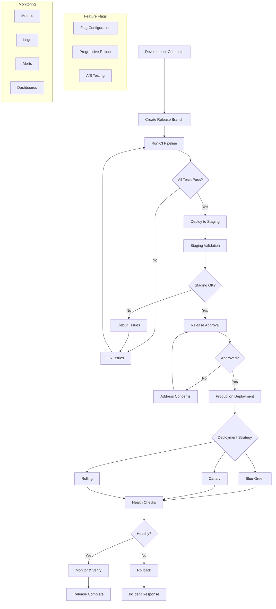

# Deployment and Release Management Standards

**Version:** v1.0.0  
**Domain:** operations  
**Type:** Process  
**Risk Level:** CRITICAL  
**Maturity Level:** Production  
**Author:** MCP Standards Team  
**Created:** 2025-07-08T11:30:00.000000  
**Last Updated:** 2025-07-08T11:30:00.000000  

## Purpose

Comprehensive standards for deployment and release management, including release strategies, feature flags, rollback procedures, and environment management

This deployment standard defines the requirements, guidelines, and best practices for managing software deployments and releases. It provides comprehensive guidance for release strategies, feature flag management, rollback procedures, and post-deployment verification while ensuring reliability, safety, and minimal downtime.

**Deployment Focus Areas:**
- **Release Strategies**: Blue-green, canary, rolling deployments
- **Feature Flag Management**: Progressive rollouts and experimentation
- **Rollback Procedures**: Safe and rapid rollback mechanisms
- **Environment Management**: Dev, staging, and production environments
- **Release Communication**: Notes, notifications, and coordination
- **Post-Deployment**: Verification and monitoring procedures
- **Emergency Releases**: Hot fixes and critical update procedures

## Scope

This deployment standard applies to:
- Software release planning and execution
- Deployment automation and orchestration
- Feature flag systems and management
- Environment configuration and promotion
- Release validation and verification
- Rollback and recovery procedures
- Emergency release processes
- Release documentation and communication
- Post-deployment monitoring

## Implementation

### Deployment Requirements

**NIST Controls:** NIST-CM-2, CM-3, CM-4, CM-7, CM-8, SA-10, SA-11, SC-7, SC-8, SI-2, SI-3, SI-4, SI-6, SI-7, CP-10, CP-2, CP-7, CP-9

**Deployment Standards:** GitOps, Infrastructure as Code, CI/CD best practices
**Release Standards:** Semantic versioning, changelog standards
**Communication Standards:** Release notes, stakeholder notifications

### Deployment Architecture

#### Deployment Process Flow


#### Deployment Implementation
```python
# Example: Comprehensive deployment and release management system
import asyncio
import json
import yaml
from typing import List, Dict, Any, Optional, Callable
from dataclasses import dataclass, field
from datetime import datetime, timedelta
from enum import Enum
import hashlib
import kubernetes
from kubernetes import client, config
import boto3
import docker
import consul
import redis
import requests
from prometheus_client import Counter, Histogram, Gauge
import logging
from abc import ABC, abstractmethod

class DeploymentStrategy(Enum):
    """Deployment strategy types."""
    BLUE_GREEN = "blue_green"
    CANARY = "canary"
    ROLLING = "rolling"
    RECREATE = "recreate"
    A_B_TESTING = "ab_testing"

class ReleaseStatus(Enum):
    """Release status."""
    PLANNED = "planned"
    IN_PROGRESS = "in_progress"
    DEPLOYED = "deployed"
    VERIFIED = "verified"
    ROLLED_BACK = "rolled_back"
    FAILED = "failed"

@dataclass
class DeploymentConfig:
    """Deployment configuration."""
    application: str
    version: str
    environment: str
    strategy: DeploymentStrategy
    health_check_url: str
    health_check_interval: int = 10
    health_check_timeout: int = 30
    rollback_on_failure: bool = True
    
    # Strategy-specific configs
    canary_percentage: int = 10
    canary_duration: int = 300  # seconds
    rolling_max_surge: int = 1
    rolling_max_unavailable: int = 0
    
    # Feature flags
    feature_flags: Dict[str, Any] = field(default_factory=dict)
    
    # Monitoring
    metrics_endpoint: str = "/metrics"
    log_aggregation: bool = True
    alert_channels: List[str] = field(default_factory=list)

@dataclass
class Release:
    """Release information."""
    release_id: str
    version: str
    environment: str
    status: ReleaseStatus
    deployment_config: DeploymentConfig
    created_at: datetime
    deployed_at: Optional[datetime] = None
    verified_at: Optional[datetime] = None
    deployed_by: str = ""
    release_notes: str = ""
    commits: List[str] = field(default_factory=list)
    rollback_version: Optional[str] = None
    metrics: Dict[str, Any] = field(default_factory=dict)

class DeploymentOrchestrator:
    """Orchestrate deployment and release processes."""
    
    def __init__(self, config_path: str):
        self.config = self._load_config(config_path)
        self.k8s_client = self._init_kubernetes()
        self.feature_flag_client = self._init_feature_flags()
        self.metrics_client = self._init_metrics()
        self.releases: Dict[str, Release] = {}
        self.logger = logging.getLogger(__name__)
        
    def _load_config(self, config_path: str) -> Dict[str, Any]:
        """Load deployment configuration."""
        with open(config_path) as f:
            return yaml.safe_load(f)
    
    def _init_kubernetes(self):
        """Initialize Kubernetes client."""
        try:
            config.load_incluster_config()
        except:
            config.load_kube_config()
        
        return client.ApiClient()
    
    def _init_feature_flags(self):
        """Initialize feature flag client."""
        return FeatureFlagManager(
            self.config.get("feature_flag_service", {})
        )
    
    def _init_metrics(self):
        """Initialize metrics collection."""
        return {
            "deployments_total": Counter(
                "deployments_total",
                "Total number of deployments",
                ["environment", "status"]
            ),
            "deployment_duration": Histogram(
                "deployment_duration_seconds",
                "Deployment duration in seconds",
                ["environment", "strategy"]
            ),
            "rollback_total": Counter(
                "rollbacks_total",
                "Total number of rollbacks",
                ["environment", "reason"]
            ),
            "active_version": Gauge(
                "active_version_info",
                "Currently active version",
                ["environment", "application"]
            )
        }
    
    async def create_release(self, version: str, environment: str,
                           deployment_config: DeploymentConfig) -> Release:
        """Create a new release."""
        release = Release(
            release_id=self._generate_release_id(version, environment),
            version=version,
            environment=environment,
            status=ReleaseStatus.PLANNED,
            deployment_config=deployment_config,
            created_at=datetime.utcnow()
        )
        
        # Generate release notes
        release.release_notes = await self._generate_release_notes(version)
        release.commits = await self._get_commits_since_last_release(version)
        
        self.releases[release.release_id] = release
        
        self.logger.info(f"Created release {release.release_id}")
        
        return release
    
    async def deploy_release(self, release_id: str) -> Dict[str, Any]:
        """Deploy a release using configured strategy."""
        release = self.releases.get(release_id)
        if not release:
            raise ValueError(f"Release {release_id} not found")
        
        release.status = ReleaseStatus.IN_PROGRESS
        release.deployed_at = datetime.utcnow()
        
        deployment_result = {
            "release_id": release_id,
            "start_time": datetime.utcnow(),
            "steps": [],
            "success": False
        }
        
        try:
            # Pre-deployment checks
            await self._pre_deployment_checks(release)
            
            # Deploy based on strategy
            if release.deployment_config.strategy == DeploymentStrategy.BLUE_GREEN:
                result = await self._deploy_blue_green(release)
            elif release.deployment_config.strategy == DeploymentStrategy.CANARY:
                result = await self._deploy_canary(release)
            elif release.deployment_config.strategy == DeploymentStrategy.ROLLING:
                result = await self._deploy_rolling(release)
            else:
                raise ValueError(f"Unknown strategy: {release.deployment_config.strategy}")
            
            deployment_result["steps"].extend(result["steps"])
            
            # Post-deployment verification
            if await self._verify_deployment(release):
                release.status = ReleaseStatus.VERIFIED
                release.verified_at = datetime.utcnow()
                deployment_result["success"] = True
                
                # Update metrics
                self.metrics_client["deployments_total"].labels(
                    environment=release.environment,
                    status="success"
                ).inc()
            else:
                raise Exception("Deployment verification failed")
                
        except Exception as e:
            self.logger.error(f"Deployment failed: {e}")
            
            # Rollback if configured
            if release.deployment_config.rollback_on_failure:
                await self._rollback_release(release)
            
            release.status = ReleaseStatus.FAILED
            deployment_result["error"] = str(e)
            
            # Update metrics
            self.metrics_client["deployments_total"].labels(
                environment=release.environment,
                status="failed"
            ).inc()
        
        finally:
            deployment_result["end_time"] = datetime.utcnow()
            deployment_result["duration"] = (
                deployment_result["end_time"] - deployment_result["start_time"]
            ).total_seconds()
            
            # Record deployment duration
            self.metrics_client["deployment_duration"].labels(
                environment=release.environment,
                strategy=release.deployment_config.strategy.value
            ).observe(deployment_result["duration"])
        
        return deployment_result
    
    async def _deploy_blue_green(self, release: Release) -> Dict[str, Any]:
        """Blue-green deployment strategy."""
        result = {"steps": []}
        
        self.logger.info(f"Starting blue-green deployment for {release.version}")
        
        # Step 1: Deploy to green environment
        green_deployment = await self._create_deployment(
            release,
            name_suffix="-green",
            replicas=release.deployment_config.rolling_max_surge
        )
        result["steps"].append({
            "step": "deploy_green",
            "status": "completed",
            "deployment": green_deployment
        })
        
        # Step 2: Wait for green to be healthy
        health_check_result = await self._wait_for_health(
            green_deployment["endpoint"],
            release.deployment_config.health_check_timeout
        )
        
        if not health_check_result["healthy"]:
            raise Exception("Green deployment health check failed")
        
        result["steps"].append({
            "step": "health_check_green",
            "status": "completed",
            "duration": health_check_result["duration"]
        })
        
        # Step 3: Switch traffic to green
        await self._switch_traffic(
            from_deployment="blue",
            to_deployment="green",
            percentage=100
        )
        result["steps"].append({
            "step": "switch_traffic",
            "status": "completed"
        })
        
        # Step 4: Monitor for issues
        monitoring_result = await self._monitor_deployment(
            release,
            duration=60  # Monitor for 1 minute
        )
        
        if monitoring_result["error_rate"] > 0.01:  # 1% error threshold
            raise Exception(f"High error rate detected: {monitoring_result['error_rate']}")
        
        result["steps"].append({
            "step": "monitoring",
            "status": "completed",
            "metrics": monitoring_result
        })
        
        # Step 5: Remove blue deployment
        await self._remove_deployment(name_suffix="-blue")
        result["steps"].append({
            "step": "cleanup_blue",
            "status": "completed"
        })
        
        # Step 6: Rename green to blue for next deployment
        await self._rename_deployment(
            from_name="-green",
            to_name="-blue"
        )
        
        return result
    
    async def _deploy_canary(self, release: Release) -> Dict[str, Any]:
        """Canary deployment strategy."""
        result = {"steps": []}
        
        self.logger.info(f"Starting canary deployment for {release.version}")
        
        # Step 1: Deploy canary instances
        canary_replicas = max(1, int(
            self._get_current_replicas() * 
            release.deployment_config.canary_percentage / 100
        ))
        
        canary_deployment = await self._create_deployment(
            release,
            name_suffix="-canary",
            replicas=canary_replicas
        )
        result["steps"].append({
            "step": "deploy_canary",
            "status": "completed",
            "replicas": canary_replicas
        })
        
        # Step 2: Route percentage of traffic to canary
        await self._split_traffic({
            "stable": 100 - release.deployment_config.canary_percentage,
            "canary": release.deployment_config.canary_percentage
        })
        result["steps"].append({
            "step": "route_traffic",
            "status": "completed",
            "canary_percentage": release.deployment_config.canary_percentage
        })
        
        # Step 3: Monitor canary
        monitoring_duration = release.deployment_config.canary_duration
        start_time = datetime.utcnow()
        
        while (datetime.utcnow() - start_time).total_seconds() < monitoring_duration:
            canary_metrics = await self._get_canary_metrics(release)
            
            # Compare canary vs stable
            if canary_metrics["error_rate"] > canary_metrics["stable_error_rate"] * 1.5:
                raise Exception("Canary has higher error rate than stable")
            
            if canary_metrics["latency_p99"] > canary_metrics["stable_latency_p99"] * 1.2:
                raise Exception("Canary has higher latency than stable")
            
            result["steps"].append({
                "step": "canary_analysis",
                "timestamp": datetime.utcnow(),
                "metrics": canary_metrics
            })
            
            await asyncio.sleep(30)  # Check every 30 seconds
        
        # Step 4: Promote canary
        await self._promote_canary(release)
        result["steps"].append({
            "step": "promote_canary",
            "status": "completed"
        })
        
        return result
    
    async def _deploy_rolling(self, release: Release) -> Dict[str, Any]:
        """Rolling deployment strategy."""
        result = {"steps": []}
        
        self.logger.info(f"Starting rolling deployment for {release.version}")
        
        # Get current deployment
        current_deployment = await self._get_current_deployment()
        total_replicas = current_deployment["replicas"]
        
        # Calculate rolling parameters
        max_surge = release.deployment_config.rolling_max_surge
        max_unavailable = release.deployment_config.rolling_max_unavailable
        
        # Create new deployment with rolling update
        deployment_spec = {
            "apiVersion": "apps/v1",
            "kind": "Deployment",
            "metadata": {
                "name": f"{release.deployment_config.application}",
                "labels": {
                    "app": release.deployment_config.application,
                    "version": release.version
                }
            },
            "spec": {
                "replicas": total_replicas,
                "strategy": {
                    "type": "RollingUpdate",
                    "rollingUpdate": {
                        "maxSurge": max_surge,
                        "maxUnavailable": max_unavailable
                    }
                },
                "selector": {
                    "matchLabels": {
                        "app": release.deployment_config.application
                    }
                },
                "template": {
                    "metadata": {
                        "labels": {
                            "app": release.deployment_config.application,
                            "version": release.version
                        }
                    },
                    "spec": {
                        "containers": [{
                            "name": release.deployment_config.application,
                            "image": f"{release.deployment_config.application}:{release.version}",
                            "ports": [{"containerPort": 8080}],
                            "readinessProbe": {
                                "httpGet": {
                                    "path": "/health",
                                    "port": 8080
                                },
                                "initialDelaySeconds": 10,
                                "periodSeconds": 5
                            },
                            "livenessProbe": {
                                "httpGet": {
                                    "path": "/health",
                                    "port": 8080
                                },
                                "initialDelaySeconds": 30,
                                "periodSeconds": 10
                            }
                        }]
                    }
                }
            }
        }
        
        # Apply deployment
        apps_v1 = client.AppsV1Api()
        apps_v1.patch_namespaced_deployment(
            name=deployment_spec["metadata"]["name"],
            namespace=release.environment,
            body=deployment_spec
        )
        
        result["steps"].append({
            "step": "update_deployment",
            "status": "initiated"
        })
        
        # Monitor rolling update progress
        while True:
            deployment_status = apps_v1.read_namespaced_deployment_status(
                name=deployment_spec["metadata"]["name"],
                namespace=release.environment
            )
            
            conditions = deployment_status.status.conditions or []
            progressing = next(
                (c for c in conditions if c.type == "Progressing"),
                None
            )
            
            if progressing and progressing.status == "True":
                if progressing.reason == "NewReplicaSetAvailable":
                    break
            
            # Check for timeout or failure
            if (datetime.utcnow() - release.deployed_at).total_seconds() > 600:
                raise Exception("Rolling update timeout")
            
            result["steps"].append({
                "step": "rolling_progress",
                "timestamp": datetime.utcnow(),
                "updated_replicas": deployment_status.status.updated_replicas,
                "ready_replicas": deployment_status.status.ready_replicas,
                "available_replicas": deployment_status.status.available_replicas
            })
            
            await asyncio.sleep(10)
        
        result["steps"].append({
            "step": "rolling_complete",
            "status": "completed"
        })
        
        return result
    
    async def _verify_deployment(self, release: Release) -> bool:
        """Verify deployment health and functionality."""
        verification_steps = [
            self._verify_health_endpoints,
            self._verify_critical_features,
            self._verify_dependencies,
            self._verify_performance_metrics,
            self._run_smoke_tests
        ]
        
        for step in verification_steps:
            result = await step(release)
            if not result["success"]:
                self.logger.error(f"Verification failed: {result['error']}")
                return False
        
        return True
    
    async def _verify_health_endpoints(self, release: Release) -> Dict[str, Any]:
        """Verify all health endpoints are responding."""
        endpoints = await self._get_deployment_endpoints(release)
        
        for endpoint in endpoints:
            try:
                response = requests.get(
                    f"{endpoint}{release.deployment_config.health_check_url}",
                    timeout=5
                )
                
                if response.status_code != 200:
                    return {
                        "success": False,
                        "error": f"Health check failed for {endpoint}"
                    }
                    
            except Exception as e:
                return {
                    "success": False,
                    "error": f"Health check error: {e}"
                }
        
        return {"success": True}
    
    async def _rollback_release(self, release: Release):
        """Rollback to previous version."""
        self.logger.warning(f"Rolling back release {release.release_id}")
        
        # Get previous stable version
        previous_version = await self._get_previous_version(release)
        if not previous_version:
            raise Exception("No previous version to rollback to")
        
        # Create rollback deployment config
        rollback_config = release.deployment_config
        rollback_config.version = previous_version
        
        # Deploy previous version
        rollback_release = await self.create_release(
            previous_version,
            release.environment,
            rollback_config
        )
        
        # Fast-track deployment
        await self.deploy_release(rollback_release.release_id)
        
        # Update original release status
        release.status = ReleaseStatus.ROLLED_BACK
        release.rollback_version = previous_version
        
        # Update metrics
        self.metrics_client["rollback_total"].labels(
            environment=release.environment,
            reason="deployment_failure"
        ).inc()
    
    async def manage_feature_flags(self, release: Release):
        """Manage feature flags for progressive rollout."""
        flags = release.deployment_config.feature_flags
        
        for flag_name, flag_config in flags.items():
            # Create or update feature flag
            await self.feature_flag_client.create_or_update_flag(
                flag_name,
                flag_config
            )
            
            # Set up progressive rollout if configured
            if flag_config.get("progressive_rollout"):
                await self._setup_progressive_rollout(
                    flag_name,
                    flag_config["progressive_rollout"]
                )
    
    async def _setup_progressive_rollout(self, flag_name: str,
                                       rollout_config: Dict[str, Any]):
        """Set up progressive feature rollout."""
        stages = rollout_config.get("stages", [
            {"percentage": 10, "duration": 3600},    # 10% for 1 hour
            {"percentage": 25, "duration": 3600},    # 25% for 1 hour
            {"percentage": 50, "duration": 7200},    # 50% for 2 hours
            {"percentage": 100, "duration": None}    # 100% indefinitely
        ])
        
        for stage in stages:
            # Update flag percentage
            await self.feature_flag_client.update_rollout_percentage(
                flag_name,
                stage["percentage"]
            )
            
            # Monitor metrics during stage
            if stage["duration"]:
                await self._monitor_flag_metrics(
                    flag_name,
                    stage["duration"]
                )
            
            # Check success criteria
            if not await self._check_rollout_criteria(flag_name):
                # Rollback flag
                await self.feature_flag_client.disable_flag(flag_name)
                raise Exception(f"Feature flag {flag_name} rollout failed criteria")
    
    def _generate_release_id(self, version: str, environment: str) -> str:
        """Generate unique release ID."""
        timestamp = datetime.utcnow().strftime("%Y%m%d%H%M%S")
        return f"{environment}-{version}-{timestamp}"
    
    async def _generate_release_notes(self, version: str) -> str:
        """Generate release notes from commits and issues."""
        # Get commits since last release
        commits = await self._get_commits_since_last_release(version)
        
        # Categorize changes
        features = []
        fixes = []
        breaking = []
        other = []
        
        for commit in commits:
            message = commit["message"]
            
            if message.startswith("feat:"):
                features.append(message)
            elif message.startswith("fix:"):
                fixes.append(message)
            elif "BREAKING CHANGE" in message:
                breaking.append(message)
            else:
                other.append(message)
        
        # Generate formatted release notes
        notes = f"# Release {version}\n\n"
        notes += f"Released on {datetime.utcnow().strftime('%Y-%m-%d')}\n\n"
        
        if breaking:
            notes += "## ⚠️ Breaking Changes\n\n"
            for item in breaking:
                notes += f"- {item}\n"
            notes += "\n"
        
        if features:
            notes += "## ✨ New Features\n\n"
            for item in features:
                notes += f"- {item}\n"
            notes += "\n"
        
        if fixes:
            notes += "## 🐛 Bug Fixes\n\n"
            for item in fixes:
                notes += f"- {item}\n"
            notes += "\n"
        
        if other:
            notes += "## 📝 Other Changes\n\n"
            for item in other:
                notes += f"- {item}\n"
        
        return notes

### Feature Flag Management

#### Feature Flag System Implementation
```python
# Example: Advanced feature flag management
from typing import List, Dict, Any, Optional, Set
import json
import redis
import consul
from dataclasses import dataclass, field
from datetime import datetime, timedelta
import hashlib
import random
from abc import ABC, abstractmethod

@dataclass
class FeatureFlag:
    """Feature flag configuration."""
    name: str
    description: str
    enabled: bool
    rollout_percentage: float
    targeting_rules: List[Dict[str, Any]] = field(default_factory=list)
    variants: Dict[str, Any] = field(default_factory=dict)
    dependencies: List[str] = field(default_factory=list)
    created_at: datetime = field(default_factory=datetime.utcnow)
    updated_at: datetime = field(default_factory=datetime.utcnow)
    tags: List[str] = field(default_factory=list)

@dataclass
class FlagEvaluation:
    """Feature flag evaluation result."""
    flag_name: str
    enabled: bool
    variant: Optional[str] = None
    reason: str = ""
    metadata: Dict[str, Any] = field(default_factory=dict)

class FeatureFlagManager:
    """Manage feature flags across environments."""
    
    def __init__(self, config: Dict[str, Any]):
        self.config = config
        self.redis_client = redis.Redis.from_url(config["redis_url"])
        self.consul_client = consul.Consul(
            host=config.get("consul_host", "localhost"),
            port=config.get("consul_port", 8500)
        )
        self.flags: Dict[str, FeatureFlag] = {}
        self._load_flags()
        
    def _load_flags(self):
        """Load flags from persistent storage."""
        # Load from Consul KV store
        _, data = self.consul_client.kv.get("feature_flags/", recurse=True)
        
        if data:
            for item in data:
                if item["Value"]:
                    flag_data = json.loads(item["Value"])
                    flag = FeatureFlag(**flag_data)
                    self.flags[flag.name] = flag
    
    async def create_flag(self, flag_name: str, description: str,
                         **kwargs) -> FeatureFlag:
        """Create a new feature flag."""
        flag = FeatureFlag(
            name=flag_name,
            description=description,
            enabled=kwargs.get("enabled", False),
            rollout_percentage=kwargs.get("rollout_percentage", 0.0),
            targeting_rules=kwargs.get("targeting_rules", []),
            variants=kwargs.get("variants", {}),
            dependencies=kwargs.get("dependencies", []),
            tags=kwargs.get("tags", [])
        )
        
        # Save to Consul
        self.consul_client.kv.put(
            f"feature_flags/{flag_name}",
            json.dumps(flag.__dict__, default=str)
        )
        
        # Cache in Redis
        self._cache_flag(flag)
        
        self.flags[flag_name] = flag
        
        # Emit flag created event
        await self._emit_flag_event("created", flag)
        
        return flag
    
    async def evaluate_flag(self, flag_name: str, context: Dict[str, Any]) -> FlagEvaluation:
        """Evaluate feature flag for given context."""
        # Check cache first
        cached_result = self._get_cached_evaluation(flag_name, context)
        if cached_result:
            return cached_result
        
        flag = self.flags.get(flag_name)
        if not flag:
            return FlagEvaluation(
                flag_name=flag_name,
                enabled=False,
                reason="Flag not found"
            )
        
        # Check if flag is globally disabled
        if not flag.enabled:
            return FlagEvaluation(
                flag_name=flag_name,
                enabled=False,
                reason="Flag globally disabled"
            )
        
        # Check dependencies
        if not await self._check_dependencies(flag, context):
            return FlagEvaluation(
                flag_name=flag_name,
                enabled=False,
                reason="Dependencies not met"
            )
        
        # Apply targeting rules
        targeting_result = self._evaluate_targeting_rules(flag, context)
        if targeting_result is not None:
            return FlagEvaluation(
                flag_name=flag_name,
                enabled=targeting_result["enabled"],
                variant=targeting_result.get("variant"),
                reason=f"Targeting rule: {targeting_result['rule_id']}"
            )
        
        # Apply percentage rollout
        if self._is_in_rollout_percentage(flag, context):
            variant = self._select_variant(flag, context)
            result = FlagEvaluation(
                flag_name=flag_name,
                enabled=True,
                variant=variant,
                reason=f"In {flag.rollout_percentage}% rollout"
            )
        else:
            result = FlagEvaluation(
                flag_name=flag_name,
                enabled=False,
                reason=f"Not in {flag.rollout_percentage}% rollout"
            )
        
        # Cache result
        self._cache_evaluation(flag_name, context, result)
        
        # Track evaluation
        await self._track_evaluation(flag, context, result)
        
        return result
    
    def _evaluate_targeting_rules(self, flag: FeatureFlag,
                                context: Dict[str, Any]) -> Optional[Dict[str, Any]]:
        """Evaluate targeting rules in order."""
        for rule in flag.targeting_rules:
            if self._matches_rule(rule, context):
                return {
                    "enabled": rule.get("enabled", True),
                    "variant": rule.get("variant"),
                    "rule_id": rule.get("id", "unknown")
                }
        return None
    
    def _matches_rule(self, rule: Dict[str, Any], context: Dict[str, Any]) -> bool:
        """Check if context matches targeting rule."""
        conditions = rule.get("conditions", [])
        match_type = rule.get("match_type", "all")  # all or any
        
        results = []
        for condition in conditions:
            attribute = condition["attribute"]
            operator = condition["operator"]
            values = condition["values"]
            
            context_value = context.get(attribute)
            
            if operator == "equals":
                results.append(context_value in values)
            elif operator == "not_equals":
                results.append(context_value not in values)
            elif operator == "contains":
                results.append(any(v in str(context_value) for v in values))
            elif operator == "regex":
                import re
                results.append(any(re.match(v, str(context_value)) for v in values))
            elif operator == "greater_than":
                results.append(float(context_value) > float(values[0]))
            elif operator == "less_than":
                results.append(float(context_value) < float(values[0]))
            elif operator == "in_segment":
                results.append(self._is_in_segment(context_value, values))
            else:
                results.append(False)
        
        if match_type == "all":
            return all(results)
        else:  # any
            return any(results)
    
    def _is_in_rollout_percentage(self, flag: FeatureFlag,
                                context: Dict[str, Any]) -> bool:
        """Check if user is in rollout percentage."""
        if flag.rollout_percentage >= 100:
            return True
        if flag.rollout_percentage <= 0:
            return False
        
        # Generate consistent hash for user
        user_id = context.get("user_id", "anonymous")
        hash_input = f"{flag.name}:{user_id}"
        hash_value = int(hashlib.md5(hash_input.encode()).hexdigest(), 16)
        
        # Check if hash falls within percentage
        bucket = (hash_value % 10000) / 100.0
        return bucket < flag.rollout_percentage
    
    def _select_variant(self, flag: FeatureFlag, context: Dict[str, Any]) -> Optional[str]:
        """Select variant based on distribution."""
        if not flag.variants:
            return None
        
        # Calculate cumulative weights
        total_weight = sum(v.get("weight", 0) for v in flag.variants.values())
        if total_weight == 0:
            return None
        
        # Generate consistent random value for user
        user_id = context.get("user_id", "anonymous")
        hash_input = f"{flag.name}:variant:{user_id}"
        hash_value = int(hashlib.md5(hash_input.encode()).hexdigest(), 16)
        random_value = (hash_value % 10000) / 10000.0
        
        # Select variant based on weights
        cumulative = 0
        for variant_name, variant_config in flag.variants.items():
            weight = variant_config.get("weight", 0) / total_weight
            cumulative += weight
            if random_value < cumulative:
                return variant_name
        
        return None
    
    async def update_rollout_percentage(self, flag_name: str, percentage: float):
        """Update flag rollout percentage."""
        flag = self.flags.get(flag_name)
        if not flag:
            raise ValueError(f"Flag {flag_name} not found")
        
        old_percentage = flag.rollout_percentage
        flag.rollout_percentage = max(0, min(100, percentage))
        flag.updated_at = datetime.utcnow()
        
        # Save changes
        self._save_flag(flag)
        
        # Emit event
        await self._emit_flag_event("rollout_updated", flag, {
            "old_percentage": old_percentage,
            "new_percentage": percentage
        })
    
    async def create_experiment(self, flag_name: str,
                              hypothesis: str,
                              metrics: List[str],
                              duration_hours: int = 168) -> Dict[str, Any]:
        """Create an A/B test experiment."""
        flag = self.flags.get(flag_name)
        if not flag:
            raise ValueError(f"Flag {flag_name} not found")
        
        experiment = {
            "id": f"exp-{datetime.utcnow().strftime('%Y%m%d%H%M%S')}",
            "flag_name": flag_name,
            "hypothesis": hypothesis,
            "metrics": metrics,
            "start_time": datetime.utcnow(),
            "end_time": datetime.utcnow() + timedelta(hours=duration_hours),
            "control_variant": "control",
            "treatment_variants": list(flag.variants.keys()),
            "status": "running"
        }
        
        # Save experiment
        self.consul_client.kv.put(
            f"experiments/{experiment['id']}",
            json.dumps(experiment, default=str)
        )
        
        # Set up metrics collection
        await self._setup_experiment_metrics(experiment)
        
        return experiment
    
    async def _track_evaluation(self, flag: FeatureFlag, context: Dict[str, Any],
                              result: FlagEvaluation):
        """Track flag evaluation for analytics."""
        # Record in time series database
        metric_data = {
            "flag_name": flag.name,
            "enabled": result.enabled,
            "variant": result.variant,
            "user_id": context.get("user_id", "anonymous"),
            "timestamp": datetime.utcnow().isoformat()
        }
        
        # Send to metrics pipeline
        self.redis_client.xadd(
            "feature_flag_evaluations",
            metric_data
        )
        
        # Update evaluation counter
        self.redis_client.hincrby(
            f"flag_metrics:{flag.name}",
            "evaluations" if result.enabled else "evaluations_off",
            1
        )
    
    def get_flag_metrics(self, flag_name: str) -> Dict[str, Any]:
        """Get metrics for a feature flag."""
        metrics_key = f"flag_metrics:{flag_name}"
        raw_metrics = self.redis_client.hgetall(metrics_key)
        
        metrics = {
            "evaluations_on": int(raw_metrics.get(b"evaluations", 0)),
            "evaluations_off": int(raw_metrics.get(b"evaluations_off", 0)),
            "errors": int(raw_metrics.get(b"errors", 0))
        }
        
        total = metrics["evaluations_on"] + metrics["evaluations_off"]
        if total > 0:
            metrics["enablement_ratio"] = metrics["evaluations_on"] / total
        else:
            metrics["enablement_ratio"] = 0
        
        return metrics
    
    def _cache_flag(self, flag: FeatureFlag):
        """Cache flag in Redis."""
        self.redis_client.set(
            f"flag:{flag.name}",
            json.dumps(flag.__dict__, default=str),
            ex=300  # 5 minute TTL
        )
    
    def _save_flag(self, flag: FeatureFlag):
        """Save flag to persistent storage."""
        # Save to Consul
        self.consul_client.kv.put(
            f"feature_flags/{flag.name}",
            json.dumps(flag.__dict__, default=str)
        )
        
        # Update cache
        self._cache_flag(flag)
    
    async def _emit_flag_event(self, event_type: str, flag: FeatureFlag,
                             metadata: Dict[str, Any] = None):
        """Emit feature flag event."""
        event = {
            "type": f"feature_flag.{event_type}",
            "flag_name": flag.name,
            "timestamp": datetime.utcnow().isoformat(),
            "metadata": metadata or {}
        }
        
        # Publish to event stream
        self.redis_client.publish(
            "feature_flag_events",
            json.dumps(event)
        )

### Environment Management

#### Multi-Environment Configuration
```python
# Example: Environment management and promotion
from typing import List, Dict, Any, Optional
import yaml
import json
from dataclasses import dataclass
from pathlib import Path
import kubernetes
import boto3
import terraform

@dataclass
class Environment:
    """Environment configuration."""
    name: str
    type: str  # dev, staging, prod
    region: str
    cluster: str
    namespace: str
    config_path: str
    secrets_path: str
    resources: Dict[str, Any]
    dependencies: List[str]
    promotion_targets: List[str]
    approval_required: bool

class EnvironmentManager:
    """Manage multi-environment configurations and promotions."""
    
    def __init__(self, config_path: str):
        self.config = self._load_config(config_path)
        self.environments = self._load_environments()
        self.k8s_clients = self._init_k8s_clients()
        self.secret_manager = self._init_secret_manager()
        
    def _load_environments(self) -> Dict[str, Environment]:
        """Load environment configurations."""
        environments = {}
        
        # Development environment
        environments["dev"] = Environment(
            name="dev",
            type="development",
            region="us-east-1",
            cluster="dev-cluster",
            namespace="dev",
            config_path="config/dev/",
            secrets_path="secrets/dev/",
            resources={
                "cpu_limit": "2",
                "memory_limit": "4Gi",
                "replicas": 2,
                "autoscaling": False
            },
            dependencies=[],
            promotion_targets=["staging"],
            approval_required=False
        )
        
        # Staging environment
        environments["staging"] = Environment(
            name="staging",
            type="staging",
            region="us-east-1",
            cluster="staging-cluster",
            namespace="staging",
            config_path="config/staging/",
            secrets_path="secrets/staging/",
            resources={
                "cpu_limit": "4",
                "memory_limit": "8Gi",
                "replicas": 3,
                "autoscaling": True,
                "min_replicas": 2,
                "max_replicas": 10
            },
            dependencies=["dev"],
            promotion_targets=["prod"],
            approval_required=True
        )
        
        # Production environment
        environments["prod"] = Environment(
            name="prod",
            type="production",
            region="us-east-1",
            cluster="prod-cluster",
            namespace="prod",
            config_path="config/prod/",
            secrets_path="secrets/prod/",
            resources={
                "cpu_limit": "8",
                "memory_limit": "16Gi",
                "replicas": 5,
                "autoscaling": True,
                "min_replicas": 3,
                "max_replicas": 50
            },
            dependencies=["staging"],
            promotion_targets=[],
            approval_required=True
        )
        
        return environments
    
    async def promote_release(self, release_version: str,
                            from_env: str, to_env: str) -> Dict[str, Any]:
        """Promote release between environments."""
        if to_env not in self.environments[from_env].promotion_targets:
            raise ValueError(f"Cannot promote from {from_env} to {to_env}")
        
        source_env = self.environments[from_env]
        target_env = self.environments[to_env]
        
        # Check approval requirement
        if target_env.approval_required:
            approval = await self._request_approval(
                release_version,
                from_env,
                to_env
            )
            if not approval["approved"]:
                return {
                    "status": "rejected",
                    "reason": approval["reason"]
                }
        
        # Validate source deployment
        if not await self._validate_source_deployment(release_version, source_env):
            return {
                "status": "failed",
                "reason": "Source deployment validation failed"
            }
        
        # Copy artifacts
        await self._copy_artifacts(release_version, source_env, target_env)
        
        # Transform configuration
        target_config = await self._transform_config(
            release_version,
            source_env,
            target_env
        )
        
        # Deploy to target environment
        deployment_result = await self._deploy_to_environment(
            release_version,
            target_env,
            target_config
        )
        
        return {
            "status": "completed",
            "from_environment": from_env,
            "to_environment": to_env,
            "version": release_version,
            "deployment_result": deployment_result
        }
    
    async def _transform_config(self, version: str,
                              source_env: Environment,
                              target_env: Environment) -> Dict[str, Any]:
        """Transform configuration for target environment."""
        # Load base configuration
        base_config = self._load_base_config(version)
        
        # Apply environment-specific overrides
        env_config = self._load_env_config(target_env)
        
        # Merge configurations
        config = self._deep_merge(base_config, env_config)
        
        # Transform values
        transformations = {
            "replicas": target_env.resources["replicas"],
            "resources": {
                "limits": {
                    "cpu": target_env.resources["cpu_limit"],
                    "memory": target_env.resources["memory_limit"]
                }
            },
            "ingress": {
                "host": f"{version}.{target_env.name}.example.com"
            }
        }
        
        config = self._deep_merge(config, transformations)
        
        # Handle secrets
        config["secrets"] = await self._get_environment_secrets(target_env)
        
        return config
    
    async def sync_environments(self):
        """Sync all environment configurations."""
        for env_name, env in self.environments.items():
            self.logger.info(f"Syncing environment: {env_name}")
            
            # Sync Kubernetes resources
            await self._sync_k8s_resources(env)
            
            # Sync secrets
            await self._sync_secrets(env)
            
            # Sync monitoring
            await self._sync_monitoring(env)
            
            # Validate environment
            validation_result = await self._validate_environment(env)
            if not validation_result["valid"]:
                self.logger.error(
                    f"Environment {env_name} validation failed: {validation_result['errors']}"
                )
    
    async def _sync_k8s_resources(self, env: Environment):
        """Sync Kubernetes resources for environment."""
        k8s_client = self.k8s_clients[env.name]
        
        # Namespace
        await self._ensure_namespace(k8s_client, env.namespace)
        
        # Resource quotas
        await self._apply_resource_quota(k8s_client, env)
        
        # Network policies
        await self._apply_network_policies(k8s_client, env)
        
        # Service accounts and RBAC
        await self._apply_rbac(k8s_client, env)
    
    def generate_environment_report(self) -> Dict[str, Any]:
        """Generate comprehensive environment status report."""
        report = {
            "environments": {},
            "drift_analysis": {},
            "resource_usage": {},
            "compliance_status": {}
        }
        
        for env_name, env in self.environments.items():
            # Get environment status
            status = self._get_environment_status(env)
            report["environments"][env_name] = status
            
            # Check configuration drift
            drift = self._check_configuration_drift(env)
            report["drift_analysis"][env_name] = drift
            
            # Get resource usage
            usage = self._get_resource_usage(env)
            report["resource_usage"][env_name] = usage
            
            # Check compliance
            compliance = self._check_environment_compliance(env)
            report["compliance_status"][env_name] = compliance
        
        return report

### Post-Deployment Verification

#### Verification and Monitoring Framework
```python
# Example: Post-deployment verification system
import asyncio
from typing import List, Dict, Any, Optional, Callable
from dataclasses import dataclass
import aiohttp
import prometheus_client
from prometheus_client.parser import text_string_to_metric_families
import time

@dataclass
class VerificationCheck:
    """Post-deployment verification check."""
    name: str
    check_type: str  # health, functional, performance, security
    target: str
    expected_result: Any
    timeout: int = 30
    retries: int = 3
    critical: bool = True

class PostDeploymentVerifier:
    """Verify deployments are successful and healthy."""
    
    def __init__(self, config: Dict[str, Any]):
        self.config = config
        self.checks: List[VerificationCheck] = []
        self._load_verification_checks()
        
    def _load_verification_checks(self):
        """Load verification check configurations."""
        # Health checks
        self.checks.extend([
            VerificationCheck(
                name="primary_health",
                check_type="health",
                target="/health",
                expected_result={"status": "healthy"},
                critical=True
            ),
            VerificationCheck(
                name="readiness",
                check_type="health",
                target="/ready",
                expected_result={"ready": True},
                critical=True
            ),
            VerificationCheck(
                name="dependencies",
                check_type="health",
                target="/health/dependencies",
                expected_result=lambda r: all(d["healthy"] for d in r["dependencies"]),
                critical=True
            )
        ])
        
        # Functional checks
        self.checks.extend([
            VerificationCheck(
                name="api_endpoints",
                check_type="functional",
                target="/api/v1/test",
                expected_result=lambda r: r.get("status_code") == 200,
                critical=True
            ),
            VerificationCheck(
                name="database_connectivity",
                check_type="functional",
                target="/health/db",
                expected_result={"connected": True},
                critical=True
            ),
            VerificationCheck(
                name="cache_connectivity",
                check_type="functional",
                target="/health/cache",
                expected_result={"connected": True},
                critical=False
            )
        ])
        
        # Performance checks
        self.checks.extend([
            VerificationCheck(
                name="response_time",
                check_type="performance",
                target="/api/v1/users",
                expected_result=lambda r: r.get("response_time_ms", float('inf')) < 100,
                critical=False
            ),
            VerificationCheck(
                name="throughput",
                check_type="performance",
                target="/metrics",
                expected_result=lambda m: self._check_throughput_metrics(m),
                critical=False
            )
        ])
    
    async def verify_deployment(self, deployment_url: str,
                              version: str) -> Dict[str, Any]:
        """Run all verification checks."""
        results = {
            "deployment_url": deployment_url,
            "version": version,
            "timestamp": datetime.utcnow(),
            "checks": [],
            "overall_status": "success",
            "critical_failures": 0,
            "warnings": 0
        }
        
        # Run checks in parallel
        check_tasks = [
            self._run_check(check, deployment_url)
            for check in self.checks
        ]
        
        check_results = await asyncio.gather(*check_tasks, return_exceptions=True)
        
        # Process results
        for check, result in zip(self.checks, check_results):
            if isinstance(result, Exception):
                check_result = {
                    "name": check.name,
                    "type": check.check_type,
                    "status": "error",
                    "error": str(result),
                    "critical": check.critical
                }
            else:
                check_result = result
            
            results["checks"].append(check_result)
            
            # Update counters
            if check_result["status"] == "failed":
                if check.critical:
                    results["critical_failures"] += 1
                else:
                    results["warnings"] += 1
        
        # Determine overall status
        if results["critical_failures"] > 0:
            results["overall_status"] = "failed"
        elif results["warnings"] > 0:
            results["overall_status"] = "warning"
        
        # Run smoke tests if basic checks pass
        if results["overall_status"] != "failed":
            smoke_test_results = await self._run_smoke_tests(deployment_url)
            results["smoke_tests"] = smoke_test_results
        
        return results
    
    async def _run_check(self, check: VerificationCheck,
                       base_url: str) -> Dict[str, Any]:
        """Run individual verification check."""
        result = {
            "name": check.name,
            "type": check.check_type,
            "status": "pending",
            "attempts": 0,
            "critical": check.critical
        }
        
        for attempt in range(check.retries):
            try:
                result["attempts"] = attempt + 1
                
                if check.check_type == "health":
                    check_result = await self._run_health_check(check, base_url)
                elif check.check_type == "functional":
                    check_result = await self._run_functional_check(check, base_url)
                elif check.check_type == "performance":
                    check_result = await self._run_performance_check(check, base_url)
                elif check.check_type == "security":
                    check_result = await self._run_security_check(check, base_url)
                else:
                    raise ValueError(f"Unknown check type: {check.check_type}")
                
                # Evaluate result
                if callable(check.expected_result):
                    passed = check.expected_result(check_result)
                else:
                    passed = check_result == check.expected_result
                
                result["status"] = "passed" if passed else "failed"
                result["actual_result"] = check_result
                result["expected_result"] = str(check.expected_result)
                
                if passed:
                    break
                    
            except Exception as e:
                result["status"] = "error"
                result["error"] = str(e)
                
                if attempt < check.retries - 1:
                    await asyncio.sleep(2 ** attempt)  # Exponential backoff
        
        return result
    
    async def _run_health_check(self, check: VerificationCheck,
                              base_url: str) -> Dict[str, Any]:
        """Run health check."""
        async with aiohttp.ClientSession() as session:
            async with session.get(
                f"{base_url}{check.target}",
                timeout=aiohttp.ClientTimeout(total=check.timeout)
            ) as response:
                return await response.json()
    
    async def _run_performance_check(self, check: VerificationCheck,
                                   base_url: str) -> Dict[str, Any]:
        """Run performance check."""
        if check.target == "/metrics":
            # Get Prometheus metrics
            async with aiohttp.ClientSession() as session:
                async with session.get(f"{base_url}{check.target}") as response:
                    metrics_text = await response.text()
                    
            # Parse metrics
            metrics = {}
            for family in text_string_to_metric_families(metrics_text):
                for sample in family.samples:
                    metrics[sample.name] = sample.value
            
            return metrics
        else:
            # Measure response time
            start_time = time.time()
            
            async with aiohttp.ClientSession() as session:
                async with session.get(f"{base_url}{check.target}") as response:
                    await response.read()
                    response_time = (time.time() - start_time) * 1000
                    
            return {
                "response_time_ms": response_time,
                "status_code": response.status
            }
    
    async def _run_smoke_tests(self, deployment_url: str) -> Dict[str, Any]:
        """Run smoke tests against deployment."""
        smoke_tests = [
            {
                "name": "create_user",
                "method": "POST",
                "path": "/api/v1/users",
                "data": {"name": "Test User", "email": "test@example.com"}
            },
            {
                "name": "get_user",
                "method": "GET",
                "path": "/api/v1/users/1"
            },
            {
                "name": "list_users",
                "method": "GET",
                "path": "/api/v1/users"
            }
        ]
        
        results = []
        
        async with aiohttp.ClientSession() as session:
            for test in smoke_tests:
                try:
                    if test["method"] == "GET":
                        async with session.get(
                            f"{deployment_url}{test['path']}"
                        ) as response:
                            result = {
                                "name": test["name"],
                                "status": "passed" if response.status < 400 else "failed",
                                "status_code": response.status
                            }
                    elif test["method"] == "POST":
                        async with session.post(
                            f"{deployment_url}{test['path']}",
                            json=test["data"]
                        ) as response:
                            result = {
                                "name": test["name"],
                                "status": "passed" if response.status < 400 else "failed",
                                "status_code": response.status
                            }
                    
                    results.append(result)
                    
                except Exception as e:
                    results.append({
                        "name": test["name"],
                        "status": "error",
                        "error": str(e)
                    })
        
        return {
            "total_tests": len(smoke_tests),
            "passed": len([r for r in results if r["status"] == "passed"]),
            "failed": len([r for r in results if r["status"] == "failed"]),
            "errors": len([r for r in results if r["status"] == "error"]),
            "results": results
        }
    
    def _check_throughput_metrics(self, metrics: Dict[str, float]) -> bool:
        """Check if throughput metrics are acceptable."""
        # Check request rate
        request_rate = metrics.get("http_requests_per_second", 0)
        if request_rate < 10:  # Minimum 10 RPS
            return False
        
        # Check error rate
        error_rate = metrics.get("http_errors_per_second", 0)
        if error_rate / request_rate > 0.01:  # Max 1% error rate
            return False
        
        return True

### Emergency Release Procedures

#### Emergency Release Management
```python
# Example: Emergency release and hotfix procedures
from typing import List, Dict, Any, Optional
import asyncio
from datetime import datetime, timedelta
from enum import Enum

class EmergencyType(Enum):
    """Types of emergency releases."""
    SECURITY_PATCH = "security_patch"
    CRITICAL_BUG = "critical_bug"
    DATA_CORRUPTION = "data_corruption"
    SERVICE_OUTAGE = "service_outage"
    COMPLIANCE_ISSUE = "compliance_issue"

@dataclass
class EmergencyRelease:
    """Emergency release information."""
    release_id: str
    emergency_type: EmergencyType
    severity: str  # P0, P1, P2
    description: str
    affected_services: List[str]
    fix_version: str
    created_at: datetime
    created_by: str
    approved_by: List[str]
    deployment_status: str
    rollout_plan: Dict[str, Any]

class EmergencyReleaseManager:
    """Manage emergency releases and hotfixes."""
    
    def __init__(self, config: Dict[str, Any]):
        self.config = config
        self.active_emergencies: Dict[str, EmergencyRelease] = {}
        self.notification_channels = self._setup_notifications()
        
    async def create_emergency_release(self, emergency_type: EmergencyType,
                                     severity: str,
                                     description: str,
                                     affected_services: List[str],
                                     fix_version: str) -> EmergencyRelease:
        """Create emergency release request."""
        release = EmergencyRelease(
            release_id=f"ER-{datetime.utcnow().strftime('%Y%m%d%H%M%S')}",
            emergency_type=emergency_type,
            severity=severity,
            description=description,
            affected_services=affected_services,
            fix_version=fix_version,
            created_at=datetime.utcnow(),
            created_by=self._get_current_user(),
            approved_by=[],
            deployment_status="pending_approval",
            rollout_plan=self._generate_rollout_plan(severity, affected_services)
        )
        
        self.active_emergencies[release.release_id] = release
        
        # Notify stakeholders
        await self._notify_emergency(release)
        
        # Auto-approve P0 emergencies
        if severity == "P0":
            await self._auto_approve_p0(release)
        
        return release
    
    def _generate_rollout_plan(self, severity: str,
                             affected_services: List[str]) -> Dict[str, Any]:
        """Generate emergency rollout plan based on severity."""
        if severity == "P0":
            # Immediate rollout to all environments
            return {
                "strategy": "immediate",
                "environments": ["prod", "staging", "dev"],
                "canary_percentage": 0,  # Skip canary for P0
                "approval_required": False,
                "monitoring_duration": 300,  # 5 minutes
                "rollback_threshold": 0.05  # 5% error rate
            }
        elif severity == "P1":
            # Rapid rollout with minimal canary
            return {
                "strategy": "rapid",
                "environments": ["prod", "staging"],
                "canary_percentage": 10,
                "canary_duration": 600,  # 10 minutes
                "approval_required": True,
                "monitoring_duration": 1800,  # 30 minutes
                "rollback_threshold": 0.02  # 2% error rate
            }
        else:  # P2
            # Standard emergency procedure
            return {
                "strategy": "controlled",
                "environments": ["staging", "prod"],
                "canary_percentage": 25,
                "canary_duration": 1800,  # 30 minutes
                "approval_required": True,
                "monitoring_duration": 3600,  # 1 hour
                "rollback_threshold": 0.01  # 1% error rate
            }
    
    async def execute_emergency_release(self, release_id: str) -> Dict[str, Any]:
        """Execute emergency release with expedited procedures."""
        release = self.active_emergencies.get(release_id)
        if not release:
            raise ValueError(f"Emergency release {release_id} not found")
        
        execution_log = {
            "release_id": release_id,
            "start_time": datetime.utcnow(),
            "steps": []
        }
        
        try:
            # Verify approvals (skip for P0)
            if release.severity != "P0" and len(release.approved_by) < 2:
                raise Exception("Insufficient approvals for emergency release")
            
            # Build and test fix
            build_result = await self._emergency_build(release.fix_version)
            execution_log["steps"].append({
                "step": "emergency_build",
                "status": "completed",
                "duration": build_result["duration"]
            })
            
            # Run abbreviated tests
            test_result = await self._run_critical_tests_only(release.fix_version)
            execution_log["steps"].append({
                "step": "critical_tests",
                "status": "completed",
                "passed": test_result["passed"],
                "total": test_result["total"]
            })
            
            # Deploy based on rollout plan
            for env in release.rollout_plan["environments"]:
                deploy_result = await self._emergency_deploy(
                    release.fix_version,
                    env,
                    release.rollout_plan
                )
                
                execution_log["steps"].append({
                    "step": f"deploy_{env}",
                    "status": "completed",
                    "duration": deploy_result["duration"]
                })
                
                # Quick verification
                if not await self._verify_emergency_fix(env, release):
                    raise Exception(f"Emergency fix verification failed in {env}")
            
            release.deployment_status = "completed"
            execution_log["status"] = "success"
            
        except Exception as e:
            self.logger.error(f"Emergency release failed: {e}")
            release.deployment_status = "failed"
            execution_log["status"] = "failed"
            execution_log["error"] = str(e)
            
            # Attempt rollback
            await self._emergency_rollback(release)
            
        finally:
            execution_log["end_time"] = datetime.utcnow()
            
            # Send completion notification
            await self._notify_emergency_complete(release, execution_log)
        
        return execution_log
    
    async def _run_critical_tests_only(self, version: str) -> Dict[str, Any]:
        """Run only critical tests for emergency release."""
        critical_test_suites = [
            "security_tests",
            "data_integrity_tests",
            "api_contract_tests",
            "critical_path_tests"
        ]
        
        results = {
            "total": 0,
            "passed": 0,
            "failed": 0,
            "skipped": 0
        }
        
        for suite in critical_test_suites:
            suite_result = await self._run_test_suite(suite, version)
            results["total"] += suite_result["total"]
            results["passed"] += suite_result["passed"]
            results["failed"] += suite_result["failed"]
        
        # Calculate skipped tests
        all_tests = await self._get_total_test_count()
        results["skipped"] = all_tests - results["total"]
        
        return results
    
    async def _notify_emergency(self, release: EmergencyRelease):
        """Send emergency release notifications."""
        notification = {
            "type": "EMERGENCY_RELEASE",
            "severity": release.severity,
            "release_id": release.release_id,
            "description": release.description,
            "affected_services": release.affected_services,
            "action_required": "APPROVAL" if release.severity != "P0" else "NOTIFICATION"
        }
        
        # Notify based on severity
        if release.severity == "P0":
            # Page on-call, notify executives
            await self._page_oncall(notification)
            await self._notify_executives(notification)
        elif release.severity == "P1":
            # Notify tech leads and on-call
            await self._notify_tech_leads(notification)
            await self._notify_oncall(notification)
        else:
            # Standard notification channels
            await self._notify_standard_channels(notification)
    
    def generate_emergency_report(self) -> Dict[str, Any]:
        """Generate emergency release statistics report."""
        # Get historical emergency releases
        historical = self._get_historical_emergencies()
        
        report = {
            "total_emergencies": len(historical),
            "by_type": self._count_by_type(historical),
            "by_severity": self._count_by_severity(historical),
            "average_resolution_time": self._calculate_avg_resolution_time(historical),
            "success_rate": self._calculate_success_rate(historical),
            "top_affected_services": self._get_top_affected_services(historical),
            "trends": self._analyze_emergency_trends(historical)
        }
        
        return report
```

## Responsibilities

### Standard Owner
- Maintain deployment standards
- Update release procedures
- Monitor deployment metrics

### DevOps Teams
- Implement deployment automation
- Manage environments
- Execute releases
- Maintain deployment tools

### Development Teams
- Follow release procedures
- Provide release notes
- Support deployments
- Respond to issues

### Operations Teams
- Monitor deployments
- Manage incidents
- Execute rollbacks
- Maintain environments

## References

### Deployment Strategies

#### Release Strategies
- **Blue-Green Deployments**: Zero-downtime deployment pattern
- **Canary Releases**: Progressive rollout strategy
- **Rolling Updates**: Gradual replacement strategy
- **Feature Toggles**: Feature flag best practices

#### Deployment Tools
- **Kubernetes**: Container orchestration
- **ArgoCD**: GitOps continuous delivery
- **Spinnaker**: Multi-cloud deployment platform
- **Jenkins**: CI/CD automation server
- **GitHub Actions**: CI/CD platform

#### Feature Flag Systems
- **LaunchDarkly**: Feature management platform
- **Split.io**: Feature delivery platform
- **Unleash**: Open-source feature toggle
- **Flagsmith**: Feature flag service
- **ConfigCat**: Feature flag service

#### Monitoring Tools
- **Prometheus**: Metrics and alerting
- **Grafana**: Visualization platform
- **Datadog**: Monitoring service
- **New Relic**: Application monitoring
- **PagerDuty**: Incident response

## Appendix

### Glossary

**Deployment**: Process of releasing software to an environment.

**Release**: Specific version of software ready for deployment.

**Rollback**: Reverting to a previous working version.

**Feature Flag**: Toggle to enable/disable features without deployment.

**Canary Release**: Releasing to a small subset of users first.

**Blue-Green**: Deployment strategy with two production environments.

**Environment**: Isolated infrastructure for running applications.

### Change History

| Version | Date | Changes | Author |
|---------|------|---------|---------|
| 1.0.0 | 2025-07-08T11:30:00.000000 | Initial version | MCP Standards Team |

### Review and Approval

- **Review Status**: Draft
- **Reviewers**: 
- **Approval Date**: Pending

---

*This document is part of the operations standards framework and is subject to regular review and updates.*