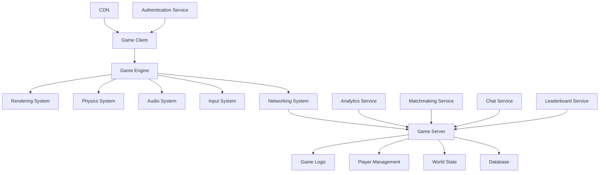

# Gaming Development Standards

**Version:** v1.0.0  
**Domain:** gaming  
**Type:** Technical  
**Risk Level:** MODERATE  
**Maturity Level:** Production  
**Author:** MCP Standards Team  
**Created:** 2025-07-07T23:26:02.248322  
**Last Updated:** 2025-07-07T23:26:02.248330  

## Purpose

Comprehensive standards for game development, performance optimization, and multi-platform deployment

This gaming standard defines the requirements, guidelines, and best practices for gaming development standards. It provides comprehensive guidance for game development, performance optimization, multiplayer systems, and player experience design while ensuring scalability, security, and cross-platform compatibility.

**Gaming Focus Areas:**
- **Game Architecture**: Scalable and modular game system design
- **Performance Optimization**: Frame rate, memory, and network optimization
- **Multiplayer Systems**: Real-time networking and synchronization
- **Player Experience**: UI/UX design and accessibility
- **Platform Integration**: Cross-platform development and deployment
- **Analytics**: Player behavior tracking and game telemetry

## Scope

This gaming standard applies to:
- Game engine development and customization
- Client-server game architecture design
- Multiplayer and networking systems
- Game performance optimization
- Player data management and analytics
- Cross-platform deployment and compatibility
- Game security and anti-cheat systems
- Player community and social features

## Implementation

### Gaming Requirements

**NIST Controls:** NIST-AC-1, AC-6, AU-2, AU-12, CM-2, CM-8, IA-2, IA-4, RA-3, RA-5, SA-3, SA-8, SC-7, SC-8, SI-3, SI-4

**Performance Standards:** 60 FPS minimum, <50ms network latency
**Platform Standards:** Cross-platform compatibility and unified codebase
**Security Standards:** Anti-cheat systems and secure player data handling

### Game Architecture Design

#### Game System Architecture


#### Game Engine Implementation
```python
# Example: Game engine core system
import pygame
import numpy as np
from typing import Dict, List, Any, Optional
from dataclasses import dataclass
from abc import ABC, abstractmethod
import time
import json
import threading
from collections import defaultdict

@dataclass
class Vector2D:
    x: float
    y: float
    
    def __add__(self, other):
        return Vector2D(self.x + other.x, self.y + other.y)
    
    def __sub__(self, other):
        return Vector2D(self.x - other.x, self.y - other.y)
    
    def __mul__(self, scalar):
        return Vector2D(self.x * scalar, self.y * scalar)
    
    def magnitude(self):
        return np.sqrt(self.x ** 2 + self.y ** 2)
    
    def normalize(self):
        mag = self.magnitude()
        if mag > 0:
            return Vector2D(self.x / mag, self.y / mag)
        return Vector2D(0, 0)

class GameObject:
    """Base game object class."""
    
    def __init__(self, object_id: str, position: Vector2D = Vector2D(0, 0)):
        self.object_id = object_id
        self.position = position
        self.velocity = Vector2D(0, 0)
        self.rotation = 0.0
        self.scale = Vector2D(1, 1)
        self.active = True
        self.components = {}
        
    def add_component(self, component_type: str, component):
        """Add a component to this game object."""
        self.components[component_type] = component
        component.game_object = self
        
    def get_component(self, component_type: str):
        """Get a component from this game object."""
        return self.components.get(component_type)
    
    def update(self, delta_time: float):
        """Update game object logic."""
        # Update position based on velocity
        self.position = self.position + (self.velocity * delta_time)
        
        # Update all components
        for component in self.components.values():
            component.update(delta_time)

class Component(ABC):
    """Base component class for entity-component system."""
    
    def __init__(self):
        self.game_object = None
    
    @abstractmethod
    def update(self, delta_time: float):
        """Update component logic."""
        pass

class RenderComponent(Component):
    """Component for rendering game objects."""
    
    def __init__(self, sprite_path: str, layer: int = 0):
        super().__init__()
        self.sprite_path = sprite_path
        self.layer = layer
        self.sprite = None
        self.visible = True
    
    def load_sprite(self):
        """Load sprite for rendering."""
        if self.sprite_path:
            self.sprite = pygame.image.load(self.sprite_path)
    
    def update(self, delta_time: float):
        """Update render component."""
        pass
    
    def render(self, screen, camera_offset: Vector2D = Vector2D(0, 0)):
        """Render the sprite to screen."""
        if self.sprite and self.visible and self.game_object:
            render_pos = self.game_object.position - camera_offset
            screen.blit(self.sprite, (render_pos.x, render_pos.y))

class PhysicsComponent(Component):
    """Component for physics simulation."""
    
    def __init__(self, mass: float = 1.0, friction: float = 0.1):
        super().__init__()
        self.mass = mass
        self.friction = friction
        self.force = Vector2D(0, 0)
        
    def apply_force(self, force: Vector2D):
        """Apply force to the object."""
        self.force = self.force + force
    
    def update(self, delta_time: float):
        """Update physics simulation."""
        if self.game_object:
            # Apply forces to velocity (F = ma)
            acceleration = self.force * (1.0 / self.mass)
            self.game_object.velocity = self.game_object.velocity + (acceleration * delta_time)
            
            # Apply friction
            friction_force = self.game_object.velocity * -self.friction
            self.game_object.velocity = self.game_object.velocity + (friction_force * delta_time)
            
            # Reset forces
            self.force = Vector2D(0, 0)

class InputComponent(Component):
    """Component for handling input."""
    
    def __init__(self):
        super().__init__()
        self.input_mappings = {}
        
    def bind_input(self, key, action):
        """Bind a key to an action."""
        self.input_mappings[key] = action
    
    def handle_input(self, keys_pressed):
        """Handle input events."""
        for key, action in self.input_mappings.items():
            if keys_pressed.get(key):
                action(self.game_object)
    
    def update(self, delta_time: float):
        """Update input component."""
        pass

class GameEngine:
    """Main game engine class."""
    
    def __init__(self, width: int = 1920, height: int = 1080, target_fps: int = 60):
        self.width = width
        self.height = height
        self.target_fps = target_fps
        self.running = False
        
        # Initialize pygame
        pygame.init()
        self.screen = pygame.display.set_mode((width, height))
        self.clock = pygame.time.Clock()
        
        # Game systems
        self.game_objects = {}
        self.render_system = RenderSystem()
        self.physics_system = PhysicsSystem()
        self.input_system = InputSystem()
        self.audio_system = AudioSystem()
        
        # Performance tracking
        self.frame_count = 0
        self.fps_counter = 0
        self.last_fps_update = time.time()
        
        # Game state
        self.camera_position = Vector2D(0, 0)
        
    def add_game_object(self, game_object: GameObject):
        """Add a game object to the engine."""
        self.game_objects[game_object.object_id] = game_object
        
        # Register with appropriate systems
        if game_object.get_component('render'):
            self.render_system.add_object(game_object)
        if game_object.get_component('physics'):
            self.physics_system.add_object(game_object)
        if game_object.get_component('input'):
            self.input_system.add_object(game_object)
    
    def remove_game_object(self, object_id: str):
        """Remove a game object from the engine."""
        if object_id in self.game_objects:
            game_object = self.game_objects[object_id]
            
            # Unregister from systems
            self.render_system.remove_object(game_object)
            self.physics_system.remove_object(game_object)
            self.input_system.remove_object(game_object)
            
            del self.game_objects[object_id]
    
    def run(self):
        """Main game loop."""
        self.running = True
        last_time = time.time()
        
        while self.running:
            current_time = time.time()
            delta_time = current_time - last_time
            last_time = current_time
            
            # Handle events
            for event in pygame.event.get():
                if event.type == pygame.QUIT:
                    self.running = False
            
            # Update systems
            self.input_system.update(delta_time)
            self.physics_system.update(delta_time)
            
            # Update game objects
            for game_object in self.game_objects.values():
                game_object.update(delta_time)
            
            # Render
            self.screen.fill((0, 0, 0))  # Clear screen
            self.render_system.render(self.screen, self.camera_position)
            
            # Update display
            pygame.display.flip()
            
            # Control frame rate
            self.clock.tick(self.target_fps)
            
            # Update FPS counter
            self._update_fps_counter()
        
        pygame.quit()
    
    def _update_fps_counter(self):
        """Update FPS counter."""
        self.frame_count += 1
        current_time = time.time()
        
        if current_time - self.last_fps_update >= 1.0:
            self.fps_counter = self.frame_count
            self.frame_count = 0
            self.last_fps_update = current_time
            pygame.display.set_caption(f"Game Engine - FPS: {self.fps_counter}")

class RenderSystem:
    """System for rendering game objects."""
    
    def __init__(self):
        self.render_objects = []
    
    def add_object(self, game_object: GameObject):
        """Add object to render system."""
        render_component = game_object.get_component('render')
        if render_component:
            render_component.load_sprite()
            self.render_objects.append(game_object)
    
    def remove_object(self, game_object: GameObject):
        """Remove object from render system."""
        if game_object in self.render_objects:
            self.render_objects.remove(game_object)
    
    def render(self, screen, camera_offset: Vector2D):
        """Render all objects."""
        # Sort by layer for proper rendering order
        sorted_objects = sorted(
            self.render_objects,
            key=lambda obj: obj.get_component('render').layer
        )
        
        for game_object in sorted_objects:
            render_component = game_object.get_component('render')
            if render_component:
                render_component.render(screen, camera_offset)

class PhysicsSystem:
    """System for physics simulation."""
    
    def __init__(self):
        self.physics_objects = []
    
    def add_object(self, game_object: GameObject):
        """Add object to physics system."""
        if game_object.get_component('physics'):
            self.physics_objects.append(game_object)
    
    def remove_object(self, game_object: GameObject):
        """Remove object from physics system."""
        if game_object in self.physics_objects:
            self.physics_objects.remove(game_object)
    
    def update(self, delta_time: float):
        """Update physics for all objects."""
        for game_object in self.physics_objects:
            physics_component = game_object.get_component('physics')
            if physics_component:
                physics_component.update(delta_time)
        
        # Check for collisions
        self._check_collisions()
    
    def _check_collisions(self):
        """Simple collision detection."""
        for i, obj1 in enumerate(self.physics_objects):
            for obj2 in self.physics_objects[i+1:]:
                if self._objects_collide(obj1, obj2):
                    self._handle_collision(obj1, obj2)
    
    def _objects_collide(self, obj1: GameObject, obj2: GameObject) -> bool:
        """Check if two objects collide (simplified)."""
        distance = (obj1.position - obj2.position).magnitude()
        return distance < 50  # Simple radius-based collision
    
    def _handle_collision(self, obj1: GameObject, obj2: GameObject):
        """Handle collision between two objects."""
        # Simple elastic collision
        physics1 = obj1.get_component('physics')
        physics2 = obj2.get_component('physics')
        
        if physics1 and physics2:
            # Swap velocities (simplified)
            temp_velocity = obj1.velocity
            obj1.velocity = obj2.velocity
            obj2.velocity = temp_velocity

class InputSystem:
    """System for handling input."""
    
    def __init__(self):
        self.input_objects = []
        
    def add_object(self, game_object: GameObject):
        """Add object to input system."""
        if game_object.get_component('input'):
            self.input_objects.append(game_object)
    
    def remove_object(self, game_object: GameObject):
        """Remove object from input system."""
        if game_object in self.input_objects:
            self.input_objects.remove(game_object)
    
    def update(self, delta_time: float):
        """Update input handling."""
        keys_pressed = pygame.key.get_pressed()
        
        for game_object in self.input_objects:
            input_component = game_object.get_component('input')
            if input_component:
                input_component.handle_input(keys_pressed)

class AudioSystem:
    """System for audio management."""
    
    def __init__(self):
        pygame.mixer.init()
        self.sounds = {}
        self.music = {}
        
    def load_sound(self, sound_id: str, file_path: str):
        """Load a sound effect."""
        self.sounds[sound_id] = pygame.mixer.Sound(file_path)
    
    def play_sound(self, sound_id: str, volume: float = 1.0):
        """Play a sound effect."""
        if sound_id in self.sounds:
            sound = self.sounds[sound_id]
            sound.set_volume(volume)
            sound.play()
    
    def load_music(self, music_id: str, file_path: str):
        """Load background music."""
        self.music[music_id] = file_path
    
    def play_music(self, music_id: str, loop: bool = True):
        """Play background music."""
        if music_id in self.music:
            pygame.mixer.music.load(self.music[music_id])
            pygame.mixer.music.play(-1 if loop else 0)

# Example usage
def create_player_object(engine: GameEngine):
    """Create a player game object."""
    player = GameObject("player", Vector2D(400, 300))
    
    # Add render component
    render_comp = RenderComponent("player_sprite.png", layer=1)
    player.add_component('render', render_comp)
    
    # Add physics component
    physics_comp = PhysicsComponent(mass=1.0, friction=0.5)
    player.add_component('physics', physics_comp)
    
    # Add input component
    input_comp = InputComponent()
    
    # Define movement actions
    def move_up(game_obj):
        physics = game_obj.get_component('physics')
        if physics:
            physics.apply_force(Vector2D(0, -500))
    
    def move_down(game_obj):
        physics = game_obj.get_component('physics')
        if physics:
            physics.apply_force(Vector2D(0, 500))
    
    def move_left(game_obj):
        physics = game_obj.get_component('physics')
        if physics:
            physics.apply_force(Vector2D(-500, 0))
    
    def move_right(game_obj):
        physics = game_obj.get_component('physics')
        if physics:
            physics.apply_force(Vector2D(500, 0))
    
    # Bind inputs
    input_comp.bind_input(pygame.K_UP, move_up)
    input_comp.bind_input(pygame.K_DOWN, move_down)
    input_comp.bind_input(pygame.K_LEFT, move_left)
    input_comp.bind_input(pygame.K_RIGHT, move_right)
    
    player.add_component('input', input_comp)
    
    engine.add_game_object(player)
    return player

def main():
    """Main game function."""
    engine = GameEngine(1280, 720, 60)
    
    # Create game objects
    player = create_player_object(engine)
    
    # Load audio
    # engine.audio_system.load_music("background", "background_music.mp3")
    # engine.audio_system.play_music("background")
    
    # Start game loop
    engine.run()

if __name__ == "__main__":
    main()
```

### Multiplayer and Networking

#### Network Architecture
```python
# Example: Multiplayer game networking
import asyncio
import websockets
import json
import time
from typing import Dict, List, Set
from dataclasses import dataclass, asdict
from enum import Enum

class MessageType(Enum):
    PLAYER_JOIN = "player_join"
    PLAYER_LEAVE = "player_leave"
    PLAYER_MOVE = "player_move"
    PLAYER_ACTION = "player_action"
    GAME_STATE = "game_state"
    PING = "ping"
    PONG = "pong"

@dataclass
class NetworkMessage:
    type: MessageType
    player_id: str
    timestamp: float
    data: Dict
    
    def to_json(self) -> str:
        return json.dumps({
            'type': self.type.value,
            'player_id': self.player_id,
            'timestamp': self.timestamp,
            'data': self.data
        })
    
    @classmethod
    def from_json(cls, json_str: str) -> 'NetworkMessage':
        data = json.loads(json_str)
        return cls(
            type=MessageType(data['type']),
            player_id=data['player_id'],
            timestamp=data['timestamp'],
            data=data['data']
        )

@dataclass
class Player:
    player_id: str
    position: Vector2D
    health: int = 100
    score: int = 0
    last_update: float = 0
    
    def to_dict(self) -> Dict:
        return {
            'player_id': self.player_id,
            'position': {'x': self.position.x, 'y': self.position.y},
            'health': self.health,
            'score': self.score,
            'last_update': self.last_update
        }

class GameServer:
    """Authoritative game server for multiplayer games."""
    
    def __init__(self, host: str = "localhost", port: int = 8765):
        self.host = host
        self.port = port
        self.players: Dict[str, Player] = {}
        self.connections: Dict[str, websockets.WebSocketServerProtocol] = {}
        self.game_state = {
            'match_id': 'match_001',
            'status': 'waiting',
            'start_time': None,
            'world_objects': []
        }
        
        # Network optimization
        self.tick_rate = 60  # Server updates per second
        self.update_interval = 1.0 / self.tick_rate
        self.last_tick = time.time()
        
        # Anti-cheat measures
        self.max_speed = 500  # Max player speed
        self.max_position_delta = 100  # Max position change per update
        
    async def start_server(self):
        """Start the game server."""
        print(f"Starting game server on {self.host}:{self.port}")
        
        # Start server tick loop
        asyncio.create_task(self.game_tick_loop())
        
        # Start WebSocket server
        async with websockets.serve(self.handle_client, self.host, self.port):
            print("Game server is running...")
            await asyncio.Future()  # Run forever
    
    async def handle_client(self, websocket, path):
        """Handle new client connection."""
        player_id = None
        
        try:
            async for message in websocket:
                try:
                    net_message = NetworkMessage.from_json(message)
                    
                    if net_message.type == MessageType.PLAYER_JOIN:
                        player_id = await self.handle_player_join(websocket, net_message)
                    elif net_message.type == MessageType.PLAYER_MOVE:
                        await self.handle_player_move(net_message)
                    elif net_message.type == MessageType.PLAYER_ACTION:
                        await self.handle_player_action(net_message)
                    elif net_message.type == MessageType.PING:
                        await self.handle_ping(websocket, net_message)
                        
                except json.JSONDecodeError:
                    print(f"Invalid JSON received from {player_id or 'unknown'}")
                except Exception as e:
                    print(f"Error handling message: {e}")
                    
        except websockets.exceptions.ConnectionClosed:
            print(f"Player {player_id or 'unknown'} disconnected")
        finally:
            if player_id:
                await self.handle_player_leave(player_id)
    
    async def handle_player_join(self, websocket, message: NetworkMessage) -> str:
        """Handle player joining the game."""
        player_id = message.player_id
        
        # Create new player
        player = Player(
            player_id=player_id,
            position=Vector2D(400, 300),  # Spawn position
            last_update=time.time()
        )
        
        self.players[player_id] = player
        self.connections[player_id] = websocket
        
        print(f"Player {player_id} joined the game")
        
        # Send welcome message
        welcome_message = NetworkMessage(
            type=MessageType.GAME_STATE,
            player_id="server",
            timestamp=time.time(),
            data={
                'game_state': self.game_state,
                'your_player': player.to_dict(),
                'all_players': {pid: p.to_dict() for pid, p in self.players.items()}
            }
        )
        
        await websocket.send(welcome_message.to_json())
        
        # Notify other players
        await self.broadcast_message(
            MessageType.PLAYER_JOIN,
            "server",
            {'new_player': player.to_dict()},
            exclude=player_id
        )
        
        return player_id
    
    async def handle_player_leave(self, player_id: str):
        """Handle player leaving the game."""
        if player_id in self.players:
            del self.players[player_id]
        
        if player_id in self.connections:
            del self.connections[player_id]
        
        # Notify other players
        await self.broadcast_message(
            MessageType.PLAYER_LEAVE,
            "server",
            {'player_id': player_id}
        )
        
        print(f"Player {player_id} left the game")
    
    async def handle_player_move(self, message: NetworkMessage):
        """Handle player movement with validation."""
        player_id = message.player_id
        
        if player_id not in self.players:
            return
        
        player = self.players[player_id]
        move_data = message.data
        
        # Extract new position
        new_position = Vector2D(
            move_data['position']['x'],
            move_data['position']['y']
        )
        
        # Anti-cheat validation
        current_time = time.time()
        time_delta = current_time - player.last_update
        
        if time_delta > 0:
            # Calculate maximum allowed movement
            max_distance = self.max_speed * time_delta
            actual_distance = (new_position - player.position).magnitude()
            
            if actual_distance > max_distance:
                print(f"Player {player_id} attempted invalid movement: {actual_distance} > {max_distance}")
                # Reject movement, send correction
                await self.send_position_correction(player_id, player.position)
                return
        
        # Update player position
        player.position = new_position
        player.last_update = current_time
        
        # Broadcast to other players (with lag compensation)
        await self.broadcast_message(
            MessageType.PLAYER_MOVE,
            player_id,
            {
                'position': {'x': new_position.x, 'y': new_position.y},
                'timestamp': message.timestamp
            },
            exclude=player_id
        )
    
    async def handle_player_action(self, message: NetworkMessage):
        """Handle player actions (shooting, abilities, etc.)."""
        player_id = message.player_id
        action_data = message.data
        
        if player_id not in self.players:
            return
        
        action_type = action_data.get('action_type')
        
        if action_type == 'shoot':
            await self.handle_shoot_action(player_id, action_data)
        elif action_type == 'ability':
            await self.handle_ability_action(player_id, action_data)
    
    async def handle_shoot_action(self, player_id: str, action_data: Dict):
        """Handle shooting action."""
        player = self.players[player_id]
        
        # Validate shot (rate limiting, ammo, etc.)
        # ... validation logic ...
        
        # Broadcast shot to all players
        await self.broadcast_message(
            MessageType.PLAYER_ACTION,
            player_id,
            {
                'action_type': 'shoot',
                'origin': {'x': player.position.x, 'y': player.position.y},
                'direction': action_data.get('direction'),
                'timestamp': time.time()
            }
        )
    
    async def handle_ping(self, websocket, message: NetworkMessage):
        """Handle ping message for latency measurement."""
        pong_message = NetworkMessage(
            type=MessageType.PONG,
            player_id="server",
            timestamp=time.time(),
            data={'client_timestamp': message.timestamp}
        )
        
        await websocket.send(pong_message.to_json())
    
    async def send_position_correction(self, player_id: str, correct_position: Vector2D):
        """Send position correction to a player."""
        if player_id in self.connections:
            correction_message = NetworkMessage(
                type=MessageType.PLAYER_MOVE,
                player_id="server",
                timestamp=time.time(),
                data={
                    'correction': True,
                    'position': {'x': correct_position.x, 'y': correct_position.y}
                }
            )
            
            await self.connections[player_id].send(correction_message.to_json())
    
    async def broadcast_message(
        self,
        message_type: MessageType,
        sender_id: str,
        data: Dict,
        exclude: str = None
    ):
        """Broadcast message to all connected players."""
        message = NetworkMessage(
            type=message_type,
            player_id=sender_id,
            timestamp=time.time(),
            data=data
        )
        
        disconnected_players = []
        
        for player_id, websocket in self.connections.items():
            if player_id != exclude:
                try:
                    await websocket.send(message.to_json())
                except websockets.exceptions.ConnectionClosed:
                    disconnected_players.append(player_id)
        
        # Clean up disconnected players
        for player_id in disconnected_players:
            await self.handle_player_leave(player_id)
    
    async def game_tick_loop(self):
        """Main game tick loop for server-side simulation."""
        while True:
            current_time = time.time()
            delta_time = current_time - self.last_tick
            
            if delta_time >= self.update_interval:
                await self.update_game_state(delta_time)
                self.last_tick = current_time
            
            await asyncio.sleep(0.001)  # Small sleep to prevent busy waiting
    
    async def update_game_state(self, delta_time: float):
        """Update server-side game state."""
        # Update world objects, game logic, etc.
        # Send periodic state updates to clients
        
        # Example: Send game state every 10 ticks
        if int(time.time() * self.tick_rate) % 10 == 0:
            await self.broadcast_game_state()
    
    async def broadcast_game_state(self):
        """Broadcast current game state to all players."""
        state_data = {
            'game_state': self.game_state,
            'players': {pid: player.to_dict() for pid, player in self.players.items()},
            'timestamp': time.time()
        }
        
        await self.broadcast_message(
            MessageType.GAME_STATE,
            "server",
            state_data
        )

# Client-side networking
class GameClient:
    """Game client for multiplayer connectivity."""
    
    def __init__(self, player_id: str):
        self.player_id = player_id
        self.websocket = None
        self.connected = False
        self.latency = 0
        self.last_ping = 0
        
        # Client-side prediction
        self.local_player_state = None
        self.server_player_state = None
        
    async def connect(self, server_uri: str):
        """Connect to game server."""
        try:
            self.websocket = await websockets.connect(server_uri)
            self.connected = True
            
            # Send join message
            join_message = NetworkMessage(
                type=MessageType.PLAYER_JOIN,
                player_id=self.player_id,
                timestamp=time.time(),
                data={'username': self.player_id}
            )
            
            await self.websocket.send(join_message.to_json())
            
            # Start message handling
            asyncio.create_task(self.handle_messages())
            asyncio.create_task(self.ping_loop())
            
            print(f"Connected to server as {self.player_id}")
            
        except Exception as e:
            print(f"Failed to connect: {e}")
            self.connected = False
    
    async def handle_messages(self):
        """Handle incoming messages from server."""
        try:
            async for message in self.websocket:
                net_message = NetworkMessage.from_json(message)
                
                if net_message.type == MessageType.GAME_STATE:
                    self.handle_game_state(net_message)
                elif net_message.type == MessageType.PLAYER_MOVE:
                    self.handle_player_move(net_message)
                elif net_message.type == MessageType.PONG:
                    self.handle_pong(net_message)
                    
        except websockets.exceptions.ConnectionClosed:
            print("Connection to server lost")
            self.connected = False
    
    async def send_move(self, position: Vector2D):
        """Send player movement to server."""
        if not self.connected:
            return
        
        move_message = NetworkMessage(
            type=MessageType.PLAYER_MOVE,
            player_id=self.player_id,
            timestamp=time.time(),
            data={'position': {'x': position.x, 'y': position.y}}
        )
        
        await self.websocket.send(move_message.to_json())
    
    async def ping_loop(self):
        """Send periodic ping messages for latency measurement."""
        while self.connected:
            ping_message = NetworkMessage(
                type=MessageType.PING,
                player_id=self.player_id,
                timestamp=time.time(),
                data={}
            )
            
            self.last_ping = time.time()
            await self.websocket.send(ping_message.to_json())
            await asyncio.sleep(5)  # Ping every 5 seconds
    
    def handle_pong(self, message: NetworkMessage):
        """Handle pong response for latency calculation."""
        current_time = time.time()
        client_timestamp = message.data['client_timestamp']
        self.latency = (current_time - client_timestamp) * 1000  # Convert to ms
        print(f"Latency: {self.latency:.2f}ms")

# Usage example
async def run_server():
    server = GameServer("localhost", 8765)
    await server.start_server()

async def run_client(player_id: str):
    client = GameClient(player_id)
    await client.connect("ws://localhost:8765")
    
    # Keep client running
    while client.connected:
        await asyncio.sleep(1)

if __name__ == "__main__":
    # Run server
    asyncio.run(run_server())
```

### Performance Optimization

#### Game Performance Profiler
```python
# Example: Game performance profiler
import time
import functools
import cProfile
import pstats
from typing import Dict, List, Callable
from collections import defaultdict, deque
import threading
import psutil
import tracemalloc

class GameProfiler:
    """Comprehensive game performance profiler."""
    
    def __init__(self):
        self.frame_times = deque(maxlen=1000)  # Last 1000 frames
        self.function_times = defaultdict(list)
        self.memory_snapshots = deque(maxlen=100)
        self.gpu_metrics = deque(maxlen=100)
        
        # Performance targets
        self.target_fps = 60
        self.target_frame_time = 1000.0 / self.target_fps  # ms
        
        # Profiling state
        self.profiling_enabled = False
        self.profiler = None
        
        # Memory tracking
        tracemalloc.start()
        
    def profile_function(self, func: Callable):
        """Decorator to profile function execution time."""
        @functools.wraps(func)
        def wrapper(*args, **kwargs):
            start_time = time.perf_counter()
            result = func(*args, **kwargs)
            end_time = time.perf_counter()
            
            execution_time = (end_time - start_time) * 1000  # Convert to ms
            self.function_times[func.__name__].append(execution_time)
            
            return result
        return wrapper
    
    def start_frame(self):
        """Mark the start of a frame."""
        self.frame_start_time = time.perf_counter()
    
    def end_frame(self):
        """Mark the end of a frame and record timing."""
        frame_end_time = time.perf_counter()
        frame_time = (frame_end_time - self.frame_start_time) * 1000  # ms
        self.frame_times.append(frame_time)
        
        # Check for performance issues
        if frame_time > self.target_frame_time * 1.5:  # 50% over target
            self.detect_performance_bottlenecks()
    
    def start_profiling(self):
        """Start detailed CPU profiling."""
        self.profiler = cProfile.Profile()
        self.profiler.enable()
        self.profiling_enabled = True
    
    def stop_profiling(self, output_file: str = "game_profile.prof"):
        """Stop profiling and save results."""
        if self.profiler:
            self.profiler.disable()
            self.profiler.dump_stats(output_file)
            self.profiling_enabled = False
            
            # Generate readable report
            stats = pstats.Stats(output_file)
            stats.sort_stats('cumulative')
            stats.print_stats(20)  # Top 20 functions
    
    def capture_memory_snapshot(self):
        """Capture current memory usage."""
        current, peak = tracemalloc.get_traced_memory()
        process = psutil.Process()
        
        memory_info = {
            'timestamp': time.time(),
            'traced_current': current / 1024 / 1024,  # MB
            'traced_peak': peak / 1024 / 1024,  # MB
            'process_memory': process.memory_info().rss / 1024 / 1024,  # MB
            'process_percent': process.memory_percent()
        }
        
        self.memory_snapshots.append(memory_info)
    
    def get_performance_report(self) -> Dict:
        """Generate comprehensive performance report."""
        if not self.frame_times:
            return {"error": "No performance data available"}
        
        frame_times_list = list(self.frame_times)
        
        # Frame rate statistics
        avg_frame_time = sum(frame_times_list) / len(frame_times_list)
        avg_fps = 1000.0 / avg_frame_time if avg_frame_time > 0 else 0
        min_frame_time = min(frame_times_list)
        max_frame_time = max(frame_times_list)
        
        # Performance percentiles
        sorted_times = sorted(frame_times_list)
        p95_frame_time = sorted_times[int(len(sorted_times) * 0.95)]
        p99_frame_time = sorted_times[int(len(sorted_times) * 0.99)]
        
        # Function performance
        function_stats = {}
        for func_name, times in self.function_times.items():
            if times:
                function_stats[func_name] = {
                    'avg_time': sum(times) / len(times),
                    'max_time': max(times),
                    'call_count': len(times),
                    'total_time': sum(times)
                }
        
        # Memory statistics
        memory_stats = {}
        if self.memory_snapshots:
            latest_memory = self.memory_snapshots[-1]
            memory_stats = {
                'current_usage_mb': latest_memory['process_memory'],
                'memory_percent': latest_memory['process_percent'],
                'peak_traced_mb': latest_memory['traced_peak']
            }
        
        return {
            'frame_stats': {
                'avg_fps': avg_fps,
                'avg_frame_time_ms': avg_frame_time,
                'min_frame_time_ms': min_frame_time,
                'max_frame_time_ms': max_frame_time,
                'p95_frame_time_ms': p95_frame_time,
                'p99_frame_time_ms': p99_frame_time,
                'frames_analyzed': len(frame_times_list)
            },
            'function_stats': function_stats,
            'memory_stats': memory_stats,
            'performance_issues': self.detect_performance_issues(frame_times_list)
        }
    
    def detect_performance_issues(self, frame_times: List[float]) -> List[str]:
        """Detect potential performance issues."""
        issues = []
        
        avg_frame_time = sum(frame_times) / len(frame_times)
        
        if avg_frame_time > self.target_frame_time * 1.2:
            issues.append(f"Average frame time ({avg_frame_time:.2f}ms) exceeds target ({self.target_frame_time:.2f}ms)")
        
        # Check for frame time spikes
        spikes = [t for t in frame_times if t > self.target_frame_time * 2]
        if len(spikes) > len(frame_times) * 0.05:  # More than 5% of frames
            issues.append(f"Frequent frame time spikes detected ({len(spikes)} spikes)")
        
        # Check memory usage
        if self.memory_snapshots:
            latest_memory = self.memory_snapshots[-1]
            if latest_memory['memory_percent'] > 80:
                issues.append(f"High memory usage ({latest_memory['memory_percent']:.1f}%)")
        
        return issues
    
    def detect_performance_bottlenecks(self):
        """Detect specific performance bottlenecks."""
        # Analyze function performance
        bottlenecks = []
        
        for func_name, times in self.function_times.items():
            if times:
                avg_time = sum(times) / len(times)
                if avg_time > 5.0:  # Functions taking more than 5ms
                    bottlenecks.append(f"Function '{func_name}' averaging {avg_time:.2f}ms")
        
        if bottlenecks:
            print("Performance bottlenecks detected:")
            for bottleneck in bottlenecks:
                print(f"  - {bottleneck}")

# Usage in game loop
def optimized_game_loop():
    """Example of profiled game loop."""
    profiler = GameProfiler()
    
    # Mock game objects and systems
    class MockGameSystem:
        @profiler.profile_function
        def update(self, delta_time):
            # Simulate some work
            time.sleep(0.001)
        
        @profiler.profile_function
        def render(self):
            # Simulate rendering work
            time.sleep(0.005)
    
    game_system = MockGameSystem()
    
    # Game loop
    for frame in range(1000):  # 1000 frames
        profiler.start_frame()
        
        # Update game systems
        game_system.update(0.016)  # 60 FPS delta time
        game_system.render()
        
        # Capture memory snapshot every 100 frames
        if frame % 100 == 0:
            profiler.capture_memory_snapshot()
        
        profiler.end_frame()
        
        # Simulate frame timing
        time.sleep(0.010)  # Simulate some frame work
    
    # Generate performance report
    report = profiler.get_performance_report()
    print("Performance Report:")
    print(f"Average FPS: {report['frame_stats']['avg_fps']:.2f}")
    print(f"Average Frame Time: {report['frame_stats']['avg_frame_time_ms']:.2f}ms")
    
    if report['performance_issues']:
        print("Issues detected:")
        for issue in report['performance_issues']:
            print(f"  - {issue}")

if __name__ == "__main__":
    optimized_game_loop()
```

## Compliance

### Regulatory Requirements

- **GDPR**: Compliance with GDPR requirements
- **CCPA**: Compliance with CCPA requirements
- **COPPA**: Compliance with COPPA requirements
- **ESRB**: Compliance with ESRB requirements
- **PEGI**: Compliance with PEGI requirements
- **PCI DSS**: Compliance with PCI DSS requirements

### Risk Management

- **Risk Level**: Moderate Impact
- **Risk Assessment**: Regular risk assessments required
- **Mitigation Strategies**: Implement appropriate controls

### Audit Requirements

- Regular compliance audits
- Documentation review
- Control effectiveness testing

## Monitoring and Measurement

### Gaming System Monitoring

#### Game Analytics and Telemetry
```python
# Example: Game analytics and player behavior tracking
class GameAnalytics:
    def __init__(self):
        self.player_sessions = {}
        self.game_events = []
        self.performance_metrics = {}
    
    def track_player_session(self, player_id: str, session_data: Dict):
        """Track player session data."""
        self.player_sessions[player_id] = {
            'session_start': time.time(),
            'level_progression': session_data.get('levels_completed', 0),
            'playtime_minutes': session_data.get('playtime', 0),
            'achievements_unlocked': session_data.get('achievements', []),
            'in_app_purchases': session_data.get('purchases', [])
        }
    
    def track_game_event(self, event_type: str, player_id: str, event_data: Dict):
        """Track specific game events."""
        event = {
            'timestamp': time.time(),
            'event_type': event_type,
            'player_id': player_id,
            'data': event_data
        }
        self.game_events.append(event)
    
    def generate_player_behavior_report(self):
        """Generate player behavior analytics report."""
        # Analyze player retention, engagement, monetization
        return {
            'total_players': len(self.player_sessions),
            'avg_session_length': self.calculate_avg_session_length(),
            'retention_rates': self.calculate_retention_rates(),
            'popular_features': self.analyze_feature_usage()
        }

# Real-time performance monitoring
class GamePerformanceMonitor:
    def __init__(self):
        self.fps_history = deque(maxlen=3600)  # 1 minute at 60 FPS
        self.network_latency = deque(maxlen=100)
        self.error_count = 0
    
    def monitor_frame_rate(self, fps: float):
        """Monitor game frame rate."""
        self.fps_history.append(fps)
        
        # Alert on performance drops
        if fps < 30:
            self.alert_performance_issue("Low FPS", fps)
    
    def monitor_network_latency(self, latency_ms: float):
        """Monitor network latency."""
        self.network_latency.append(latency_ms)
        
        # Alert on high latency
        if latency_ms > 150:
            self.alert_performance_issue("High Latency", latency_ms)
    
    def alert_performance_issue(self, issue_type: str, value: float):
        """Alert on performance issues."""
        print(f"Performance Alert: {issue_type} - {value}")
```

## Responsibilities

### Standard Owner
- Maintain standard documentation
- Approve changes and updates
- Ensure compliance monitoring

### Implementation Teams
- Follow standard requirements
- Report compliance issues
- Maintain documentation

### Audit Teams
- Conduct compliance reviews
- Validate implementation
- Report findings and recommendations

## References

### Gaming Development References

#### Game Engines and Frameworks
- **Unity**: Popular game engine for 2D and 3D games
- **Unreal Engine**: High-end game engine with advanced graphics
- **Godot**: Open-source game engine
- **Pygame**: Python game development framework
- **Three.js**: JavaScript 3D library for web games

#### Game Networking
- **Mirror Networking**: Unity networking solution
- **Photon**: Multiplayer game networking platform
- **Socket.IO**: Real-time web communication
- **WebRTC**: Peer-to-peer communication for browsers

#### Performance Optimization
- **GPU Profiling**: Tools for graphics performance analysis
- **Memory Management**: Techniques for efficient memory usage
- **Asset Optimization**: Methods for reducing asset sizes
- **Level-of-Detail (LOD)**: Techniques for performance scaling

#### Game Analytics
- **Unity Analytics**: Built-in analytics for Unity games
- **GameAnalytics**: Cross-platform game analytics
- **Firebase Analytics**: Google's analytics platform
- **Custom Telemetry**: Building custom analytics systems

#### Platform-Specific Development
- **Steam SDK**: Steam platform integration
- **Console Development**: PlayStation, Xbox, Nintendo Switch
- **Mobile Gaming**: iOS and Android optimization
- **Web Games**: Browser-based game development

#### Game Design Patterns
- **Entity-Component-System (ECS)**: Modular game architecture
- **State Machines**: Game state management
- **Observer Pattern**: Event-driven game systems
- **Object Pooling**: Memory management for game objects

## Appendix

### Glossary

**Standard**: A documented agreement containing technical specifications or criteria to be used consistently.

**Compliance**: The act of conforming to rules, regulations, or standards.

**Risk**: The potential for loss, damage, or destruction of an asset as a result of a threat.

### Change History

| Version | Date | Changes | Author |
|---------|------|---------|---------|
| 1.0.0 | 2025-07-07T23:26:02.248330 | Initial version | MCP Standards Team |

### Review and Approval

- **Review Status**: Draft
- **Reviewers**: 
- **Approval Date**: Pending

---

*This document is part of the gaming standards framework and is subject to regular review and updates.*