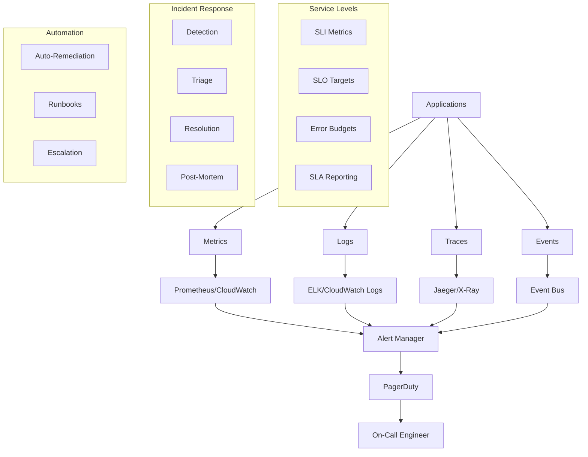

# Monitoring and Incident Response Standards

**Version:** v1.0.0  
**Domain:** operations  
**Type:** Technical  
**Risk Level:** CRITICAL  
**Maturity Level:** Production  
**Author:** MCP Standards Team  
**Created:** 2025-07-08T12:00:00.000000  
**Last Updated:** 2025-07-08T12:00:00.000000  

## Purpose

Comprehensive standards for monitoring, alerting, and incident response, including SLI/SLO/SLA definitions, monitoring architecture, alert design, incident classification, and post-mortem processes

This monitoring and incident response standard defines the requirements, guidelines, and best practices for implementing effective monitoring systems and responding to incidents. It provides comprehensive guidance for defining service level objectives, designing monitoring architectures, creating effective alerts, classifying incidents, managing on-call rotations, and conducting thorough post-mortems while ensuring rapid detection, response, and continuous improvement.

**Monitoring and Incident Response Focus Areas:**
- **SLI/SLO/SLA Management**: Service level definitions and tracking
- **Monitoring Architecture**: Metrics, logs, traces, and synthetic monitoring
- **Alert Engineering**: Alert design, routing, and noise reduction
- **Incident Classification**: Severity levels and response procedures
- **On-Call Management**: Rotation schedules and escalation paths
- **Post-Mortem Process**: Learning from incidents and preventing recurrence
- **Runbook Automation**: Automated response and remediation

## Scope

This monitoring and incident response standard applies to:
- Service level indicator definition and measurement
- Monitoring system architecture and implementation
- Alert design and management
- Incident detection and classification
- On-call procedures and tooling
- Incident response workflows
- Post-mortem processes and documentation
- Runbook creation and automation
- Communication during incidents

## Implementation

### Monitoring Requirements

**NIST Controls:** NIST-SI-4, SI-5, SI-6, AU-2, AU-3, AU-4, AU-5, AU-6, AU-12, CA-7, IR-4, IR-5, IR-6, IR-8, CP-2, SA-15

**Monitoring Standards:** OpenTelemetry, Prometheus, ELK Stack, CloudWatch
**Incident Standards:** ITIL, PagerDuty incident response, Jira Service Management
**Communication Standards:** Slack incident channels, status pages, stakeholder updates

### Monitoring Architecture

#### Comprehensive Monitoring Stack


#### Monitoring Implementation
```python
# Example: Comprehensive monitoring and incident response framework
import time
import asyncio
import logging
from datetime import datetime, timedelta
from typing import List, Dict, Any, Optional, Callable, Tuple
from dataclasses import dataclass, field
from enum import Enum
import prometheus_client
from prometheus_client import Counter, Histogram, Gauge, Summary
import structlog

# Configure structured logging
structlog.configure(
    processors=[
        structlog.stdlib.filter_by_level,
        structlog.stdlib.add_logger_name,
        structlog.stdlib.add_log_level,
        structlog.stdlib.PositionalArgumentsFormatter(),
        structlog.processors.TimeStamper(fmt="iso"),
        structlog.processors.StackInfoRenderer(),
        structlog.processors.format_exc_info,
        structlog.processors.UnicodeDecoder(),
        structlog.processors.JSONRenderer()
    ],
    context_class=dict,
    logger_factory=structlog.stdlib.LoggerFactory(),
    cache_logger_on_first_use=True,
)

logger = structlog.get_logger()

# Metrics definitions
request_count = Counter('http_requests_total', 'Total HTTP requests', ['method', 'endpoint', 'status'])
request_duration = Histogram('http_request_duration_seconds', 'HTTP request duration', ['method', 'endpoint'])
error_count = Counter('errors_total', 'Total errors', ['service', 'error_type'])
active_connections = Gauge('active_connections', 'Number of active connections')
cpu_usage = Gauge('cpu_usage_percent', 'CPU usage percentage')
memory_usage = Gauge('memory_usage_bytes', 'Memory usage in bytes')

class Severity(Enum):
    """Incident severity levels"""
    SEV1 = "CRITICAL"  # Complete service outage
    SEV2 = "HIGH"      # Major functionality impaired
    SEV3 = "MEDIUM"    # Minor functionality impaired
    SEV4 = "LOW"       # Minimal impact
    SEV5 = "INFO"      # Informational only

class IncidentStatus(Enum):
    """Incident lifecycle status"""
    DETECTED = "DETECTED"
    ACKNOWLEDGED = "ACKNOWLEDGED"
    INVESTIGATING = "INVESTIGATING"
    IDENTIFIED = "IDENTIFIED"
    FIXING = "FIXING"
    MONITORING = "MONITORING"
    RESOLVED = "RESOLVED"
    POST_MORTEM = "POST_MORTEM"

@dataclass
class SLI:
    """Service Level Indicator definition"""
    name: str
    description: str
    measurement: Callable[[], float]
    unit: str = "percent"
    
    def measure(self) -> float:
        """Get current SLI value"""
        return self.measurement()

@dataclass
class SLO:
    """Service Level Objective definition"""
    sli: SLI
    target: float
    window: timedelta
    error_budget: Optional[float] = None
    
    def __post_init__(self):
        if self.error_budget is None:
            self.error_budget = 100.0 - self.target
    
    def is_met(self) -> bool:
        """Check if SLO is currently met"""
        current = self.sli.measure()
        return current >= self.target
    
    def error_budget_consumed(self, measurement_window: timedelta) -> float:
        """Calculate error budget consumption"""
        current = self.sli.measure()
        if current >= self.target:
            return 0.0
        
        # Calculate percentage of error budget consumed
        budget_used = (self.target - current) / self.error_budget * 100
        return min(budget_used, 100.0)

@dataclass
class Alert:
    """Alert definition"""
    name: str
    condition: Callable[[], bool]
    severity: Severity
    service: str
    runbook_url: str
    description: str
    cooldown: timedelta = field(default_factory=lambda: timedelta(minutes=5))
    last_fired: Optional[datetime] = None
    
    def should_fire(self) -> bool:
        """Check if alert should fire"""
        # Check cooldown period
        if self.last_fired:
            if datetime.utcnow() - self.last_fired < self.cooldown:
                return False
        
        # Check alert condition
        return self.condition()
    
    def fire(self):
        """Fire the alert"""
        self.last_fired = datetime.utcnow()
        logger.warning(
            "Alert fired",
            alert_name=self.name,
            severity=self.severity.value,
            service=self.service,
            runbook_url=self.runbook_url
        )

@dataclass
class Incident:
    """Incident record"""
    id: str
    title: str
    description: str
    severity: Severity
    status: IncidentStatus
    service: str
    detected_at: datetime
    acknowledged_at: Optional[datetime] = None
    resolved_at: Optional[datetime] = None
    responders: List[str] = field(default_factory=list)
    timeline: List[Dict[str, Any]] = field(default_factory=list)
    root_cause: Optional[str] = None
    action_items: List[str] = field(default_factory=list)
    
    def add_timeline_event(self, event: str, details: Optional[Dict[str, Any]] = None):
        """Add event to incident timeline"""
        self.timeline.append({
            "timestamp": datetime.utcnow().isoformat(),
            "event": event,
            "details": details or {}
        })
    
    def acknowledge(self, responder: str):
        """Acknowledge incident"""
        self.acknowledged_at = datetime.utcnow()
        self.status = IncidentStatus.ACKNOWLEDGED
        self.responders.append(responder)
        self.add_timeline_event(f"Incident acknowledged by {responder}")
    
    def resolve(self, resolution: str):
        """Resolve incident"""
        self.resolved_at = datetime.utcnow()
        self.status = IncidentStatus.RESOLVED
        self.add_timeline_event("Incident resolved", {"resolution": resolution})
    
    def time_to_acknowledge(self) -> Optional[timedelta]:
        """Calculate time to acknowledge"""
        if self.acknowledged_at:
            return self.acknowledged_at - self.detected_at
        return None
    
    def time_to_resolve(self) -> Optional[timedelta]:
        """Calculate time to resolve"""
        if self.resolved_at:
            return self.resolved_at - self.detected_at
        return None

class MonitoringSystem:
    """Comprehensive monitoring system"""
    
    def __init__(self):
        self.slis: Dict[str, SLI] = {}
        self.slos: Dict[str, SLO] = {}
        self.alerts: Dict[str, Alert] = {}
        self.incidents: Dict[str, Incident] = {}
        self.runbooks: Dict[str, Dict[str, Any]] = {}
        
    def register_sli(self, sli: SLI):
        """Register a new SLI"""
        self.slis[sli.name] = sli
        logger.info("SLI registered", sli_name=sli.name)
    
    def register_slo(self, slo: SLO):
        """Register a new SLO"""
        self.slos[slo.sli.name] = slo
        logger.info(
            "SLO registered",
            slo_name=slo.sli.name,
            target=slo.target,
            window=str(slo.window)
        )
    
    def register_alert(self, alert: Alert):
        """Register a new alert"""
        self.alerts[alert.name] = alert
        logger.info("Alert registered", alert_name=alert.name)
    
    def check_alerts(self):
        """Check all alerts and fire if necessary"""
        for alert in self.alerts.values():
            if alert.should_fire():
                alert.fire()
                # Create incident if high severity
                if alert.severity in [Severity.SEV1, Severity.SEV2]:
                    self.create_incident(
                        title=f"Alert: {alert.name}",
                        description=alert.description,
                        severity=alert.severity,
                        service=alert.service
                    )
    
    def create_incident(self, title: str, description: str, 
                       severity: Severity, service: str) -> Incident:
        """Create a new incident"""
        incident_id = f"INC-{int(time.time())}"
        incident = Incident(
            id=incident_id,
            title=title,
            description=description,
            severity=severity,
            status=IncidentStatus.DETECTED,
            service=service,
            detected_at=datetime.utcnow()
        )
        
        self.incidents[incident_id] = incident
        incident.add_timeline_event("Incident created")
        
        logger.error(
            "Incident created",
            incident_id=incident_id,
            severity=severity.value,
            service=service
        )
        
        # Trigger notifications
        self._notify_incident(incident)
        
        return incident
    
    def _notify_incident(self, incident: Incident):
        """Send incident notifications"""
        # This would integrate with PagerDuty, Slack, etc.
        logger.info(
            "Incident notification sent",
            incident_id=incident.id,
            channels=["pagerduty", "slack", "email"]
        )
    
    def generate_slo_report(self) -> Dict[str, Any]:
        """Generate SLO compliance report"""
        report = {
            "timestamp": datetime.utcnow().isoformat(),
            "slos": {}
        }
        
        for name, slo in self.slos.items():
            current_value = slo.sli.measure()
            is_met = slo.is_met()
            error_budget_consumed = slo.error_budget_consumed(slo.window)
            
            report["slos"][name] = {
                "current_value": current_value,
                "target": slo.target,
                "is_met": is_met,
                "error_budget_consumed": error_budget_consumed,
                "window": str(slo.window)
            }
        
        return report

class IncidentResponseAutomation:
    """Automated incident response system"""
    
    def __init__(self, monitoring: MonitoringSystem):
        self.monitoring = monitoring
        self.remediation_actions: Dict[str, Callable] = {}
        
    def register_remediation(self, pattern: str, action: Callable):
        """Register automated remediation action"""
        self.remediation_actions[pattern] = action
    
    async def auto_remediate(self, incident: Incident) -> bool:
        """Attempt automatic remediation"""
        for pattern, action in self.remediation_actions.items():
            if pattern in incident.title or pattern in incident.description:
                try:
                    logger.info(
                        "Attempting auto-remediation",
                        incident_id=incident.id,
                        pattern=pattern
                    )
                    
                    # Execute remediation
                    success = await action(incident)
                    
                    if success:
                        incident.add_timeline_event(
                            "Auto-remediation successful",
                            {"pattern": pattern}
                        )
                        return True
                    
                except Exception as e:
                    logger.error(
                        "Auto-remediation failed",
                        incident_id=incident.id,
                        error=str(e)
                    )
        
        return False

class PostMortemTemplate:
    """Post-mortem documentation template"""
    
    @staticmethod
    def generate(incident: Incident) -> str:
        """Generate post-mortem document"""
        template = f"""
# Post-Mortem: {incident.title}

## Incident Summary
- **Incident ID**: {incident.id}
- **Date**: {incident.detected_at.strftime('%Y-%m-%d')}
- **Severity**: {incident.severity.value}
- **Service**: {incident.service}
- **Duration**: {incident.time_to_resolve() if incident.resolved_at else 'Ongoing'}

## Impact
[Describe the impact on users and business]

## Root Cause
{incident.root_cause or '[To be determined]'}

## Timeline
"""
        # Add timeline events
        for event in incident.timeline:
            template += f"- **{event['timestamp']}**: {event['event']}\n"
        
        template += """
## Detection
[How was this incident detected?]

## Response
[What actions were taken?]

## Recovery
[How was service restored?]

## Lessons Learned
### What Went Well
- [List positive aspects]

### What Could Be Improved
- [List areas for improvement]

## Action Items
"""
        # Add action items
        for i, item in enumerate(incident.action_items, 1):
            template += f"{i}. {item}\n"
        
        template += """
## Prevention
[How can we prevent this from happening again?]
"""
        
        return template

# Example usage
async def main():
    # Initialize monitoring system
    monitoring = MonitoringSystem()
    automation = IncidentResponseAutomation(monitoring)
    
    # Define SLIs
    availability_sli = SLI(
        name="api_availability",
        description="API endpoint availability",
        measurement=lambda: 99.5  # This would query actual metrics
    )
    
    latency_sli = SLI(
        name="api_latency_p99",
        description="99th percentile API latency",
        measurement=lambda: 250  # milliseconds
    )
    
    # Register SLIs
    monitoring.register_sli(availability_sli)
    monitoring.register_sli(latency_sli)
    
    # Define SLOs
    availability_slo = SLO(
        sli=availability_sli,
        target=99.9,
        window=timedelta(days=30)
    )
    
    latency_slo = SLO(
        sli=latency_sli,
        target=300,  # milliseconds
        window=timedelta(days=7)
    )
    
    # Register SLOs
    monitoring.register_slo(availability_slo)
    monitoring.register_slo(latency_slo)
    
    # Define alerts
    high_error_rate = Alert(
        name="high_error_rate",
        condition=lambda: error_count._value.sum() > 100,
        severity=Severity.SEV2,
        service="api",
        runbook_url="https://runbooks.example.com/high-error-rate",
        description="Error rate exceeded threshold"
    )
    
    monitoring.register_alert(high_error_rate)
    
    # Register auto-remediation
    async def restart_service(incident: Incident) -> bool:
        logger.info("Restarting service", service=incident.service)
        # Actual restart logic here
        await asyncio.sleep(2)  # Simulate restart
        return True
    
    automation.register_remediation("high_error_rate", restart_service)
    
    # Simulate monitoring loop
    for _ in range(5):
        monitoring.check_alerts()
        await asyncio.sleep(1)
    
    # Generate SLO report
    report = monitoring.generate_slo_report()
    logger.info("SLO Report", report=report)

if __name__ == "__main__":
    asyncio.run(main())
```

### Alert Design Patterns

#### Effective Alert Strategy
```yaml
# Example: Alert configuration with proper routing
alerts:
  - name: API Error Rate High
    severity: SEV2
    condition: |
      rate(http_requests_total{status=~"5.."}[5m]) 
      / rate(http_requests_total[5m]) > 0.05
    for: 5m
    labels:
      service: api
      team: platform
    annotations:
      summary: "API error rate above 5%"
      description: "{{ $value | humanizePercentage }} error rate"
      runbook: "https://runbooks.example.com/api-errors"
      dashboard: "https://grafana.example.com/d/api-overview"
    
  - name: Database Connection Pool Exhausted
    severity: SEV1
    condition: |
      database_connection_pool_available == 0
    for: 1m
    labels:
      service: database
      team: data
    annotations:
      summary: "No available database connections"
      impact: "New requests will fail"
      runbook: "https://runbooks.example.com/db-connections"
```

### Incident Classification Matrix

| Severity | Response Time | Escalation | Impact | Example |
|----------|--------------|------------|---------|----------|
| SEV1 | < 5 min | Immediate | Complete outage | Site down, data loss |
| SEV2 | < 15 min | 30 min | Major degradation | Payment failures |
| SEV3 | < 1 hour | 2 hours | Minor degradation | Slow queries |
| SEV4 | < 4 hours | Next day | Minimal impact | UI glitch |
| SEV5 | Best effort | None | Informational | Deprecated API usage |

### On-Call Best Practices

#### On-Call Rotation Template
```python
# Example: On-call schedule management
from datetime import datetime, timedelta
from typing import List, Optional
import random

class OnCallSchedule:
    """Manage on-call rotations"""
    
    def __init__(self, engineers: List[str], rotation_days: int = 7):
        self.engineers = engineers
        self.rotation_days = rotation_days
        self.schedule = {}
        self.overrides = {}
        
    def generate_schedule(self, start_date: datetime, weeks: int = 12):
        """Generate on-call schedule"""
        current_date = start_date
        engineer_index = 0
        
        for _ in range(weeks):
            engineer = self.engineers[engineer_index % len(self.engineers)]
            week_key = current_date.strftime("%Y-%W")
            
            self.schedule[week_key] = {
                "primary": engineer,
                "backup": self.engineers[(engineer_index + 1) % len(self.engineers)],
                "start": current_date,
                "end": current_date + timedelta(days=self.rotation_days)
            }
            
            current_date += timedelta(days=self.rotation_days)
            engineer_index += 1
    
    def get_on_call(self, date: Optional[datetime] = None) -> Dict[str, str]:
        """Get current on-call engineers"""
        if date is None:
            date = datetime.utcnow()
        
        week_key = date.strftime("%Y-%W")
        
        # Check for overrides first
        if week_key in self.overrides:
            return self.overrides[week_key]
        
        return self.schedule.get(week_key, {"primary": "Unknown", "backup": "Unknown"})
    
    def swap_shifts(self, date1: datetime, date2: datetime):
        """Swap on-call shifts between two dates"""
        week1 = date1.strftime("%Y-%W")
        week2 = date2.strftime("%Y-%W")
        
        if week1 in self.schedule and week2 in self.schedule:
            self.schedule[week1], self.schedule[week2] = \
                self.schedule[week2], self.schedule[week1]
```

### Post-Mortem Process

#### Blameless Post-Mortem Culture
```markdown
# Post-Mortem Guidelines

## Principles
1. **Blameless**: Focus on systems, not individuals
2. **Learning**: Extract maximum learning value
3. **Actionable**: Generate concrete improvements
4. **Transparent**: Share findings organization-wide

## Timeline Requirements
- **SEV1**: Post-mortem within 48 hours
- **SEV2**: Post-mortem within 1 week
- **SEV3+**: Optional, based on learning opportunity

## Required Sections
1. Executive Summary (1-2 paragraphs)
2. Impact Assessment (users, revenue, SLA)
3. Timeline of Events (minute-by-minute for SEV1)
4. Root Cause Analysis (5 Whys, Fishbone)
5. Contributing Factors
6. What Went Well
7. Action Items (with owners and deadlines)
8. Lessons Learned
```

### Runbook Automation

#### Automated Remediation Framework
```python
# Example: Runbook automation system
import subprocess
import yaml
from typing import Dict, Any, List, Callable
import asyncio

class RunbookExecutor:
    """Execute automated runbooks"""
    
    def __init__(self):
        self.runbooks: Dict[str, Dict[str, Any]] = {}
        self.actions: Dict[str, Callable] = {
            "restart_service": self._restart_service,
            "scale_service": self._scale_service,
            "clear_cache": self._clear_cache,
            "rotate_logs": self._rotate_logs,
            "failover": self._failover
        }
    
    def load_runbook(self, path: str):
        """Load runbook from YAML"""
        with open(path, 'r') as f:
            runbook = yaml.safe_load(f)
            self.runbooks[runbook['name']] = runbook
    
    async def execute(self, runbook_name: str, context: Dict[str, Any]) -> bool:
        """Execute a runbook"""
        if runbook_name not in self.runbooks:
            raise ValueError(f"Runbook {runbook_name} not found")
        
        runbook = self.runbooks[runbook_name]
        logger.info(f"Executing runbook: {runbook_name}")
        
        # Check conditions
        if not self._check_conditions(runbook.get('conditions', []), context):
            logger.info("Runbook conditions not met")
            return False
        
        # Execute steps
        for step in runbook['steps']:
            success = await self._execute_step(step, context)
            if not success and step.get('critical', True):
                logger.error(f"Critical step failed: {step['name']}")
                return False
        
        return True
    
    async def _execute_step(self, step: Dict[str, Any], context: Dict[str, Any]) -> bool:
        """Execute a single runbook step"""
        action = step['action']
        params = step.get('params', {})
        
        # Substitute context variables
        params = self._substitute_vars(params, context)
        
        if action in self.actions:
            try:
                result = await self.actions[action](**params)
                logger.info(f"Step completed: {step['name']}")
                return result
            except Exception as e:
                logger.error(f"Step failed: {step['name']}", error=str(e))
                return False
        
        return False
    
    async def _restart_service(self, service: str) -> bool:
        """Restart a service"""
        cmd = f"systemctl restart {service}"
        result = subprocess.run(cmd, shell=True, capture_output=True)
        return result.returncode == 0
    
    async def _scale_service(self, service: str, replicas: int) -> bool:
        """Scale a Kubernetes deployment"""
        cmd = f"kubectl scale deployment {service} --replicas={replicas}"
        result = subprocess.run(cmd, shell=True, capture_output=True)
        return result.returncode == 0
    
    async def _clear_cache(self, cache_type: str) -> bool:
        """Clear application cache"""
        # Implementation depends on cache type
        logger.info(f"Clearing {cache_type} cache")
        return True
    
    async def _rotate_logs(self, service: str) -> bool:
        """Rotate service logs"""
        cmd = f"logrotate -f /etc/logrotate.d/{service}"
        result = subprocess.run(cmd, shell=True, capture_output=True)
        return result.returncode == 0
    
    async def _failover(self, from_region: str, to_region: str) -> bool:
        """Perform regional failover"""
        logger.info(f"Failing over from {from_region} to {to_region}")
        # Implementation depends on infrastructure
        return True
    
    def _check_conditions(self, conditions: List[Dict[str, Any]], 
                         context: Dict[str, Any]) -> bool:
        """Check if runbook conditions are met"""
        for condition in conditions:
            if not eval(condition['expression'], {"context": context}):
                return False
        return True
    
    def _substitute_vars(self, params: Dict[str, Any], 
                        context: Dict[str, Any]) -> Dict[str, Any]:
        """Substitute context variables in parameters"""
        result = {}
        for key, value in params.items():
            if isinstance(value, str) and value.startswith('$'):
                var_name = value[1:]
                result[key] = context.get(var_name, value)
            else:
                result[key] = value
        return result

# Example runbook YAML
example_runbook = """
name: high_cpu_remediation
description: Remediate high CPU usage
conditions:
  - expression: context['cpu_usage'] > 80
  - expression: context['service'] in ['api', 'worker']
steps:
  - name: Restart service
    action: restart_service
    params:
      service: $service
    critical: false
  
  - name: Scale up if needed
    action: scale_service
    params:
      service: $service
      replicas: 5
    critical: true
  
  - name: Clear cache
    action: clear_cache
    params:
      cache_type: application
    critical: false
"""
```

### Monitoring Metrics and KPIs

#### Key Performance Indicators
```python
# Example: Monitoring KPI definitions
monitoring_kpis = {
    "availability": {
        "target": 99.9,
        "measurement": "uptime_seconds / total_seconds * 100",
        "window": "30d"
    },
    "mean_time_to_detect": {
        "target": 5,  # minutes
        "measurement": "avg(incident.detected_at - incident.started_at)",
        "window": "30d"
    },
    "mean_time_to_acknowledge": {
        "target": 10,  # minutes
        "measurement": "avg(incident.acknowledged_at - incident.detected_at)",
        "window": "30d"
    },
    "mean_time_to_resolve": {
        "target": 60,  # minutes
        "measurement": "avg(incident.resolved_at - incident.detected_at)",
        "window": "30d"
    },
    "incident_frequency": {
        "target": 10,  # per month
        "measurement": "count(incidents)",
        "window": "30d"
    },
    "false_positive_rate": {
        "target": 5,  # percent
        "measurement": "false_positives / total_alerts * 100",
        "window": "7d"
    }
}
```

### Best Practices

1. **Alert Fatigue Prevention**
   - Tune alerts to reduce false positives
   - Use alert grouping and deduplication
   - Implement smart routing based on severity

2. **Effective On-Call**
   - Limit on-call shifts to 1 week
   - Provide adequate compensation
   - Ensure proper handoff procedures

3. **Incident Communication**
   - Use dedicated incident channels
   - Provide regular updates (every 30 min for SEV1)
   - Maintain public status page

4. **Continuous Improvement**
   - Track monitoring KPIs
   - Regular post-mortem reviews
   - Invest in automation

### Security Considerations

- Secure monitoring data in transit and at rest
- Implement RBAC for monitoring systems
- Audit access to sensitive metrics
- Protect runbook credentials
- Enable MFA for on-call systems

### Compliance Requirements

- Maintain audit logs for all incidents
- Document SLA compliance metrics
- Archive post-mortems for compliance periods
- Regular disaster recovery testing
- Incident notification procedures for regulated data