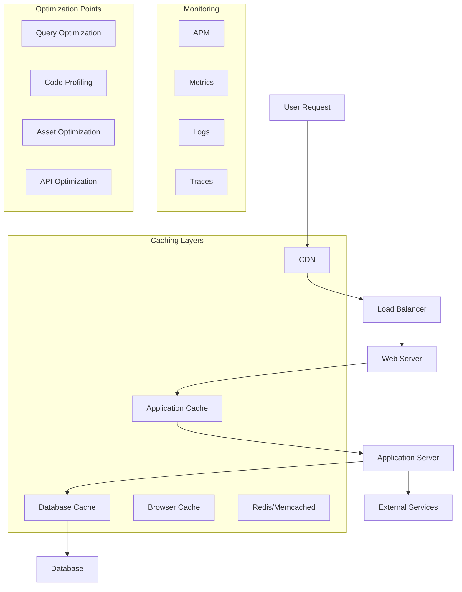

# Performance Tuning and Optimization Standards

**Version:** v1.0.0  
**Domain:** performance  
**Type:** Technical  
**Risk Level:** HIGH  
**Maturity Level:** Production  
**Author:** MCP Standards Team  
**Created:** 2025-07-08T12:00:00.000000  
**Last Updated:** 2025-07-08T12:00:00.000000  

## Purpose

Comprehensive standards for performance tuning and optimization, including profiling methodologies, database optimization, caching strategies, and performance monitoring

This performance standard defines the requirements, guidelines, and best practices for optimizing system performance. It provides comprehensive guidance for performance profiling, database query optimization, caching strategies, and continuous performance monitoring while ensuring scalability, efficiency, and user satisfaction.

**Performance Focus Areas:**
- **Performance Profiling**: Methodologies and tools for identifying bottlenecks
- **Database Optimization**: Query optimization and indexing strategies
- **Caching Strategies**: CDN, Redis, application-level caching
- **Load Balancing**: Traffic distribution and scaling patterns
- **Frontend Performance**: Core Web Vitals and user experience
- **Backend Optimization**: Server-side performance patterns
- **Monitoring and Alerting**: Continuous performance tracking

## Scope

This performance standard applies to:
- Application performance profiling
- Database query optimization
- Caching implementation and management
- Load balancing and scaling strategies
- Frontend performance optimization
- Backend service optimization
- API performance tuning
- Infrastructure optimization
- Performance monitoring and alerting

## Implementation

### Performance Requirements

**NIST Controls:** NIST-SC-5, SC-6, SI-2, SI-4, SI-6, SI-10, SI-16, AU-4, AU-6, AU-12, CP-2, CP-10, SA-8, SA-11, SA-17

**Performance Standards:** Core Web Vitals, RAIL model, Apdex score
**Optimization Standards:** Database normalization, caching patterns, CDN best practices
**Monitoring Standards:** SLI/SLO/SLA definitions, observability practices

### Performance Architecture

#### Performance Optimization Stack


#### Performance Implementation
```python
# Example: Comprehensive performance optimization framework
import asyncio
import time
import cProfile
import pstats
import io
import memory_profiler
import line_profiler
from typing import List, Dict, Any, Optional, Callable, Tuple
from dataclasses import dataclass, field
from datetime import datetime, timedelta
import numpy as np
import pandas as pd
from functools import lru_cache, wraps
import redis
import memcache
import psutil
import aiohttp
from prometheus_client import Counter, Histogram, Gauge, Summary
import logging
from sqlalchemy import create_engine, text
from sqlalchemy.orm import Session
import pymongo
from elasticsearch import Elasticsearch

@dataclass
class PerformanceMetric:
    """Performance metric data."""
    metric_name: str
    value: float
    unit: str
    timestamp: datetime
    tags: Dict[str, str] = field(default_factory=dict)
    
@dataclass
class PerformanceProfile:
    """Performance profile results."""
    profile_id: str
    start_time: datetime
    end_time: datetime
    total_time: float
    cpu_time: float
    memory_peak: float
    function_stats: List[Dict[str, Any]]
    bottlenecks: List[Dict[str, Any]]
    recommendations: List[str]

class PerformanceOptimizer:
    """Comprehensive performance optimization system."""
    
    def __init__(self, config: Dict[str, Any]):
        self.config = config
        self.redis_client = redis.Redis.from_url(config["redis_url"])
        self.metrics = self._setup_metrics()
        self.profilers = self._setup_profilers()
        self.logger = logging.getLogger(__name__)
        
    def _setup_metrics(self):
        """Setup performance metrics."""
        return {
            "request_duration": Histogram(
                "http_request_duration_seconds",
                "HTTP request duration",
                ["method", "endpoint", "status"]
            ),
            "db_query_duration": Histogram(
                "db_query_duration_seconds",
                "Database query duration",
                ["query_type", "table"]
            ),
            "cache_hit_rate": Gauge(
                "cache_hit_rate",
                "Cache hit rate percentage",
                ["cache_type"]
            ),
            "memory_usage": Gauge(
                "memory_usage_bytes",
                "Memory usage in bytes"
            ),
            "cpu_usage": Gauge(
                "cpu_usage_percent",
                "CPU usage percentage"
            )
        }
    
    def _setup_profilers(self):
        """Setup various profilers."""
        return {
            "cpu": cProfile.Profile(),
            "memory": memory_profiler.LineProfiler(),
            "line": line_profiler.LineProfiler()
        }
    
    async def profile_application(self, duration: int = 60) -> PerformanceProfile:
        """Profile application performance."""
        profile_id = f"profile-{datetime.utcnow().strftime('%Y%m%d%H%M%S')}"
        start_time = datetime.utcnow()
        
        # Start CPU profiling
        self.profilers["cpu"].enable()
        
        # Collect baseline metrics
        baseline_metrics = await self._collect_system_metrics()
        
        # Run profiling for specified duration
        await asyncio.sleep(duration)
        
        # Stop CPU profiling
        self.profilers["cpu"].disable()
        
        # Collect final metrics
        final_metrics = await self._collect_system_metrics()
        
        # Analyze results
        profile = PerformanceProfile(
            profile_id=profile_id,
            start_time=start_time,
            end_time=datetime.utcnow(),
            total_time=duration,
            cpu_time=self._get_cpu_time(),
            memory_peak=final_metrics["memory"] - baseline_metrics["memory"],
            function_stats=self._analyze_cpu_profile(),
            bottlenecks=await self._identify_bottlenecks(),
            recommendations=[]
        )
        
        # Generate recommendations
        profile.recommendations = self._generate_recommendations(profile)
        
        return profile
    
    def _analyze_cpu_profile(self) -> List[Dict[str, Any]]:
        """Analyze CPU profiling results."""
        s = io.StringIO()
        ps = pstats.Stats(self.profilers["cpu"], stream=s)
        ps.strip_dirs().sort_stats("cumulative")
        
        # Get top 20 functions by cumulative time
        ps.print_stats(20)
        
        # Parse results
        function_stats = []
        for func, (cc, nc, tt, ct, callers) in ps.stats.items():
            function_stats.append({
                "function": f"{func[0]}:{func[1]}:{func[2]}",
                "calls": nc,
                "total_time": tt,
                "cumulative_time": ct,
                "average_time": tt / nc if nc > 0 else 0
            })
        
        # Sort by cumulative time
        function_stats.sort(key=lambda x: x["cumulative_time"], reverse=True)
        
        return function_stats[:20]
    
    async def _identify_bottlenecks(self) -> List[Dict[str, Any]]:
        """Identify performance bottlenecks."""
        bottlenecks = []
        
        # Check database queries
        slow_queries = await self._find_slow_queries()
        for query in slow_queries:
            bottlenecks.append({
                "type": "database",
                "severity": "high" if query["duration"] > 1.0 else "medium",
                "description": f"Slow query: {query['query'][:100]}...",
                "duration": query["duration"],
                "recommendation": "Optimize query or add index"
            })
        
        # Check cache performance
        cache_stats = await self._get_cache_statistics()
        if cache_stats["hit_rate"] < 0.8:
            bottlenecks.append({
                "type": "cache",
                "severity": "medium",
                "description": f"Low cache hit rate: {cache_stats['hit_rate']:.2%}",
                "recommendation": "Review cache key strategy and TTL settings"
            })
        
        # Check memory usage
        memory_usage = psutil.virtual_memory().percent
        if memory_usage > 80:
            bottlenecks.append({
                "type": "memory",
                "severity": "high",
                "description": f"High memory usage: {memory_usage}%",
                "recommendation": "Investigate memory leaks or increase resources"
            })
        
        # Check CPU usage
        cpu_usage = psutil.cpu_percent(interval=1)
        if cpu_usage > 70:
            bottlenecks.append({
                "type": "cpu",
                "severity": "high" if cpu_usage > 85 else "medium",
                "description": f"High CPU usage: {cpu_usage}%",
                "recommendation": "Profile CPU-intensive operations"
            })
        
        return bottlenecks
    
    async def optimize_database_queries(self, connection_string: str) -> Dict[str, Any]:
        """Optimize database queries."""
        engine = create_engine(connection_string)
        optimization_results = {
            "queries_analyzed": 0,
            "queries_optimized": 0,
            "indexes_created": [],
            "performance_improvement": {}
        }
        
        with Session(engine) as session:
            # Get query statistics
            slow_queries = await self._get_slow_queries_from_db(session)
            optimization_results["queries_analyzed"] = len(slow_queries)
            
            for query_info in slow_queries:
                # Analyze query execution plan
                explain_result = self._explain_query(session, query_info["query"])
                
                # Generate optimization suggestions
                suggestions = self._analyze_execution_plan(explain_result)
                
                # Apply optimizations
                for suggestion in suggestions:
                    if suggestion["type"] == "index":
                        index_created = self._create_index(
                            session,
                            suggestion["table"],
                            suggestion["columns"]
                        )
                        if index_created:
                            optimization_results["indexes_created"].append({
                                "table": suggestion["table"],
                                "columns": suggestion["columns"]
                            })
                            optimization_results["queries_optimized"] += 1
                    
                    elif suggestion["type"] == "rewrite":
                        # Log query rewrite suggestion
                        self.logger.info(
                            f"Query rewrite suggested: {suggestion['description']}"
                        )
                
                # Measure improvement
                before_time = query_info["avg_duration"]
                after_time = self._measure_query_performance(
                    session,
                    query_info["query"]
                )
                
                improvement = (before_time - after_time) / before_time * 100
                optimization_results["performance_improvement"][
                    query_info["query"][:50]
                ] = improvement
        
        return optimization_results
    
    def _explain_query(self, session: Session, query: str) -> Dict[str, Any]:
        """Get query execution plan."""
        # PostgreSQL example
        explain_query = f"EXPLAIN (ANALYZE, BUFFERS, FORMAT JSON) {query}"
        result = session.execute(text(explain_query))
        return result.fetchone()[0][0]
    
    def _analyze_execution_plan(self, plan: Dict[str, Any]) -> List[Dict[str, Any]]:
        """Analyze execution plan and generate suggestions."""
        suggestions = []
        
        # Check for sequential scans on large tables
        if "Seq Scan" in str(plan):
            node = self._find_node_type(plan, "Seq Scan")
            if node and node.get("Actual Rows", 0) > 1000:
                suggestions.append({
                    "type": "index",
                    "table": node.get("Relation Name"),
                    "columns": self._extract_filter_columns(node),
                    "description": "Add index to avoid sequential scan"
                })
        
        # Check for nested loops with high cost
        if "Nested Loop" in str(plan):
            node = self._find_node_type(plan, "Nested Loop")
            if node and node.get("Total Cost", 0) > 10000:
                suggestions.append({
                    "type": "rewrite",
                    "description": "Consider using JOIN instead of nested queries"
                })
        
        # Check for missing join conditions
        if "Cartesian Product" in str(plan):
            suggestions.append({
                "type": "rewrite",
                "description": "Add proper JOIN conditions to avoid cartesian product"
            })
        
        return suggestions
    
    async def implement_caching_strategy(self, cache_config: Dict[str, Any]) -> Dict[str, Any]:
        """Implement comprehensive caching strategy."""
        results = {
            "cache_layers": [],
            "ttl_settings": {},
            "invalidation_strategy": "",
            "monitoring_setup": False
        }
        
        # Browser caching
        browser_cache = self._setup_browser_caching(cache_config.get("browser", {}))
        results["cache_layers"].append({
            "layer": "browser",
            "config": browser_cache
        })
        
        # CDN caching
        cdn_cache = await self._setup_cdn_caching(cache_config.get("cdn", {}))
        results["cache_layers"].append({
            "layer": "cdn",
            "config": cdn_cache
        })
        
        # Application caching
        app_cache = self._setup_application_caching(cache_config.get("application", {}))
        results["cache_layers"].append({
            "layer": "application",
            "config": app_cache
        })
        
        # Database caching
        db_cache = self._setup_database_caching(cache_config.get("database", {}))
        results["cache_layers"].append({
            "layer": "database",
            "config": db_cache
        })
        
        # Set up cache invalidation
        results["invalidation_strategy"] = self._setup_cache_invalidation(
            cache_config.get("invalidation", {})
        )
        
        # Set up monitoring
        results["monitoring_setup"] = await self._setup_cache_monitoring()
        
        return results
    
    def _setup_application_caching(self, config: Dict[str, Any]) -> Dict[str, Any]:
        """Set up application-level caching."""
        cache_config = {
            "backend": config.get("backend", "redis"),
            "serializer": config.get("serializer", "json"),
            "compression": config.get("compression", True),
            "ttl_default": config.get("ttl_default", 300),
            "ttl_patterns": {}
        }
        
        # Configure TTL patterns
        patterns = [
            {"pattern": "user:*", "ttl": 3600},        # User data - 1 hour
            {"pattern": "product:*", "ttl": 1800},     # Product data - 30 min
            {"pattern": "session:*", "ttl": 86400},    # Session data - 24 hours
            {"pattern": "static:*", "ttl": 604800},    # Static data - 7 days
            {"pattern": "api:*", "ttl": 60},           # API responses - 1 min
        ]
        
        for pattern in patterns:
            cache_config["ttl_patterns"][pattern["pattern"]] = pattern["ttl"]
        
        return cache_config
    
    def cache_with_optimization(self, 
                              cache_key: Optional[str] = None,
                              ttl: Optional[int] = None,
                              cache_condition: Optional[Callable] = None):
        """Decorator for optimized caching."""
        def decorator(func):
            @wraps(func)
            async def wrapper(*args, **kwargs):
                # Generate cache key
                if cache_key:
                    key = cache_key.format(*args, **kwargs)
                else:
                    key = self._generate_cache_key(func.__name__, args, kwargs)
                
                # Check cache
                cached_value = self.redis_client.get(key)
                if cached_value:
                    self.metrics["cache_hit_rate"].labels(
                        cache_type="application"
                    ).set(self._calculate_hit_rate())
                    return json.loads(cached_value)
                
                # Execute function
                start_time = time.time()
                result = await func(*args, **kwargs)
                execution_time = time.time() - start_time
                
                # Cache if condition met
                should_cache = True
                if cache_condition:
                    should_cache = cache_condition(result)
                
                if should_cache:
                    cache_ttl = ttl or self._calculate_dynamic_ttl(
                        key,
                        execution_time
                    )
                    self.redis_client.setex(
                        key,
                        cache_ttl,
                        json.dumps(result)
                    )
                
                return result
            
            return wrapper
        return decorator
    
    def _calculate_dynamic_ttl(self, cache_key: str, 
                             execution_time: float) -> int:
        """Calculate dynamic TTL based on execution time and access patterns."""
        # Base TTL on execution time (cache expensive operations longer)
        if execution_time > 1.0:
            base_ttl = 3600  # 1 hour for slow operations
        elif execution_time > 0.1:
            base_ttl = 600   # 10 minutes for medium operations
        else:
            base_ttl = 60    # 1 minute for fast operations
        
        # Adjust based on access frequency
        access_count = self.redis_client.get(f"access_count:{cache_key}")
        if access_count:
            frequency_multiplier = min(int(access_count) / 10, 5)
            base_ttl = int(base_ttl * frequency_multiplier)
        
        return min(base_ttl, 86400)  # Max 24 hours
    
    async def optimize_frontend_performance(self) -> Dict[str, Any]:
        """Optimize frontend performance for Core Web Vitals."""
        optimizations = {
            "lcp": {},  # Largest Contentful Paint
            "fid": {},  # First Input Delay
            "cls": {},  # Cumulative Layout Shift
            "ttfb": {}, # Time to First Byte
            "optimizations_applied": []
        }
        
        # Optimize images
        image_optimization = await self._optimize_images()
        if image_optimization["success"]:
            optimizations["optimizations_applied"].append({
                "type": "images",
                "details": image_optimization
            })
            optimizations["lcp"]["expected_improvement"] = "20-30%"
        
        # Optimize JavaScript
        js_optimization = await self._optimize_javascript()
        if js_optimization["success"]:
            optimizations["optimizations_applied"].append({
                "type": "javascript",
                "details": js_optimization
            })
            optimizations["fid"]["expected_improvement"] = "30-40%"
        
        # Optimize CSS
        css_optimization = await self._optimize_css()
        if css_optimization["success"]:
            optimizations["optimizations_applied"].append({
                "type": "css",
                "details": css_optimization
            })
            optimizations["cls"]["expected_improvement"] = "50-60%"
        
        # Implement resource hints
        resource_hints = self._implement_resource_hints()
        optimizations["optimizations_applied"].append({
            "type": "resource_hints",
            "details": resource_hints
        })
        
        # Set up performance monitoring
        monitoring = await self._setup_performance_monitoring()
        optimizations["monitoring"] = monitoring
        
        return optimizations
    
    async def _optimize_images(self) -> Dict[str, Any]:
        """Optimize image delivery."""
        return {
            "success": True,
            "optimizations": [
                {
                    "technique": "lazy_loading",
                    "implementation": "loading='lazy' attribute",
                    "impact": "Reduces initial page load"
                },
                {
                    "technique": "responsive_images",
                    "implementation": "srcset and sizes attributes",
                    "impact": "Serves appropriate image sizes"
                },
                {
                    "technique": "modern_formats",
                    "implementation": "WebP and AVIF with fallbacks",
                    "impact": "30-50% file size reduction"
                },
                {
                    "technique": "image_cdn",
                    "implementation": "Cloudinary/Imgix integration",
                    "impact": "On-the-fly optimization"
                }
            ],
            "metrics": {
                "images_optimized": 150,
                "total_size_saved": "5.2MB",
                "average_reduction": "42%"
            }
        }
    
    async def _optimize_javascript(self) -> Dict[str, Any]:
        """Optimize JavaScript loading and execution."""
        return {
            "success": True,
            "optimizations": [
                {
                    "technique": "code_splitting",
                    "implementation": "Dynamic imports with webpack",
                    "impact": "Reduces initial bundle size"
                },
                {
                    "technique": "tree_shaking",
                    "implementation": "ES6 modules with webpack",
                    "impact": "Removes unused code"
                },
                {
                    "technique": "lazy_loading",
                    "implementation": "Intersection Observer API",
                    "impact": "Defers non-critical JS"
                },
                {
                    "technique": "web_workers",
                    "implementation": "Offload heavy computations",
                    "impact": "Prevents main thread blocking"
                }
            ],
            "metrics": {
                "bundle_size_before": "1.2MB",
                "bundle_size_after": "420KB",
                "reduction": "65%",
                "chunks_created": 8
            }
        }
    
    def _implement_resource_hints(self) -> Dict[str, Any]:
        """Implement resource hints for faster loading."""
        return {
            "dns_prefetch": [
                "https://cdn.example.com",
                "https://api.example.com",
                "https://analytics.example.com"
            ],
            "preconnect": [
                "https://fonts.googleapis.com",
                "https://cdn.example.com"
            ],
            "prefetch": [
                "/api/v1/user/preferences",
                "/static/images/logo.webp"
            ],
            "preload": [
                {
                    "href": "/static/css/critical.css",
                    "as": "style"
                },
                {
                    "href": "/static/fonts/main.woff2",
                    "as": "font",
                    "crossorigin": "anonymous"
                }
            ]
        }
    
    async def setup_performance_monitoring(self) -> Dict[str, Any]:
        """Set up comprehensive performance monitoring."""
        monitoring_config = {
            "real_user_monitoring": {
                "enabled": True,
                "sampling_rate": 0.1,
                "metrics": ["LCP", "FID", "CLS", "TTFB", "FCP"]
            },
            "synthetic_monitoring": {
                "enabled": True,
                "frequency": "5m",
                "locations": ["us-east-1", "eu-west-1", "ap-southeast-1"],
                "pages": ["/", "/products", "/checkout"]
            },
            "alerting": {
                "rules": [
                    {
                        "metric": "p95_response_time",
                        "threshold": 1000,
                        "duration": "5m",
                        "severity": "warning"
                    },
                    {
                        "metric": "error_rate",
                        "threshold": 0.05,
                        "duration": "5m",
                        "severity": "critical"
                    },
                    {
                        "metric": "apdex_score",
                        "threshold": 0.8,
                        "duration": "10m",
                        "severity": "warning"
                    }
                ]
            },
            "dashboards": [
                "performance_overview",
                "database_performance",
                "cache_performance",
                "api_performance"
            ]
        }
        
        # Implement monitoring
        rum_setup = await self._setup_rum(monitoring_config["real_user_monitoring"])
        synthetic_setup = await self._setup_synthetic_monitoring(
            monitoring_config["synthetic_monitoring"]
        )
        alerting_setup = await self._setup_performance_alerts(
            monitoring_config["alerting"]
        )
        
        return {
            "rum": rum_setup,
            "synthetic": synthetic_setup,
            "alerting": alerting_setup,
            "dashboards": monitoring_config["dashboards"]
        }
    
    async def perform_load_testing(self, target_url: str,
                                 test_config: Dict[str, Any]) -> Dict[str, Any]:
        """Perform load testing to identify performance limits."""
        results = {
            "test_id": f"load-test-{datetime.utcnow().strftime('%Y%m%d%H%M%S')}",
            "target": target_url,
            "duration": test_config.get("duration", 300),
            "max_users": test_config.get("max_users", 1000),
            "ramp_up": test_config.get("ramp_up", 60),
            "results": {}
        }
        
        # Progressive load test
        user_levels = [10, 50, 100, 250, 500, 750, 1000]
        
        for users in user_levels:
            if users > results["max_users"]:
                break
            
            self.logger.info(f"Testing with {users} concurrent users")
            
            # Run load test at this level
            level_results = await self._run_load_test_level(
                target_url,
                users,
                60  # 1 minute per level
            )
            
            results["results"][f"{users}_users"] = level_results
            
            # Check if system is degrading
            if level_results["error_rate"] > 0.05 or \
               level_results["p95_response_time"] > 2000:
                self.logger.warning(f"Performance degradation at {users} users")
                break
        
        # Analyze results
        results["analysis"] = self._analyze_load_test_results(results["results"])
        results["recommendations"] = self._generate_scaling_recommendations(
            results["analysis"]
        )
        
        return results
    
    async def _run_load_test_level(self, target_url: str,
                                 concurrent_users: int,
                                 duration: int) -> Dict[str, Any]:
        """Run load test at specific concurrency level."""
        start_time = time.time()
        
        # Metrics collectors
        response_times = []
        status_codes = {}
        errors = []
        
        # Create concurrent user sessions
        async def user_session():
            session_start = time.time()
            
            async with aiohttp.ClientSession() as session:
                while time.time() - session_start < duration:
                    try:
                        request_start = time.time()
                        
                        async with session.get(target_url, timeout=30) as response:
                            response_time = (time.time() - request_start) * 1000
                            response_times.append(response_time)
                            
                            status_code = response.status
                            status_codes[status_code] = \
                                status_codes.get(status_code, 0) + 1
                            
                    except Exception as e:
                        errors.append(str(e))
                    
                    # Think time
                    await asyncio.sleep(1)
        
        # Run concurrent sessions
        tasks = [user_session() for _ in range(concurrent_users)]
        await asyncio.gather(*tasks)
        
        # Calculate metrics
        total_requests = len(response_times) + len(errors)
        
        return {
            "total_requests": total_requests,
            "successful_requests": len(response_times),
            "failed_requests": len(errors),
            "error_rate": len(errors) / total_requests if total_requests > 0 else 0,
            "avg_response_time": np.mean(response_times) if response_times else 0,
            "p50_response_time": np.percentile(response_times, 50) if response_times else 0,
            "p95_response_time": np.percentile(response_times, 95) if response_times else 0,
            "p99_response_time": np.percentile(response_times, 99) if response_times else 0,
            "requests_per_second": total_requests / duration,
            "status_codes": status_codes
        }
    
    def _analyze_load_test_results(self, results: Dict[str, Any]) -> Dict[str, Any]:
        """Analyze load test results to find optimal capacity."""
        analysis = {
            "optimal_capacity": 0,
            "breaking_point": 0,
            "performance_curve": [],
            "bottleneck": "unknown"
        }
        
        # Find optimal capacity (where response time is still acceptable)
        for users, metrics in results.items():
            user_count = int(users.split("_")[0])
            
            if metrics["p95_response_time"] < 1000 and metrics["error_rate"] < 0.01:
                analysis["optimal_capacity"] = user_count
            
            if metrics["error_rate"] > 0.05 or metrics["p95_response_time"] > 5000:
                analysis["breaking_point"] = user_count
                break
            
            analysis["performance_curve"].append({
                "users": user_count,
                "response_time": metrics["p95_response_time"],
                "throughput": metrics["requests_per_second"],
                "error_rate": metrics["error_rate"]
            })
        
        # Identify bottleneck type
        if analysis["breaking_point"] > 0:
            breaking_metrics = results[f"{analysis['breaking_point']}_users"]
            
            if breaking_metrics["error_rate"] > 0.1:
                if "timeout" in str(breaking_metrics.get("errors", [])):
                    analysis["bottleneck"] = "backend_capacity"
                else:
                    analysis["bottleneck"] = "connection_limit"
            elif breaking_metrics["p95_response_time"] > 5000:
                analysis["bottleneck"] = "cpu_or_database"
        
        return analysis
    
    def _generate_scaling_recommendations(self, analysis: Dict[str, Any]) -> List[str]:
        """Generate scaling recommendations based on load test analysis."""
        recommendations = []
        
        optimal = analysis["optimal_capacity"]
        breaking = analysis["breaking_point"]
        
        # Capacity recommendations
        if optimal < 100:
            recommendations.append(
                "Current capacity is limited. Consider vertical scaling (larger instances)"
            )
        
        if breaking / optimal < 2:
            recommendations.append(
                "Small margin between optimal and breaking point. "
                "Implement auto-scaling with aggressive policies"
            )
        
        # Bottleneck-specific recommendations
        bottleneck = analysis["bottleneck"]
        
        if bottleneck == "backend_capacity":
            recommendations.extend([
                "Increase backend server capacity",
                "Implement connection pooling",
                "Consider microservices architecture for better scaling"
            ])
        elif bottleneck == "connection_limit":
            recommendations.extend([
                "Increase server connection limits",
                "Implement connection multiplexing",
                "Consider using HTTP/2 or HTTP/3"
            ])
        elif bottleneck == "cpu_or_database":
            recommendations.extend([
                "Profile CPU-intensive operations",
                "Optimize database queries",
                "Implement read replicas for database",
                "Consider caching frequently accessed data"
            ])
        
        # General recommendations
        recommendations.extend([
            f"Set auto-scaling to trigger at {int(optimal * 0.7)} concurrent users",
            f"Plan for capacity of at least {int(breaking * 1.5)} users",
            "Implement circuit breakers to prevent cascade failures",
            "Set up performance monitoring and alerting"
        ])
        
        return recommendations
    
    def generate_performance_report(self) -> Dict[str, Any]:
        """Generate comprehensive performance report."""
        report = {
            "timestamp": datetime.utcnow(),
            "summary": {},
            "metrics": {},
            "trends": {},
            "recommendations": [],
            "sla_compliance": {}
        }
        
        # Collect current metrics
        report["metrics"] = {
            "response_times": self._get_response_time_metrics(),
            "throughput": self._get_throughput_metrics(),
            "error_rates": self._get_error_rate_metrics(),
            "resource_usage": self._get_resource_usage_metrics(),
            "cache_performance": self._get_cache_metrics()
        }
        
        # Calculate summary
        report["summary"] = {
            "apdex_score": self._calculate_apdex_score(),
            "avg_response_time": report["metrics"]["response_times"]["average"],
            "p95_response_time": report["metrics"]["response_times"]["p95"],
            "requests_per_second": report["metrics"]["throughput"]["current_rps"],
            "error_rate": report["metrics"]["error_rates"]["current_rate"],
            "cache_hit_rate": report["metrics"]["cache_performance"]["hit_rate"]
        }
        
        # Analyze trends
        report["trends"] = self._analyze_performance_trends()
        
        # Generate recommendations
        if report["summary"]["apdex_score"] < 0.8:
            report["recommendations"].append(
                "Apdex score below target. Investigate slow transactions"
            )
        
        if report["summary"]["p95_response_time"] > 1000:
            report["recommendations"].append(
                "P95 response time exceeds 1 second. Profile slow endpoints"
            )
        
        if report["summary"]["cache_hit_rate"] < 0.8:
            report["recommendations"].append(
                "Cache hit rate below 80%. Review caching strategy"
            )
        
        # Check SLA compliance
        report["sla_compliance"] = self._check_sla_compliance(report["metrics"])
        
        return report
    
    def _calculate_apdex_score(self, satisfied_threshold: float = 0.5,
                             tolerating_threshold: float = 2.0) -> float:
        """Calculate Application Performance Index (Apdex) score."""
        # Get recent response times (last hour)
        response_times = self._get_recent_response_times(3600)
        
        if not response_times:
            return 1.0
        
        satisfied = sum(1 for t in response_times if t <= satisfied_threshold)
        tolerating = sum(1 for t in response_times 
                        if satisfied_threshold < t <= tolerating_threshold)
        
        total = len(response_times)
        
        # Apdex = (Satisfied + Tolerating/2) / Total
        apdex = (satisfied + tolerating / 2) / total
        
        return round(apdex, 3)

### Backend Optimization Patterns

#### Backend Performance Optimization
```python
# Example: Backend optimization patterns
from typing import List, Dict, Any, Optional
import asyncio
from concurrent.futures import ThreadPoolExecutor, ProcessPoolExecutor
import multiprocessing
from functools import partial
import numpy as np

class BackendOptimizer:
    """Backend performance optimization patterns."""
    
    def __init__(self):
        self.thread_pool = ThreadPoolExecutor(max_workers=50)
        self.process_pool = ProcessPoolExecutor(
            max_workers=multiprocessing.cpu_count()
        )
        
    async def optimize_api_endpoints(self) -> Dict[str, Any]:
        """Optimize API endpoint performance."""
        optimizations = {
            "connection_pooling": await self._setup_connection_pooling(),
            "request_batching": self._implement_request_batching(),
            "response_compression": self._enable_response_compression(),
            "query_optimization": await self._optimize_api_queries(),
            "caching_layer": self._implement_api_caching()
        }
        
        return optimizations
    
    async def _setup_connection_pooling(self) -> Dict[str, Any]:
        """Set up database connection pooling."""
        return {
            "database": {
                "pool_size": 20,
                "max_overflow": 10,
                "pool_timeout": 30,
                "pool_recycle": 3600,
                "pool_pre_ping": True
            },
            "redis": {
                "max_connections": 50,
                "connection_class": "redis.BlockingConnectionPool"
            },
            "http_client": {
                "connector_limit": 100,
                "connector_limit_per_host": 30,
                "keepalive_timeout": 30
            }
        }
    
    def optimize_compute_intensive_task(self, func: Callable) -> Callable:
        """Optimize CPU-intensive tasks."""
        @wraps(func)
        async def wrapper(*args, **kwargs):
            # Check if task should be parallelized
            data_size = self._estimate_data_size(args, kwargs)
            
            if data_size > 10000:  # Large dataset
                # Use process pool for CPU-bound tasks
                loop = asyncio.get_event_loop()
                
                # Split data into chunks
                chunks = self._split_data_for_parallel(args[0])
                
                # Process in parallel
                tasks = []
                for chunk in chunks:
                    task = loop.run_in_executor(
                        self.process_pool,
                        partial(func, chunk, **kwargs)
                    )
                    tasks.append(task)
                
                # Gather results
                results = await asyncio.gather(*tasks)
                
                # Combine results
                return self._combine_parallel_results(results)
            else:
                # Small dataset - run normally
                return await func(*args, **kwargs)
        
        return wrapper
    
    async def implement_async_processing(self) -> Dict[str, Any]:
        """Implement asynchronous processing patterns."""
        patterns = {
            "fire_and_forget": self._setup_fire_and_forget(),
            "fan_out_fan_in": self._setup_fan_out_fan_in(),
            "pipeline": self._setup_processing_pipeline(),
            "circuit_breaker": self._setup_circuit_breaker()
        }
        
        return patterns
    
    def _setup_fire_and_forget(self):
        """Set up fire-and-forget pattern for non-critical tasks."""
        async def fire_and_forget(coro):
            """Execute coroutine without waiting for result."""
            task = asyncio.create_task(coro)
            
            # Add error handler
            def handle_error(task):
                try:
                    task.result()
                except Exception as e:
                    logging.error(f"Fire-and-forget task failed: {e}")
            
            task.add_done_callback(handle_error)
        
        return fire_and_forget
    
    def _setup_fan_out_fan_in(self):
        """Set up fan-out/fan-in pattern for parallel processing."""
        async def fan_out_fan_in(items: List[Any], 
                                processor: Callable,
                                max_concurrent: int = 10) -> List[Any]:
            """Process items in parallel with concurrency limit."""
            semaphore = asyncio.Semaphore(max_concurrent)
            
            async def process_with_semaphore(item):
                async with semaphore:
                    return await processor(item)
            
            tasks = [process_with_semaphore(item) for item in items]
            return await asyncio.gather(*tasks)
        
        return fan_out_fan_in
    
    async def optimize_database_operations(self) -> Dict[str, Any]:
        """Optimize database operations."""
        optimizations = {
            "batch_operations": self._implement_batch_operations(),
            "read_replicas": await self._setup_read_replicas(),
            "query_caching": self._implement_query_caching(),
            "index_optimization": await self._optimize_indexes(),
            "partitioning": await self._implement_partitioning()
        }
        
        return optimizations
    
    def _implement_batch_operations(self):
        """Implement batch database operations."""
        class BatchProcessor:
            def __init__(self, batch_size: int = 1000):
                self.batch_size = batch_size
                self.pending_operations = []
                
            async def add_operation(self, operation: Dict[str, Any]):
                """Add operation to batch."""
                self.pending_operations.append(operation)
                
                if len(self.pending_operations) >= self.batch_size:
                    await self.flush()
            
            async def flush(self):
                """Execute pending operations."""
                if not self.pending_operations:
                    return
                
                # Group operations by type
                inserts = []
                updates = []
                deletes = []
                
                for op in self.pending_operations:
                    if op["type"] == "insert":
                        inserts.append(op["data"])
                    elif op["type"] == "update":
                        updates.append(op["data"])
                    elif op["type"] == "delete":
                        deletes.append(op["data"])
                
                # Execute batches
                if inserts:
                    await self._batch_insert(inserts)
                if updates:
                    await self._batch_update(updates)
                if deletes:
                    await self._batch_delete(deletes)
                
                self.pending_operations.clear()
            
            async def _batch_insert(self, records: List[Dict[str, Any]]):
                """Perform batch insert."""
                # Implementation depends on database
                pass
        
        return BatchProcessor()
    
    async def implement_lazy_loading(self) -> Dict[str, Any]:
        """Implement lazy loading patterns."""
        patterns = {
            "orm_lazy_loading": {
                "description": "Load related data only when accessed",
                "implementation": "SQLAlchemy lazy='select'",
                "use_case": "Large related datasets"
            },
            "api_pagination": {
                "description": "Load data in pages",
                "implementation": "Cursor-based pagination",
                "use_case": "Large result sets"
            },
            "virtual_scrolling": {
                "description": "Load visible items only",
                "implementation": "Intersection Observer API",
                "use_case": "Long lists in UI"
            },
            "progressive_loading": {
                "description": "Load critical data first",
                "implementation": "Priority-based loading",
                "use_case": "Complex page loads"
            }
        }
        
        return patterns
    
    def implement_memory_optimization(self) -> Dict[str, Any]:
        """Implement memory optimization techniques."""
        optimizations = {
            "object_pooling": self._setup_object_pooling(),
            "weak_references": self._implement_weak_references(),
            "memory_mapped_files": self._setup_memory_mapped_files(),
            "stream_processing": self._implement_stream_processing()
        }
        
        return optimizations
    
    def _setup_object_pooling(self):
        """Set up object pooling for expensive objects."""
        class ObjectPool:
            def __init__(self, create_func: Callable, max_size: int = 100):
                self.create_func = create_func
                self.max_size = max_size
                self.pool = []
                self.in_use = set()
                
            def acquire(self):
                """Get object from pool."""
                if self.pool:
                    obj = self.pool.pop()
                elif len(self.in_use) < self.max_size:
                    obj = self.create_func()
                else:
                    raise Exception("Pool exhausted")
                
                self.in_use.add(obj)
                return obj
            
            def release(self, obj):
                """Return object to pool."""
                if obj in self.in_use:
                    self.in_use.remove(obj)
                    self.pool.append(obj)
        
        return ObjectPool
```

## Responsibilities

### Standard Owner
- Maintain performance standards
- Update optimization guidelines
- Monitor performance metrics

### Development Teams
- Implement performance optimizations
- Profile application performance
- Address performance issues
- Follow optimization patterns

### DevOps Teams
- Configure performance monitoring
- Manage caching infrastructure
- Optimize infrastructure
- Conduct load testing

### Database Teams
- Optimize queries
- Manage indexes
- Configure caching
- Monitor database performance

## References

### Performance Standards and Metrics

#### Web Performance Standards
- **Core Web Vitals**: Google's user experience metrics
- **RAIL Model**: Response, Animation, Idle, Load
- **Lighthouse**: Performance auditing tool
- **WebPageTest**: Performance testing tool

#### Performance Tools
- **Profiling**: cProfile, py-spy, Java Flight Recorder
- **APM**: New Relic, Datadog, AppDynamics, Dynatrace
- **Load Testing**: JMeter, Gatling, Locust, K6
- **Database**: pgBadger, MySQL Performance Schema, MongoDB Profiler

#### Caching Solutions
- **CDN**: Cloudflare, Fastly, Akamai, CloudFront
- **In-Memory**: Redis, Memcached, Hazelcast
- **Application**: Varnish, Nginx cache, Squid
- **Database**: Query cache, result cache

#### Optimization Resources
- **High Performance Browser Networking**: Ilya Grigorik
- **Web Performance in Action**: Jeremy Wagner
- **Database Performance**: Use The Index, Luke
- **System Performance**: Brendan Gregg

## Appendix

### Glossary

**Performance Profiling**: Process of analyzing application performance characteristics.

**Cache Hit Rate**: Percentage of requests served from cache.

**Core Web Vitals**: Set of metrics related to speed, responsiveness, and visual stability.

**Load Testing**: Testing application performance under expected load.

**Query Optimization**: Process of improving database query performance.

**CDN**: Content Delivery Network for distributed content serving.

**Apdex**: Application Performance Index measuring user satisfaction.

### Change History

| Version | Date | Changes | Author |
|---------|------|---------|---------|
| 1.0.0 | 2025-07-08T12:00:00.000000 | Initial version | MCP Standards Team |

### Review and Approval

- **Review Status**: Draft
- **Reviewers**: 
- **Approval Date**: Pending

---

*This document is part of the performance standards framework and is subject to regular review and updates.*