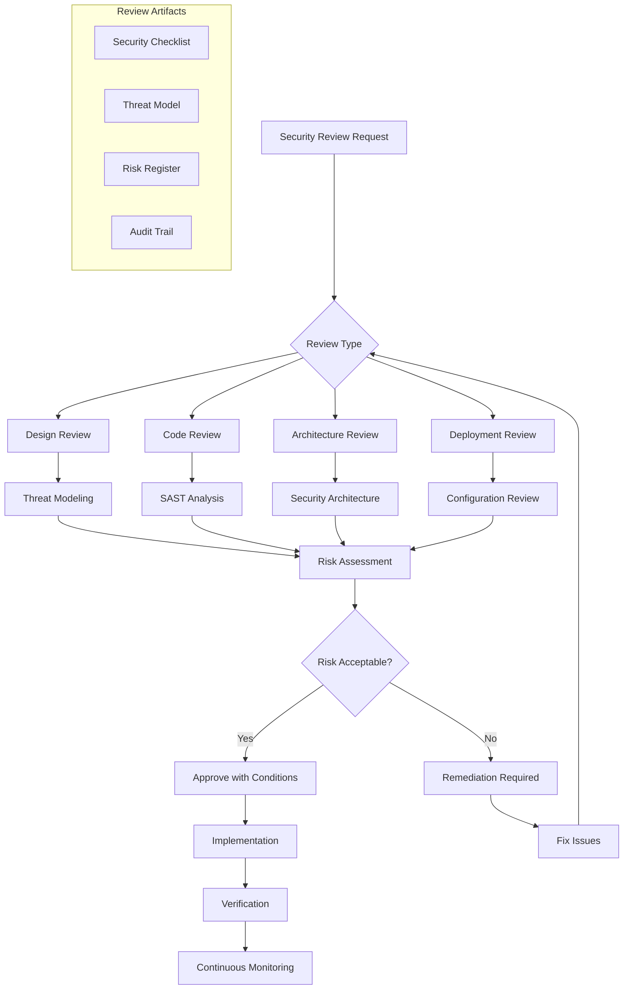

# Security Review and Audit Process Standards

**Version:** v1.0.0  
**Domain:** security  
**Type:** Process  
**Risk Level:** CRITICAL  
**Maturity Level:** Production  
**Author:** MCP Standards Team  
**Created:** 2025-07-08T10:30:00.000000  
**Last Updated:** 2025-07-08T10:30:00.000000  

## Purpose

Comprehensive standards for security review and audit processes, including threat modeling, vulnerability assessment, code review, and compliance verification

This security standard defines the requirements, guidelines, and best practices for security review and audit processes. It provides comprehensive guidance for threat modeling, vulnerability management, security code reviews, and compliance verification while ensuring continuous security improvement across all systems.

**Security Focus Areas:**
- **Security Review Workflows**: Structured review processes and checklists
- **Threat Modeling**: STRIDE, PASTA, and other methodologies
- **Vulnerability Management**: Assessment, tracking, and remediation
- **Code Review Security**: Security-focused code review processes
- **Third-Party Audits**: External security assessment management
- **Compliance Verification**: SOC2, ISO 27001, and other standards
- **Incident Response**: Security incident procedures and playbooks

## Scope

This security standard applies to:
- Security review processes and workflows
- Threat modeling activities
- Vulnerability assessment and management
- Security code review procedures
- Third-party security audits
- Compliance verification processes
- Security incident response
- Security metrics and reporting
- Continuous security improvement

## Implementation

### Security Review Requirements

**NIST Controls:** NIST-CA-2, CA-5, CA-7, CA-8, CM-3, CM-4, PM-9, PM-11, RA-3, RA-5, SA-3, SA-4, SA-5, SA-8, SA-11, SA-15, SA-17, SC-7, SI-2, SI-3, SI-4

**Security Standards:** ISO 27001, SOC 2, PCI DSS, OWASP SAMM
**Threat Modeling:** STRIDE, PASTA, OCTAVE, Attack Trees
**Compliance Frameworks:** NIST CSF, CIS Controls, COBIT

### Security Review Architecture

#### Security Review Process Flow


#### Security Review Implementation
```python
# Example: Comprehensive security review framework
import json
import yaml
from typing import List, Dict, Any, Optional, Tuple
from dataclasses import dataclass, field
from datetime import datetime, timedelta
from enum import Enum
import hashlib
import logging
from pathlib import Path
import asyncio
import jinja2
import pandas as pd
from abc import ABC, abstractmethod

class ReviewType(Enum):
    """Types of security reviews."""
    DESIGN = "design"
    CODE = "code"
    ARCHITECTURE = "architecture"
    DEPLOYMENT = "deployment"
    THIRD_PARTY = "third_party"
    COMPLIANCE = "compliance"

class RiskLevel(Enum):
    """Risk levels for findings."""
    CRITICAL = "critical"
    HIGH = "high"
    MEDIUM = "medium"
    LOW = "low"
    INFO = "info"

@dataclass
class SecurityFinding:
    """Security finding from review."""
    finding_id: str
    title: str
    description: str
    risk_level: RiskLevel
    category: str
    affected_component: str
    recommendation: str
    evidence: Optional[Dict[str, Any]] = None
    references: List[str] = field(default_factory=list)
    cwe_id: Optional[str] = None
    cve_id: Optional[str] = None
    
@dataclass
class SecurityReview:
    """Security review record."""
    review_id: str
    review_type: ReviewType
    project_name: str
    version: str
    reviewer: str
    review_date: datetime
    status: str
    findings: List[SecurityFinding] = field(default_factory=list)
    risk_summary: Dict[str, int] = field(default_factory=dict)
    recommendations: List[str] = field(default_factory=list)
    next_review_date: Optional[datetime] = None

class SecurityReviewManager:
    """Manage security review processes."""
    
    def __init__(self, config_path: str):
        self.config = self._load_config(config_path)
        self.reviews: Dict[str, SecurityReview] = {}
        self.templates = self._load_templates()
        self.logger = logging.getLogger(__name__)
        
    def _load_config(self, config_path: str) -> Dict[str, Any]:
        """Load security review configuration."""
        with open(config_path) as f:
            return yaml.safe_load(f)
    
    def _load_templates(self) -> jinja2.Environment:
        """Load review templates."""
        loader = jinja2.FileSystemLoader("templates/security")
        return jinja2.Environment(loader=loader)
    
    async def create_review(self, project_name: str, version: str,
                          review_type: ReviewType) -> SecurityReview:
        """Create a new security review."""
        review_id = self._generate_review_id(project_name, version, review_type)
        
        review = SecurityReview(
            review_id=review_id,
            review_type=review_type,
            project_name=project_name,
            version=version,
            reviewer=self.config.get("default_reviewer", "security_team"),
            review_date=datetime.utcnow(),
            status="in_progress"
        )
        
        self.reviews[review_id] = review
        
        # Initialize review based on type
        if review_type == ReviewType.DESIGN:
            await self._init_design_review(review)
        elif review_type == ReviewType.CODE:
            await self._init_code_review(review)
        elif review_type == ReviewType.ARCHITECTURE:
            await self._init_architecture_review(review)
        
        return review
    
    def _generate_review_id(self, project: str, version: str,
                          review_type: ReviewType) -> str:
        """Generate unique review ID."""
        timestamp = datetime.utcnow().strftime("%Y%m%d%H%M%S")
        hash_input = f"{project}{version}{review_type.value}{timestamp}"
        return hashlib.sha256(hash_input.encode()).hexdigest()[:12]
    
    async def _init_design_review(self, review: SecurityReview):
        """Initialize design review with checklist."""
        checklist = self.config.get("design_review_checklist", [])
        
        for item in checklist:
            # Create placeholder findings for unchecked items
            finding = SecurityFinding(
                finding_id=self._generate_finding_id(),
                title=f"Design Review: {item['title']}",
                description=item['description'],
                risk_level=RiskLevel.INFO,
                category="design_review",
                affected_component="design",
                recommendation="Verify during review"
            )
            review.findings.append(finding)
    
    async def conduct_threat_modeling(self, review_id: str,
                                    methodology: str = "STRIDE") -> Dict[str, Any]:
        """Conduct threat modeling for the review."""
        review = self.reviews.get(review_id)
        if not review:
            raise ValueError(f"Review {review_id} not found")
        
        if methodology == "STRIDE":
            return await self._stride_threat_modeling(review)
        elif methodology == "PASTA":
            return await self._pasta_threat_modeling(review)
        else:
            raise ValueError(f"Unknown methodology: {methodology}")
    
    async def _stride_threat_modeling(self, review: SecurityReview) -> Dict[str, Any]:
        """STRIDE threat modeling implementation."""
        stride_categories = {
            "Spoofing": "Authentication",
            "Tampering": "Integrity",
            "Repudiation": "Non-repudiation",
            "Information Disclosure": "Confidentiality",
            "Denial of Service": "Availability",
            "Elevation of Privilege": "Authorization"
        }
        
        threats = []
        
        # Analyze each component for STRIDE threats
        components = await self._identify_components(review.project_name)
        
        for component in components:
            for threat_type, property_violated in stride_categories.items():
                threat = await self._analyze_stride_threat(
                    component,
                    threat_type,
                    property_violated
                )
                if threat:
                    threats.append(threat)
                    
                    # Create finding
                    finding = SecurityFinding(
                        finding_id=self._generate_finding_id(),
                        title=f"{threat_type} threat in {component['name']}",
                        description=threat['description'],
                        risk_level=self._calculate_risk_level(threat),
                        category="threat_model",
                        affected_component=component['name'],
                        recommendation=threat['mitigation']
                    )
                    review.findings.append(finding)
        
        return {
            "methodology": "STRIDE",
            "components_analyzed": len(components),
            "threats_identified": len(threats),
            "threats": threats
        }
    
    async def _analyze_stride_threat(self, component: Dict[str, Any],
                                   threat_type: str,
                                   property_violated: str) -> Optional[Dict[str, Any]]:
        """Analyze specific STRIDE threat for component."""
        # Component type specific threat analysis
        threat_analysis = {
            "api_endpoint": {
                "Spoofing": {
                    "description": "API endpoint could be impersonated",
                    "likelihood": "medium",
                    "impact": "high",
                    "mitigation": "Implement strong authentication (OAuth2, JWT)"
                },
                "Tampering": {
                    "description": "API requests/responses could be modified",
                    "likelihood": "medium",
                    "impact": "high",
                    "mitigation": "Use HTTPS, implement request signing"
                }
            },
            "database": {
                "Information Disclosure": {
                    "description": "Sensitive data could be exposed",
                    "likelihood": "high",
                    "impact": "critical",
                    "mitigation": "Encrypt data at rest, implement access controls"
                },
                "Tampering": {
                    "description": "Data could be modified unauthorizedly",
                    "likelihood": "medium",
                    "impact": "high",
                    "mitigation": "Implement audit logging, use database roles"
                }
            },
            "authentication": {
                "Elevation of Privilege": {
                    "description": "Users could gain unauthorized privileges",
                    "likelihood": "medium",
                    "impact": "critical",
                    "mitigation": "Implement least privilege, regular permission audits"
                }
            }
        }
        
        component_type = component.get("type", "generic")
        if component_type in threat_analysis and \
           threat_type in threat_analysis[component_type]:
            threat = threat_analysis[component_type][threat_type].copy()
            threat["threat_type"] = threat_type
            threat["property_violated"] = property_violated
            threat["component"] = component["name"]
            return threat
        
        return None
    
    def _calculate_risk_level(self, threat: Dict[str, Any]) -> RiskLevel:
        """Calculate risk level based on likelihood and impact."""
        risk_matrix = {
            ("low", "low"): RiskLevel.LOW,
            ("low", "medium"): RiskLevel.LOW,
            ("low", "high"): RiskLevel.MEDIUM,
            ("low", "critical"): RiskLevel.HIGH,
            ("medium", "low"): RiskLevel.LOW,
            ("medium", "medium"): RiskLevel.MEDIUM,
            ("medium", "high"): RiskLevel.HIGH,
            ("medium", "critical"): RiskLevel.CRITICAL,
            ("high", "low"): RiskLevel.MEDIUM,
            ("high", "medium"): RiskLevel.HIGH,
            ("high", "high"): RiskLevel.CRITICAL,
            ("high", "critical"): RiskLevel.CRITICAL
        }
        
        likelihood = threat.get("likelihood", "medium")
        impact = threat.get("impact", "medium")
        
        return risk_matrix.get((likelihood, impact), RiskLevel.MEDIUM)
    
    async def perform_security_assessment(self, review_id: str) -> Dict[str, Any]:
        """Perform comprehensive security assessment."""
        review = self.reviews.get(review_id)
        if not review:
            raise ValueError(f"Review {review_id} not found")
        
        assessment_tasks = [
            self._assess_authentication(review),
            self._assess_authorization(review),
            self._assess_data_protection(review),
            self._assess_input_validation(review),
            self._assess_error_handling(review),
            self._assess_logging_monitoring(review),
            self._assess_dependencies(review),
            self._assess_configuration(review)
        ]
        
        results = await asyncio.gather(*assessment_tasks)
        
        # Aggregate findings
        total_findings = sum(r["findings_count"] for r in results)
        critical_findings = sum(r.get("critical_count", 0) for r in results)
        
        return {
            "assessment_areas": len(assessment_tasks),
            "total_findings": total_findings,
            "critical_findings": critical_findings,
            "results": results
        }
    
    async def _assess_authentication(self, review: SecurityReview) -> Dict[str, Any]:
        """Assess authentication security."""
        findings = []
        
        # Check for weak authentication
        auth_checks = [
            {
                "check": "password_policy",
                "description": "Verify strong password policy",
                "risk": RiskLevel.HIGH
            },
            {
                "check": "mfa_enabled",
                "description": "Multi-factor authentication should be enabled",
                "risk": RiskLevel.HIGH
            },
            {
                "check": "session_management",
                "description": "Secure session management required",
                "risk": RiskLevel.MEDIUM
            },
            {
                "check": "brute_force_protection",
                "description": "Implement rate limiting and account lockout",
                "risk": RiskLevel.HIGH
            }
        ]
        
        for check in auth_checks:
            # Simulate check (in real implementation, would analyze code/config)
            if await self._check_authentication_issue(check["check"]):
                finding = SecurityFinding(
                    finding_id=self._generate_finding_id(),
                    title=f"Authentication Issue: {check['check']}",
                    description=check["description"],
                    risk_level=check["risk"],
                    category="authentication",
                    affected_component="auth_system",
                    recommendation="Implement secure authentication practices"
                )
                findings.append(finding)
                review.findings.append(finding)
        
        return {
            "area": "authentication",
            "findings_count": len(findings),
            "critical_count": sum(1 for f in findings if f.risk_level == RiskLevel.CRITICAL)
        }
    
    async def generate_security_report(self, review_id: str) -> str:
        """Generate comprehensive security report."""
        review = self.reviews.get(review_id)
        if not review:
            raise ValueError(f"Review {review_id} not found")
        
        # Calculate risk summary
        review.risk_summary = self._calculate_risk_summary(review.findings)
        
        # Generate recommendations
        review.recommendations = self._generate_recommendations(review.findings)
        
        # Update review status
        review.status = "completed"
        review.next_review_date = datetime.utcnow() + timedelta(days=90)
        
        # Generate report using template
        template = self.templates.get_template("security_review_report.html")
        report_html = template.render(
            review=review,
            generated_date=datetime.utcnow(),
            executive_summary=self._generate_executive_summary(review)
        )
        
        # Save report
        report_path = Path(f"reports/security/{review.review_id}.html")
        report_path.parent.mkdir(parents=True, exist_ok=True)
        with open(report_path, "w") as f:
            f.write(report_html)
        
        return str(report_path)
    
    def _calculate_risk_summary(self, findings: List[SecurityFinding]) -> Dict[str, int]:
        """Calculate risk summary from findings."""
        summary = {
            "critical": 0,
            "high": 0,
            "medium": 0,
            "low": 0,
            "info": 0
        }
        
        for finding in findings:
            summary[finding.risk_level.value] += 1
        
        return summary
    
    def _generate_recommendations(self, findings: List[SecurityFinding]) -> List[str]:
        """Generate prioritized recommendations."""
        recommendations = []
        
        # Group findings by category
        categories = {}
        for finding in findings:
            if finding.category not in categories:
                categories[finding.category] = []
            categories[finding.category].append(finding)
        
        # Generate recommendations by priority
        for risk_level in [RiskLevel.CRITICAL, RiskLevel.HIGH, 
                          RiskLevel.MEDIUM, RiskLevel.LOW]:
            for category, category_findings in categories.items():
                level_findings = [f for f in category_findings 
                                if f.risk_level == risk_level]
                
                if level_findings:
                    recommendation = self._create_recommendation(
                        category,
                        level_findings,
                        risk_level
                    )
                    recommendations.append(recommendation)
        
        return recommendations
    
    def _generate_finding_id(self) -> str:
        """Generate unique finding ID."""
        timestamp = datetime.utcnow().timestamp()
        return hashlib.sha256(str(timestamp).encode()).hexdigest()[:8]

### Vulnerability Assessment Implementation

#### Vulnerability Management Framework
```python
# Example: Vulnerability assessment and management
import nmap
import requests
from typing import List, Dict, Any, Optional
import asyncio
from dataclasses import dataclass
from datetime import datetime
import json
import sqlite3
from enum import Enum
import subprocess
import re

class VulnerabilitySeverity(Enum):
    """CVSS severity levels."""
    CRITICAL = "critical"  # 9.0-10.0
    HIGH = "high"         # 7.0-8.9
    MEDIUM = "medium"     # 4.0-6.9
    LOW = "low"           # 0.1-3.9
    NONE = "none"         # 0.0

@dataclass
class Vulnerability:
    """Vulnerability data structure."""
    vuln_id: str
    title: str
    description: str
    severity: VulnerabilitySeverity
    cvss_score: float
    cve_id: Optional[str]
    cwe_id: Optional[str]
    affected_component: str
    affected_versions: List[str]
    fixed_versions: List[str]
    exploit_available: bool
    remediation: str
    references: List[str]
    discovered_date: datetime
    last_modified: datetime

class VulnerabilityScanner:
    """Comprehensive vulnerability scanner."""
    
    def __init__(self):
        self.nm = nmap.PortScanner()
        self.vulns_db = self._init_database()
        self.logger = logging.getLogger(__name__)
        
    def _init_database(self):
        """Initialize vulnerability database."""
        conn = sqlite3.connect("vulnerabilities.db")
        cursor = conn.cursor()
        
        cursor.execute("""
            CREATE TABLE IF NOT EXISTS vulnerabilities (
                vuln_id TEXT PRIMARY KEY,
                title TEXT,
                description TEXT,
                severity TEXT,
                cvss_score REAL,
                cve_id TEXT,
                cwe_id TEXT,
                affected_component TEXT,
                affected_versions TEXT,
                fixed_versions TEXT,
                exploit_available BOOLEAN,
                remediation TEXT,
                references TEXT,
                discovered_date TIMESTAMP,
                last_modified TIMESTAMP,
                status TEXT
            )
        """)
        
        conn.commit()
        return conn
    
    async def scan_network(self, target: str, ports: str = "1-65535") -> Dict[str, Any]:
        """Perform network vulnerability scan."""
        self.logger.info(f"Starting network scan for {target}")
        
        # Perform port scan
        self.nm.scan(target, ports, arguments="-sV -sC -O")
        
        results = {
            "target": target,
            "scan_time": datetime.utcnow().isoformat(),
            "hosts": []
        }
        
        for host in self.nm.all_hosts():
            host_info = {
                "ip": host,
                "hostname": self.nm[host].hostname(),
                "state": self.nm[host].state(),
                "services": [],
                "vulnerabilities": []
            }
            
            # Analyze open ports
            for proto in self.nm[host].all_protocols():
                ports = self.nm[host][proto].keys()
                
                for port in ports:
                    service = self.nm[host][proto][port]
                    
                    service_info = {
                        "port": port,
                        "protocol": proto,
                        "service": service.get("name", "unknown"),
                        "version": service.get("version", ""),
                        "product": service.get("product", "")
                    }
                    
                    # Check for vulnerabilities
                    vulns = await self._check_service_vulnerabilities(service_info)
                    if vulns:
                        service_info["vulnerabilities"] = vulns
                        host_info["vulnerabilities"].extend(vulns)
                    
                    host_info["services"].append(service_info)
            
            results["hosts"].append(host_info)
        
        return results
    
    async def _check_service_vulnerabilities(self, service: Dict[str, Any]) -> List[Dict[str, Any]]:
        """Check service for known vulnerabilities."""
        vulnerabilities = []
        
        # Check CVE database
        if service.get("product") and service.get("version"):
            cves = await self._search_cve_database(
                service["product"],
                service["version"]
            )
            
            for cve in cves:
                vuln = {
                    "cve_id": cve["id"],
                    "severity": cve["severity"],
                    "description": cve["description"],
                    "cvss_score": cve.get("cvss_score", 0),
                    "remediation": f"Update {service['product']} to latest version"
                }
                vulnerabilities.append(vuln)
        
        # Check for default credentials
        if service.get("service") in ["ssh", "telnet", "ftp", "mysql", "postgresql"]:
            if await self._check_default_credentials(service):
                vulnerabilities.append({
                    "title": "Default Credentials",
                    "severity": "critical",
                    "description": f"Service {service['service']} may have default credentials",
                    "remediation": "Change default credentials immediately"
                })
        
        return vulnerabilities
    
    async def scan_web_application(self, target_url: str) -> Dict[str, Any]:
        """Scan web application for vulnerabilities."""
        self.logger.info(f"Starting web application scan for {target_url}")
        
        results = {
            "target": target_url,
            "scan_time": datetime.utcnow().isoformat(),
            "vulnerabilities": []
        }
        
        # Run various web vulnerability checks
        scan_tasks = [
            self._check_sql_injection(target_url),
            self._check_xss(target_url),
            self._check_xxe(target_url),
            self._check_security_headers(target_url),
            self._check_ssl_tls(target_url),
            self._check_directory_traversal(target_url),
            self._check_insecure_deserialization(target_url),
            self._check_csrf(target_url),
            self._check_open_redirect(target_url),
            self._check_information_disclosure(target_url)
        ]
        
        scan_results = await asyncio.gather(*scan_tasks, return_exceptions=True)
        
        for result in scan_results:
            if isinstance(result, list):
                results["vulnerabilities"].extend(result)
            elif isinstance(result, dict) and "vulnerability" in result:
                results["vulnerabilities"].append(result)
        
        return results
    
    async def _check_sql_injection(self, target_url: str) -> List[Dict[str, Any]]:
        """Check for SQL injection vulnerabilities."""
        vulnerabilities = []
        
        # SQL injection payloads
        payloads = [
            "' OR '1'='1",
            "1' OR '1'='1' --",
            "1' UNION SELECT NULL--",
            "1' AND SLEEP(5)--"
        ]
        
        for payload in payloads:
            try:
                # Test GET parameters
                test_url = f"{target_url}?id={payload}"
                response = requests.get(test_url, timeout=10)
                
                # Check for SQL error messages
                sql_errors = [
                    "mysql_fetch_array",
                    "Warning: mysql",
                    "MySQLSyntaxErrorException",
                    "PostgreSQL query failed",
                    "Warning: pg_",
                    "Microsoft OLE DB Provider for SQL Server"
                ]
                
                for error in sql_errors:
                    if error.lower() in response.text.lower():
                        vuln = {
                            "type": "SQL Injection",
                            "severity": "critical",
                            "url": test_url,
                            "parameter": "id",
                            "evidence": error,
                            "cwe_id": "CWE-89",
                            "remediation": "Use parameterized queries"
                        }
                        vulnerabilities.append(vuln)
                        break
                
            except Exception as e:
                self.logger.debug(f"SQL injection test error: {e}")
        
        return vulnerabilities
    
    async def scan_dependencies(self, project_path: str) -> Dict[str, Any]:
        """Scan project dependencies for vulnerabilities."""
        results = {
            "project": project_path,
            "scan_time": datetime.utcnow().isoformat(),
            "vulnerabilities": []
        }
        
        # Detect package manager
        package_files = {
            "package.json": self._scan_npm_dependencies,
            "requirements.txt": self._scan_python_dependencies,
            "pom.xml": self._scan_maven_dependencies,
            "build.gradle": self._scan_gradle_dependencies,
            "Gemfile": self._scan_ruby_dependencies,
            "go.mod": self._scan_go_dependencies
        }
        
        project_path_obj = Path(project_path)
        
        for file_name, scanner in package_files.items():
            file_path = project_path_obj / file_name
            if file_path.exists():
                vulns = await scanner(str(file_path))
                results["vulnerabilities"].extend(vulns)
        
        return results
    
    async def _scan_npm_dependencies(self, package_file: str) -> List[Dict[str, Any]]:
        """Scan NPM dependencies using npm audit."""
        try:
            # Run npm audit
            result = subprocess.run(
                ["npm", "audit", "--json"],
                cwd=Path(package_file).parent,
                capture_output=True,
                text=True
            )
            
            audit_data = json.loads(result.stdout)
            vulnerabilities = []
            
            for advisory_id, advisory in audit_data.get("advisories", {}).items():
                vuln = {
                    "type": "Dependency Vulnerability",
                    "package": advisory["module_name"],
                    "severity": advisory["severity"],
                    "title": advisory["title"],
                    "description": advisory["overview"],
                    "vulnerable_versions": advisory["vulnerable_versions"],
                    "patched_versions": advisory["patched_versions"],
                    "cve_id": advisory.get("cves", [None])[0],
                    "remediation": advisory["recommendation"]
                }
                vulnerabilities.append(vuln)
            
            return vulnerabilities
            
        except Exception as e:
            self.logger.error(f"NPM audit failed: {e}")
            return []
    
    async def track_vulnerability(self, vuln: Vulnerability) -> str:
        """Track vulnerability in database."""
        cursor = self.vulns_db.cursor()
        
        cursor.execute("""
            INSERT OR REPLACE INTO vulnerabilities
            (vuln_id, title, description, severity, cvss_score, cve_id, cwe_id,
             affected_component, affected_versions, fixed_versions, exploit_available,
             remediation, references, discovered_date, last_modified, status)
            VALUES (?, ?, ?, ?, ?, ?, ?, ?, ?, ?, ?, ?, ?, ?, ?, ?)
        """, (
            vuln.vuln_id,
            vuln.title,
            vuln.description,
            vuln.severity.value,
            vuln.cvss_score,
            vuln.cve_id,
            vuln.cwe_id,
            vuln.affected_component,
            json.dumps(vuln.affected_versions),
            json.dumps(vuln.fixed_versions),
            vuln.exploit_available,
            vuln.remediation,
            json.dumps(vuln.references),
            vuln.discovered_date.isoformat(),
            vuln.last_modified.isoformat(),
            "open"
        ))
        
        self.vulns_db.commit()
        return vuln.vuln_id
    
    def generate_vulnerability_report(self) -> Dict[str, Any]:
        """Generate vulnerability report from database."""
        cursor = self.vulns_db.cursor()
        
        # Get vulnerability statistics
        cursor.execute("""
            SELECT severity, COUNT(*) as count
            FROM vulnerabilities
            WHERE status = 'open'
            GROUP BY severity
        """)
        
        severity_counts = dict(cursor.fetchall())
        
        # Get top vulnerable components
        cursor.execute("""
            SELECT affected_component, COUNT(*) as vuln_count
            FROM vulnerabilities
            WHERE status = 'open'
            GROUP BY affected_component
            ORDER BY vuln_count DESC
            LIMIT 10
        """)
        
        top_components = cursor.fetchall()
        
        # Get vulnerabilities with exploits
        cursor.execute("""
            SELECT COUNT(*)
            FROM vulnerabilities
            WHERE status = 'open' AND exploit_available = 1
        """)
        
        exploitable_count = cursor.fetchone()[0]
        
        return {
            "total_open_vulnerabilities": sum(severity_counts.values()),
            "severity_distribution": severity_counts,
            "exploitable_vulnerabilities": exploitable_count,
            "top_vulnerable_components": [
                {"component": comp, "count": count}
                for comp, count in top_components
            ],
            "report_generated": datetime.utcnow().isoformat()
        }

### Security Code Review Implementation

#### Code Review Security Framework
```python
# Example: Security-focused code review implementation
import ast
import re
from typing import List, Dict, Any, Optional, Set
from pathlib import Path
import git
import gitlab
from github import Github
from dataclasses import dataclass
import subprocess

@dataclass
class CodeSecurityIssue:
    """Security issue found in code."""
    file_path: str
    line_number: int
    column: int
    issue_type: str
    severity: str
    message: str
    code_snippet: str
    recommendation: str
    cwe_id: Optional[str] = None
    owasp_category: Optional[str] = None

class SecurityCodeReviewer:
    """Automated security code review."""
    
    def __init__(self):
        self.security_patterns = self._load_security_patterns()
        self.logger = logging.getLogger(__name__)
        
    def _load_security_patterns(self) -> Dict[str, List[Dict[str, Any]]]:
        """Load security patterns for different languages."""
        return {
            "python": [
                {
                    "pattern": r"exec\s*\(",
                    "issue": "Dynamic code execution",
                    "severity": "critical",
                    "cwe": "CWE-94",
                    "recommendation": "Avoid exec(), use safer alternatives"
                },
                {
                    "pattern": r"eval\s*\(",
                    "issue": "Dynamic code evaluation",
                    "severity": "critical",
                    "cwe": "CWE-94",
                    "recommendation": "Replace eval() with ast.literal_eval() or json.loads()"
                },
                {
                    "pattern": r"pickle\.loads?\s*\(",
                    "issue": "Insecure deserialization",
                    "severity": "high",
                    "cwe": "CWE-502",
                    "recommendation": "Use JSON or other safe serialization formats"
                },
                {
                    "pattern": r"os\.system\s*\(",
                    "issue": "Command injection risk",
                    "severity": "high",
                    "cwe": "CWE-78",
                    "recommendation": "Use subprocess with shell=False"
                },
                {
                    "pattern": r"sql\s*=\s*[\"'].*%[s|d].*[\"']",
                    "issue": "Potential SQL injection",
                    "severity": "critical",
                    "cwe": "CWE-89",
                    "recommendation": "Use parameterized queries"
                }
            ],
            "javascript": [
                {
                    "pattern": r"eval\s*\(",
                    "issue": "Dynamic code evaluation",
                    "severity": "critical",
                    "cwe": "CWE-94",
                    "recommendation": "Avoid eval(), use JSON.parse() or Function constructor"
                },
                {
                    "pattern": r"innerHTML\s*=",
                    "issue": "Potential XSS vulnerability",
                    "severity": "high",
                    "cwe": "CWE-79",
                    "recommendation": "Use textContent or sanitize HTML"
                },
                {
                    "pattern": r"document\.write\s*\(",
                    "issue": "DOM-based XSS risk",
                    "severity": "high",
                    "cwe": "CWE-79",
                    "recommendation": "Use createElement and appendChild"
                },
                {
                    "pattern": r"window\.location\s*=\s*[^;]*user",
                    "issue": "Open redirect vulnerability",
                    "severity": "medium",
                    "cwe": "CWE-601",
                    "recommendation": "Validate and whitelist redirect URLs"
                }
            ],
            "java": [
                {
                    "pattern": r"Runtime\.getRuntime\(\)\.exec",
                    "issue": "Command injection risk",
                    "severity": "high",
                    "cwe": "CWE-78",
                    "recommendation": "Use ProcessBuilder with command array"
                },
                {
                    "pattern": r"new\s+ObjectInputStream",
                    "issue": "Insecure deserialization",
                    "severity": "high",
                    "cwe": "CWE-502",
                    "recommendation": "Implement serialization filters"
                },
                {
                    "pattern": r"Statement\s+.*\s*=\s*.*\.createStatement",
                    "issue": "SQL injection risk",
                    "severity": "critical",
                    "cwe": "CWE-89",
                    "recommendation": "Use PreparedStatement instead"
                }
            ]
        }
    
    async def review_pull_request(self, repo_url: str, pr_number: int) -> Dict[str, Any]:
        """Review pull request for security issues."""
        # Clone repository
        repo_path = await self._clone_repository(repo_url)
        
        # Get changed files
        changed_files = await self._get_pr_changed_files(repo_path, pr_number)
        
        issues = []
        for file_path in changed_files:
            file_issues = await self.review_file(file_path)
            issues.extend(file_issues)
        
        # Generate review comments
        comments = self._generate_review_comments(issues)
        
        return {
            "pr_number": pr_number,
            "files_reviewed": len(changed_files),
            "issues_found": len(issues),
            "critical_issues": sum(1 for i in issues if i.severity == "critical"),
            "high_issues": sum(1 for i in issues if i.severity == "high"),
            "comments": comments,
            "recommendation": self._get_pr_recommendation(issues)
        }
    
    async def review_file(self, file_path: str) -> List[CodeSecurityIssue]:
        """Review single file for security issues."""
        issues = []
        
        # Determine file language
        language = self._detect_language(file_path)
        if language not in self.security_patterns:
            return issues
        
        patterns = self.security_patterns[language]
        
        try:
            with open(file_path, 'r', encoding='utf-8') as f:
                content = f.read()
                lines = content.splitlines()
            
            # Check each pattern
            for pattern_config in patterns:
                pattern = pattern_config["pattern"]
                
                for match in re.finditer(pattern, content):
                    line_number = content[:match.start()].count('\n') + 1
                    column = match.start() - content.rfind('\n', 0, match.start())
                    
                    # Get code snippet
                    snippet_start = max(0, line_number - 3)
                    snippet_end = min(len(lines), line_number + 2)
                    code_snippet = '\n'.join(
                        f"{i+1}: {lines[i]}" 
                        for i in range(snippet_start, snippet_end)
                    )
                    
                    issue = CodeSecurityIssue(
                        file_path=file_path,
                        line_number=line_number,
                        column=column,
                        issue_type=pattern_config["issue"],
                        severity=pattern_config["severity"],
                        message=f"{pattern_config['issue']} detected",
                        code_snippet=code_snippet,
                        recommendation=pattern_config["recommendation"],
                        cwe_id=pattern_config.get("cwe"),
                        owasp_category=self._get_owasp_category(pattern_config.get("cwe"))
                    )
                    issues.append(issue)
            
            # Language-specific analysis
            if language == "python":
                issues.extend(await self._analyze_python_ast(file_path, content))
            elif language == "javascript":
                issues.extend(await self._analyze_javascript_ast(file_path, content))
            
        except Exception as e:
            self.logger.error(f"Error reviewing file {file_path}: {e}")
        
        return issues
    
    async def _analyze_python_ast(self, file_path: str, content: str) -> List[CodeSecurityIssue]:
        """Analyze Python AST for security issues."""
        issues = []
        
        try:
            tree = ast.parse(content)
            
            # Check for hardcoded secrets
            for node in ast.walk(tree):
                if isinstance(node, ast.Assign):
                    for target in node.targets:
                        if isinstance(target, ast.Name):
                            var_name = target.id.lower()
                            
                            # Check for potential secrets
                            secret_patterns = [
                                "password", "passwd", "pwd", "secret",
                                "api_key", "apikey", "token", "auth"
                            ]
                            
                            if any(pattern in var_name for pattern in secret_patterns):
                                if isinstance(node.value, ast.Str):
                                    issue = CodeSecurityIssue(
                                        file_path=file_path,
                                        line_number=node.lineno,
                                        column=node.col_offset,
                                        issue_type="Hardcoded Secret",
                                        severity="high",
                                        message=f"Potential hardcoded secret in variable '{target.id}'",
                                        code_snippet=ast.unparse(node),
                                        recommendation="Use environment variables or secure vaults",
                                        cwe_id="CWE-798"
                                    )
                                    issues.append(issue)
                
                # Check for SQL construction
                if isinstance(node, ast.BinOp) and isinstance(node.op, (ast.Mod, ast.Add)):
                    if hasattr(node, 'lineno'):
                        # Check if SQL keywords are present
                        try:
                            node_str = ast.unparse(node)
                            sql_keywords = ["SELECT", "INSERT", "UPDATE", "DELETE", "FROM", "WHERE"]
                            if any(keyword in node_str.upper() for keyword in sql_keywords):
                                issue = CodeSecurityIssue(
                                    file_path=file_path,
                                    line_number=node.lineno,
                                    column=node.col_offset,
                                    issue_type="SQL String Construction",
                                    severity="high",
                                    message="SQL query constructed using string operations",
                                    code_snippet=node_str,
                                    recommendation="Use parameterized queries with placeholders",
                                    cwe_id="CWE-89"
                                )
                                issues.append(issue)
                        except:
                            pass
            
        except Exception as e:
            self.logger.error(f"AST analysis error: {e}")
        
        return issues
    
    def _detect_language(self, file_path: str) -> str:
        """Detect programming language from file extension."""
        extension_map = {
            ".py": "python",
            ".js": "javascript",
            ".jsx": "javascript",
            ".ts": "javascript",
            ".tsx": "javascript",
            ".java": "java",
            ".rb": "ruby",
            ".php": "php",
            ".go": "go",
            ".rs": "rust",
            ".c": "c",
            ".cpp": "cpp",
            ".cs": "csharp"
        }
        
        ext = Path(file_path).suffix.lower()
        return extension_map.get(ext, "unknown")
    
    def _generate_review_comments(self, issues: List[CodeSecurityIssue]) -> List[Dict[str, Any]]:
        """Generate review comments for issues."""
        comments = []
        
        # Group issues by file
        issues_by_file = {}
        for issue in issues:
            if issue.file_path not in issues_by_file:
                issues_by_file[issue.file_path] = []
            issues_by_file[issue.file_path].append(issue)
        
        for file_path, file_issues in issues_by_file.items():
            for issue in file_issues:
                comment = {
                    "path": file_path,
                    "line": issue.line_number,
                    "body": f"""**Security Issue: {issue.issue_type}**
                    
Severity: {issue.severity.upper()}
{f'CWE: {issue.cwe_id}' if issue.cwe_id else ''}

{issue.message}

**Recommendation:** {issue.recommendation}

```
{issue.code_snippet}
```
""",
                    "severity": issue.severity
                }
                comments.append(comment)
        
        return comments
    
    def _get_pr_recommendation(self, issues: List[CodeSecurityIssue]) -> str:
        """Get pull request recommendation based on issues."""
        critical_count = sum(1 for i in issues if i.severity == "critical")
        high_count = sum(1 for i in issues if i.severity == "high")
        
        if critical_count > 0:
            return "BLOCK: Critical security issues must be resolved"
        elif high_count > 2:
            return "BLOCK: Multiple high-severity issues require attention"
        elif high_count > 0:
            return "REVIEW: High-severity issues should be addressed"
        elif len(issues) > 5:
            return "REVIEW: Multiple security issues found"
        elif len(issues) > 0:
            return "APPROVE_WITH_SUGGESTIONS: Minor security improvements recommended"
        else:
            return "APPROVE: No security issues found"

### Compliance Verification Implementation

#### Compliance Assessment Framework
```python
# Example: Compliance verification and audit
from typing import List, Dict, Any, Optional, Set
import json
import yaml
from dataclasses import dataclass, field
from datetime import datetime
from pathlib import Path
import pandas as pd

@dataclass
class ComplianceControl:
    """Compliance control definition."""
    control_id: str
    title: str
    description: str
    category: str
    framework: str  # SOC2, ISO27001, PCI-DSS, etc.
    implementation_guidance: str
    verification_steps: List[str]
    evidence_required: List[str]
    automated_checks: List[str] = field(default_factory=list)

@dataclass
class ComplianceAssessment:
    """Compliance assessment result."""
    control_id: str
    status: str  # compliant, non-compliant, partial, not-applicable
    evidence: List[Dict[str, Any]]
    gaps: List[str]
    recommendations: List[str]
    last_assessed: datetime
    next_review: datetime

class ComplianceAuditor:
    """Automated compliance auditing system."""
    
    def __init__(self, frameworks: List[str]):
        self.frameworks = frameworks
        self.controls = self._load_controls()
        self.assessments = {}
        
    def _load_controls(self) -> Dict[str, List[ComplianceControl]]:
        """Load compliance controls for frameworks."""
        controls = {}
        
        # SOC 2 Type II Controls
        controls["SOC2"] = [
            ComplianceControl(
                control_id="CC1.1",
                title="Control Environment",
                description="The entity demonstrates commitment to integrity and ethical values",
                category="Control Environment",
                framework="SOC2",
                implementation_guidance="Establish code of conduct and ethics policies",
                verification_steps=[
                    "Review code of conduct documentation",
                    "Verify ethics training completion",
                    "Check incident reporting mechanisms"
                ],
                evidence_required=[
                    "Code of conduct document",
                    "Training records",
                    "Ethics violation reports"
                ]
            ),
            ComplianceControl(
                control_id="CC2.1",
                title="Information and Communication",
                description="The entity obtains or generates relevant, quality information",
                category="Information and Communication",
                framework="SOC2",
                implementation_guidance="Implement logging and monitoring systems",
                verification_steps=[
                    "Review logging configuration",
                    "Verify log retention policies",
                    "Check monitoring alerts"
                ],
                evidence_required=[
                    "Logging configuration files",
                    "Log samples",
                    "Alert history"
                ],
                automated_checks=["check_logging_enabled", "verify_log_retention"]
            ),
            ComplianceControl(
                control_id="CC6.1",
                title="Logical Access Controls",
                description="The entity implements logical access security measures",
                category="Logical and Physical Access",
                framework="SOC2",
                implementation_guidance="Implement authentication and authorization controls",
                verification_steps=[
                    "Review authentication mechanisms",
                    "Verify password policies",
                    "Check access control lists"
                ],
                evidence_required=[
                    "Authentication configuration",
                    "Password policy documentation",
                    "User access matrix"
                ],
                automated_checks=["check_mfa_enabled", "verify_password_policy"]
            )
        ]
        
        # ISO 27001 Controls
        controls["ISO27001"] = [
            ComplianceControl(
                control_id="A.12.1.1",
                title="Documented Operating Procedures",
                description="Operating procedures shall be documented and made available",
                category="Operations Security",
                framework="ISO27001",
                implementation_guidance="Document all operational procedures",
                verification_steps=[
                    "Review procedure documentation",
                    "Verify document control",
                    "Check accessibility"
                ],
                evidence_required=[
                    "Procedure documents",
                    "Document control records",
                    "Access logs"
                ]
            ),
            ComplianceControl(
                control_id="A.18.1.3",
                title="Protection of Records",
                description="Records shall be protected from loss, destruction, and falsification",
                category="Compliance",
                framework="ISO27001",
                implementation_guidance="Implement record protection measures",
                verification_steps=[
                    "Review backup procedures",
                    "Verify integrity controls",
                    "Check retention policies"
                ],
                evidence_required=[
                    "Backup logs",
                    "Integrity check results",
                    "Retention policy documents"
                ],
                automated_checks=["verify_backups", "check_data_integrity"]
            )
        ]
        
        return controls
    
    async def run_compliance_assessment(self, scope: Dict[str, Any]) -> Dict[str, Any]:
        """Run comprehensive compliance assessment."""
        results = {
            "assessment_id": self._generate_assessment_id(),
            "scope": scope,
            "frameworks": self.frameworks,
            "start_time": datetime.utcnow(),
            "controls_assessed": 0,
            "compliant_controls": 0,
            "non_compliant_controls": 0,
            "partial_controls": 0,
            "findings": []
        }
        
        for framework in self.frameworks:
            if framework in self.controls:
                framework_results = await self._assess_framework(
                    framework,
                    self.controls[framework],
                    scope
                )
                results["findings"].extend(framework_results)
        
        results["end_time"] = datetime.utcnow()
        results["controls_assessed"] = len(results["findings"])
        
        # Calculate compliance statistics
        for finding in results["findings"]:
            if finding["status"] == "compliant":
                results["compliant_controls"] += 1
            elif finding["status"] == "non-compliant":
                results["non_compliant_controls"] += 1
            elif finding["status"] == "partial":
                results["partial_controls"] += 1
        
        results["compliance_score"] = (
            results["compliant_controls"] / results["controls_assessed"] * 100
            if results["controls_assessed"] > 0 else 0
        )
        
        return results
    
    async def _assess_framework(self, framework: str, controls: List[ComplianceControl],
                              scope: Dict[str, Any]) -> List[Dict[str, Any]]:
        """Assess compliance for specific framework."""
        findings = []
        
        for control in controls:
            assessment = await self._assess_control(control, scope)
            
            finding = {
                "framework": framework,
                "control_id": control.control_id,
                "control_title": control.title,
                "category": control.category,
                "status": assessment.status,
                "evidence": assessment.evidence,
                "gaps": assessment.gaps,
                "recommendations": assessment.recommendations,
                "automated_checks_passed": [],
                "automated_checks_failed": []
            }
            
            # Run automated checks
            for check in control.automated_checks:
                check_result = await self._run_automated_check(check, scope)
                if check_result["passed"]:
                    finding["automated_checks_passed"].append(check)
                else:
                    finding["automated_checks_failed"].append(check)
                    finding["gaps"].append(check_result["message"])
            
            findings.append(finding)
            
            # Store assessment
            self.assessments[control.control_id] = assessment
        
        return findings
    
    async def _assess_control(self, control: ComplianceControl,
                            scope: Dict[str, Any]) -> ComplianceAssessment:
        """Assess individual control."""
        evidence = []
        gaps = []
        recommendations = []
        
        # Collect evidence
        for evidence_type in control.evidence_required:
            evidence_result = await self._collect_evidence(evidence_type, scope)
            if evidence_result:
                evidence.append(evidence_result)
            else:
                gaps.append(f"Missing evidence: {evidence_type}")
                recommendations.append(f"Provide {evidence_type}")
        
        # Determine compliance status
        if not gaps:
            status = "compliant"
        elif len(gaps) == len(control.evidence_required):
            status = "non-compliant"
        else:
            status = "partial"
        
        return ComplianceAssessment(
            control_id=control.control_id,
            status=status,
            evidence=evidence,
            gaps=gaps,
            recommendations=recommendations,
            last_assessed=datetime.utcnow(),
            next_review=datetime.utcnow() + timedelta(days=90)
        )
    
    async def _run_automated_check(self, check_name: str,
                                 scope: Dict[str, Any]) -> Dict[str, Any]:
        """Run automated compliance check."""
        check_functions = {
            "check_logging_enabled": self._check_logging_enabled,
            "verify_log_retention": self._verify_log_retention,
            "check_mfa_enabled": self._check_mfa_enabled,
            "verify_password_policy": self._verify_password_policy,
            "verify_backups": self._verify_backups,
            "check_data_integrity": self._check_data_integrity,
            "check_encryption": self._check_encryption,
            "verify_access_controls": self._verify_access_controls
        }
        
        if check_name in check_functions:
            return await check_functions[check_name](scope)
        
        return {"passed": False, "message": f"Unknown check: {check_name}"}
    
    async def _check_logging_enabled(self, scope: Dict[str, Any]) -> Dict[str, Any]:
        """Check if logging is properly enabled."""
        # Check application logging
        app_config = scope.get("application_config", {})
        logging_enabled = app_config.get("logging", {}).get("enabled", False)
        log_level = app_config.get("logging", {}).get("level", "ERROR")
        
        if not logging_enabled:
            return {
                "passed": False,
                "message": "Application logging is not enabled"
            }
        
        if log_level not in ["DEBUG", "INFO"]:
            return {
                "passed": False,
                "message": f"Insufficient logging level: {log_level}"
            }
        
        # Check infrastructure logging
        infra_logging = scope.get("infrastructure", {}).get("logging", {})
        if not infra_logging.get("cloudwatch_enabled") and \
           not infra_logging.get("elk_enabled") and \
           not infra_logging.get("splunk_enabled"):
            return {
                "passed": False,
                "message": "No centralized logging solution configured"
            }
        
        return {"passed": True, "message": "Logging properly configured"}
    
    async def generate_compliance_report(self, assessment_results: Dict[str, Any]) -> str:
        """Generate compliance assessment report."""
        report_data = {
            "title": "Compliance Assessment Report",
            "assessment_id": assessment_results["assessment_id"],
            "date": datetime.utcnow().strftime("%Y-%m-%d"),
            "scope": assessment_results["scope"],
            "executive_summary": self._generate_executive_summary(assessment_results),
            "compliance_score": assessment_results["compliance_score"],
            "frameworks_assessed": assessment_results["frameworks"],
            "findings_by_framework": self._group_findings_by_framework(
                assessment_results["findings"]
            ),
            "risk_matrix": self._generate_risk_matrix(assessment_results["findings"]),
            "remediation_plan": self._generate_remediation_plan(
                assessment_results["findings"]
            )
        }
        
        # Generate HTML report
        template = self.templates.get_template("compliance_report.html")
        report_html = template.render(**report_data)
        
        # Save report
        report_path = Path(f"reports/compliance/{report_data['assessment_id']}.html")
        report_path.parent.mkdir(parents=True, exist_ok=True)
        
        with open(report_path, "w") as f:
            f.write(report_html)
        
        # Generate PDF version
        pdf_path = self._generate_pdf_report(report_path)
        
        return str(report_path)
    
    def _generate_executive_summary(self, results: Dict[str, Any]) -> str:
        """Generate executive summary for compliance report."""
        compliance_score = results["compliance_score"]
        
        if compliance_score >= 95:
            rating = "Excellent"
            summary = "The organization demonstrates strong compliance posture"
        elif compliance_score >= 80:
            rating = "Good"
            summary = "The organization shows good compliance with minor gaps"
        elif compliance_score >= 60:
            rating = "Fair"
            summary = "Significant compliance gaps require attention"
        else:
            rating = "Poor"
            summary = "Critical compliance issues need immediate remediation"
        
        return f"""
Compliance Score: {compliance_score:.1f}%
Rating: {rating}

{summary}

Total Controls Assessed: {results['controls_assessed']}
Compliant Controls: {results['compliant_controls']}
Non-Compliant Controls: {results['non_compliant_controls']}
Partially Compliant: {results['partial_controls']}
"""
    
    def _generate_assessment_id(self) -> str:
        """Generate unique assessment ID."""
        timestamp = datetime.utcnow().strftime("%Y%m%d%H%M%S")
        return f"AUDIT-{timestamp}"

### Incident Response Implementation

#### Security Incident Response Framework
```python
# Example: Security incident response procedures
import asyncio
from typing import List, Dict, Any, Optional
from dataclasses import dataclass, field
from datetime import datetime, timedelta
from enum import Enum
import json
import requests

class IncidentSeverity(Enum):
    """Incident severity levels."""
    CRITICAL = "critical"  # Data breach, system compromise
    HIGH = "high"         # Service disruption, attempted breach
    MEDIUM = "medium"     # Security policy violation
    LOW = "low"           # Minor security event

class IncidentStatus(Enum):
    """Incident status."""
    DETECTED = "detected"
    TRIAGED = "triaged"
    CONTAINED = "contained"
    ERADICATED = "eradicated"
    RECOVERED = "recovered"
    CLOSED = "closed"

@dataclass
class SecurityIncident:
    """Security incident record."""
    incident_id: str
    title: str
    description: str
    severity: IncidentSeverity
    status: IncidentStatus
    detected_time: datetime
    reporter: str
    affected_systems: List[str]
    indicators_of_compromise: List[str]
    timeline: List[Dict[str, Any]] = field(default_factory=list)
    response_team: List[str] = field(default_factory=list)
    containment_actions: List[str] = field(default_factory=list)
    evidence_collected: List[str] = field(default_factory=list)
    lessons_learned: List[str] = field(default_factory=list)

class IncidentResponseOrchestrator:
    """Orchestrate security incident response."""
    
    def __init__(self):
        self.incidents: Dict[str, SecurityIncident] = {}
        self.playbooks = self._load_playbooks()
        self.logger = logging.getLogger(__name__)
        
    def _load_playbooks(self) -> Dict[str, Dict[str, Any]]:
        """Load incident response playbooks."""
        return {
            "data_breach": {
                "name": "Data Breach Response",
                "severity": "critical",
                "steps": [
                    "Activate incident response team",
                    "Identify and contain affected systems",
                    "Assess data exposure scope",
                    "Notify legal and compliance teams",
                    "Preserve evidence for investigation",
                    "Implement containment measures",
                    "Begin customer notification process",
                    "Conduct forensic analysis"
                ],
                "sla": {"response_time": 15, "containment_time": 60}
            },
            "ransomware": {
                "name": "Ransomware Attack Response",
                "severity": "critical",
                "steps": [
                    "Isolate infected systems immediately",
                    "Activate incident response team",
                    "Identify ransomware variant",
                    "Check backup availability",
                    "Preserve evidence",
                    "Assess lateral movement",
                    "Begin containment and eradication",
                    "Plan recovery strategy"
                ],
                "sla": {"response_time": 5, "containment_time": 30}
            },
            "ddos_attack": {
                "name": "DDoS Attack Response",
                "severity": "high",
                "steps": [
                    "Activate DDoS mitigation",
                    "Enable rate limiting",
                    "Contact ISP/CDN provider",
                    "Analyze attack patterns",
                    "Implement traffic filtering",
                    "Scale infrastructure if needed",
                    "Monitor service availability"
                ],
                "sla": {"response_time": 10, "mitigation_time": 20}
            }
        }
    
    async def report_incident(self, incident_data: Dict[str, Any]) -> SecurityIncident:
        """Report new security incident."""
        incident = SecurityIncident(
            incident_id=self._generate_incident_id(),
            title=incident_data["title"],
            description=incident_data["description"],
            severity=IncidentSeverity(incident_data.get("severity", "medium")),
            status=IncidentStatus.DETECTED,
            detected_time=datetime.utcnow(),
            reporter=incident_data["reporter"],
            affected_systems=incident_data.get("affected_systems", []),
            indicators_of_compromise=incident_data.get("iocs", [])
        )
        
        self.incidents[incident.incident_id] = incident
        
        # Add initial timeline entry
        incident.timeline.append({
            "timestamp": datetime.utcnow(),
            "action": "Incident reported",
            "actor": incident.reporter,
            "details": incident.description
        })
        
        # Trigger initial response
        await self._initiate_response(incident)
        
        return incident
    
    async def _initiate_response(self, incident: SecurityIncident):
        """Initiate incident response process."""
        # Determine playbook
        playbook = self._select_playbook(incident)
        
        # Alert response team
        await self._alert_response_team(incident, playbook)
        
        # Start automated containment
        if incident.severity in [IncidentSeverity.CRITICAL, IncidentSeverity.HIGH]:
            await self._automated_containment(incident)
        
        # Begin evidence collection
        asyncio.create_task(self._collect_evidence(incident))
        
        # Update incident status
        incident.status = IncidentStatus.TRIAGED
        self._add_timeline_entry(
            incident,
            "Incident triaged and response initiated",
            "IR System"
        )
    
    async def _automated_containment(self, incident: SecurityIncident):
        """Perform automated containment actions."""
        containment_actions = []
        
        for system in incident.affected_systems:
            # Block network access
            if await self._isolate_system(system):
                containment_actions.append(f"Isolated system: {system}")
            
            # Disable user accounts
            if "user_compromise" in incident.title.lower():
                affected_users = await self._identify_affected_users(system)
                for user in affected_users:
                    if await self._disable_user_account(user):
                        containment_actions.append(f"Disabled account: {user}")
            
            # Block malicious IPs
            for ioc in incident.indicators_of_compromise:
                if self._is_ip_address(ioc):
                    if await self._block_ip_address(ioc):
                        containment_actions.append(f"Blocked IP: {ioc}")
        
        incident.containment_actions.extend(containment_actions)
        incident.status = IncidentStatus.CONTAINED
        
        self._add_timeline_entry(
            incident,
            f"Automated containment completed: {len(containment_actions)} actions",
            "IR System"
        )
    
    async def _collect_evidence(self, incident: SecurityIncident):
        """Collect forensic evidence."""
        evidence = []
        
        for system in incident.affected_systems:
            # Collect system logs
            logs = await self._collect_system_logs(system, incident.detected_time)
            if logs:
                evidence.append({
                    "type": "system_logs",
                    "system": system,
                    "path": logs["path"],
                    "hash": logs["hash"]
                })
            
            # Memory dump for critical incidents
            if incident.severity == IncidentSeverity.CRITICAL:
                memory_dump = await self._capture_memory_dump(system)
                if memory_dump:
                    evidence.append({
                        "type": "memory_dump",
                        "system": system,
                        "path": memory_dump["path"],
                        "hash": memory_dump["hash"]
                    })
            
            # Network traffic capture
            pcap = await self._capture_network_traffic(system)
            if pcap:
                evidence.append({
                    "type": "network_capture",
                    "system": system,
                    "path": pcap["path"],
                    "hash": pcap["hash"]
                })
        
        incident.evidence_collected = evidence
        self._add_timeline_entry(
            incident,
            f"Evidence collection completed: {len(evidence)} items",
            "IR System"
        )
    
    def _generate_incident_id(self) -> str:
        """Generate unique incident ID."""
        timestamp = datetime.utcnow().strftime("%Y%m%d%H%M%S")
        return f"INC-{timestamp}"
    
    def _add_timeline_entry(self, incident: SecurityIncident, 
                          action: str, actor: str, details: str = ""):
        """Add entry to incident timeline."""
        incident.timeline.append({
            "timestamp": datetime.utcnow(),
            "action": action,
            "actor": actor,
            "details": details
        })
```

## Responsibilities

### Standard Owner
- Maintain security review standards
- Approve process changes
- Ensure compliance monitoring

### Security Teams
- Conduct security reviews
- Perform threat modeling
- Manage vulnerabilities
- Lead incident response

### Development Teams
- Participate in security reviews
- Implement security recommendations
- Report security issues
- Support incident response

### Compliance Teams
- Conduct compliance assessments
- Maintain audit evidence
- Generate compliance reports
- Coordinate external audits

## References

### Security Frameworks and Standards

#### Threat Modeling
- **STRIDE**: Microsoft threat modeling framework
- **PASTA**: Process for Attack Simulation and Threat Analysis
- **OCTAVE**: Operationally Critical Threat, Asset, and Vulnerability Evaluation
- **Attack Trees**: Hierarchical threat modeling

#### Vulnerability Management
- **CVE**: Common Vulnerabilities and Exposures
- **CVSS**: Common Vulnerability Scoring System
- **NVD**: National Vulnerability Database
- **CWE**: Common Weakness Enumeration

#### Security Standards
- **OWASP Top 10**: Web application security risks
- **SANS Top 25**: Most dangerous software errors
- **NIST Cybersecurity Framework**: Security best practices
- **ISO 27001/27002**: Information security standards

#### Compliance Frameworks
- **SOC 2**: Service Organization Control 2
- **PCI DSS**: Payment Card Industry Data Security Standard
- **HIPAA**: Health Insurance Portability and Accountability Act
- **GDPR**: General Data Protection Regulation

#### Security Tools
- **SAST Tools**: Checkmarx, Fortify, SonarQube, Veracode
- **DAST Tools**: OWASP ZAP, Burp Suite, Acunetix
- **Dependency Scanners**: Snyk, WhiteSource, Black Duck
- **SIEM**: Splunk, ELK Stack, QRadar, ArcSight

## Appendix

### Glossary

**Security Review**: Systematic examination of security controls and practices.

**Threat Modeling**: Process of identifying and evaluating potential threats.

**Vulnerability**: Weakness that can be exploited by threats.

**Compliance**: Adherence to laws, regulations, and standards.

**Incident Response**: Organized approach to addressing security incidents.

**Risk Assessment**: Process of identifying and evaluating risks.

**Security Control**: Safeguard or countermeasure to avoid, detect, or minimize security risks.

### Change History

| Version | Date | Changes | Author |
|---------|------|---------|---------|
| 1.0.0 | 2025-07-08T10:30:00.000000 | Initial version | MCP Standards Team |

### Review and Approval

- **Review Status**: Draft
- **Reviewers**: 
- **Approval Date**: Pending

---

*This document is part of the security standards framework and is subject to regular review and updates.*