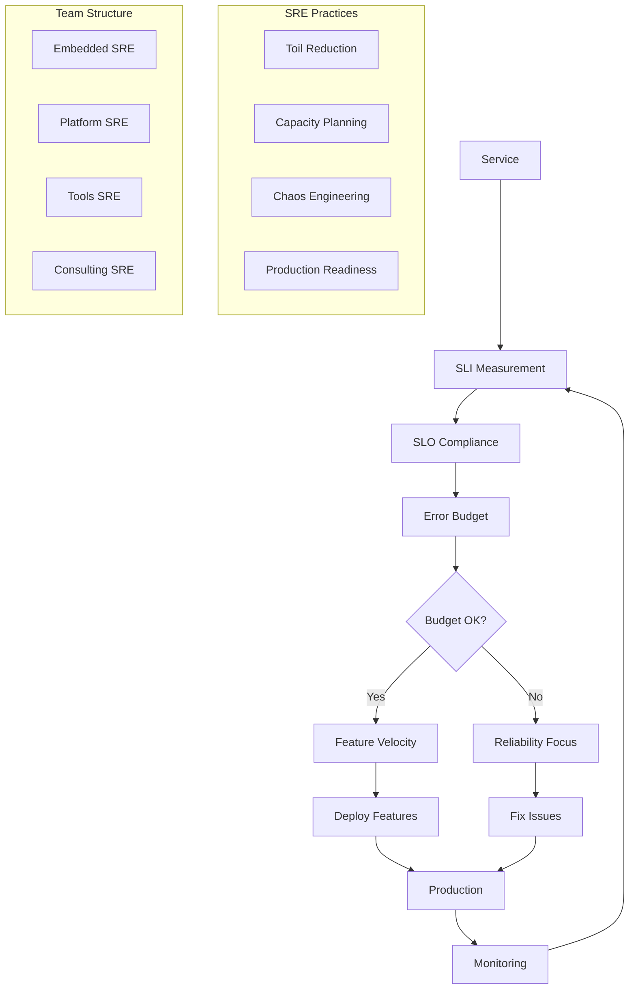

# Site Reliability Engineering (SRE) Standards

**Version:** v1.0.0  
**Domain:** reliability  
**Type:** Technical  
**Risk Level:** HIGH  
**Maturity Level:** Production  
**Author:** MCP Standards Team  
**Created:** 2025-07-08T12:00:00.000000  
**Last Updated:** 2025-07-08T12:00:00.000000  

## Purpose

Comprehensive standards for Site Reliability Engineering practices, including error budget policies, toil reduction strategies, capacity planning, service level objectives, reliability testing, production readiness reviews, and SRE team organization

This SRE standard defines the requirements, guidelines, and best practices for implementing Site Reliability Engineering. It provides comprehensive guidance for establishing error budgets, reducing operational toil, planning capacity, defining service level objectives, testing reliability, conducting production readiness reviews, and organizing SRE teams while ensuring scalable, reliable, and efficient service operations.

**Site Reliability Engineering Focus Areas:**
- **Error Budget Management**: Policy definition and tracking
- **Toil Reduction**: Automation and elimination strategies
- **Capacity Planning**: Predictive scaling and resource management
- **Service Level Objectives**: SLO definition and monitoring
- **Reliability Testing**: Chaos engineering and load testing
- **Production Readiness**: Launch reviews and checklists
- **Team Organization**: SRE roles and responsibilities

## Scope

This SRE standard applies to:
- Error budget policy creation and enforcement
- Toil identification and automation
- Capacity planning and forecasting
- Service level objective management
- Reliability and chaos testing
- Production readiness assessments
- SRE team structure and operations
- Incident management and response
- Post-mortem and learning culture

## Implementation

### SRE Requirements

**NIST Controls:** NIST-SA-8, SA-11, SA-15, SC-5, SI-2, SI-4, SI-6, CA-7, CP-2, CP-10, RA-3, RA-5, PM-14, PM-30

**Engineering Standards:** Google SRE practices, DevOps principles, DORA metrics
**Reliability Standards:** Four 9s (99.99%) availability, sub-second latency
**Automation Standards:** Infrastructure as Code, GitOps, Policy as Code

### SRE Architecture

#### Comprehensive SRE Framework


#### SRE Implementation
```python
# Example: Comprehensive SRE management system
import asyncio
import time
import random
from datetime import datetime, timedelta
from typing import List, Dict, Any, Optional, Callable, Tuple
from dataclasses import dataclass, field
from enum import Enum
import numpy as np
from collections import defaultdict, deque
import statistics

class SLIType(Enum):
    """Types of Service Level Indicators"""
    AVAILABILITY = "availability"
    LATENCY = "latency"
    THROUGHPUT = "throughput"
    ERROR_RATE = "error_rate"
    DURABILITY = "durability"
    QUALITY = "quality"

class ToilCategory(Enum):
    """Categories of operational toil"""
    MANUAL = "manual"
    REPETITIVE = "repetitive"
    AUTOMATABLE = "automatable"
    TACTICAL = "tactical"
    NO_VALUE = "no_value"
    GROWS_WITH_SERVICE = "grows_with_service"

class ReliabilityRisk(Enum):
    """Reliability risk levels"""
    CRITICAL = "critical"
    HIGH = "high"
    MEDIUM = "medium"
    LOW = "low"
    MINIMAL = "minimal"

@dataclass
class SLI:
    """Service Level Indicator definition"""
    name: str
    type: SLIType
    description: str
    measurement_query: str
    unit: str
    aggregation: str = "average"  # average, percentile, sum
    
    def calculate(self, metrics: List[float]) -> float:
        """Calculate SLI value from metrics"""
        if not metrics:
            return 0.0
        
        if self.aggregation == "average":
            return statistics.mean(metrics)
        elif self.aggregation == "p50":
            return np.percentile(metrics, 50)
        elif self.aggregation == "p95":
            return np.percentile(metrics, 95)
        elif self.aggregation == "p99":
            return np.percentile(metrics, 99)
        elif self.aggregation == "sum":
            return sum(metrics)
        else:
            return statistics.mean(metrics)

@dataclass
class SLO:
    """Service Level Objective definition"""
    name: str
    sli: SLI
    target: float
    window: timedelta
    description: str
    consequences: str  # What happens if we miss this SLO
    
    def is_met(self, current_value: float) -> bool:
        """Check if SLO is currently met"""
        if self.sli.type in [SLIType.AVAILABILITY, SLIType.THROUGHPUT]:
            return current_value >= self.target
        elif self.sli.type in [SLIType.LATENCY, SLIType.ERROR_RATE]:
            return current_value <= self.target
        return True

@dataclass
class ErrorBudget:
    """Error budget tracking"""
    slo: SLO
    total_budget: float  # Total allowed errors/downtime
    consumed: float = 0.0
    period_start: datetime = field(default_factory=datetime.utcnow)
    
    def remaining_budget(self) -> float:
        """Calculate remaining error budget"""
        return max(0, self.total_budget - self.consumed)
    
    def remaining_percentage(self) -> float:
        """Calculate remaining budget as percentage"""
        if self.total_budget == 0:
            return 0.0
        return (self.remaining_budget() / self.total_budget) * 100
    
    def burn_rate(self) -> float:
        """Calculate current burn rate"""
        elapsed = (datetime.utcnow() - self.period_start).total_seconds() / 3600  # hours
        if elapsed == 0:
            return 0.0
        return self.consumed / elapsed
    
    def time_until_exhausted(self) -> Optional[timedelta]:
        """Estimate time until budget exhausted at current burn rate"""
        rate = self.burn_rate()
        if rate == 0:
            return None
        
        remaining = self.remaining_budget()
        hours_remaining = remaining / rate
        return timedelta(hours=hours_remaining)

@dataclass
class ToilItem:
    """Operational toil tracking"""
    id: str
    name: str
    category: ToilCategory
    description: str
    frequency_per_week: float
    minutes_per_occurrence: float
    automatable: bool
    automation_effort_hours: Optional[float] = None
    business_impact: str = "medium"
    assigned_to: Optional[str] = None
    
    def weekly_toil_hours(self) -> float:
        """Calculate weekly toil hours"""
        return (self.frequency_per_week * self.minutes_per_occurrence) / 60
    
    def annual_toil_hours(self) -> float:
        """Calculate annual toil hours"""
        return self.weekly_toil_hours() * 52
    
    def automation_roi_months(self) -> Optional[float]:
        """Calculate ROI for automation in months"""
        if not self.automatable or not self.automation_effort_hours:
            return None
        
        monthly_savings = self.weekly_toil_hours() * 4.33
        if monthly_savings == 0:
            return None
        
        return self.automation_effort_hours / monthly_savings

@dataclass
class CapacityMetrics:
    """Capacity planning metrics"""
    resource: str
    current_usage: float
    peak_usage: float
    capacity_limit: float
    growth_rate_percent_monthly: float
    
    def utilization_percent(self) -> float:
        """Current utilization percentage"""
        return (self.current_usage / self.capacity_limit) * 100
    
    def peak_utilization_percent(self) -> float:
        """Peak utilization percentage"""
        return (self.peak_usage / self.capacity_limit) * 100
    
    def months_until_capacity(self) -> float:
        """Months until capacity limit reached"""
        if self.growth_rate_percent_monthly == 0:
            return float('inf')
        
        remaining_capacity = self.capacity_limit - self.current_usage
        monthly_growth = self.current_usage * (self.growth_rate_percent_monthly / 100)
        
        if monthly_growth <= 0:
            return float('inf')
        
        return remaining_capacity / monthly_growth

class ErrorBudgetPolicy:
    """Error budget policy management"""
    
    def __init__(self):
        self.policies: Dict[str, Dict[str, Any]] = {}
        self.enforcement_actions: Dict[str, List[Callable]] = {}
        
    def define_policy(self, service: str, policy: Dict[str, Any]):
        """Define error budget policy for a service"""
        self.policies[service] = policy
        
        # Example policy structure
        default_policy = {
            "thresholds": {
                "warning": 20,      # 20% budget remaining
                "critical": 10,     # 10% budget remaining
                "exhausted": 0      # No budget remaining
            },
            "actions": {
                "warning": ["notify_team", "review_deploys"],
                "critical": ["freeze_features", "focus_reliability"],
                "exhausted": ["halt_deploys", "all_hands_reliability"]
            },
            "exceptions": ["security_fixes", "critical_bugs"]
        }
        
        self.policies[service] = {**default_policy, **policy}
    
    def evaluate_budget(self, service: str, budget: ErrorBudget) -> List[str]:
        """Evaluate budget and return required actions"""
        if service not in self.policies:
            return []
        
        policy = self.policies[service]
        remaining_percent = budget.remaining_percentage()
        actions = []
        
        if remaining_percent <= policy["thresholds"]["exhausted"]:
            actions.extend(policy["actions"]["exhausted"])
        elif remaining_percent <= policy["thresholds"]["critical"]:
            actions.extend(policy["actions"]["critical"])
        elif remaining_percent <= policy["thresholds"]["warning"]:
            actions.extend(policy["actions"]["warning"])
        
        return actions
    
    def should_allow_deploy(self, service: str, budget: ErrorBudget, 
                          change_type: str) -> Tuple[bool, str]:
        """Determine if deployment should be allowed"""
        policy = self.policies.get(service, {})
        exceptions = policy.get("exceptions", [])
        
        # Always allow exception types
        if change_type in exceptions:
            return True, f"Allowed: {change_type} is an exception"
        
        # Check budget
        remaining_percent = budget.remaining_percentage()
        
        if remaining_percent <= policy.get("thresholds", {}).get("exhausted", 0):
            return False, "Denied: Error budget exhausted"
        elif remaining_percent <= policy.get("thresholds", {}).get("critical", 10):
            return False, "Denied: Error budget critical"
        
        return True, "Allowed: Sufficient error budget"

class ToilTracker:
    """Track and manage operational toil"""
    
    def __init__(self):
        self.toil_items: Dict[str, ToilItem] = {}
        self.automation_queue: List[str] = []
        
    def add_toil_item(self, item: ToilItem):
        """Add toil item to tracker"""
        self.toil_items[item.id] = item
        
        # Add to automation queue if good ROI
        if item.automatable and item.automation_roi_months():
            roi = item.automation_roi_months()
            if roi and roi < 6:  # Less than 6 months ROI
                self.automation_queue.append(item.id)
    
    def calculate_toil_metrics(self) -> Dict[str, Any]:
        """Calculate overall toil metrics"""
        total_weekly_hours = sum(item.weekly_toil_hours() 
                                for item in self.toil_items.values())
        
        automatable_hours = sum(item.weekly_toil_hours() 
                               for item in self.toil_items.values() 
                               if item.automatable)
        
        by_category = defaultdict(float)
        for item in self.toil_items.values():
            by_category[item.category.value] += item.weekly_toil_hours()
        
        return {
            "total_weekly_hours": total_weekly_hours,
            "total_annual_hours": total_weekly_hours * 52,
            "automatable_hours": automatable_hours,
            "automation_potential_percent": (automatable_hours / total_weekly_hours * 100) 
                                          if total_weekly_hours > 0 else 0,
            "by_category": dict(by_category),
            "top_toil_items": self._get_top_toil_items(5)
        }
    
    def _get_top_toil_items(self, count: int) -> List[Dict[str, Any]]:
        """Get top toil items by time consumed"""
        sorted_items = sorted(self.toil_items.values(), 
                            key=lambda x: x.weekly_toil_hours(), 
                            reverse=True)
        
        return [
            {
                "id": item.id,
                "name": item.name,
                "weekly_hours": item.weekly_toil_hours(),
                "automation_roi_months": item.automation_roi_months()
            }
            for item in sorted_items[:count]
        ]
    
    def prioritize_automation(self) -> List[ToilItem]:
        """Prioritize toil items for automation"""
        automatable_items = [
            item for item in self.toil_items.values() 
            if item.automatable and item.automation_roi_months()
        ]
        
        # Sort by ROI (lowest first - quickest payback)
        return sorted(automatable_items, key=lambda x: x.automation_roi_months())

class CapacityPlanner:
    """Capacity planning and forecasting"""
    
    def __init__(self):
        self.metrics_history: Dict[str, deque] = defaultdict(lambda: deque(maxlen=90))
        self.capacity_limits: Dict[str, float] = {}
        self.scaling_policies: Dict[str, Dict[str, Any]] = {}
        
    def record_metric(self, resource: str, value: float, timestamp: datetime):
        """Record capacity metric"""
        self.metrics_history[resource].append({
            "value": value,
            "timestamp": timestamp
        })
    
    def set_capacity_limit(self, resource: str, limit: float):
        """Set capacity limit for resource"""
        self.capacity_limits[resource] = limit
    
    def forecast_capacity(self, resource: str, days_ahead: int = 90) -> Dict[str, Any]:
        """Forecast capacity needs"""
        if resource not in self.metrics_history:
            return {"error": "No historical data"}
        
        history = list(self.metrics_history[resource])
        if len(history) < 7:
            return {"error": "Insufficient historical data"}
        
        # Calculate growth trend (simplified linear regression)
        values = [h["value"] for h in history]
        x = list(range(len(values)))
        
        # Calculate slope
        n = len(values)
        slope = (n * sum(i * v for i, v in enumerate(values)) - sum(x) * sum(values)) / \
                (n * sum(i**2 for i in x) - sum(x)**2)
        
        # Current value
        current = values[-1]
        
        # Forecast
        daily_growth = slope
        forecast_value = current + (daily_growth * days_ahead)
        
        # Calculate when we'll hit capacity
        capacity_limit = self.capacity_limits.get(resource, float('inf'))
        days_until_capacity = None
        if daily_growth > 0 and forecast_value < capacity_limit:
            days_until_capacity = (capacity_limit - current) / daily_growth
        
        return {
            "current_value": current,
            "forecast_value": forecast_value,
            "daily_growth_rate": daily_growth,
            "capacity_limit": capacity_limit,
            "days_until_capacity": days_until_capacity,
            "recommendation": self._get_capacity_recommendation(
                current, forecast_value, capacity_limit
            )
        }
    
    def _get_capacity_recommendation(self, current: float, 
                                   forecast: float, limit: float) -> str:
        """Get capacity planning recommendation"""
        current_util = (current / limit) * 100
        forecast_util = (forecast / limit) * 100
        
        if forecast_util > 90:
            return "URGENT: Immediate capacity increase required"
        elif forecast_util > 80:
            return "WARNING: Plan capacity increase within 30 days"
        elif forecast_util > 70:
            return "MONITOR: Review capacity quarterly"
        else:
            return "OK: Adequate capacity headroom"

class ChaosExperiment:
    """Chaos engineering experiment definition"""
    
    def __init__(self, name: str, description: str):
        self.name = name
        self.description = description
        self.hypothesis = ""
        self.blast_radius = "small"  # small, medium, large
        self.rollback_plan = ""
        self.steady_state_checks: List[Callable] = []
        self.chaos_actions: List[Callable] = []
        self.abort_conditions: List[Callable] = []
        
    async def run(self) -> Dict[str, Any]:
        """Run chaos experiment"""
        result = {
            "experiment": self.name,
            "started_at": datetime.utcnow(),
            "hypothesis": self.hypothesis,
            "steady_state": "unknown",
            "experiment_result": "not_run",
            "findings": []
        }
        
        try:
            # Check steady state
            steady_state_ok = await self._check_steady_state()
            result["steady_state"] = "verified" if steady_state_ok else "not_verified"
            
            if not steady_state_ok:
                result["experiment_result"] = "aborted"
                result["findings"].append("Steady state not verified")
                return result
            
            # Run chaos actions
            for action in self.chaos_actions:
                # Check abort conditions
                if await self._should_abort():
                    result["experiment_result"] = "aborted"
                    result["findings"].append("Abort condition triggered")
                    await self._rollback()
                    return result
                
                # Execute chaos action
                await action()
            
            # Verify steady state maintained
            steady_state_after = await self._check_steady_state()
            
            if steady_state_after:
                result["experiment_result"] = "hypothesis_confirmed"
                result["findings"].append("System maintained steady state under chaos")
            else:
                result["experiment_result"] = "hypothesis_refuted"
                result["findings"].append("System failed to maintain steady state")
            
        except Exception as e:
            result["experiment_result"] = "error"
            result["error"] = str(e)
            await self._rollback()
        
        finally:
            result["completed_at"] = datetime.utcnow()
        
        return result
    
    async def _check_steady_state(self) -> bool:
        """Check if system is in steady state"""
        for check in self.steady_state_checks:
            if not await check():
                return False
        return True
    
    async def _should_abort(self) -> bool:
        """Check abort conditions"""
        for condition in self.abort_conditions:
            if await condition():
                return True
        return False
    
    async def _rollback(self):
        """Execute rollback plan"""
        # Implementation depends on experiment
        pass

class ProductionReadinessReview:
    """Production readiness review system"""
    
    def __init__(self):
        self.checklists = {
            "architecture": [
                "Load balancing configured",
                "Auto-scaling policies defined",
                "Circuit breakers implemented",
                "Retry logic with backoff",
                "Graceful degradation paths"
            ],
            "reliability": [
                "SLIs and SLOs defined",
                "Error budget policy established",
                "Monitoring and alerting configured",
                "Runbooks documented",
                "On-call rotation assigned"
            ],
            "operations": [
                "Deployment pipeline automated",
                "Rollback procedures tested",
                "Capacity planning completed",
                "Backup and recovery tested",
                "Security review passed"
            ],
            "testing": [
                "Load testing completed",
                "Chaos experiments run",
                "Failure mode testing done",
                "Performance benchmarks met",
                "Integration tests passing"
            ]
        }
        
    def review_service(self, service_name: str, 
                      responses: Dict[str, Dict[str, bool]]) -> Dict[str, Any]:
        """Conduct production readiness review"""
        review_result = {
            "service": service_name,
            "review_date": datetime.utcnow(),
            "overall_score": 0,
            "category_scores": {},
            "blocking_issues": [],
            "recommendations": [],
            "approved": False
        }
        
        total_items = 0
        completed_items = 0
        
        for category, checklist in self.checklists.items():
            category_responses = responses.get(category, {})
            category_completed = sum(1 for item in checklist 
                                   if category_responses.get(item, False))
            category_total = len(checklist)
            
            category_score = (category_completed / category_total) * 100
            review_result["category_scores"][category] = category_score
            
            total_items += category_total
            completed_items += category_completed
            
            # Identify blocking issues
            for item in checklist:
                if not category_responses.get(item, False):
                    if self._is_blocking(category, item):
                        review_result["blocking_issues"].append(f"{category}: {item}")
                    else:
                        review_result["recommendations"].append(f"Complete: {category} - {item}")
        
        # Calculate overall score
        review_result["overall_score"] = (completed_items / total_items) * 100
        
        # Determine approval
        review_result["approved"] = (
            review_result["overall_score"] >= 90 and 
            len(review_result["blocking_issues"]) == 0
        )
        
        return review_result
    
    def _is_blocking(self, category: str, item: str) -> bool:
        """Determine if missing item is blocking"""
        blocking_items = {
            "reliability": ["SLIs and SLOs defined", "Monitoring and alerting configured"],
            "operations": ["Rollback procedures tested", "Security review passed"],
            "architecture": ["Load balancing configured"]
        }
        
        return item in blocking_items.get(category, [])

class SRETeam:
    """SRE team management"""
    
    def __init__(self, team_name: str, team_type: str):
        self.team_name = team_name
        self.team_type = team_type  # embedded, platform, tools, consulting
        self.members: List[Dict[str, Any]] = []
        self.services: List[str] = []
        self.metrics: Dict[str, Any] = {}
        
    def add_member(self, name: str, role: str, skills: List[str]):
        """Add team member"""
        self.members.append({
            "name": name,
            "role": role,
            "skills": skills,
            "on_call_eligible": True
        })
    
    def assign_service(self, service: str):
        """Assign service to team"""
        self.services.append(service)
    
    def calculate_team_metrics(self) -> Dict[str, Any]:
        """Calculate team performance metrics"""
        return {
            "team_size": len(self.members),
            "services_supported": len(self.services),
            "service_to_sre_ratio": len(self.services) / len(self.members) 
                                   if self.members else 0,
            "on_call_rotation_size": sum(1 for m in self.members 
                                        if m["on_call_eligible"]),
            "skills_coverage": self._calculate_skills_coverage()
        }
    
    def _calculate_skills_coverage(self) -> Dict[str, int]:
        """Calculate team skills coverage"""
        skills_count = defaultdict(int)
        for member in self.members:
            for skill in member["skills"]:
                skills_count[skill] += 1
        return dict(skills_count)

class SREOrchestrator:
    """Main SRE orchestration system"""
    
    def __init__(self):
        self.slos: Dict[str, SLO] = {}
        self.error_budgets: Dict[str, ErrorBudget] = {}
        self.error_budget_policy = ErrorBudgetPolicy()
        self.toil_tracker = ToilTracker()
        self.capacity_planner = CapacityPlanner()
        self.teams: Dict[str, SRETeam] = {}
        self.experiments: List[ChaosExperiment] = []
        self.production_readiness = ProductionReadinessReview()
        
    def define_slo(self, service: str, slo: SLO):
        """Define SLO for a service"""
        self.slos[f"{service}_{slo.name}"] = slo
        
        # Create error budget
        budget_size = (100 - slo.target) / 100 * slo.window.total_seconds() / 60
        self.error_budgets[f"{service}_{slo.name}"] = ErrorBudget(
            slo=slo,
            total_budget=budget_size
        )
    
    def record_sli_measurement(self, service: str, slo_name: str, value: float):
        """Record SLI measurement and update error budget"""
        key = f"{service}_{slo_name}"
        if key not in self.slos:
            return
        
        slo = self.slos[key]
        budget = self.error_budgets[key]
        
        # Update error budget if SLO violated
        if not slo.is_met(value):
            # Calculate budget consumption based on violation severity
            if slo.sli.type == SLIType.AVAILABILITY:
                budget.consumed += (slo.target - value) / 100
            elif slo.sli.type == SLIType.ERROR_RATE:
                budget.consumed += (value - slo.target) / 100
    
    def get_service_reliability_report(self, service: str) -> Dict[str, Any]:
        """Generate comprehensive reliability report for service"""
        report = {
            "service": service,
            "timestamp": datetime.utcnow(),
            "slos": {},
            "error_budgets": {},
            "toil_metrics": {},
            "capacity_forecast": {},
            "recommendations": []
        }
        
        # SLO compliance
        for key, slo in self.slos.items():
            if key.startswith(f"{service}_"):
                # Simulate current SLI value
                current_value = 99.5 if slo.sli.type == SLIType.AVAILABILITY else 0.5
                
                report["slos"][slo.name] = {
                    "target": slo.target,
                    "current": current_value,
                    "compliant": slo.is_met(current_value),
                    "window": str(slo.window)
                }
        
        # Error budget status
        for key, budget in self.error_budgets.items():
            if key.startswith(f"{service}_"):
                report["error_budgets"][budget.slo.name] = {
                    "remaining_percent": budget.remaining_percentage(),
                    "burn_rate": budget.burn_rate(),
                    "time_until_exhausted": str(budget.time_until_exhausted()) 
                                           if budget.time_until_exhausted() else "N/A"
                }
                
                # Check policy actions
                actions = self.error_budget_policy.evaluate_budget(service, budget)
                if actions:
                    report["recommendations"].extend(actions)
        
        # Toil metrics
        service_toil = [item for item in self.toil_tracker.toil_items.values() 
                       if service in item.name]
        if service_toil:
            weekly_toil = sum(item.weekly_toil_hours() for item in service_toil)
            report["toil_metrics"] = {
                "weekly_hours": weekly_toil,
                "items": len(service_toil),
                "automation_opportunities": sum(1 for item in service_toil 
                                              if item.automatable)
            }
        
        # Capacity forecast
        for resource in [f"{service}_cpu", f"{service}_memory", f"{service}_storage"]:
            forecast = self.capacity_planner.forecast_capacity(resource)
            if "error" not in forecast:
                report["capacity_forecast"][resource] = forecast
        
        return report
    
    def create_chaos_experiment(self, name: str, description: str) -> ChaosExperiment:
        """Create new chaos experiment"""
        experiment = ChaosExperiment(name, description)
        self.experiments.append(experiment)
        return experiment
    
    def generate_sre_dashboard(self) -> Dict[str, Any]:
        """Generate SRE metrics dashboard data"""
        dashboard = {
            "generated_at": datetime.utcnow(),
            "services": {},
            "toil_summary": self.toil_tracker.calculate_toil_metrics(),
            "team_metrics": {},
            "recent_experiments": [],
            "production_readiness_queue": []
        }
        
        # Service reliability metrics
        for service in set(key.split("_")[0] for key in self.slos.keys()):
            dashboard["services"][service] = self.get_service_reliability_report(service)
        
        # Team metrics
        for team_name, team in self.teams.items():
            dashboard["team_metrics"][team_name] = team.calculate_team_metrics()
        
        # Recent chaos experiments
        dashboard["recent_experiments"] = [
            {
                "name": exp.name,
                "description": exp.description,
                "blast_radius": exp.blast_radius
            }
            for exp in self.experiments[-5:]
        ]
        
        return dashboard

# Example usage
async def main():
    # Initialize SRE orchestrator
    sre = SREOrchestrator()
    
    # Define SLOs
    api_availability_sli = SLI(
        name="api_availability",
        type=SLIType.AVAILABILITY,
        description="API endpoint availability",
        measurement_query="sum(up{job='api'}) / count(up{job='api'})",
        unit="percent"
    )
    
    api_availability_slo = SLO(
        name="api_availability",
        sli=api_availability_sli,
        target=99.9,
        window=timedelta(days=30),
        description="API must be 99.9% available",
        consequences="Customer impact, SLA violations"
    )
    
    sre.define_slo("api", api_availability_slo)
    
    # Define error budget policy
    sre.error_budget_policy.define_policy("api", {
        "thresholds": {
            "warning": 25,
            "critical": 10,
            "exhausted": 0
        },
        "actions": {
            "warning": ["increase_monitoring", "review_changes"],
            "critical": ["freeze_features", "reliability_sprint"],
            "exhausted": ["stop_all_changes", "incident_review"]
        }
    })
    
    # Track toil
    sre.toil_tracker.add_toil_item(ToilItem(
        id="toil_001",
        name="Manual certificate renewal",
        category=ToilCategory.MANUAL,
        description="Manually renew SSL certificates",
        frequency_per_week=0.25,  # Once per month
        minutes_per_occurrence=120,
        automatable=True,
        automation_effort_hours=16
    ))
    
    sre.toil_tracker.add_toil_item(ToilItem(
        id="toil_002",
        name="Database connection reset",
        category=ToilCategory.REPETITIVE,
        description="Reset stuck database connections",
        frequency_per_week=5,
        minutes_per_occurrence=15,
        automatable=True,
        automation_effort_hours=8
    ))
    
    # Set capacity limits
    sre.capacity_planner.set_capacity_limit("api_cpu", 1000)  # CPU cores
    sre.capacity_planner.set_capacity_limit("api_memory", 4096)  # GB
    
    # Record some metrics
    for i in range(30):
        sre.capacity_planner.record_metric(
            "api_cpu",
            500 + i * 10 + random.randint(-20, 20),
            datetime.utcnow() - timedelta(days=30-i)
        )
    
    # Create SRE team
    platform_team = SRETeam("platform-sre", "platform")
    platform_team.add_member("Alice", "Senior SRE", ["kubernetes", "python", "monitoring"])
    platform_team.add_member("Bob", "SRE", ["golang", "terraform", "networking"])
    platform_team.assign_service("api")
    platform_team.assign_service("database")
    
    sre.teams["platform-sre"] = platform_team
    
    # Create chaos experiment
    experiment = sre.create_chaos_experiment(
        "API Latency Injection",
        "Test API resilience to increased latency"
    )
    
    experiment.hypothesis = "API maintains SLO with 100ms added latency"
    experiment.blast_radius = "small"
    
    # Define experiment checks
    async def check_api_health():
        # Simulate health check
        return True
    
    async def inject_latency():
        # Simulate latency injection
        print("Injecting 100ms latency")
        await asyncio.sleep(1)
    
    experiment.steady_state_checks.append(check_api_health)
    experiment.chaos_actions.append(inject_latency)
    
    # Run experiment
    result = await experiment.run()
    print(f"Chaos experiment result: {result}")
    
    # Production readiness review
    review_responses = {
        "architecture": {
            "Load balancing configured": True,
            "Auto-scaling policies defined": True,
            "Circuit breakers implemented": False,
            "Retry logic with backoff": True,
            "Graceful degradation paths": True
        },
        "reliability": {
            "SLIs and SLOs defined": True,
            "Error budget policy established": True,
            "Monitoring and alerting configured": True,
            "Runbooks documented": False,
            "On-call rotation assigned": True
        }
    }
    
    review_result = sre.production_readiness.review_service("new-service", review_responses)
    print(f"Production readiness review: {review_result}")
    
    # Generate dashboard
    dashboard = sre.generate_sre_dashboard()
    print(f"SRE Dashboard: {json.dumps(dashboard, indent=2, default=str)}")

if __name__ == "__main__":
    asyncio.run(main())
```

### Error Budget Policy Framework

#### Error Budget Decision Matrix
| Budget Remaining | Feature Velocity | Reliability Focus | Actions |
|-----------------|------------------|-------------------|---------|
| > 50% | Full speed | Normal | Continue feature development |
| 25-50% | Reduced | Increased | Review recent changes, increase testing |
| 10-25% | Minimal | High | Feature freeze, reliability sprint |
| < 10% | Stopped | Critical | All hands on reliability |
| 0% | Stopped | Emergency | Post-mortem, executive review |

### Toil Reduction Strategy

#### Toil Identification Checklist
```yaml
# Example: Toil identification criteria
toil_criteria:
  manual:
    description: "Task requires human intervention"
    examples:
      - Manual deployments
      - Certificate renewals
      - Access provisioning
    
  repetitive:
    description: "Task performed frequently"
    threshold: "> 1x per week"
    examples:
      - Log rotation
      - Backup verification
      - Health checks
  
  automatable:
    description: "Task can be scripted"
    criteria:
      - Well-defined steps
      - Predictable outcomes
      - No creative decisions
  
  tactical:
    description: "Interrupt-driven work"
    examples:
      - Alert responses
      - Ticket handling
      - Ad-hoc requests
  
  no_enduring_value:
    description: "No lasting benefit"
    examples:
      - Temporary fixes
      - Manual workarounds
      - Data cleanup
```

### Capacity Planning Models

#### Predictive Scaling Framework
```python
# Example: Capacity planning models
class CapacityModel:
    """Advanced capacity planning models"""
    
    @staticmethod
    def linear_growth_model(historical_data: List[float], 
                           future_periods: int) -> List[float]:
        """Simple linear growth projection"""
        if len(historical_data) < 2:
            return []
        
        # Calculate average growth
        growth_rates = []
        for i in range(1, len(historical_data)):
            growth = historical_data[i] - historical_data[i-1]
            growth_rates.append(growth)
        
        avg_growth = statistics.mean(growth_rates)
        
        # Project future
        projections = []
        last_value = historical_data[-1]
        for i in range(future_periods):
            last_value += avg_growth
            projections.append(last_value)
        
        return projections
    
    @staticmethod
    def seasonal_model(historical_data: List[float], 
                      season_length: int,
                      future_periods: int) -> List[float]:
        """Seasonal capacity model"""
        if len(historical_data) < season_length * 2:
            return []
        
        # Calculate seasonal factors
        seasonal_factors = []
        for i in range(season_length):
            season_values = [historical_data[j] 
                           for j in range(i, len(historical_data), season_length)]
            seasonal_factors.append(statistics.mean(season_values))
        
        # Normalize factors
        mean_factor = statistics.mean(seasonal_factors)
        seasonal_factors = [f / mean_factor for f in seasonal_factors]
        
        # Project with seasonality
        projections = []
        base_value = historical_data[-1]
        for i in range(future_periods):
            season_index = i % season_length
            projection = base_value * seasonal_factors[season_index]
            projections.append(projection)
            
        return projections
```

### SLO Definition Templates

#### Service Level Objectives
```yaml
# Example: Comprehensive SLO definitions
slos:
  availability:
    - name: "API Availability"
      sli: "successful_requests / total_requests"
      target: 99.9%
      window: "30 days rolling"
      consequences: "Customer-facing outages"
    
    - name: "Background Job Success"
      sli: "successful_jobs / total_jobs"
      target: 99.5%
      window: "7 days rolling"
      consequences: "Data processing delays"
  
  latency:
    - name: "API Response Time P95"
      sli: "95th percentile response time"
      target: "< 200ms"
      window: "1 hour rolling"
      consequences: "Poor user experience"
    
    - name: "Database Query P99"
      sli: "99th percentile query time"
      target: "< 100ms"
      window: "5 minutes rolling"
      consequences: "Application timeouts"
  
  durability:
    - name: "Data Durability"
      sli: "successful_writes / total_writes"
      target: 99.999%
      window: "90 days rolling"
      consequences: "Data loss"
```

### Reliability Testing Playbook

#### Chaos Engineering Scenarios
```python
# Example: Chaos experiment library
chaos_experiments = {
    "network_latency": {
        "description": "Add network latency between services",
        "parameters": {
            "latency_ms": [50, 100, 200, 500],
            "jitter_ms": [10, 20, 50],
            "packet_loss_percent": [0, 1, 5]
        },
        "steady_state": ["response_time_p99 < 1000ms", "error_rate < 1%"],
        "blast_radius": "single_service"
    },
    
    "pod_failure": {
        "description": "Randomly terminate pods",
        "parameters": {
            "percentage": [10, 25, 50],
            "interval_seconds": [60, 300, 600]
        },
        "steady_state": ["availability > 99%", "no_data_loss"],
        "blast_radius": "service_cluster"
    },
    
    "resource_exhaustion": {
        "description": "Consume CPU/memory resources",
        "parameters": {
            "cpu_percent": [50, 80, 95],
            "memory_percent": [50, 80, 95],
            "duration_minutes": [5, 15, 30]
        },
        "steady_state": ["degraded_performance_only", "no_cascading_failures"],
        "blast_radius": "single_node"
    },
    
    "dependency_failure": {
        "description": "Simulate dependency outages",
        "parameters": {
            "dependency": ["database", "cache", "external_api"],
            "failure_type": ["timeout", "error", "slow"]
        },
        "steady_state": ["graceful_degradation", "circuit_breaker_activates"],
        "blast_radius": "downstream_services"
    }
}
```

### Production Readiness Checklist

#### Comprehensive Launch Review
```markdown
# Production Readiness Checklist

## Architecture & Design
- [ ] Service architecture documented
- [ ] API contracts defined and versioned
- [ ] Data models reviewed and optimized
- [ ] Security threat model completed
- [ ] Scalability limits identified

## Reliability & SLOs
- [ ] SLIs identified and instrumented
- [ ] SLOs defined with error budgets
- [ ] Monitoring dashboards created
- [ ] Alerts configured with runbooks
- [ ] On-call rotation established

## Performance
- [ ] Load testing completed
- [ ] Performance benchmarks established
- [ ] Resource limits configured
- [ ] Auto-scaling policies defined
- [ ] Cache strategies implemented

## Operations
- [ ] CI/CD pipeline configured
- [ ] Rollback procedures tested
- [ ] Feature flags implemented
- [ ] Configuration management setup
- [ ] Secrets management configured

## Security
- [ ] Security review completed
- [ ] Authentication/authorization implemented
- [ ] Data encryption at rest and in transit
- [ ] Vulnerability scanning enabled
- [ ] Compliance requirements met

## Documentation
- [ ] Architecture documentation
- [ ] API documentation
- [ ] Runbooks for common issues
- [ ] Disaster recovery procedures
- [ ] Team onboarding guide
```

### SRE Team Models

#### Team Structure Options
```yaml
# Example: SRE team models
sre_team_models:
  embedded_sre:
    description: "SREs embedded in product teams"
    pros:
      - Deep product knowledge
      - Fast iteration
      - Direct influence
    cons:
      - Potential bias
      - Limited knowledge sharing
      - Difficult to maintain standards
    best_for: "Critical user-facing services"
  
  platform_sre:
    description: "Central platform team"
    pros:
      - Consistent standards
      - Shared infrastructure
      - Economy of scale
    cons:
      - Less product context
      - Potential bottleneck
      - Generic solutions
    best_for: "Common infrastructure and tools"
  
  consulting_sre:
    description: "SREs provide guidance and reviews"
    pros:
      - Scales well
      - Knowledge transfer
      - Maintains independence
    cons:
      - Limited direct impact
      - Requires mature teams
      - Slow feedback loops
    best_for: "Mature engineering organizations"
```

### Best Practices

1. **Error Budget Management**
   - Define clear policies
   - Automate enforcement
   - Regular reviews with stakeholders
   - Balance features vs reliability

2. **Toil Reduction**
   - Track toil continuously
   - Prioritize by ROI
   - Celebrate automation wins
   - Target < 50% operational work

3. **Capacity Planning**
   - Use multiple forecasting models
   - Plan for peak + growth
   - Regular capacity reviews
   - Automate scaling where possible

4. **Reliability Culture**
   - Blameless post-mortems
   - Share learnings widely
   - Invest in reliability features
   - Make reliability everyone's job

### Security Considerations

- Secure SRE tooling access
- Audit all production changes
- Encrypt sensitive metrics
- Implement least privilege
- Regular security reviews

### Compliance Requirements

- Document all SLO definitions
- Maintain availability records
- Track error budget consumption
- Regular reliability reporting
- Audit trail for all changes