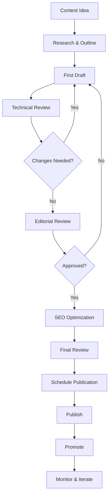

# Technical Content Creation Standards

**Version:** v1.0.0  
**Domain:** content_creation  
**Type:** Process  
**Risk Level:** MEDIUM  
**Maturity Level:** Production  
**Author:** MCP Standards Team  
**Created:** 2025-07-08T00:00:00.000000  
**Last Updated:** 2025-07-08T00:00:00.000000  

## Purpose

Comprehensive standards for creating high-quality technical content that educates, engages, and drives developer adoption

This Technical Content Creation standard defines the requirements, guidelines, and best practices for producing technical content including blog posts, tutorials, videos, presentations, and social media content. It provides comprehensive guidance for content planning, creation, optimization, and measurement while ensuring consistency and technical accuracy.

**Content Creation Focus Areas:**
- **Blog Posts**: Technical articles, case studies, and thought leadership
- **Tutorials**: Step-by-step guides and how-to content
- **Video Content**: Screencasts, demos, and technical presentations
- **Social Media**: Developer-focused social content
- **SEO Optimization**: Content discoverability and search ranking
- **Analytics**: Content performance measurement and optimization

## Scope

This Technical Content Creation standard applies to:
- All technical blog posts and articles
- Tutorial and how-to guide creation
- Video content production and scripting
- Technical presentation development
- Developer-focused social media content
- Content SEO and discoverability strategies
- Content analytics and performance tracking
- Content collaboration and review processes

## Implementation

### Technical Content Requirements

**NIST Controls:** NIST-AC-2, AC-3, AC-14, AU-4, CM-3, IA-2, PL-2, PM-15, RA-5, SA-5, SC-13, SI-10

**Content Governance:** Editorial standards and review processes
**Technical Accuracy:** Code validation and technical review
**Brand Consistency:** Style guides and content templates
**Accessibility:** WCAG 2.1 AA compliance for all content

### Blog Post Writing Standards

#### Blog Post Template
```markdown
# [Title - Clear, SEO-friendly, 60 chars max]

**Author:** [Name]  
**Date:** [YYYY-MM-DD]  
**Reading Time:** [X minutes]  
**Tags:** [tag1, tag2, tag3]  

## TL;DR
[2-3 sentence summary of the key takeaways]

## Introduction
[Hook the reader with the problem/opportunity - 2-3 paragraphs]

## Prerequisites
- [Required knowledge/tools]
- [Environment setup needed]
- [Links to relevant resources]

## Main Content
[Structured sections with clear headers]

### Section 1: [Descriptive Header]
[Content with code examples, diagrams, screenshots]

```language
// Well-commented code examples
// With proper syntax highlighting
```

### Section 2: [Descriptive Header]
[More content building on previous sections]

## Key Takeaways
- [Bullet point summary]
- [Main lessons learned]
- [Next steps for readers]

## Resources
- [Link to code repository]
- [Related documentation]
- [Further reading]

## Comments
[Enable comments for community engagement]
```

#### Blog Post Checklist
```yaml
pre_publish:
  content:
    - [ ] Clear problem statement
    - [ ] Logical flow and structure
    - [ ] Code examples tested and working
    - [ ] Screenshots/diagrams included
    - [ ] Links validated
  
  technical_review:
    - [ ] Code reviewed by subject matter expert
    - [ ] Technical accuracy verified
    - [ ] Best practices followed
    - [ ] Security considerations addressed
  
  seo_optimization:
    - [ ] Focus keyword identified
    - [ ] Meta description written (155 chars)
    - [ ] Headers properly structured (H1, H2, H3)
    - [ ] Internal/external links added
    - [ ] Image alt text provided
  
  accessibility:
    - [ ] Screen reader friendly
    - [ ] Color contrast checked
    - [ ] Code blocks have language specified
    - [ ] Images have descriptive alt text

post_publish:
  promotion:
    - [ ] Social media posts scheduled
    - [ ] Internal teams notified
    - [ ] Newsletter inclusion considered
    - [ ] Community forums posted
  
  monitoring:
    - [ ] Analytics tracking enabled
    - [ ] Comment moderation active
    - [ ] Feedback channels open
```

### Tutorial Creation Process

#### Tutorial Structure
```markdown
# How to [Achieve Specific Goal]

## What You'll Learn
- [Learning objective 1]
- [Learning objective 2]
- [Learning objective 3]

## Prerequisites
```bash
# Required tools and versions
node --version  # v18+
npm --version   # v9+
```

## Step 1: [Setup/Initial Configuration]
[Clear instructions with context]

```bash
# Command with explanation
npm init -y
```

**What's happening:** [Explain the command and its purpose]

## Step 2: [Next Logical Step]
[Build on previous step]

```javascript
// Code example with inline comments
const express = require('express');
const app = express();

// Middleware configuration
app.use(express.json()); // Parse JSON bodies
```

## Step 3: [Continue Building]
[Progressive complexity]

### Common Issues
**Problem:** [Describe common error]
**Solution:** [Provide fix with explanation]

## Testing Your Implementation
```bash
# Test commands
npm test
curl http://localhost:3000/api/endpoint
```

## Next Steps
- [Advanced feature to explore]
- [Related tutorial]
- [Community resources]
```

#### Tutorial Quality Standards
```python
# Tutorial validation framework
from typing import List, Dict, Any
import subprocess
import tempfile
import os

class TutorialValidator:
    """Validates tutorial code examples and commands."""
    
    def __init__(self):
        self.validation_results = []
    
    def validate_code_blocks(self, tutorial_content: str) -> Dict[str, Any]:
        """Extract and validate all code blocks."""
        code_blocks = self.extract_code_blocks(tutorial_content)
        results = {
            'total_blocks': len(code_blocks),
            'validated': 0,
            'errors': []
        }
        
        for block in code_blocks:
            if self.validate_syntax(block['code'], block['language']):
                results['validated'] += 1
            else:
                results['errors'].append({
                    'line': block['line'],
                    'language': block['language'],
                    'error': 'Syntax validation failed'
                })
        
        return results
    
    def validate_commands(self, commands: List[str]) -> List[Dict[str, Any]]:
        """Test shell commands in isolated environment."""
        results = []
        
        with tempfile.TemporaryDirectory() as tmpdir:
            for cmd in commands:
                result = self.run_command_safely(cmd, tmpdir)
                results.append(result)
        
        return results
    
    def check_prerequisites(self, requirements: Dict[str, str]) -> Dict[str, bool]:
        """Verify required tools and versions."""
        results = {}
        
        for tool, version in requirements.items():
            results[tool] = self.check_tool_version(tool, version)
        
        return results
```

### Video Content Standards

#### Video Script Template
```markdown
# Video Title: [Compelling Title]
**Duration:** [Target length]
**Type:** [Tutorial/Demo/Presentation]

## Hook (0:00-0:15)
[Attention-grabbing opening]
- Problem statement
- What viewers will learn
- Why it matters

## Introduction (0:15-0:45)
[Presenter introduction and context]
- Brief background
- Prerequisite knowledge
- Tools/environment needed

## Main Content (0:45-X:XX)
### Section 1: [Topic]
**Visual:** [Screen/slides/demo]
**Script:** [What to say]
**Action:** [What to show]

### Section 2: [Topic]
**Visual:** [Screen/slides/demo]
**Script:** [What to say]
**Action:** [What to show]

## Demo/Code Walkthrough
[Step-by-step demonstration]
- Clear narration
- Highlight key points
- Show common pitfalls

## Summary (X:XX-X:XX)
[Recap and next steps]
- Key takeaways
- Resources and links
- Call to action

## Outro (Final 15s)
[Closing and engagement]
- Subscribe/follow prompt
- Related content
- Community links
```

#### Video Production Checklist
```yaml
pre_production:
  planning:
    - [ ] Script written and reviewed
    - [ ] Technical content validated
    - [ ] Demo environment prepared
    - [ ] Assets created (slides, graphics)
  
  setup:
    - [ ] Recording software configured
    - [ ] Audio levels tested
    - [ ] Screen resolution optimized (1920x1080)
    - [ ] Desktop cleaned and organized

recording:
  quality:
    - [ ] Clear audio (no background noise)
    - [ ] Consistent pacing
    - [ ] Screen clearly visible
    - [ ] Smooth transitions
  
  content:
    - [ ] Introduction recorded
    - [ ] Main content captured
    - [ ] Errors edited out
    - [ ] Outro included

post_production:
  editing:
    - [ ] Intro/outro graphics added
    - [ ] Captions generated
    - [ ] Annotations added
    - [ ] Audio normalized
  
  optimization:
    - [ ] Thumbnail created
    - [ ] SEO title and description
    - [ ] Tags selected
    - [ ] Chapters/timestamps added
```

### Technical Presentation Standards

#### Presentation Template Structure
```yaml
title_slide:
  - title: "Clear, Compelling Title"
  - subtitle: "What attendees will learn"
  - speaker: "Name and credentials"
  - date: "Conference/Event name"

agenda_slide:
  - introduction: "2-3 minutes"
  - main_content: "15-20 minutes"
  - demo: "10-15 minutes"
  - qa: "5-10 minutes"

content_guidelines:
  - max_bullet_points: 5
  - font_size_minimum: 24pt
  - code_font_size: 18pt
  - slides_per_topic: 3-5
  
visual_standards:
  - consistent_color_scheme: true
  - high_contrast: true
  - minimal_animations: true
  - code_syntax_highlighting: true
```

#### Presentation Code Examples
```javascript
// Live coding best practices
class PresentationDemo {
    constructor() {
        // Start with working code
        this.baseCode = this.loadWorkingExample();
        
        // Prepare incremental changes
        this.steps = this.prepareSteps();
        
        // Have fallback ready
        this.fallbackCode = this.loadFallback();
    }
    
    demonstrateFeature() {
        try {
            // Show initial state
            this.showCode(this.baseCode);
            
            // Apply changes step by step
            this.steps.forEach((step, index) => {
                this.explainChange(step);
                this.applyChange(step);
                this.showResult();
            });
            
        } catch (error) {
            // Gracefully handle errors
            console.log("Let's look at what went wrong...");
            this.showFallback();
        }
    }
}
```

### Social Media Content for Developers

#### Platform-Specific Templates

**Twitter/X Thread Template**
```text
🚀 Just discovered an awesome way to [solve problem]!

Here's a quick thread on how to [achieve result] 🧵

1/ The problem:
[Describe the challenge developers face]

2/ The solution:
[High-level approach]

```javascript
// Clean code example
const solution = implement();
```

3/ Key benefits:
✅ [Benefit 1]
✅ [Benefit 2]
✅ [Benefit 3]

4/ Full tutorial: [link]
GitHub repo: [link]

What's your approach to [problem]? 👇
```

**LinkedIn Technical Post**
```text
[Engaging headline question or statement]

[2-3 paragraphs explaining the technical concept, problem, or solution]

Key takeaways:
• [Insight 1]
• [Insight 2]
• [Insight 3]

[Call to action - link to full article/repo]

#WebDevelopment #JavaScript #CodingBestPractices
```

#### Social Media Content Calendar
```python
# Content scheduling framework
from datetime import datetime, timedelta
from typing import List, Dict
import hashlib

class ContentScheduler:
    """Manages technical content scheduling across platforms."""
    
    def __init__(self):
        self.platforms = ['twitter', 'linkedin', 'devto', 'reddit']
        self.content_types = ['tutorial', 'tip', 'tool', 'article', 'discussion']
        
    def generate_content_calendar(self, num_weeks: int = 4) -> Dict[str, List]:
        """Generate balanced content calendar."""
        calendar = {}
        start_date = datetime.now()
        
        for week in range(num_weeks):
            week_key = f"Week {week + 1}"
            calendar[week_key] = []
            
            # Plan 3-4 posts per week
            for day in [1, 3, 5]:  # Mon, Wed, Fri
                post_date = start_date + timedelta(weeks=week, days=day)
                content = self.plan_content(post_date)
                calendar[week_key].append(content)
                
        return calendar
    
    def plan_content(self, date: datetime) -> Dict[str, Any]:
        """Plan individual content piece."""
        return {
            'date': date.strftime('%Y-%m-%d'),
            'platform': self.select_platform(date),
            'type': self.select_content_type(date),
            'topic': self.suggest_topic(date),
            'assets_needed': self.list_assets()
        }
```

### Content SEO and Discoverability

#### SEO Optimization Framework
```javascript
// SEO metadata generator
class SEOOptimizer {
    constructor() {
        this.keywordDensityTarget = 0.015; // 1.5%
        this.minWordCount = 1200;
        this.maxTitleLength = 60;
        this.maxDescriptionLength = 155;
    }
    
    optimizeContent(content) {
        const optimization = {
            title: this.optimizeTitle(content.title, content.keyword),
            description: this.createMetaDescription(content),
            headers: this.structureHeaders(content.sections),
            keywords: this.analyzeKeywordUsage(content.body),
            internalLinks: this.suggestInternalLinks(content),
            schema: this.generateSchema(content)
        };
        
        return optimization;
    }
    
    generateSchema(content) {
        return {
            "@context": "https://schema.org",
            "@type": "TechArticle",
            "headline": content.title,
            "description": content.description,
            "keywords": content.tags.join(", "),
            "datePublished": new Date().toISOString(),
            "author": {
                "@type": "Person",
                "name": content.author
            },
            "proficiencyLevel": content.difficulty,
            "programmingLanguage": content.languages
        };
    }
}
```

#### Content Performance Tracking
```yaml
metrics_dashboard:
  engagement:
    - page_views: "Total unique visitors"
    - time_on_page: "Average reading time"
    - scroll_depth: "Percentage of content viewed"
    - bounce_rate: "Single page sessions"
  
  conversions:
    - cta_clicks: "Call-to-action conversions"
    - code_copies: "Code snippet interactions"
    - resource_downloads: "Asset download count"
    - newsletter_signups: "Email captures"
  
  social:
    - shares: "Social media distributions"
    - comments: "Reader discussions"
    - reactions: "Likes and reactions"
    - mentions: "Brand/author mentions"
  
  technical:
    - page_load_time: "Performance metrics"
    - mobile_usage: "Device breakdown"
    - referral_sources: "Traffic sources"
    - search_queries: "Keywords driving traffic"
```

### Content Analytics Implementation

```python
# Analytics tracking implementation
import json
from datetime import datetime
from typing import Dict, List, Any

class ContentAnalytics:
    """Track and analyze content performance."""
    
    def __init__(self, analytics_provider: str = 'ga4'):
        self.provider = analytics_provider
        self.metrics = {}
        
    def track_content_event(self, event_type: str, content_id: str, 
                           metadata: Dict[str, Any]) -> None:
        """Track specific content interactions."""
        event = {
            'timestamp': datetime.utcnow().isoformat(),
            'event_type': event_type,
            'content_id': content_id,
            'metadata': metadata
        }
        
        # Send to analytics provider
        self._send_event(event)
        
    def generate_content_report(self, content_id: str, 
                               date_range: tuple) -> Dict[str, Any]:
        """Generate comprehensive content performance report."""
        report = {
            'content_id': content_id,
            'period': {
                'start': date_range[0],
                'end': date_range[1]
            },
            'metrics': {
                'engagement': self._calculate_engagement_metrics(content_id),
                'audience': self._analyze_audience_data(content_id),
                'conversions': self._track_conversions(content_id),
                'content_quality': self._assess_content_quality(content_id)
            },
            'recommendations': self._generate_recommendations(content_id)
        }
        
        return report
    
    def _calculate_engagement_metrics(self, content_id: str) -> Dict[str, float]:
        """Calculate key engagement metrics."""
        return {
            'avg_time_on_page': 4.5,  # minutes
            'scroll_depth': 78.5,      # percentage
            'interaction_rate': 23.4,  # percentage
            'return_visitor_rate': 15.2  # percentage
        }
```

### Content Collaboration Workflow



### Best Practices

#### Content Creation Guidelines
1. **Audience First**: Always consider the developer audience and their needs
2. **Practical Value**: Provide actionable insights and working code examples
3. **Progressive Disclosure**: Start simple, build complexity gradually
4. **Visual Support**: Use diagrams, screenshots, and videos to enhance understanding
5. **Accessibility**: Ensure content is accessible to all developers
6. **Continuous Improvement**: Iterate based on analytics and feedback

#### Quality Assurance Checklist
```yaml
content_qa:
  technical_accuracy:
    - code_tested: "All code examples run without errors"
    - dependencies_listed: "Required packages and versions specified"
    - environment_described: "Setup instructions complete"
    - edge_cases_covered: "Common errors addressed"
  
  readability:
    - clear_structure: "Logical flow with proper headings"
    - consistent_style: "Follows style guide"
    - grammar_check: "Professional writing quality"
    - jargon_explained: "Technical terms defined"
  
  engagement:
    - compelling_intro: "Hooks reader attention"
    - practical_examples: "Real-world applications"
    - interactive_elements: "Code playgrounds or demos"
    - clear_takeaways: "Summary of key points"
```

### Tools and Resources

#### Recommended Tools
- **Writing**: VS Code with Markdown extensions, Grammarly
- **Diagrams**: Mermaid, Draw.io, Excalidraw
- **Screenshots**: CleanShot, ShareX, Flameshot
- **Video**: OBS Studio, ScreenFlow, Loom
- **SEO**: Ahrefs, SEMrush, Google Search Console
- **Analytics**: Google Analytics 4, Plausible, Fathom
- **Scheduling**: Buffer, Hootsuite, Later

#### Templates Repository
```bash
content-templates/
├── blog-posts/
│   ├── tutorial.md
│   ├── technical-deep-dive.md
│   ├── case-study.md
│   └── release-announcement.md
├── videos/
│   ├── demo-script.md
│   ├── tutorial-script.md
│   └── presentation-script.md
├── social-media/
│   ├── twitter-thread.md
│   ├── linkedin-post.md
│   └── reddit-post.md
└── checklists/
    ├── pre-publish.yaml
    ├── promotion.yaml
    └── analytics-review.yaml
```

### Compliance and Governance

#### Content Standards Compliance
- **Accuracy**: Technical review by subject matter experts
- **Originality**: Plagiarism checks and proper attribution
- **Legal**: Copyright compliance and license verification
- **Brand**: Consistent voice and visual identity
- **Privacy**: No exposure of sensitive data or credentials
- **Accessibility**: WCAG 2.1 AA compliance

### Metrics and KPIs

#### Content Performance Metrics
```python
class ContentKPIs:
    """Define and track content key performance indicators."""
    
    def __init__(self):
        self.kpi_definitions = {
            'reach': {
                'page_views': {'target': 5000, 'weight': 0.2},
                'unique_visitors': {'target': 2000, 'weight': 0.3},
                'social_shares': {'target': 100, 'weight': 0.2},
                'backlinks': {'target': 10, 'weight': 0.3}
            },
            'engagement': {
                'avg_time_on_page': {'target': 4.0, 'weight': 0.3},
                'scroll_depth': {'target': 70, 'weight': 0.2},
                'comments': {'target': 10, 'weight': 0.2},
                'code_interactions': {'target': 50, 'weight': 0.3}
            },
            'conversion': {
                'cta_clicks': {'target': 5, 'weight': 0.4},
                'newsletter_signups': {'target': 2, 'weight': 0.3},
                'github_stars': {'target': 1, 'weight': 0.3}
            }
        }
    
    def calculate_content_score(self, metrics: Dict[str, Any]) -> float:
        """Calculate overall content performance score."""
        total_score = 0
        
        for category, kpis in self.kpi_definitions.items():
            category_score = 0
            
            for kpi, config in kpis.items():
                if kpi in metrics:
                    achievement = min(metrics[kpi] / config['target'], 1.0)
                    category_score += achievement * config['weight']
            
            total_score += category_score / len(self.kpi_definitions)
        
        return round(total_score * 100, 2)
```

### Version Control

This standard is version controlled with semantic versioning:
- **Major**: Significant changes to content strategy or frameworks
- **Minor**: New content types or platform additions
- **Patch**: Updates to templates or minor corrections

### Related Standards
- DOCUMENTATION_WRITING_STANDARDS.md
- SEO_WEB_MARKETING_STANDARDS.md
- TEAM_COLLABORATION_STANDARDS.md
- KNOWLEDGE_MANAGEMENT_STANDARDS.md