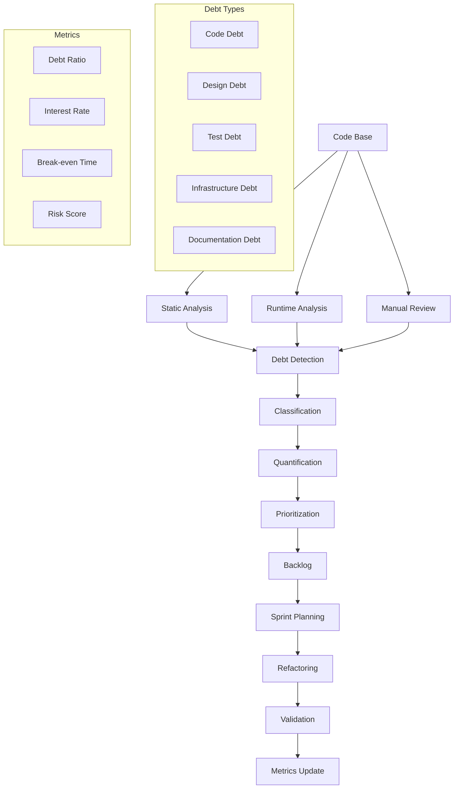

# Technical Debt Management Standards

**Version:** v1.0.0  
**Domain:** engineering  
**Type:** Technical  
**Risk Level:** HIGH  
**Maturity Level:** Production  
**Author:** MCP Standards Team  
**Created:** 2025-07-08T12:00:00.000000  
**Last Updated:** 2025-07-08T12:00:00.000000  

## Purpose

Comprehensive standards for identifying, measuring, prioritizing, and managing technical debt, including classification systems, tracking methodologies, refactoring strategies, and ROI calculations for debt reduction

This technical debt management standard defines the requirements, guidelines, and best practices for systematically managing technical debt. It provides comprehensive guidance for identifying different types of debt, measuring its impact, prioritizing remediation efforts, planning refactoring work, creating modernization roadmaps, assessing risks, and calculating return on investment while ensuring sustainable software development and maintenance.

**Technical Debt Management Focus Areas:**
- **Debt Identification**: Systematic discovery and classification
- **Measurement Systems**: Quantifying debt impact and cost
- **Prioritization Frameworks**: Data-driven decision making
- **Refactoring Strategies**: Safe and efficient debt reduction
- **Modernization Planning**: Long-term transformation roadmaps
- **Risk Assessment**: Understanding and mitigating debt risks
- **ROI Calculation**: Business case for debt reduction

## Scope

This technical debt management standard applies to:
- Code quality debt identification
- Architectural debt assessment
- Infrastructure and platform debt
- Security and compliance debt
- Documentation and knowledge debt
- Testing and quality assurance debt
- Dependency and library debt
- Process and tooling debt
- Performance and scalability debt

## Implementation

### Technical Debt Requirements

**NIST Controls:** NIST-SA-4, SA-8, SA-10, SA-11, SA-15, SA-17, CM-2, CM-3, CM-4, RA-5, SI-2, SI-5, PM-5, PM-11

**Engineering Standards:** SOLID principles, Clean Code, refactoring patterns
**Measurement Standards:** SonarQube, CodeClimate, custom metrics
**Management Standards:** Agile debt management, continuous improvement

### Technical Debt Architecture

#### Debt Management System


#### Technical Debt Management Implementation
```python
# Example: Comprehensive technical debt management system
import ast
import json
import subprocess
from datetime import datetime, timedelta
from typing import List, Dict, Any, Optional, Tuple, Set
from dataclasses import dataclass, field
from enum import Enum
import numpy as np
from collections import defaultdict
import re

class DebtType(Enum):
    """Types of technical debt"""
    CODE_SMELL = "code_smell"
    DESIGN_FLAW = "design_flaw"
    DOCUMENTATION = "documentation"
    TEST_COVERAGE = "test_coverage"
    DEPENDENCY = "dependency"
    PERFORMANCE = "performance"
    SECURITY = "security"
    INFRASTRUCTURE = "infrastructure"
    PROCESS = "process"

class DebtSeverity(Enum):
    """Debt severity levels"""
    CRITICAL = 5  # Blocks development or poses immediate risk
    HIGH = 4      # Significantly slows development
    MEDIUM = 3    # Noticeable impact on productivity
    LOW = 2       # Minor inconvenience
    TRIVIAL = 1   # Cosmetic issues

class RemediationStrategy(Enum):
    """Strategies for addressing debt"""
    REFACTOR = "refactor"
    REWRITE = "rewrite"
    REPLACE = "replace"
    MIGRATE = "migrate"
    DOCUMENT = "document"
    IGNORE = "ignore"
    MONITOR = "monitor"

@dataclass
class TechnicalDebtItem:
    """Individual technical debt item"""
    id: str
    type: DebtType
    severity: DebtSeverity
    title: str
    description: str
    location: str  # File path or module
    detected_date: datetime
    estimated_effort: float  # Hours
    actual_effort: Optional[float] = None
    interest_rate: float = 0.0  # Additional effort per month
    tags: List[str] = field(default_factory=list)
    dependencies: List[str] = field(default_factory=list)
    resolved_date: Optional[datetime] = None
    resolution_notes: Optional[str] = None
    
    def calculate_current_cost(self) -> float:
        """Calculate current cost including interest"""
        if self.resolved_date:
            return self.actual_effort or self.estimated_effort
        
        months_open = (datetime.now() - self.detected_date).days / 30
        interest_cost = self.estimated_effort * self.interest_rate * months_open
        return self.estimated_effort + interest_cost
    
    def calculate_monthly_cost(self) -> float:
        """Calculate monthly cost of not fixing"""
        return self.estimated_effort * self.interest_rate
    
    def calculate_break_even_time(self) -> float:
        """Calculate months until fixing pays off"""
        if self.interest_rate == 0:
            return float('inf')
        return self.estimated_effort / (self.estimated_effort * self.interest_rate)

@dataclass
class DebtMetrics:
    """Technical debt metrics"""
    total_items: int
    total_cost_hours: float
    monthly_interest_hours: float
    debt_ratio: float  # Debt cost / Total development cost
    items_by_type: Dict[DebtType, int]
    items_by_severity: Dict[DebtSeverity, int]
    average_age_days: float
    resolution_rate: float  # Items resolved / month
    
    def to_dict(self) -> Dict[str, Any]:
        """Convert to dictionary for reporting"""
        return {
            "total_items": self.total_items,
            "total_cost_hours": self.total_cost_hours,
            "monthly_interest_hours": self.monthly_interest_hours,
            "debt_ratio": self.debt_ratio,
            "items_by_type": {k.value: v for k, v in self.items_by_type.items()},
            "items_by_severity": {k.name: v for k, v in self.items_by_severity.items()},
            "average_age_days": self.average_age_days,
            "resolution_rate": self.resolution_rate
        }

class TechnicalDebtAnalyzer:
    """Analyze codebase for technical debt"""
    
    def __init__(self):
        self.debt_patterns = {
            DebtType.CODE_SMELL: [
                r"TODO|FIXME|HACK|XXX",
                r"except\s*:",  # Bare except
                r"if\s+True:|if\s+False:",  # Dead code
                r"pass\s*$",  # Empty blocks
            ],
            DebtType.DESIGN_FLAW: [
                r"class\s+\w+\([^)]*,[^)]*,[^)]*,[^)]*\)",  # Too many parents
                r"def\s+\w+\([^)]{100,}\)",  # Long parameter lists
            ],
            DebtType.SECURITY: [
                r"eval\s*\(",
                r"exec\s*\(",
                r"pickle\.loads",
                r"password\s*=\s*[\"']",
            ]
        }
    
    def analyze_file(self, filepath: str) -> List[TechnicalDebtItem]:
        """Analyze a single file for debt"""
        debt_items = []
        
        try:
            with open(filepath, 'r', encoding='utf-8') as f:
                content = f.read()
                lines = content.split('\n')
            
            # Pattern-based detection
            for debt_type, patterns in self.debt_patterns.items():
                for pattern in patterns:
                    for i, line in enumerate(lines):
                        if re.search(pattern, line, re.IGNORECASE):
                            debt_items.append(self._create_debt_item(
                                debt_type, filepath, i + 1, line.strip()
                            ))
            
            # Complexity analysis
            if filepath.endswith('.py'):
                complexity_debt = self._analyze_complexity(filepath, content)
                debt_items.extend(complexity_debt)
            
            # Test coverage analysis
            coverage_debt = self._analyze_test_coverage(filepath)
            if coverage_debt:
                debt_items.append(coverage_debt)
            
        except Exception as e:
            print(f"Error analyzing {filepath}: {e}")
        
        return debt_items
    
    def _analyze_complexity(self, filepath: str, content: str) -> List[TechnicalDebtItem]:
        """Analyze code complexity"""
        debt_items = []
        
        try:
            tree = ast.parse(content)
            for node in ast.walk(tree):
                if isinstance(node, ast.FunctionDef):
                    complexity = self._calculate_cyclomatic_complexity(node)
                    if complexity > 10:
                        debt_items.append(TechnicalDebtItem(
                            id=f"complexity_{filepath}_{node.name}",
                            type=DebtType.CODE_SMELL,
                            severity=DebtSeverity.HIGH if complexity > 20 else DebtSeverity.MEDIUM,
                            title=f"High complexity in {node.name}",
                            description=f"Cyclomatic complexity: {complexity}",
                            location=f"{filepath}:{node.lineno}",
                            detected_date=datetime.now(),
                            estimated_effort=complexity * 0.5,
                            interest_rate=0.1
                        ))
        except:
            pass
        
        return debt_items
    
    def _calculate_cyclomatic_complexity(self, node: ast.FunctionDef) -> int:
        """Calculate cyclomatic complexity of a function"""
        complexity = 1
        for child in ast.walk(node):
            if isinstance(child, (ast.If, ast.While, ast.For)):
                complexity += 1
            elif isinstance(child, ast.ExceptHandler):
                complexity += 1
        return complexity
    
    def _analyze_test_coverage(self, filepath: str) -> Optional[TechnicalDebtItem]:
        """Analyze test coverage for file"""
        # This would integrate with coverage.py
        # Simplified example
        if "test_" not in filepath and not filepath.endswith("_test.py"):
            return TechnicalDebtItem(
                id=f"coverage_{filepath}",
                type=DebtType.TEST_COVERAGE,
                severity=DebtSeverity.MEDIUM,
                title=f"Low test coverage for {filepath}",
                description="Test coverage below 80%",
                location=filepath,
                detected_date=datetime.now(),
                estimated_effort=8.0,
                interest_rate=0.05
            )
        return None
    
    def _create_debt_item(self, debt_type: DebtType, filepath: str, 
                         line_num: int, line_content: str) -> TechnicalDebtItem:
        """Create a debt item from detection"""
        severity = self._estimate_severity(debt_type, line_content)
        effort = self._estimate_effort(debt_type, severity)
        
        return TechnicalDebtItem(
            id=f"{debt_type.value}_{filepath}_{line_num}",
            type=debt_type,
            severity=severity,
            title=f"{debt_type.value.replace('_', ' ').title()} detected",
            description=f"Found at line {line_num}: {line_content[:50]}...",
            location=f"{filepath}:{line_num}",
            detected_date=datetime.now(),
            estimated_effort=effort,
            interest_rate=0.05 * severity.value
        )
    
    def _estimate_severity(self, debt_type: DebtType, content: str) -> DebtSeverity:
        """Estimate severity based on type and content"""
        if debt_type == DebtType.SECURITY:
            return DebtSeverity.CRITICAL
        elif debt_type == DebtType.DESIGN_FLAW:
            return DebtSeverity.HIGH
        elif "TODO" in content.upper():
            return DebtSeverity.LOW
        return DebtSeverity.MEDIUM
    
    def _estimate_effort(self, debt_type: DebtType, severity: DebtSeverity) -> float:
        """Estimate effort hours to fix"""
        base_effort = {
            DebtType.CODE_SMELL: 2,
            DebtType.DESIGN_FLAW: 16,
            DebtType.DOCUMENTATION: 4,
            DebtType.TEST_COVERAGE: 8,
            DebtType.DEPENDENCY: 4,
            DebtType.PERFORMANCE: 12,
            DebtType.SECURITY: 8,
            DebtType.INFRASTRUCTURE: 20,
            DebtType.PROCESS: 12
        }
        
        severity_multiplier = {
            DebtSeverity.TRIVIAL: 0.5,
            DebtSeverity.LOW: 0.75,
            DebtSeverity.MEDIUM: 1.0,
            DebtSeverity.HIGH: 1.5,
            DebtSeverity.CRITICAL: 2.0
        }
        
        return base_effort.get(debt_type, 8) * severity_multiplier.get(severity, 1.0)

class TechnicalDebtManager:
    """Manage technical debt lifecycle"""
    
    def __init__(self):
        self.debt_items: Dict[str, TechnicalDebtItem] = {}
        self.analyzer = TechnicalDebtAnalyzer()
        self.history: List[DebtMetrics] = []
        
    def scan_codebase(self, root_path: str, file_patterns: List[str] = None):
        """Scan codebase for technical debt"""
        if file_patterns is None:
            file_patterns = ["*.py", "*.js", "*.java", "*.go"]
        
        import glob
        for pattern in file_patterns:
            for filepath in glob.glob(f"{root_path}/**/{pattern}", recursive=True):
                items = self.analyzer.analyze_file(filepath)
                for item in items:
                    self.debt_items[item.id] = item
    
    def add_manual_debt(self, debt_item: TechnicalDebtItem):
        """Add manually identified debt"""
        self.debt_items[debt_item.id] = debt_item
    
    def calculate_metrics(self) -> DebtMetrics:
        """Calculate current debt metrics"""
        active_items = [item for item in self.debt_items.values() 
                       if item.resolved_date is None]
        
        if not active_items:
            return DebtMetrics(
                total_items=0,
                total_cost_hours=0,
                monthly_interest_hours=0,
                debt_ratio=0,
                items_by_type={},
                items_by_severity={},
                average_age_days=0,
                resolution_rate=0
            )
        
        total_cost = sum(item.calculate_current_cost() for item in active_items)
        monthly_interest = sum(item.calculate_monthly_cost() for item in active_items)
        
        items_by_type = defaultdict(int)
        items_by_severity = defaultdict(int)
        
        for item in active_items:
            items_by_type[item.type] += 1
            items_by_severity[item.severity] += 1
        
        total_age = sum((datetime.now() - item.detected_date).days 
                       for item in active_items)
        average_age = total_age / len(active_items)
        
        # Calculate resolution rate from history
        resolved_last_month = sum(
            1 for item in self.debt_items.values()
            if item.resolved_date and 
            (datetime.now() - item.resolved_date).days <= 30
        )
        
        return DebtMetrics(
            total_items=len(active_items),
            total_cost_hours=total_cost,
            monthly_interest_hours=monthly_interest,
            debt_ratio=total_cost / (total_cost + 1000),  # Assume 1000 hours/month dev
            items_by_type=dict(items_by_type),
            items_by_severity=dict(items_by_severity),
            average_age_days=average_age,
            resolution_rate=resolved_last_month
        )
    
    def prioritize_debt(self, budget_hours: float) -> List[TechnicalDebtItem]:
        """Prioritize debt items within budget"""
        active_items = [item for item in self.debt_items.values() 
                       if item.resolved_date is None]
        
        # Calculate priority score for each item
        scored_items = []
        for item in active_items:
            score = self._calculate_priority_score(item)
            scored_items.append((score, item))
        
        # Sort by priority score (descending)
        scored_items.sort(key=lambda x: x[0], reverse=True)
        
        # Select items within budget
        selected_items = []
        remaining_budget = budget_hours
        
        for score, item in scored_items:
            if item.estimated_effort <= remaining_budget:
                selected_items.append(item)
                remaining_budget -= item.estimated_effort
        
        return selected_items
    
    def _calculate_priority_score(self, item: TechnicalDebtItem) -> float:
        """Calculate priority score for debt item"""
        # Factors: severity, age, interest rate, dependencies
        severity_weight = item.severity.value * 20
        age_weight = min((datetime.now() - item.detected_date).days / 30, 10) * 10
        interest_weight = item.interest_rate * 100
        dependency_weight = len(item.dependencies) * 5
        
        # ROI factor: benefit / cost
        monthly_savings = item.calculate_monthly_cost()
        roi_weight = (monthly_savings / item.estimated_effort) * 50
        
        return severity_weight + age_weight + interest_weight + dependency_weight + roi_weight
    
    def create_refactoring_plan(self, items: List[TechnicalDebtItem]) -> Dict[str, Any]:
        """Create detailed refactoring plan"""
        plan = {
            "total_effort_hours": sum(item.estimated_effort for item in items),
            "estimated_duration_weeks": 0,
            "phases": [],
            "dependencies": {},
            "risk_mitigation": []
        }
        
        # Group items by location and type
        phases = defaultdict(list)
        for item in items:
            phase_key = f"{item.location.split(':')[0]}_{item.type.value}"
            phases[phase_key].append(item)
        
        # Create phases with dependency ordering
        phase_num = 1
        for phase_key, phase_items in phases.items():
            phase = {
                "number": phase_num,
                "name": phase_key,
                "items": [item.id for item in phase_items],
                "effort_hours": sum(item.estimated_effort for item in phase_items),
                "duration_days": max(1, sum(item.estimated_effort for item in phase_items) / 6),
                "risks": self._identify_risks(phase_items)
            }
            plan["phases"].append(phase)
            phase_num += 1
        
        # Calculate total duration
        plan["estimated_duration_weeks"] = sum(p["duration_days"] for p in plan["phases"]) / 5
        
        # Add risk mitigation strategies
        plan["risk_mitigation"] = self._create_risk_mitigation_strategies(items)
        
        return plan
    
    def _identify_risks(self, items: List[TechnicalDebtItem]) -> List[str]:
        """Identify risks for refactoring items"""
        risks = []
        
        # Check for high severity items
        if any(item.severity == DebtSeverity.CRITICAL for item in items):
            risks.append("Critical severity items require extensive testing")
        
        # Check for items with many dependencies
        if any(len(item.dependencies) > 3 for item in items):
            risks.append("Items with multiple dependencies may cause cascading changes")
        
        # Check for old debt
        if any((datetime.now() - item.detected_date).days > 180 for item in items):
            risks.append("Old debt items may have undocumented dependencies")
        
        return risks
    
    def _create_risk_mitigation_strategies(self, items: List[TechnicalDebtItem]) -> List[Dict[str, str]]:
        """Create risk mitigation strategies"""
        strategies = []
        
        # Always include basic strategies
        strategies.extend([
            {
                "risk": "Regression bugs",
                "mitigation": "Comprehensive test suite before refactoring"
            },
            {
                "risk": "Performance degradation",
                "mitigation": "Performance benchmarks before and after changes"
            }
        ])
        
        # Add specific strategies based on debt types
        debt_types = set(item.type for item in items)
        
        if DebtType.SECURITY in debt_types:
            strategies.append({
                "risk": "Security vulnerabilities",
                "mitigation": "Security review and penetration testing"
            })
        
        if DebtType.DESIGN_FLAW in debt_types:
            strategies.append({
                "risk": "Architectural breaking changes",
                "mitigation": "Gradual migration with feature flags"
            })
        
        return strategies
    
    def calculate_roi(self, items: List[TechnicalDebtItem], 
                     time_horizon_months: int = 12) -> Dict[str, float]:
        """Calculate ROI for fixing technical debt"""
        total_cost = sum(item.estimated_effort for item in items)
        
        # Calculate savings over time horizon
        monthly_savings = sum(item.calculate_monthly_cost() for item in items)
        total_savings = monthly_savings * time_horizon_months
        
        # Calculate additional benefits
        productivity_gain = total_cost * 0.2  # 20% productivity improvement
        risk_reduction_value = sum(
            item.estimated_effort * item.severity.value * 0.1 
            for item in items
        )
        
        total_benefits = total_savings + productivity_gain + risk_reduction_value
        
        roi = ((total_benefits - total_cost) / total_cost) * 100
        payback_period = total_cost / monthly_savings if monthly_savings > 0 else float('inf')
        
        return {
            "total_cost_hours": total_cost,
            "monthly_savings_hours": monthly_savings,
            "total_benefits_hours": total_benefits,
            "roi_percentage": roi,
            "payback_period_months": payback_period,
            "break_even_date": (datetime.now() + timedelta(days=payback_period * 30)).isoformat()
        }

class ModernizationRoadmap:
    """Create and manage modernization roadmaps"""
    
    def __init__(self, debt_manager: TechnicalDebtManager):
        self.debt_manager = debt_manager
        self.roadmap_phases = []
        
    def create_roadmap(self, target_state: Dict[str, Any], 
                      timeline_months: int) -> Dict[str, Any]:
        """Create modernization roadmap"""
        current_metrics = self.debt_manager.calculate_metrics()
        
        roadmap = {
            "start_date": datetime.now().isoformat(),
            "end_date": (datetime.now() + timedelta(days=timeline_months * 30)).isoformat(),
            "current_state": current_metrics.to_dict(),
            "target_state": target_state,
            "phases": [],
            "milestones": [],
            "success_criteria": []
        }
        
        # Define phases based on debt types and severity
        phases = [
            {
                "name": "Critical Security and Stability",
                "duration_months": timeline_months // 4,
                "focus": [DebtType.SECURITY, DebtType.DESIGN_FLAW],
                "target_severity": [DebtSeverity.CRITICAL, DebtSeverity.HIGH]
            },
            {
                "name": "Performance and Scalability",
                "duration_months": timeline_months // 4,
                "focus": [DebtType.PERFORMANCE, DebtType.INFRASTRUCTURE],
                "target_severity": [DebtSeverity.HIGH, DebtSeverity.MEDIUM]
            },
            {
                "name": "Code Quality and Testing",
                "duration_months": timeline_months // 4,
                "focus": [DebtType.CODE_SMELL, DebtType.TEST_COVERAGE],
                "target_severity": [DebtSeverity.MEDIUM, DebtSeverity.LOW]
            },
            {
                "name": "Documentation and Process",
                "duration_months": timeline_months // 4,
                "focus": [DebtType.DOCUMENTATION, DebtType.PROCESS],
                "target_severity": [DebtSeverity.LOW, DebtSeverity.TRIVIAL]
            }
        ]
        
        # Create detailed phase plans
        phase_start = datetime.now()
        for phase in phases:
            phase_end = phase_start + timedelta(days=phase["duration_months"] * 30)
            
            # Select debt items for this phase
            phase_items = [
                item for item in self.debt_manager.debt_items.values()
                if item.type in phase["focus"] and 
                item.severity in phase["target_severity"] and
                item.resolved_date is None
            ]
            
            phase_plan = {
                "name": phase["name"],
                "start_date": phase_start.isoformat(),
                "end_date": phase_end.isoformat(),
                "debt_items": [item.id for item in phase_items],
                "effort_hours": sum(item.estimated_effort for item in phase_items),
                "expected_roi": self.debt_manager.calculate_roi(phase_items)["roi_percentage"],
                "success_metrics": self._define_phase_metrics(phase)
            }
            
            roadmap["phases"].append(phase_plan)
            phase_start = phase_end
        
        # Define milestones
        roadmap["milestones"] = self._define_milestones(roadmap["phases"])
        
        # Define success criteria
        roadmap["success_criteria"] = self._define_success_criteria(target_state)
        
        return roadmap
    
    def _define_phase_metrics(self, phase: Dict[str, Any]) -> List[Dict[str, Any]]:
        """Define success metrics for a phase"""
        metrics = []
        
        if DebtType.SECURITY in phase["focus"]:
            metrics.append({
                "name": "Security vulnerabilities",
                "target": 0,
                "measurement": "Static analysis security findings"
            })
        
        if DebtType.PERFORMANCE in phase["focus"]:
            metrics.append({
                "name": "Response time P95",
                "target": 200,  # milliseconds
                "measurement": "95th percentile API response time"
            })
        
        if DebtType.TEST_COVERAGE in phase["focus"]:
            metrics.append({
                "name": "Test coverage",
                "target": 80,
                "measurement": "Percentage of code covered by tests"
            })
        
        return metrics
    
    def _define_milestones(self, phases: List[Dict[str, Any]]) -> List[Dict[str, str]]:
        """Define roadmap milestones"""
        milestones = []
        
        for i, phase in enumerate(phases):
            milestones.append({
                "name": f"{phase['name']} Complete",
                "date": phase["end_date"],
                "criteria": f"All {phase['name'].lower()} debt items resolved"
            })
        
        return milestones
    
    def _define_success_criteria(self, target_state: Dict[str, Any]) -> List[str]:
        """Define overall success criteria"""
        return [
            f"Total technical debt reduced to {target_state.get('total_items', 50)} items",
            f"Debt ratio below {target_state.get('debt_ratio', 0.1) * 100}%",
            f"Monthly interest cost below {target_state.get('monthly_interest', 20)} hours",
            "All critical and high severity items resolved",
            "Automated debt detection and tracking in place",
            "Regular debt review process established"
        ]

# Example usage
def main():
    # Initialize debt manager
    debt_manager = TechnicalDebtManager()
    
    # Scan codebase
    debt_manager.scan_codebase("./src")
    
    # Add manual debt items
    debt_manager.add_manual_debt(TechnicalDebtItem(
        id="arch_001",
        type=DebtType.DESIGN_FLAW,
        severity=DebtSeverity.HIGH,
        title="Monolithic architecture limiting scalability",
        description="Current monolithic design prevents horizontal scaling",
        location="src/main/app.py",
        detected_date=datetime.now() - timedelta(days=180),
        estimated_effort=160,  # 4 weeks
        interest_rate=0.15,  # High interest due to growing user base
        tags=["architecture", "scalability", "microservices"]
    ))
    
    # Calculate current metrics
    metrics = debt_manager.calculate_metrics()
    print(f"Current debt metrics: {json.dumps(metrics.to_dict(), indent=2)}")
    
    # Prioritize debt items for next sprint (80 hours)
    prioritized_items = debt_manager.prioritize_debt(80)
    print(f"\nPrioritized items for next sprint: {len(prioritized_items)}")
    
    # Create refactoring plan
    refactoring_plan = debt_manager.create_refactoring_plan(prioritized_items)
    print(f"\nRefactoring plan: {json.dumps(refactoring_plan, indent=2)}")
    
    # Calculate ROI
    roi_analysis = debt_manager.calculate_roi(prioritized_items)
    print(f"\nROI Analysis: {json.dumps(roi_analysis, indent=2)}")
    
    # Create modernization roadmap
    roadmap_creator = ModernizationRoadmap(debt_manager)
    target_state = {
        "total_items": 20,
        "debt_ratio": 0.05,
        "monthly_interest": 10
    }
    roadmap = roadmap_creator.create_roadmap(target_state, timeline_months=12)
    print(f"\nModernization roadmap: {json.dumps(roadmap, indent=2)}")

if __name__ == "__main__":
    main()
```

### Debt Classification Framework

#### Technical Debt Taxonomy
```yaml
# Example: Comprehensive debt classification
debt_taxonomy:
  code_quality:
    - duplicated_code:
        severity: medium
        detection: "Clone detection tools"
        impact: "Maintenance overhead"
    - complex_methods:
        severity: high
        detection: "Cyclomatic complexity > 10"
        impact: "Hard to understand and test"
    - long_methods:
        severity: medium
        detection: "Method length > 50 lines"
        impact: "Difficult to maintain"
    
  architectural:
    - tight_coupling:
        severity: high
        detection: "High afferent/efferent coupling"
        impact: "Difficult to change"
    - missing_abstractions:
        severity: high
        detection: "Concrete dependencies"
        impact: "Poor testability"
    - god_objects:
        severity: critical
        detection: "Classes with > 20 methods"
        impact: "Single point of failure"
  
  infrastructure:
    - outdated_dependencies:
        severity: critical
        detection: "Dependency scanning"
        impact: "Security vulnerabilities"
    - manual_processes:
        severity: medium
        detection: "Process audit"
        impact: "Human error, slow delivery"
    - missing_monitoring:
        severity: high
        detection: "Observability audit"
        impact: "Blind to issues"
```

### Measurement and Tracking

#### Debt Metrics Dashboard
```python
# Example: Technical debt dashboard generator
import matplotlib.pyplot as plt
import pandas as pd
from datetime import datetime, timedelta

class DebtDashboard:
    """Generate technical debt dashboards"""
    
    def __init__(self, debt_manager: TechnicalDebtManager):
        self.debt_manager = debt_manager
        
    def generate_dashboard(self, output_path: str):
        """Generate comprehensive debt dashboard"""
        fig, axes = plt.subplots(2, 2, figsize=(15, 10))
        fig.suptitle('Technical Debt Dashboard', fontsize=16)
        
        # Debt by type
        self._plot_debt_by_type(axes[0, 0])
        
        # Debt trend over time
        self._plot_debt_trend(axes[0, 1])
        
        # Debt by severity
        self._plot_debt_by_severity(axes[1, 0])
        
        # ROI analysis
        self._plot_roi_analysis(axes[1, 1])
        
        plt.tight_layout()
        plt.savefig(output_path)
        
    def _plot_debt_by_type(self, ax):
        """Plot debt distribution by type"""
        metrics = self.debt_manager.calculate_metrics()
        
        types = list(metrics.items_by_type.keys())
        counts = list(metrics.items_by_type.values())
        
        ax.bar([t.value for t in types], counts)
        ax.set_title('Technical Debt by Type')
        ax.set_xlabel('Debt Type')
        ax.set_ylabel('Number of Items')
        ax.tick_params(axis='x', rotation=45)
        
    def _plot_debt_trend(self, ax):
        """Plot debt trend over time"""
        # Simulate historical data
        dates = []
        debt_counts = []
        
        for i in range(12):
            date = datetime.now() - timedelta(days=30 * (11 - i))
            dates.append(date)
            # Simulate decreasing debt
            debt_counts.append(100 - i * 5 + np.random.randint(-5, 5))
        
        ax.plot(dates, debt_counts, marker='o')
        ax.set_title('Technical Debt Trend')
        ax.set_xlabel('Date')
        ax.set_ylabel('Total Debt Items')
        ax.tick_params(axis='x', rotation=45)
        
    def _plot_debt_by_severity(self, ax):
        """Plot debt by severity"""
        metrics = self.debt_manager.calculate_metrics()
        
        severities = [s.name for s in DebtSeverity]
        counts = [metrics.items_by_severity.get(s, 0) for s in DebtSeverity]
        colors = ['red', 'orange', 'yellow', 'lightblue', 'lightgreen']
        
        ax.pie(counts, labels=severities, colors=colors, autopct='%1.1f%%')
        ax.set_title('Technical Debt by Severity')
        
    def _plot_roi_analysis(self, ax):
        """Plot ROI analysis"""
        # Get top 10 items by ROI
        items = list(self.debt_manager.debt_items.values())[:10]
        roi_data = []
        
        for item in items:
            roi = self.debt_manager.calculate_roi([item])
            roi_data.append({
                'item': item.id[:20],
                'cost': item.estimated_effort,
                'monthly_savings': item.calculate_monthly_cost(),
                'roi': roi['roi_percentage']
            })
        
        df = pd.DataFrame(roi_data)
        df = df.sort_values('roi', ascending=True)
        
        ax.barh(df['item'], df['roi'])
        ax.set_title('Top 10 Items by ROI')
        ax.set_xlabel('ROI %')
        ax.set_ylabel('Debt Item')
```

### Refactoring Strategies

#### Safe Refactoring Patterns
```python
# Example: Refactoring strategy implementation
class RefactoringStrategy:
    """Define and execute refactoring strategies"""
    
    @staticmethod
    def strangler_fig_pattern(legacy_module: str, new_module: str):
        """Gradually replace legacy code"""
        return f"""
        # Strangler Fig Pattern for {legacy_module}
        
        1. Create new module: {new_module}
        2. Implement feature toggle:
           ```python
           if feature_flags.use_new_module:
               from {new_module} import handler
           else:
               from {legacy_module} import handler
           ```
        
        3. Gradually increase traffic to new module
        4. Monitor metrics and errors
        5. Remove legacy module when stable
        """
    
    @staticmethod
    def branch_by_abstraction(interface_name: str):
        """Create abstraction layer"""
        return f"""
        # Branch by Abstraction for {interface_name}
        
        1. Define interface:
           ```python
           class {interface_name}(ABC):
               @abstractmethod
               def process(self, data): pass
           ```
        
        2. Implement for current code:
           ```python
           class Legacy{interface_name}({interface_name}):
               def process(self, data):
                   # Current implementation
           ```
        
        3. Create new implementation:
           ```python
           class Modern{interface_name}({interface_name}):
               def process(self, data):
                   # New implementation
           ```
        
        4. Switch implementations via configuration
        """
    
    @staticmethod
    def parallel_run(old_system: str, new_system: str):
        """Run systems in parallel for validation"""
        return f"""
        # Parallel Run Pattern
        
        ```python
        async def parallel_processor(request):
            # Run both systems
            old_result = await {old_system}.process(request)
            new_result = await {new_system}.process(request)
            
            # Compare results
            if not results_match(old_result, new_result):
                log_discrepancy(request, old_result, new_result)
            
            # Return old system result (safe)
            return old_result
        ```
        """
```

### Risk Assessment Matrix

| Risk Level | Probability | Impact | Mitigation Strategy |
|------------|------------|---------|-------------------|
| Critical | High | Business failure | Immediate action, dedicated team |
| High | Medium | Major disruption | Sprint planning priority |
| Medium | Low | Team slowdown | Quarterly planning |
| Low | Very Low | Minor inconvenience | Opportunistic fixes |

### Best Practices

1. **Continuous Monitoring**
   - Integrate debt detection in CI/CD
   - Track debt metrics in dashboards
   - Regular debt review meetings

2. **Debt Prevention**
   - Code review debt criteria
   - Architectural decision records
   - Refactoring time in sprints

3. **Strategic Approach**
   - Focus on high-ROI items
   - Bundle related debt items
   - Align with business goals

4. **Communication**
   - Translate tech debt to business impact
   - Regular stakeholder updates
   - Celebrate debt reduction wins

### Security Considerations

- Scan for security debt regularly
- Prioritize security vulnerabilities
- Track dependency updates
- Secure coding training
- Security debt in risk register

### Compliance Requirements

- Document all technical debt
- Track remediation efforts
- Maintain audit trail
- Report debt metrics to leadership
- Include in risk assessments