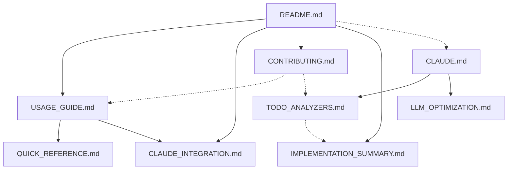

# Standards Relationship Graph

**Version:** 1.0.0  
**Last Updated:** 2025-06-23  
**Status:** Active  
**Standard Code:** META-GRAPH  

**Summary:** Explicit relationships and dependencies between all documentation  
**Tokens:** ~800 (helps AI plan context usage)  
**Priority:** medium  

This document defines the semantic relationships between all documentation files in the MCP Standards Server project, enabling intelligent navigation and dependency management.

## 📊 Document Relationships

### Core Documentation Dependencies

```yaml
relationships:
  README:
    depends_on: []
    required_by: ["USAGE_GUIDE", "CLAUDE_INTEGRATION", "CONTRIBUTING"]
    related_to: ["QUICK_REFERENCE", "CLAUDE"]
    conflicts_with: []
    description: "Entry point for all project documentation"
    
  CLAUDE:
    depends_on: []
    required_by: ["TODO_ANALYZERS", "LLM_OPTIMIZATION"]
    related_to: ["README", "IMPLEMENTATION_SUMMARY"]
    conflicts_with: []
    description: "AI router and development coordinator"
    
  USAGE_GUIDE:
    depends_on: ["README"]
    required_by: ["QUICK_REFERENCE", "CLAUDE_INTEGRATION"]
    related_to: ["CONTRIBUTING"]
    conflicts_with: []
    description: "Comprehensive usage documentation"
    
  QUICK_REFERENCE:
    depends_on: ["USAGE_GUIDE"]
    required_by: []
    related_to: ["README", "CLAUDE_INTEGRATION"]
    conflicts_with: []
    description: "Quick lookup and command reference"
    
  CLAUDE_INTEGRATION:
    depends_on: ["README", "USAGE_GUIDE"]
    required_by: []
    related_to: ["QUICK_REFERENCE"]
    conflicts_with: []
    description: "Claude CLI specific setup and configuration"
    
  TODO_ANALYZERS:
    depends_on: ["CLAUDE"]
    required_by: []
    related_to: ["IMPLEMENTATION_SUMMARY"]
    conflicts_with: []
    description: "Project status and implementation tracking"
    
  IMPLEMENTATION_SUMMARY:
    depends_on: ["README"]
    required_by: []
    related_to: ["TODO_ANALYZERS", "CLAUDE"]
    conflicts_with: []
    description: "Technical architecture and implementation details"
    
  CONTRIBUTING:
    depends_on: ["README"]
    required_by: []
    related_to: ["USAGE_GUIDE", "TODO_ANALYZERS"]
    conflicts_with: []
    description: "Development and contribution guidelines"
```

### Specialized Documentation Dependencies

```yaml
specialized_relationships:
  LLM_OPTIMIZATION:
    depends_on: ["CLAUDE"]
    required_by: []
    related_to: ["TODO_ANALYZERS"]
    conflicts_with: []
    description: "Token optimization and AI integration strategies"
    
  STANDARDS_VERSIONING:
    depends_on: []
    required_by: []
    related_to: ["CONTRIBUTING"]
    conflicts_with: []
    description: "Standards lifecycle and version management"
    
  DOCUMENTATION_STATUS:
    depends_on: ["README", "CLAUDE"]
    required_by: []
    related_to: ["TODO_ANALYZERS", "CONTRIBUTING"]
    conflicts_with: []
    description: "Documentation completeness and maintenance tracking"
```

## 🔗 Bidirectional Link Validation

### Required Cross-References

| From Document | To Document | Link Type | Status |
|---------------|-------------|-----------|---------|
| README.md | docs/USAGE_GUIDE.md | user-guide | ✅ |
| README.md | docs/CLAUDE_INTEGRATION.md | integration | ✅ |
| USAGE_GUIDE.md | QUICK_REFERENCE.md | reference | ✅ |
| USAGE_GUIDE.md | CLAUDE_INTEGRATION.md | setup | ✅ |
| CLAUDE.md | TODO_ANALYZERS.md | status | ✅ |
| CONTRIBUTING.md | README.md | overview | ✅ |

### Missing Cross-References

| From Document | To Document | Link Type | Priority |
|---------------|-------------|-----------|----------|
| QUICK_REFERENCE.md | README.md | overview | Medium |
| TODO_ANALYZERS.md | CLAUDE.md | router | Medium |
| LLM_OPTIMIZATION.md | CLAUDE.md | router | Low |

## 📈 Dependency Graph Visualization



## 🔄 Conflict Detection

### Potential Conflicts

1. **Test Coverage Numbers**: Multiple documents reference coverage percentages
   - **Files**: README.md, CLAUDE.md, TODO_ANALYZERS.md, IMPLEMENTATION_SUMMARY.md
   - **Resolution**: Single source of truth in CLAUDE.md, others reference it

2. **Feature Status**: Implementation status mentioned in multiple places
   - **Files**: CLAUDE.md, TODO_ANALYZERS.md, IMPLEMENTATION_SUMMARY.md
   - **Resolution**: CLAUDE.md is authoritative for current status

3. **Command Documentation**: CLI commands documented in multiple files
   - **Files**: README.md, USAGE_GUIDE.md, QUICK_REFERENCE.md
   - **Resolution**: USAGE_GUIDE.md is comprehensive, others are summaries

## 🔍 Orphaned Content Detection

### Documents Without Strong Dependencies

1. **CHANGELOG.md**: Stands alone but should reference README.md
2. **SECURITY.md**: Independent security policy
3. **Project_plan.md**: Historical document, could be deprecated

### Recommendations

1. **Link CHANGELOG.md to README.md**: Add project overview reference
2. **Keep SECURITY.md independent**: Security policies should be standalone
3. **Consider deprecating Project_plan.md**: Historical value only

## 🛠️ Dependency Validation Commands

```bash
# Check for broken links
find . -name "*.md" -exec grep -l "\[.*\](\./" {} \; | xargs -I {} sh -c 'echo "Checking {}" && grep -o "\[.*\](\.\/[^)]*)" {} | sed "s/.*](\.\///" | sed "s/).*//" | while read link; do [ -f "$link" ] || echo "BROKEN: $link in {}"; done'

# Validate bidirectional references
grep -r "README.md" --include="*.md" . | grep -v "README.md:"
grep -r "CLAUDE.md" --include="*.md" . | grep -v "CLAUDE.md:"

# Check for circular dependencies
python3 << 'EOF'
import yaml
with open('MANIFEST.yaml', 'r') as f:
    manifest = yaml.safe_load(f)
    
def find_cycles(graph, start, visited, rec_stack):
    visited[start] = True
    rec_stack[start] = True
    
    for neighbor in graph.get(start, []):
        if not visited.get(neighbor, False):
            if find_cycles(graph, neighbor, visited, rec_stack):
                return True
        elif rec_stack.get(neighbor, False):
            return True
    
    rec_stack[start] = False
    return False

# Build dependency graph from manifest
deps = {}
for doc in manifest.get('documentation', {}).values():
    if isinstance(doc, list):
        for item in doc:
            deps[item['id']] = item.get('dependencies', [])
    elif isinstance(doc, dict) and 'dependencies' in doc:
        deps[doc['id']] = doc['dependencies']

# Check for cycles
visited = {}
rec_stack = {}
for node in deps:
    if not visited.get(node, False):
        if find_cycles(deps, node, visited, rec_stack):
            print(f"Circular dependency detected involving: {node}")
            break
else:
    print("No circular dependencies found")
EOF
```

## 📋 Maintenance Checklist

- [ ] Validate all cross-references monthly
- [ ] Update relationship graph when adding new documents
- [ ] Check for orphaned content quarterly
- [ ] Resolve conflicts when updating coverage/status information
- [ ] Validate dependency graph for cycles on major changes

## 🔗 Related Documents

- [MANIFEST.yaml](../../../MANIFEST.yaml) - Machine-readable metadata
- [KNOWLEDGE_MANAGEMENT_STANDARDS.yaml](../KNOWLEDGE_MANAGEMENT_STANDARDS.yaml) - Standards compliance
- [CONTRIBUTING.md](../../../CONTRIBUTING.md) - Contribution guidelines
- [README.md](../../../README.md) - Project overview