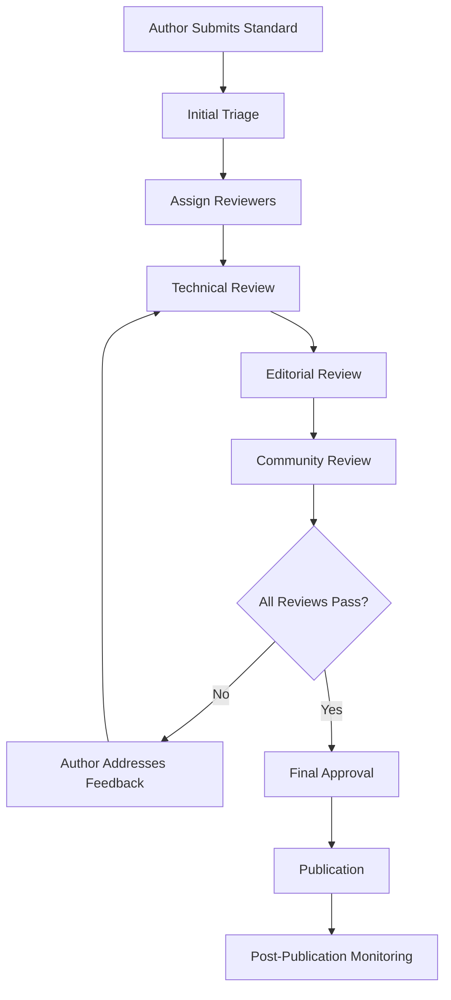

# Community Review Process

This document outlines the structured review workflow for standards contributions, including reviewer assignment, tracking, feedback integration, and approval workflows.

## Table of Contents

1. [Overview](#overview)
2. [Review Workflow](#review-workflow)
3. [Reviewer Roles and Responsibilities](#reviewer-roles-and-responsibilities)
4. [Review Stages](#review-stages)
5. [Feedback Integration Process](#feedback-integration-process)
6. [Approval and Publication Workflow](#approval-and-publication-workflow)
7. [Quality Gates](#quality-gates)
8. [Tools and Automation](#tools-and-automation)
9. [Escalation and Conflict Resolution](#escalation-and-conflict-resolution)
10. [Metrics and Continuous Improvement](#metrics-and-continuous-improvement)

## Overview

The community review process ensures that all standards meet high quality, consistency, and community needs. Our process balances thorough review with timely feedback to maintain momentum while ensuring excellence.

### Goals

- **Quality Assurance**: Ensure standards meet technical and editorial excellence
- **Community Input**: Incorporate diverse perspectives and expertise
- **Consistency**: Maintain coherent standards across domains
- **Transparency**: Provide clear, traceable review processes
- **Efficiency**: Deliver timely feedback and decisions

### Process Principles

- **Inclusive**: Welcome contributions from all community members
- **Constructive**: Focus on improvement, not criticism
- **Collaborative**: Encourage dialogue between authors and reviewers
- **Evidence-based**: Make decisions based on clear criteria
- **Iterative**: Support continuous improvement

## Review Workflow

### High-Level Process



### Review Stages

| Stage | Duration | Participants | Outcome |
|-------|----------|--------------|---------|
| Initial Triage | 24 hours | Maintainers | Assignment or rejection |
| Technical Review | 3-5 days | Domain experts | Technical approval |
| Editorial Review | 2-3 days | Editorial team | Content approval |
| Community Review | 5-7 days | Community members | Community consensus |
| Final Approval | 1-2 days | Maintainers | Publication decision |

### Review Triggers

Reviews are triggered by:

- **New standard submissions** via pull requests
- **Major version 1.0.0
- **Community requests** for existing standard reviews
- **Scheduled reviews** for standards older than 12 months
- **Compliance updates** when regulations change

## Reviewer Roles and Responsibilities

### Maintainers

**Selection Criteria:**
- Significant contributions to the project
- Deep understanding of standards development
- Proven track record in technical leadership
- Active community participation

**Responsibilities:**
- Initial triage and reviewer assignment
- Final approval decisions
- Escalation resolution
- Process oversight and improvement

**Time Commitment:** 5-10 hours per week

### Domain Experts

**Selection Criteria:**
- Recognized expertise in specific domains
- Professional experience implementing standards
- Ability to assess technical accuracy
- Commitment to timely reviews

**Responsibilities:**
- Technical accuracy validation
- Implementation feasibility assessment
- Best practices verification
- Architecture review

**Current Domain Experts:**

| Domain | Expert | Expertise Areas |
|--------|--------|----------------|
| API Design | @api-expert | REST, GraphQL, gRPC, OpenAPI |
| Security | @security-expert | Authentication, Authorization, Cryptography |
| AI/ML | @ml-expert | MLOps, Model Governance, Data Science |
| Cloud Native | @cloud-expert | Kubernetes, Microservices, DevOps |
| Data Engineering | @data-expert | Pipelines, Governance, Analytics |
| Frontend | @frontend-expert | React, Vue, Accessibility, Performance |

### Editorial Team

**Selection Criteria:**
- Strong technical writing skills
- Experience with documentation standards
- Attention to detail
- Understanding of audience needs

**Responsibilities:**
- Grammar and style validation
- Clarity and readability assessment
- Consistency with style guide
- Accessibility review

### Community Reviewers

**Selection Criteria:**
- Regular community participation
- Relevant implementation experience
- Constructive feedback history
- Commitment to review timeline

**Responsibilities:**
- Practical feedback on usability
- Use case validation
- Implementation experience sharing
- Quality scoring participation

## Review Stages

### 1. Initial Triage (24 hours)

**Performed by:** Maintainers

**Criteria:**
- [ ] Submission follows contribution guidelines
- [ ] Required files are present (MD + YAML)
- [ ] Basic quality threshold met (>60%)
- [ ] No obvious duplicates or conflicts
- [ ] Appropriate domain classification

**Outcomes:**
- **Accept**: Proceed to reviewer assignment
- **Request Changes**: Return to author with specific requirements
- **Reject**: Close with explanation

**Automated Checks:**
- File format validation
- Metadata completeness
- Link verification
- Basic quality scoring

### 2. Technical Review (3-5 days)

**Performed by:** Domain experts (1-2 reviewers)

**Review Checklist:**

#### Technical Accuracy
- [ ] Factual correctness of all technical statements
- [ ] Current and relevant technology references
- [ ] Accurate code examples and implementations
- [ ] Proper security considerations
- [ ] Performance implications addressed

#### Implementation Feasibility
- [ ] Realistic implementation requirements
- [ ] Appropriate complexity level
- [ ] Clear implementation guidance
- [ ] Testable requirements
- [ ] Scalability considerations

#### Architecture and Design
- [ ] Sound architectural principles
- [ ] Appropriate design patterns
- [ ] Integration considerations
- [ ] Dependency management
- [ ] Extensibility and maintainability

#### Domain Alignment
- [ ] Fits within domain boundaries
- [ ] Complements existing standards
- [ ] Addresses real domain needs
- [ ] Follows domain conventions
- [ ] Appropriate abstraction level

**Review Template:**

```markdown
## Technical Review: [Standard Name]

### Summary
Brief overview of the standard and review findings.

### Technical Accuracy: ✅/❌
- Accuracy assessment
- Any factual corrections needed

### Implementation Feasibility: ✅/❌  
- Feasibility analysis
- Implementation concerns or suggestions

### Architecture Review: ✅/❌
- Architectural soundness
- Design pattern appropriateness

### Code Examples: ✅/❌
- Example quality and correctness
- Additional examples needed

### Security Considerations: ✅/❌
- Security analysis
- Missing security aspects

### Recommendations
1. [Priority] Specific improvement suggestion
2. [Priority] Another recommendation

### Decision: APPROVE / REQUEST_CHANGES / REJECT
Rationale for decision
```

### 3. Editorial Review (2-3 days)

**Performed by:** Editorial team (1 reviewer)

**Review Checklist:**

#### Content Quality
- [ ] Clear and concise writing
- [ ] Logical information flow
- [ ] Appropriate section organization
- [ ] Complete coverage of topics
- [ ] Actionable guidance

#### Language and Style
- [ ] Grammar and spelling accuracy
- [ ] Consistent terminology usage
- [ ] Appropriate tone and voice
- [ ] Accessibility-friendly language
- [ ] Style guide compliance

#### Structure and Format
- [ ] Proper markdown formatting
- [ ] Consistent heading structure
- [ ] Effective use of lists and tables
- [ ] Appropriate visual elements
- [ ] Cross-reference formatting

#### Documentation Standards
- [ ] Complete metadata
- [ ] Proper version 1.0.0
- [ ] Required sections present
- [ ] Link validation
- [ ] Citation formatting

**Editorial Review Template:**

```markdown
## Editorial Review: [Standard Name]

### Content Quality: ✅/❌
- Writing clarity assessment
- Organization feedback

### Language and Style: ✅/❌
- Grammar and style issues
- Terminology consistency

### Structure: ✅/❌
- Formatting review
- Structural improvements

### Completeness: ✅/❌
- Missing sections or information
- Metadata completeness

### Suggested Edits
[Line-by-line editorial suggestions]

### Decision: APPROVE / REQUEST_CHANGES
Editorial rationale
```

### 4. Community Review (5-7 days)

**Performed by:** Community members (3-5 reviewers)

**Review Focus:**
- Practical usability
- Real-world applicability
- Missing use cases
- Implementation experience
- Community value

**Community Review Process:**

1. **Open Call**: Announcement in community channels
2. **Self-Assignment**: Community members volunteer
3. **Guided Review**: Structured feedback collection
4. **Consensus Building**: Discussion and alignment
5. **Summary Report**: Consolidated community feedback

**Community Review Template:**

```markdown
## Community Review: [Standard Name]

### Reviewer Background
Brief description of relevant experience

### Usability Assessment: ⭐⭐⭐⭐⭐
Rate the practical usability (1-5 stars)

### Use Case Coverage: ✅/❌
- Are relevant use cases covered?
- What's missing?

### Implementation Experience: ✅/❌
- Have you implemented similar solutions?
- What challenges should be addressed?

### Community Value: ⭐⭐⭐⭐⭐
Rate the value to the community (1-5 stars)

### Specific Feedback
[Detailed feedback and suggestions]

### Recommendation: APPROVE / REQUEST_CHANGES / NEEDS_DISCUSSION
```

### 5. Final Approval (1-2 days)

**Performed by:** Maintainers

**Final Review Checklist:**
- [ ] All review stages completed successfully
- [ ] Author addressed all required feedback
- [ ] Quality score meets minimum threshold (80%)
- [ ] No unresolved conflicts or concerns
- [ ] Publication readiness confirmed

## Feedback Integration Process

### Feedback Categories

**Must Fix (Blocking)**
- Technical inaccuracies
- Security vulnerabilities
- Major usability issues
- Compliance violations

**Should Fix (Important)**
- Performance concerns
- Unclear documentation
- Missing examples
- Style inconsistencies

**Could Fix (Optional)**
- Minor improvements
- Additional examples
- Enhanced explanations
- Future considerations

### Integration Workflow

1. **Feedback Collection**: All reviewer feedback compiled
2. **Categorization**: Feedback sorted by priority and type
3. **Author Notification**: Structured feedback provided to author
4. **Discussion Period**: Author and reviewers discuss concerns
5. **Implementation**: Author implements required changes
6. **Re-review**: Updated standard reviewed for compliance
7. **Approval**: Final approval once all requirements met

### Conflict Resolution

**Common Conflicts:**
- Disagreement between reviewers
- Author disputes feedback
- Technical approach debates
- Resource or timeline concerns

**Resolution Process:**
1. **Direct Discussion**: Encourage reviewer-author dialogue
2. **Expert Consultation**: Involve additional domain experts
3. **Community Input**: Seek broader community perspective
4. **Maintainer Decision**: Final decision by maintainers
5. **Documentation**: Record decision rationale

## Approval and Publication Workflow

### Approval Criteria

All standards must meet these criteria for approval:

#### Technical Excellence
- ✅ Technical accuracy verified
- ✅ Implementation feasibility confirmed
- ✅ Security considerations addressed
- ✅ Performance implications documented

#### Content Quality
- ✅ Clear and actionable guidance
- ✅ Complete coverage of scope
- ✅ Appropriate examples provided
- ✅ Proper documentation structure

#### Community Value
- ✅ Addresses real community needs
- ✅ Complements existing standards
- ✅ Demonstrates practical utility
- ✅ Supports accessibility and inclusion

#### Process Compliance
- ✅ All review stages completed
- ✅ Feedback properly addressed
- ✅ Quality score ≥ 80%
- ✅ Metadata complete and accurate

### Publication Process

1. **Final Approval**: Maintainer grants final approval
2. **Version Assignment**: Final version 1.0.0
3. **Publication**: Standard published to repository
4. **Announcement**: Community notification of new standard
5. **Index Update**: Standards index updated
6. **Monitoring Setup**: Post-publication monitoring enabled

### Post-Publication Activities

- **Community Announcement**: Newsletter, Discord, GitHub
- **Documentation Update**: Index and cross-references
- **Feedback Monitoring**: Track implementation feedback
- **Usage Analytics**: Monitor adoption and usage
- **Maintenance Planning**: Schedule future reviews

## Quality Gates

### Automated Quality Gates

**Pre-Review Gates:**
- File format validation
- Metadata completeness check
- Link verification
- Basic quality scoring (>60%)
- Security scanning
- Compliance validation

**Post-Review Gates:**
- All reviewer approvals received
- Quality score threshold met (≥80%)
- Required feedback addressed
- Final maintainer approval
- Publication readiness check

### Manual Quality Gates

**Review Stage Gates:**
- Technical expert approval
- Editorial team approval  
- Community consensus achieved
- Maintainer final approval

**Exception Process:**
- Exceptional circumstances documented
- Maintainer override with rationale
- Community notification of exceptions
- Post-publication review scheduled

## Tools and Automation

### Review Management Tools

**GitHub Integration:**
- Pull request workflow
- Review assignment automation
- Status tracking
- Approval collection

**Custom Tools:**
- Review dashboard
- Quality scoring system
- Feedback aggregation
- Timeline tracking

### Automated Workflows

```yaml
# .github/workflows/review-assignment.yml
name: Review Assignment
on:
  pull_request:
    types: [opened]
    paths: ['standards/**']

jobs:
  assign-reviewers:
    runs-on: ubuntu-latest
    steps:
      - name: Determine Domain
        id: domain
        run: |
          # Extract domain from PR files
      
      - name: Assign Technical Reviewers
        run: |
          # Auto-assign domain experts
      
      - name: Create Review Checklist
        run: |
          # Generate review templates
```

### Quality Metrics Dashboard

**Real-time Metrics:**
- Review queue length
- Average review time
- Quality score distribution
- Reviewer workload
- Community participation

**Historical Analysis:**
- Review trend analysis
- Quality improvements over time
- Reviewer performance metrics
- Process bottleneck identification

## Escalation and Conflict Resolution

### Escalation Triggers

- **Timeline Exceeded**: Review taking longer than allocated time
- **Reviewer Unavailability**: Assigned reviewer cannot complete review
- **Technical Disagreement**: Reviewers cannot reach consensus
- **Author Disputes**: Author disagrees with required changes
- **Quality Concerns**: Standard quality below threshold

### Escalation Levels

**Level 1: Peer Resolution**
- Direct discussion between parties
- Additional expert consultation
- Extended review period
- Compromise solutions

**Level 2: Maintainer Intervention**
- Maintainer mediates discussion
- Additional reviewers assigned
- Process modifications
- Timeline adjustments

**Level 3: Community Decision**
- Public discussion period
- Community voting process
- Advisory committee input
- Final binding decision

### Resolution Documentation

All escalations and resolutions are documented:
- Issue description and timeline
- Parties involved
- Resolution process used
- Final decision and rationale
- Process improvements identified

## Metrics and Continuous Improvement

### Key Performance Indicators

**Efficiency Metrics:**
- Average review time by stage
- Time from submission to publication
- Review queue backlog
- Reviewer response time

**Quality Metrics:**
- Initial quality score distribution
- Post-review quality improvements
- Community satisfaction ratings
- Standard adoption rates

**Participation Metrics:**
- Number of active reviewers
- Community review participation
- Reviewer retention rates
- Geographic/demographic diversity

### Continuous Improvement Process

**Monthly Reviews:**
- Metric analysis and trending
- Process bottleneck identification
- Reviewer feedback collection
- Tool and automation assessment

**Quarterly Improvements:**
- Process refinements implemented
- Tool enhancements deployed
- Reviewer training updates
- Community feedback integration

**Annual Assessment:**
- Comprehensive process review
- Strategic direction alignment
- Major process overhauls
- Long-term metric analysis

### Feedback Mechanisms

**Reviewer Feedback:**
- Post-review surveys
- Regular feedback sessions
- Process improvement suggestions
- Tool enhancement requests

**Author Feedback:**
- Submission experience surveys
- Process clarity assessment
- Timeline satisfaction
- Support quality evaluation

**Community Feedback:**
- Community satisfaction surveys
- Public feedback forums
- Standards quality assessment
- Process transparency evaluation

## Review Process Templates

### New Reviewer Onboarding

```markdown
# Welcome to the Standards Review Team!

## Getting Started
1. Review the contribution guidelines
2. Complete reviewer training modules
3. Set up review tools and access
4. Join reviewer communication channels

## First Review Assignment
- Start with editorial reviews
- Shadow experienced reviewers
- Receive mentorship and feedback
- Gradually increase review complexity

## Ongoing Development
- Participate in reviewer forums
- Attend training sessions
- Provide process feedback
- Consider domain specialization
```

### Review Status Communication

```markdown
# Review Status Update: [Standard Name]

**Current Stage:** Technical Review
**Assigned Reviewers:** @reviewer1, @reviewer2
**Expected Completion:** [Date]
**Progress:** 2/3 reviews completed

## Recent Activity
- [Date] Technical review completed by @reviewer1
- [Date] Editorial feedback provided
- [Date] Author responded to initial feedback

## Next Steps
- Awaiting final technical review
- Community review to begin [Date]
- Estimated publication: [Date]

## Questions or Concerns?
Contact the review team at [contact info]
```

## Conclusion

The community review process is designed to ensure high-quality standards while fostering inclusive participation and continuous improvement. By following these structured workflows and maintaining focus on our core principles, we can build a robust collection of standards that serve the entire community.

The process continues to evolve based on community feedback and changing needs. All community members are encouraged to participate in both the review process and its ongoing improvement.

---

*For questions about the review process, please open an issue or contact the maintainers.*