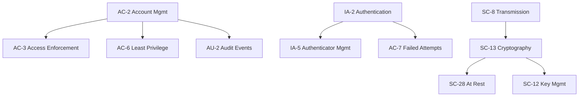

# NIST 800-53r5 Control Mappings

This document provides a comprehensive mapping of NIST 800-53r5 controls to code patterns and implementation strategies. The MCP Standards Server now detects **200+ controls** across all 20 NIST control families.

## Control Coverage Overview

The enhanced control detection system identifies patterns across all 20 NIST control families:

| Family | Name | Controls Detected | Key Patterns |
|--------|------|-------------------|--------------|
| AC | Access Control | 25+ | RBAC, sessions, lockout, wireless |
| AU | Audit & Accountability | 16+ | Logging, SIEM, retention, NTP |
| AT | Awareness & Training | 5+ | Training records, security awareness |
| CM | Configuration Management | 12+ | Baselines, change control, inventory |
| CP | Contingency Planning | 13+ | Backup, recovery, failover, DR |
| IA | Identification & Authentication | 12+ | MFA, SSO, biometrics, certificates |
| IR | Incident Response | 10+ | SIEM, forensics, ticketing |
| MA | Maintenance | 8+ | Windows, logging, remote access |
| MP | Media Protection | 8+ | Encryption, sanitization, USB control |
| PE | Physical & Environmental | 10+ | Access cards, CCTV, datacenter |
| PL | Planning | 5+ | Security plans, rules of behavior |
| PM | Program Management | 8+ | Risk management, governance |
| PS | Personnel Security | 6+ | Background checks, termination |
| PT | Privacy | 8+ | PII handling, consent, minimization |
| RA | Risk Assessment | 10+ | Scanning, threat modeling, PIA |
| SA | System & Services Acquisition | 15+ | SDLC, code review, supply chain |
| SC | System & Communications Protection | 45+ | Encryption, firewalls, segmentation |
| SI | System & Information Integrity | 23+ | Patching, AV, input validation |
| SR | Supply Chain Risk Management | 12+ | SBOM, vendor audit, integrity |

## Enhanced Pattern Detection

### Detection Methods

1. **Explicit Annotations**
   ```python
   # @nist-controls: AC-3, AU-2
   # @evidence: Role-based access control with audit logging
   ```

2. **Decorator Patterns**
   - `@login_required`, `@authenticated` → IA-2
   - `@require_permission`, `@roles_allowed` → AC-3
   - `@ratelimit`, `@throttle` → SC-5
   - `@encrypt`, `@decrypt` → SC-13

3. **Function Name Analysis**
   - `validate_*`, `sanitize_*` → SI-10
   - `encrypt_*`, `decrypt_*` → SC-13
   - `backup_*`, `restore_*` → CP-9
   - `audit_*`, `log_*` → AU-2

4. **Import Analysis**
   - Cryptography libraries → SC-13, SC-28
   - Auth libraries (JWT, OAuth) → IA-2, IA-8
   - Logging frameworks → AU-2, AU-3
   - Security tools → SA-11, RA-5

5. **AST-Based Detection**
   - Security configurations
   - Error handling patterns
   - Session management
   - Input validation

## Detailed Control Mappings

### AC - Access Control (25+ Controls)

#### AC-2: Account Management
```python
# Pattern: User lifecycle management
def create_user(username, role, approver):
    # @nist-controls: AC-2
    # @evidence: Account creation with approval workflow
    validate_approver(approver)
    user = User.create(username=username, role=role)
    audit_log.info(f"User {username} created by {approver}")
    return user
```

#### AC-3: Access Enforcement
```python
# Pattern: Role-based access control
@require_role(['admin', 'manager'])
def sensitive_operation():
    # @nist-controls: AC-3, AU-2
    # @evidence: RBAC enforcement with audit trail
    pass
```

#### AC-6: Least Privilege
```python
# Pattern: Minimal permissions
@minimal_permissions(['read:users', 'write:own_profile'])
def user_profile_update(user_id):
    # @nist-controls: AC-6
    # @evidence: Least privilege implementation
    pass
```

#### AC-7: Unsuccessful Login Attempts
```python
# Pattern: Account lockout
def handle_failed_login(username):
    # @nist-controls: AC-7, AU-2
    # @evidence: Account lockout after 5 attempts
    attempts = increment_failed_attempts(username)
    if attempts >= 5:
        lock_account(username)
```

#### AC-12: Session Termination
```python
# Pattern: Automatic logout
SESSION_TIMEOUT = 900  # 15 minutes
# @nist-controls: AC-12, SC-10
# @evidence: Automatic session termination
```

### AU - Audit and Accountability (16+ Controls)

#### AU-2/AU-3: Comprehensive Audit Logging
```python
# Pattern: Security event logging with full context
audit_logger.info({
    'event_type': 'authentication',     # What
    'timestamp': datetime.utcnow(),     # When
    'source_ip': request.remote_addr,   # Where
    'user_id': user.id,                 # Who
    'outcome': 'success',               # Result
    'details': auth_details             # Additional context
})
# @nist-controls: AU-2, AU-3
# @evidence: Complete audit record per NIST requirements
```

#### AU-4: Audit Storage Capacity
```python
# Pattern: Log rotation and archival
logging.handlers.RotatingFileHandler(
    filename='audit.log',
    maxBytes=100_000_000,  # 100MB
    backupCount=10
)
# @nist-controls: AU-4, AU-11
# @evidence: Automated log rotation with retention
```

### CM - Configuration Management (12+ Controls)

#### CM-2: Baseline Configuration
```yaml
# Pattern: Infrastructure as Code
# @nist-controls: CM-2, CM-3
# @evidence: Version-controlled baseline configuration
apiVersion: v1
kind: ConfigMap
metadata:
  name: security-baseline
data:
  tls_version: "1.3"
  cipher_suites: "TLS_AES_256_GCM_SHA384"
```

#### CM-7: Least Functionality
```python
# Pattern: Software whitelisting
ALLOWED_PACKAGES = [
    'flask==2.0.1',
    'gunicorn==20.1.0',
    # Explicitly allowed dependencies only
]
# @nist-controls: CM-7
# @evidence: Explicit package whitelisting
```

### CP - Contingency Planning (13+ Controls)

#### CP-9: Information System Backup
```python
# Pattern: Automated backup
@scheduled_task(cron="0 2 * * *")
def backup_database():
    # @nist-controls: CP-9, CP-10
    # @evidence: Daily automated backups with verification
    backup_path = create_backup()
    verify_backup_integrity(backup_path)
    replicate_to_offsite(backup_path)
```

### IA - Identification and Authentication (12+ Controls)

#### IA-2(1): Multi-factor Authentication
```python
# Pattern: MFA implementation
def verify_mfa(user, token):
    # @nist-controls: IA-2, IA-2(1)
    # @evidence: TOTP-based MFA
    return pyotp.TOTP(user.mfa_secret).verify(token)
```

#### IA-5(1): Password Complexity
```python
# Pattern: Password policy enforcement
PASSWORD_REGEX = r'^(?=.*[a-z])(?=.*[A-Z])(?=.*\d)(?=.*[@$!%*?&])[A-Za-z\d@$!%*?&]{12,}$'
# @nist-controls: IA-5, IA-5(1)
# @evidence: Complex password requirements
```

### SC - System and Communications Protection (45+ Controls)

#### SC-8: Transmission Confidentiality
```python
# Pattern: TLS enforcement
app.config['SESSION_COOKIE_SECURE'] = True
app.config['SESSION_COOKIE_HTTPONLY'] = True
app.config['SESSION_COOKIE_SAMESITE'] = 'Strict'
# @nist-controls: SC-8, SC-13
# @evidence: HTTPS-only with secure cookies
```

#### SC-28: Protection at Rest
```python
# Pattern: Database encryption
from cryptography.fernet import Fernet
# @nist-controls: SC-28, SC-13
# @evidence: AES-256 encryption at rest
def encrypt_sensitive_data(data):
    return fernet.encrypt(data.encode())
```

### SI - System and Information Integrity (23+ Controls)

#### SI-10: Information Input Validation
```python
# Pattern: Input sanitization
def validate_user_input(data):
    # @nist-controls: SI-10
    # @evidence: Input validation preventing injection
    schema = UserSchema()
    return schema.load(data)  # Validates and sanitizes
```

#### SI-2: Flaw Remediation
```python
# Pattern: Dependency scanning
# @nist-controls: SI-2, RA-5
# @evidence: Automated vulnerability scanning
# In requirements.txt or pyproject.toml
# safety check
# bandit -r src/
```

## Using the Coverage Command

### Generate Coverage Report
```bash
# Basic coverage analysis
mcp-standards coverage

# Detailed HTML report
mcp-standards coverage --output-format html --output-file coverage.html

# JSON for CI/CD integration
mcp-standards coverage --output-format json --output-file coverage.json
```

### Understanding Coverage Metrics

The coverage report provides:
- **Total Controls**: Number of unique NIST controls detected
- **Family Coverage**: Percentage of controls implemented per family
- **High Confidence**: Controls with explicit annotations or strong patterns
- **Suggestions**: Related controls to consider implementing

### Coverage Thresholds

| Coverage % | Status | Meaning |
|------------|--------|---------|
| 70%+ | ✅ Excellent | Comprehensive security implementation |
| 50-69% | 👍 Good | Solid foundation, some gaps |
| 30-49% | ⚠️ Fair | Basic controls, needs improvement |
| <30% | ❌ Needs Work | Significant gaps in coverage |

## Best Practices

### 1. Use Explicit Annotations
```python
# GOOD: Clear control mapping
# @nist-controls: AC-3, AU-2, SI-10
# @evidence: RBAC with input validation and audit logging
# @oscal-component: api-gateway
def process_request(user, data):
    validate_input(data)      # SI-10
    check_permissions(user)   # AC-3
    audit_log.info(...)      # AU-2
```

### 2. Implement Control Families Together
Related controls often work as a system:
- **Authentication**: IA-2 + IA-5 + AC-7 + AU-2
- **Encryption**: SC-8 + SC-13 + SC-28 + SC-12
- **Access Control**: AC-2 + AC-3 + AC-6 + AU-2

### 3. Document Control Inheritance
```python
class SecureBaseHandler:
    """
    Base handler implementing common security controls
    @nist-controls: AC-3, AU-2, SC-8, SI-10
    @evidence: Inherited security controls for all handlers
    """
```

### 4. Regular Coverage Reviews
```yaml
# .github/workflows/nist-compliance.yml
- name: Check NIST Coverage
  run: |
    mcp-standards coverage --output-format json > coverage.json
    python -c "
    import json
    data = json.load(open('coverage.json'))
    if data['summary']['total_controls'] < 50:
        raise SystemExit('Insufficient NIST control coverage')
    "
```

## Control Relationships

The system understands control dependencies:



## Integration Examples

### Python/Django
```python
# models.py
class SecureModel(models.Model):
    # @nist-controls: AC-3, AU-2, SC-28
    # @evidence: Model-level security controls
    
    encrypted_field = EncryptedCharField()  # SC-28
    
    class Meta:
        permissions = [  # AC-3
            ("view_sensitive", "Can view sensitive data"),
        ]
        
    def save(self, *args, **kwargs):
        audit_log.info(f"Model {self.id} modified")  # AU-2
        super().save(*args, **kwargs)
```

### JavaScript/Node.js
```javascript
// middleware/security.js
// @nist-controls: AC-3, AU-2, IA-2, SC-8
// @evidence: Express security middleware stack

app.use(helmet());  // SC-8, SC-13
app.use(authenticate);  // IA-2
app.use(authorize);  // AC-3
app.use(auditLogger);  // AU-2
app.use(rateLimiter);  // SC-5
```

### Go
```go
// middleware/auth.go
// @nist-controls: IA-2, AC-3, AU-2
// @evidence: Authentication and authorization middleware

func AuthMiddleware(next http.Handler) http.Handler {
    return http.HandlerFunc(func(w http.ResponseWriter, r *http.Request) {
        token := r.Header.Get("Authorization")
        user, err := validateToken(token)  // IA-2
        if err != nil {
            auditLog.Warn("Failed authentication", r)  // AU-2
            http.Error(w, "Unauthorized", 401)
            return
        }
        
        if !hasPermission(user, r.URL.Path) {  // AC-3
            auditLog.Warn("Access denied", user, r)  // AU-2
            http.Error(w, "Forbidden", 403)
            return
        }
        
        next.ServeHTTP(w, r)
    })
}
```

## Resources

- [NIST SP 800-53r5 Full Catalog](https://csrc.nist.gov/publications/detail/sp/800-53/rev-5/final)
- [NIST Control Catalog Search](https://csrc.nist.gov/projects/risk-management/sp800-53-controls/release-search)
- [OSCAL Documentation](https://pages.nist.gov/OSCAL/)
- [Control Baselines](https://csrc.nist.gov/projects/risk-management/sp800-53-controls/release-search#!/control?version=5.1)